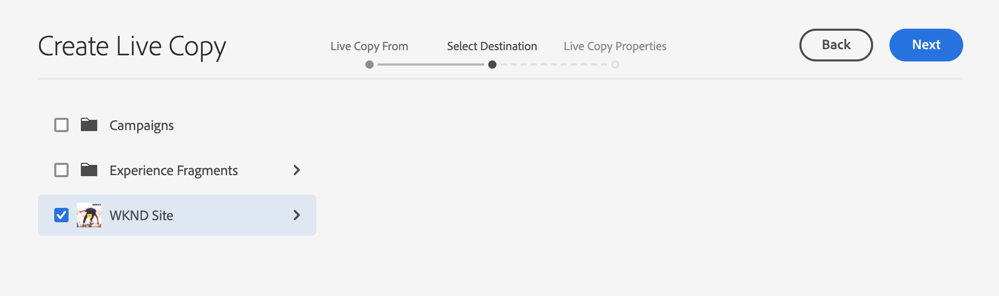

# Actieve kopieën maken en synchroniseren {#creating-and-synchronizing-live-copies}

U kunt een Live kopie maken van een pagina of configuratie van een blauwdruk om die inhoud op uw site opnieuw te gebruiken. Overerving en synchronisatie beheren, kunt u bepalen hoe wijzigingen in de inhoud worden doorgegeven.

## Configuraties van blauwdrukken beheren {#managing-blueprint-configurations}

Een blauwdrukconfiguratie identificeert een bestaande website die u als bron voor één of meerdere Live Copy-pagina&#39;s wilt gebruiken.

>[!TIP]
>
>Met vervagingsconfiguraties kunt u wijzigingen in de inhoud doorvoeren in Live kopieën. Zie [Actieve exemplaren - Bron, Blauwdrukken en Blauwdrukconfiguraties](overview.md#source-blueprints-and-blueprint-configurations).

Wanneer u een blauwdrukconfiguratie creeert, selecteert u een malplaatje dat de interne structuur van de blauwdruk bepaalt. In de standaardsjabloon voor blauwdrukken wordt ervan uitgegaan dat de bronwebsite de volgende kenmerken heeft:

* De website heeft een hoofdpagina.
* De directe onderliggende pagina&#39;s van de hoofdmap zijn taalvertakkingen van de website. Wanneer u een Live kopie maakt, worden de talen weergegeven als optionele inhoud die u in de kopie wilt opnemen.
* De hoofdmap van elke taalvertakking bevat een of meer onderliggende pagina&#39;s. Wanneer u een actieve kopie maakt, worden onderliggende pagina&#39;s weergegeven, zodat u deze kunt opnemen in de actieve kopie.

>[!NOTE]
>
>Een andere structuur vereist een andere blauwdruksjabloon.

Nadat u de blauwdrukconfiguratie creeert, vormt u de volgende eigenschappen:

* **Naam**: De naam van de configuratie van de blauwdruk
* **Bronpad**: Het pad van de hoofdpagina van de site die u als bron gebruikt (blauwdruk)
* **Beschrijving**. (Optioneel) Een beschrijving van de configuratie van de blauwdruk, die wordt weergegeven in de lijst met blauwdrukconfiguraties die u kunt kiezen bij het maken van een site

Wanneer uw blauwdrukconfiguratie wordt gebruikt, kunt u het met een rollout configuratie associëren die bepaalt hoe de Levende Kopieën van de bron/de blauwdruk worden gesynchroniseerd. Zie [De te gebruiken configuraties van de Output specificeren](live-copy-sync-config.md#specifying-the-rollout-configurations-to-use).

### Bewegingsconfiguraties maken en bewerken {#creating-editing-blueprint-configurations}

Vervagingsconfiguraties worden beschouwd als onveranderlijke gegevens en kunnen daarom niet worden bewerkt tijdens runtime. Om deze reden, moeten om het even welke configuratieveranderingen via Git worden opgesteld gebruikend de pijpleiding CI/CD.

Meer informatie vindt u in het artikel [Notable Changes to Adobe Experience Manager (AEM) als Cloud Service.](/help/release-notes/aem-cloud-changes.md)

De volgende stappen zijn alleen voor test- en ontwikkelingsdoeleinden beschikbaar voor een beheerder van een lokale ontwikkelingsinstantie. Deze opties zijn niet beschikbaar in een AEMaaCS-cloudinstantie.

#### Lokaal {#creating-a-blueprint-configuration} een blauwdrukconfiguratie maken

Een blauwdrukconfiguratie maken:

1. [Navigeer ](/help/sites-cloud/authoring/getting-started/basic-handling.md#global-navigation) naar het menu  **** Opties en selecteer vervolgens het menu  **** Sites.
1. Selecteer **Blauwdrukken** om de **Blueprint Configurations**-console te openen:

   

1. Selecteer **Maken**.
1. Selecteer de blauwdruksjabloon en **Volgende** om door te gaan.
1. Selecteer de bronpagina die als blauwdruk moet worden gebruikt; dan **Volgende** om verder te gaan.
1. Definiëren:

   * **Titel**: verplichte titel voor de blauwdruk
   * **Omschrijving**: een optionele beschrijving voor meer informatie.

1. **** CreateCreate zal tot de blauwdrukconfiguratie leiden die op uw specificatie wordt gebaseerd.

### Een configuratie van een blauwdruk lokaal bewerken of verwijderen{#editing-or-deleting-a-blueprint-configuration}

U kunt een bestaande configuratie van de blauwdruk bewerken of verwijderen:

1. [Navigeer ](/help/sites-cloud/authoring/getting-started/basic-handling.md#global-navigation) naar het menu  **** Opties en selecteer vervolgens het menu  **** Sites.
1. Selecteer **Blauwdrukken** om de **Blueprint Configurations**-console te openen:

   

1. Selecteer de vereiste blauwdrukconfiguratie. De juiste acties worden beschikbaar op de werkbalk:

   * **Eigenschappen**; u kunt dit gebruiken om de eigenschappen van de configuratie te bekijken en dan uit te geven.
   * **Verwijderen**

## Een actieve kopie maken {#creating-a-live-copy}

U kunt op verschillende manieren een actieve kopie maken.

### Een actieve kopie van een pagina maken {#creating-a-live-copy-of-a-page}

U kunt een actieve kopie van elke pagina of vertakking maken. Wanneer u de live kopie maakt, kunt u opgeven welke rollout-configuraties moeten worden gebruikt voor het synchroniseren van de inhoud:

* De geselecteerde rollout-configuraties zijn van toepassing op de pagina Live kopie en de onderliggende pagina&#39;s.
* Als u geen rollout configuraties specificeert, bepaalt MSM welke rollout configuraties aan gebruik. Zie [Specifying the Rollout Configuration to Use](live-copy-sync-config.md#specifying-the-rollout-configurations-to-use).

U kunt een actieve kopie van elke pagina maken:

* Pagina&#39;s waarnaar wordt verwezen door een [blauwdrukconfiguratie](#creating-a-blueprint-configuration)
* En pagina&#39;s die geen verbinding hebben met een configuratie
* Live kopie op de pagina&#39;s van een andere Live kopie ([geneste actieve kopieën](overview.md#nested-live-copies))

Het enige verschil is dat de beschikbaarheid van het **bevel Rollout** op de bron/blauwdruk pagina&#39;s afhankelijk is van of de bron door een blauwdrukconfiguratie van verwijzingen wordt voorzien:

* Als u het Levende Exemplaar van een bronpagina creeert die **is** in een blauwdrukconfiguratie van verwijzingen voorzien, dan zal het bevel van de Uitvoer beschikbaar op de bron/blauwdruk pagina(s) zijn.
* Als u het Levende Exemplaar van een bronpagina creeert die **niet** in een blauwdrukconfiguratie van verwijzingen wordt voorzien, dan zal het bevel van de Uitvoer niet beschikbaar op de bron/blauwdruk pagina(s) zijn.

Een actieve kopie maken:

1. Selecteer **Create** in de **Sites**-console en **Live Copy**.

   

1. Selecteer de bronpagina en klik of tik op **Next**. Bijvoorbeeld:

   

1. Geef het doelpad van de actieve kopie op (open de bovenliggende map/pagina van de actieve kopie) en klik of tik op **Volgende**.

   

   >[!NOTE]
   >
   >Het doelpad kan zich niet binnen het bronpad bevinden.

1. Enter:

   * a **Titel** voor de pagina.
   * a **Naam**, die in URL wordt gebruikt.

   

1. Gebruik het selectievakje **Subpagina&#39;s uitsluiten**:

   * Geselecteerd: Alleen een actieve kopie van de geselecteerde pagina maken (oppervlakkige live kopie)
   * Niet geselecteerd: Een actieve kopie maken die alle onderliggende elementen van de geselecteerde pagina bevat (diepe Live kopie)

1. (Optioneel) Als u een of meer rollout-configuraties wilt opgeven die u wilt gebruiken voor de Live kopie, gebruikt u de vervolgkeuzelijst **Rollout Configs** om deze te selecteren. Geselecteerde configuraties worden weergegeven onder de keuzelijst.
1. Klik of tik **Create**. Er wordt een bevestigingsbericht weergegeven. Hiervanaf kunt u **Open** of **Done** selecteren.

### Een live kopie van een site maken op basis van een blauwdrukconfiguratie {#creating-a-live-copy-of-a-site-from-a-blueprint-configuration}

Maak een live kopie met behulp van een blauwdrukconfiguratie om een site te maken op basis van de blauwdrukinhoud (bron). Wanneer u een Live kopie maakt op basis van een blauwdrukconfiguratie, selecteert u een of meer taalvertakkingen van de blauwdrukbron die u wilt kopiëren, en selecteert u vervolgens de hoofdstukken die u wilt kopiëren uit de taalvertakkingen. Zie [Een configuratie van de Vervaging maken](#creating-a-blueprint-configuration).

Als u sommige taalvertakkingen weglaat uit Live Copy, kunt u hen later toevoegen. Zie [Een actieve kopie maken in een live kopie (configuratie blauwdruk)](#creating-a-live-copy-inside-a-live-copy-blueprint-configuration) voor meer informatie.

>[!CAUTION]
>
>Wanneer de bron van de blauwdruk koppelingen en verwijzingen bevat die een alinea in een andere vertakking als doel hebben, worden de doelen niet bijgewerkt in de pagina&#39;s van Live kopie, maar blijven ze gericht naar de oorspronkelijke bestemming.

Geef bij het maken van de site waarden op voor de volgende eigenschappen:

* **Oorspronkelijke talen**: De taalvertakkingen van de blauwdrukbron die in Live Copy moeten worden opgenomen
* **Oorspronkelijke hoofdstukken**: De onderliggende pagina&#39;s van de vertakkingen van de blauwdruktaal die moeten worden opgenomen in de Live kopie
* **Doelpad**: De locatie van de hoofdpagina van de Live Copy-site
* **Titel**: De titel van de hoofdpagina van de Live Copy-site
* **Naam**: (Optioneel) De naam van het JCR-knooppunt dat de hoofdpagina van de Live Copy opslaat (de standaardwaarde is gebaseerd op de titel)
* **Eigenaar** van site: (Optioneel) Informatie over de partij die verantwoordelijk is voor de Live kopie
* **Live kopie**: Selecteer deze optie om een live relatie met de bronsite tot stand te brengen. Als u deze optie niet selecteert, wordt een kopie van de blauwdruk gemaakt, maar wordt deze niet gesynchroniseerd met de bron.
* **Uitrolconfiguratie**: (Optioneel) Selecteer een of meer rollout-configuraties die u wilt gebruiken voor het synchroniseren van Live Copy. Standaard worden de rollout-configuraties overgeërfd van de blauwdruk. Zie [De te gebruiken configuraties van de Output specificeren](live-copy-sync-config.md#specifying-the-rollout-configurations-to-use) voor meer details.

Een actieve kopie van een site maken op basis van een blauwdrukconfiguratie:

1. Selecteer **Maken** in de **Sites**-console en **Site** in de keuzelijst.
1. Selecteer de blauwdrukconfiguratie die u als bron van de actieve kopie wilt gebruiken en ga verder met **Volgende**:

   

1. Met de kiezer **Oorspronkelijke talen** kunt u de taal of talen van de blauwdruksite opgeven die u voor Live kopie wilt gebruiken.

   Standaard zijn alle beschikbare talen geselecteerd. Als u een taal wilt verwijderen, klikt of tikt u op de **X** die naast de taal wordt weergegeven.

   Bijvoorbeeld:

   

1. Gebruik de vervolgkeuzelijst **Eerste hoofdstukken** om de secties van de blauwdruk te selecteren die u in Live kopie wilt opnemen. Alle beschikbare hoofdstukken zijn standaard inbegrepen, maar kunnen worden verwijderd.
1. Geef waarden op voor de overige eigenschappen en selecteer **Maken**. Selecteer **Done** in het bevestigingsdialoogvenster om terug te keren naar de **Sites**-console of **Open Site** om de hoofdpagina van de site te openen.

### Een actieve kopie maken in een live kopie (configuratie blauwdruk) {#creating-a-live-copy-inside-a-live-copy-blueprint-configuration}

Wanneer u een live kopie maakt in de bestaande live kopie (gemaakt met behulp van een blauwdrukconfiguratie), kunt u alle taalkopieën of hoofdstukken invoegen die niet waren opgenomen toen de live kopie werd gemaakt.

## Uw actieve kopie controleren {#monitoring-your-live-copy}

### De status van een actieve kopie bekijken {#seeing-the-status-of-a-live-copy}

De eigenschappen van een pagina van Actieve kopie tonen de volgende informatie over Live kopie:

* **Bron**: De bronpagina van de pagina Live kopie
* **Status**: De synchronisatiestatus van de live kopie, inclusief of de live kopie up-to-date is met de bron, wanneer de laatste synchronisatie heeft plaatsgevonden en wie de synchronisatie heeft uitgevoerd
* **Configuratie**:

   * Of de pagina nog steeds onderhevig is aan overerving van Live Copy
   * Of de configuratie wordt overgeërfd van de bovenliggende pagina
   * Alle rollout-configuraties die in Live Copy worden gebruikt

De eigenschappen weergeven:

1. Selecteer in de console **Sites** de pagina Live kopie en open de eigenschappen.
1. Selecteer het tabblad **Live kopie**.

   Bijvoorbeeld:

   

   Zie de sectie [Het Live Copy-overzicht gebruiken](live-copy-overview.md#using-the-live-copy-overview) in de artikel Live Copy-overzichtsconsole voor meer informatie.

### Live kopieën van een vervagingspagina bekijken {#seeing-the-live-copies-of-a-blueprint-page}

De pagina&#39;s van de blauwdruk (die in een blauwdrukconfiguratie van verwijzingen worden voorzien) verstrekken u een lijst van de Levende pagina&#39;s van het Exemplaar die de huidige (blauwdruk) pagina als bron gebruiken. Gebruik deze lijst om actieve kopieën bij te houden. De lijst wordt weergegeven op het tabblad **Blauwdruk** van de [pagina-eigenschappen](/help/sites-cloud/authoring/fundamentals/page-properties.md).

## Uw actieve kopie synchroniseren {#synchronizing-your-live-copy}

U kunt uw Live kopie op verschillende manieren synchroniseren.

### Een blauwdruk {#rolling-out-a-blueprint} uitrollen

Leer een blauwdrukpagina om wijzigingen in de inhoud door te voeren in Live kopieën. Een **Rollout** actie voert de rollout configuraties uit die [op trekker ](live-copy-sync-config.md#rollout-triggers) gebruiken.

>[!NOTE]
>
>Er kunnen conflicten optreden als er nieuwe pagina&#39;s met dezelfde paginanaam worden gemaakt in zowel de vertakking Verfafdruk als een afhankelijke vertakking Live kopie.
>
>Dergelijke [conflicten moeten worden behandeld en worden opgelost bij rollout](rollout-conflicts.md).

#### Een vervaging uitrollen uit pagina-eigenschappen {#rolling-out-a-blueprint-from-page-properties}

1. Selecteer in de console **Sites** de pagina in de blauwdruk en open de eigenschappen.
1. Open het tabblad **Vervagen**.
1. Selecteer **Uitvoer**.

   

1. Geef de pagina&#39;s en eventuele subpagina&#39;s op en bevestig vervolgens met het vinkje:

   

1. Specificeer als de rollout baan onmiddellijk (**Now**) of op een andere datum/tijd (**Later**) zou moeten worden uitgevoerd.

   

Rollouts worden verwerkt als asynchrone taken en kunnen worden gecontroleerd op de pagina [***Async Jobs Status**.](/help/operations/asynchronous-jobs.md#monitor-the-status-of-asynchronous-operations)

#### Een blauwdruk uitrollen vanuit de referentierail {#roll-out-a-blueprint-from-the-reference-rail}

1. Selecteer in de **Sites**-console de pagina in de live kopie en open het venster **[References](/help/sites-cloud/authoring/getting-started/basic-handling.md#references)** (vanuit de werkbalk).
1. Selecteer de optie **Vervagen** in de lijst om de blauwdrukken weer te geven die aan deze pagina zijn gekoppeld.
1. Selecteer de gewenste blauwdruk in de lijst.
1. Klik of tik **Uitvoer**.

   

1. U wordt gevraagd de details van de rollout te bevestigen:

   * **Uitrolbereik**:

      Geef op of het bereik alleen voor de geselecteerde pagina is of dat subpagina&#39;s moeten worden opgenomen.

   * **Schema**:

      Specificeer als de rollout baan onmiddellijk (**Now**) of op een recentere datum/tijd (**Later**) zou moeten worden uitgevoerd.

      

1. Nadat u deze details hebt bevestigd, selecteert u **Uitvoer** om de handeling uit te voeren.

Rollouts worden verwerkt als asynchrone taken en kunnen worden gecontroleerd op de pagina [**Status van taken synchroniseren**.](/help/operations/asynchronous-jobs.md#monitor-the-status-of-asynchronous-operations)

#### Een blauwdruk uitrollen met het actieve-kopieoverzicht {#roll-out-a-blueprint-from-the-live-copy-overview}

De [**actie van het Uitrollen** is ook beschikbaar bij het Levende Overzicht van het Exemplaar ](live-copy-overview.md#using-the-live-copy-overview), wanneer een pagina van de Vervaging wordt geselecteerd.

1. Open het [Live Copy-overzicht](live-copy-overview.md#using-the-live-copy-overview) en selecteer een vervagingspagina.
1. Selecteer **Uitvoer** van de toolbar.

   

1. Geef de pagina&#39;s en eventuele subpagina&#39;s op en bevestig vervolgens met het vinkje:

   

1. Specificeer als de rollout baan onmiddellijk (**Now**) of op een andere datum/tijd (**Later**) zou moeten worden uitgevoerd.

   

Rollouts worden verwerkt als asynchrone taken en kunnen worden gecontroleerd op de pagina [**Status van taken synchroniseren**.](/help/operations/asynchronous-jobs.md#monitor-the-status-of-asynchronous-operations)

### Een actieve kopie synchroniseren {#synchronizing-a-live-copy}

Synchroniseer een pagina van de Levende Kopie om inhoudsveranderingen van de bron aan Levende Exemplaar te trekken.

#### Een actieve kopie van pagina-eigenschappen synchroniseren {#synchronize-a-live-copy-from-page-properties}

Synchroniseer een actieve kopie om wijzigingen van de bron naar de actieve kopie over te brengen.

>[!NOTE]
>
>Het synchroniseren voert de rollout configuraties uit die de [Bij trekker ](live-copy-sync-config.md#rollout-triggers) gebruiken.

1. Selecteer in de console **Sites** de pagina Live kopie en open de eigenschappen.
1. Open het tabblad **Live kopie**.
1. Klik of tik **Synchroniseren**.

   

   Bevestiging wordt aangevraagd. Gebruik **Sync** om door te gaan.

#### Een actieve kopie synchroniseren vanuit het Live Copy-overzicht {#synchronize-a-live-copy-from-the-live-copy-overview}

De actie [Synchroniseren is ook beschikbaar bij het Live Copy-overzicht](live-copy-overview.md#using-the-live-copy-overview) wanneer een Live Copy-pagina is geselecteerd.

1. Open het [Live Copy-overzicht](live-copy-overview.md#using-the-live-copy-overview) en selecteer een Live Copy-pagina.
1. Selecteer **Synchroniseren** op de werkbalk.
1. Bevestig de handeling **Uitvoer** in het dialoogvenster nadat u hebt opgegeven of u het volgende wilt opnemen:

   * **Pagina- en subpagina&#39;s**
   * **Alleen pagina**

   

## Inhoud van actieve kopie wijzigen {#changing-live-copy-content}

Als u inhoud van Live kopie wilt wijzigen, kunt u:

* Voeg alinea&#39;s toe aan de pagina.
* Bestaande inhoud bijwerken door de overerving van Live kopie voor een pagina of component te verbreken.

>[!TIP]
>
>Als u handmatig een nieuwe pagina maakt in Live Copy, is de nieuwe pagina lokaal bij Live kopie. Dit betekent dat de pagina geen bijbehorende bronpagina heeft waaraan de pagina is gekoppeld.
>
>Als beste praktijken om een lokale pagina tot stand te brengen die deel van de verhouding uitmaakt, moet de lokale pagina in de bron tot stand brengen en een diepe uitrol uitvoeren. Hiermee wordt de pagina lokaal gemaakt als Live kopieën.

>[!NOTE]
>
>Er kunnen conflicten optreden als er nieuwe pagina&#39;s met dezelfde paginanaam worden gemaakt in zowel de vertakking Verfafdruk als een afhankelijke vertakking Live kopie.
>
>Dergelijke [conflicten moeten worden behandeld en worden opgelost bij rollout](rollout-conflicts.md).

### Componenten toevoegen aan een Live Copy-pagina {#adding-components-to-a-live-copy-page}

U kunt op elk gewenst moment componenten toevoegen aan een pagina voor Live kopie. De overervingsstatus van de Live kopie en het bijbehorende alineasysteem bepaalt niet hoe u componenten kunt toevoegen.

Wanneer de pagina Live kopie is gesynchroniseerd met de bronpagina, blijven de toegevoegde componenten ongewijzigd. Zie ook [De volgorde van componenten op een Live Copy-pagina wijzigen.](#changing-the-order-of-components-on-a-live-copy-page)

>[!TIP]
>
>Wijzigingen die lokaal worden aangebracht in een component die als container is gemarkeerd, worden niet overschreven door de inhoud van de blauwdruk op een rollout. Zie [Beste praktijken MSM](best-practices.md#components-and-container-synchronization) voor meer informatie.

### Overerving voor een pagina {#suspending-inheritance-for-a-page} opschorten

Wanneer u een live kopie maakt, wordt de Live kopie opgeslagen op de hoofdpagina van de gekopieerde pagina&#39;s. Alle onderliggende pagina&#39;s van de basispagina nemen de configuraties van Live Copy over. De componenten op de pagina&#39;s van het Levende Exemplaar erven ook de Levende configuratie van het Exemplaar.

U kunt de overerving van Live kopie voor een pagina van Live kopie onderbreken, zodat u pagina-eigenschappen en -componenten kunt wijzigen. Wanneer u overerving onderbreekt, worden de pagina-eigenschappen en -componenten niet meer gesynchroniseerd met de bron.

>[!TIP]
>
>U kunt ook [een Live kopie](#detaching-a-live-copy) loskoppelen van de blauwdruk om alle verbindingen te verwijderen. In tegenstelling tot het opschorten van erfenis, is de losse actie permanent en niet-omkeerbaar.

#### Overerving van pagina-eigenschappen opheffen {#suspending-inheritance-from-page-properties}

Overerving op een pagina opschorten:

1. Open de eigenschappen van de Live Copy-pagina met de opdracht **Eigenschappen weergeven** van de console **Sites** of met **Pagina-informatie** op de pagina-werkbalk.
1. Klik of tik **Live kopie** tabel.
1. Selecteer **Onderbreken** van de toolbar. Vervolgens kunt u kiezen uit:

   * **Onderbreken**: om alleen de huidige pagina op te schorten.
   * **Onderbreken met kinderen**: om de huidige pagina samen met eventuele onderliggende pagina&#39;s op te schorten.

1. Selecteer **Suspend** op de bevestigingsdialoog.

#### Overerving onderbreken vanuit het Live Copy-overzicht {#suspending-inheritance-from-the-live-copy-overview}

De handeling [Stoppen is ook beschikbaar in het Live Copy-overzicht](live-copy-overview.md#using-the-live-copy-overview) wanneer een Live Copy-pagina is geselecteerd.

1. Open het [Live Copy-overzicht](live-copy-overview.md#using-the-live-copy-overview) en selecteer een Live Copy-pagina.
1. Selecteer **Onderbreken** van de toolbar.
1. Selecteer de gewenste optie uit:

   * **Onderbreken**
   * **Opschorting met kinderen**

   

1. Bevestig de handeling **Suspend** in het dialoogvenster **Live kopie onderbreken**:

   

### Herhalingsovererving voor een pagina {#resuming-inheritance-for-a-page}

Het onderbreken van de overerving van Live Copy voor een pagina is een tijdelijke handeling. Als de handeling **Hervatten** eenmaal is opgeschort, kunt u de live relatie herstellen.

Wanneer u overerving weer inschakelt, wordt de pagina niet automatisch gesynchroniseerd met de bron. U kunt een synchronisatie aanvragen, als dit vereist is:

* In het **Hervatten**/**Terugkeren** dialoogvenster; bijvoorbeeld:

   

* In een later stadium, door de synchronisatieactie manueel te selecteren.

>[!NOTE]
>
>Wanneer u overerving weer inschakelt, wordt de pagina niet automatisch gesynchroniseerd met de bron. Als dit wordt vereist, kunt u manueel om een synchronisatie verzoeken of op het tijdstip van hervatting of later.

#### Overerving hervatten vanuit pagina-eigenschappen {#resuming-inheritance-from-page-properties}

Eenmaal [hanging](#suspending-inheritance-from-page-properties) wordt de handeling **Hervatten** in de werkbalk van de pagina-eigenschappen geplaatst:

Als deze optie is geselecteerd, wordt het dialoogvenster weergegeven. U kunt desgewenst een synchronisatie selecteren en de handeling vervolgens bevestigen.

#### Een Live Copy-pagina hervatten vanuit het Live Copy-overzicht {#resume-a-live-copy-page-from-the-live-copy-overview}

De handeling [Hervatten is ook beschikbaar in het Live Copy-overzicht](live-copy-overview.md#using-the-live-copy-overview) wanneer een Live Copy-pagina is geselecteerd.

1. Open het [Live Copy-overzicht](live-copy-overview.md#using-the-live-copy-overview) en selecteer een Live Copy-pagina die is opgeschort. De pagina wordt weergegeven als **INHERITANCE CANCELED**.
1. Selecteer **Hervatten** van de toolbar.
1. Geef aan of u de pagina wilt synchroniseren nadat u de overerving hebt hersteld en bevestig vervolgens de handeling **Hervatten** in het dialoogvenster **Live kopie hervatten**.

### De veranderende Diepte van de Overerving (Ondiep/Diep) {#changing-inheritance-depth-shallow-deep}

Op een bestaande Live kopie kunt u de diepte van een pagina wijzigen, zodat u kunt opgeven of onderliggende pagina&#39;s moeten worden opgenomen.

* Schakelen naar een oppervlakkige live kopie:

   * Zal onmiddellijk effect hebben en is niet omkeerbaar.

   * Hiermee worden onderliggende pagina&#39;s expliciet losgekoppeld van de actieve kopie. Verdere wijzigingen op kinderen kunnen niet bewaard worden als ze ongedaan worden gemaakt.

   * Hiermee verwijdert u een afstammeling `LiveRelationships`, zelfs als er `LiveCopies` is genest.

* Overschakelen naar een diepe live kopie:

   * Hiermee blijven onderliggende pagina&#39;s ongewijzigd.
   * Om het effect van de schakelaar te zien, kunt u uitlooptraject maken, worden om het even welke inhoudswijzigingen toegepast volgens de uitrolconfiguratie.

* Schakel over naar een oppervlakkige live kopie en ga vervolgens terug naar diep:

   * Behandelt alle kinderen van (vroeger) oppervlakkige Levende Kopie alsof zij manueel waren gecreeerd en daarom worden bewogen gebruikend `[oldname]_msm_moved name`.

De diepte opgeven of wijzigen:

1. Open de eigenschappen van de Live Copy-pagina met de opdracht **Eigenschappen weergeven** van de console **Sites** of met **Pagina-informatie** op de pagina-werkbalk.
1. Klik of tik **Live kopie** tabel.
1. Stel in de sectie **Configuratie** de optie **Overerving van actieve kopie** in of wis deze optie afhankelijk van of onderliggende pagina&#39;s worden opgenomen:

   * Ingeschakeld - een diepe, actieve kopie (de onderliggende pagina&#39;s worden opgenomen)
   * Niet ingeschakeld - Een oppervlakkige actieve kopie (onderliggende pagina&#39;s worden uitgesloten)

   >[!CAUTION]
   >
   >Het overschakelen naar een oppervlakkige versie van Live Copy heeft onmiddellijk effect en is niet-omkeerbaar.
   >
   >Zie [Actieve kopieën - Compositie](overview.md#live-copies-composition) voor meer informatie.

1. Klik of tik **Save** om uw updates voort te zetten.

### Overerving voor een component {#cancelling-inheritance-for-a-component} annuleren

Annuleer de overerving van Live kopie voor een component zodat de component niet meer wordt gesynchroniseerd met de broncomponent. Indien nodig kunt u overerving later inschakelen.

>[!NOTE]
>
>Wanneer u overerving weer inschakelt, wordt de component niet automatisch gesynchroniseerd met de bron. U kunt handmatig een synchronisatie aanvragen als dit vereist is.

Overerving annuleren om de inhoud van de component te wijzigen of de component te verwijderen:

1. Klik of tik op de component waarvoor u overerving wilt annuleren.

   

1. Klik of tik op het pictogram **Overerving annuleren** op de componentwerkbalk.

   

1. Bevestig in het dialoogvenster Overerving annuleren de handeling met **Yes**.

   De werkbalk van de component wordt bijgewerkt en bevat alle (toepasselijke) bewerkingsopdrachten.

### Overerving opnieuw inschakelen voor een component {#re-enabling-inheritance-for-a-component}

Als u overerving voor een component wilt inschakelen, klikt of tikt u op het pictogram **Overerving opnieuw inschakelen** op de werkbalk van de component.

### De volgorde van componenten op een Live Copy-pagina wijzigen {#changing-the-order-of-components-on-a-live-copy-page}

Als een live kopie componenten bevat die deel uitmaken van een alineasysteem, gelden voor de overerving van dat alineasysteem de volgende regels:

* De volgorde van componenten in een overgeërfd alineasysteem kan worden gewijzigd, zelfs als overerving is ingesteld.
* Bij rollout wordt de volgorde van de componenten hersteld op basis van de blauwdruk. Als nieuwe componenten vóór de rollout aan Live Copy zijn toegevoegd, worden deze samen met de componenten opnieuw geordend waarboven ze zijn toegevoegd.
* Als de overerving van het alineasysteem wordt geannuleerd, wordt de volgorde van componenten niet hersteld bij de rollout en blijft deze in de Live Copy ongewijzigd.

>[!NOTE]
>
>Bij het omkeren van een geannuleerde overerving op een alineasysteem wordt de volgorde van componenten **niet automatisch hersteld** van de blauwdruk. U kunt handmatig een synchronisatie aanvragen als dit vereist is.

Gebruik de volgende procedure om de overname van het alineasysteem te annuleren.

1. Open de pagina Live kopie.
1. Sleep een bestaande component naar een nieuwe locatie op de pagina.
1. Bevestig in het dialoogvenster **Overerving annuleren** de handeling met **Yes**.

### Eigenschappen van een Live Copy-pagina {#overriding-properties-of-a-live-copy-page} overschrijven

De pagina-eigenschappen van een Live Copy-pagina worden standaard van de bronpagina overgenomen en kunnen niet worden bewerkt.

U kunt overerving voor een eigenschap annuleren wanneer u de eigenschapswaarde voor de live kopie moet wijzigen. Een koppelingspictogram geeft aan dat overerving is ingeschakeld voor de eigenschap.

Wanneer u overerving annuleert, kunt u de waarde van de eigenschap wijzigen. Een pictogram voor verbroken koppelingen geeft aan dat overerving wordt geannuleerd.

U kunt overerving later opnieuw inschakelen voor een eigenschap als dat nodig is.

>[!NOTE]
>
>Wanneer u overerving weer inschakelt, wordt de pagina-eigenschap Live Copy niet automatisch gesynchroniseerd met de eigenschap source. U kunt handmatig een synchronisatie aanvragen als dit vereist is.

1. Open de eigenschappen van de Live Copy-pagina met behulp van de optie **Eigenschappen weergeven** van de console **Sites** of **Pagina-informatie** op de pagina-werkbalk.
1. Als u de overerving van een eigenschap wilt annuleren, klikt of tikt u op het koppelingspictogram rechts van de eigenschap.

   

1. Klik of tik in het bevestigingsdialoogvenster **Overerving annuleren** op **Ja**.

### Eigenschappen van een actieve pagina van het Exemplaar terugkeren {#revert-properties-of-a-live-copy-page}

Als u overerving voor een eigenschap wilt inschakelen, klikt of tikt u op het pictogram **Overerving herstellen** dat naast de eigenschap wordt weergegeven.

### Live Copy-pagina {#resetting-a-live-copy-page} opnieuw instellen

U kunt een pagina van Actieve kopie opnieuw instellen om:

* Alle annuleringen van overerving verwijderen en
* Hiermee keert u de pagina terug naar hetzelfde frame als de bronpagina.

Het opnieuw instellen beïnvloedt de wijzigingen die u hebt aangebracht in pagina-eigenschappen, het alineasysteem en componenten.

#### Een actieve pagina voor kopiëren herstellen vanuit de pagina-eigenschappen {#reset-a-live-copy-page-from-the-page-properties}

1. Selecteer in de console **Sites** de pagina Live kopie en selecteer **Eigenschappen weergeven**.
1. Open het tabblad **Live kopie**.
1. Selecteer **Reset** van de toolbar.

   

1. Bevestig in het dialoogvenster **Actieve kopie herstellen** met **Herstellen**.

#### Een Live Copy-pagina herstellen vanuit het Live Copy-overzicht {#reset-a-live-copy-page-from-the-live-copy-overview}

De handeling [**Herstellen** is ook beschikbaar in het Live Copy-overzicht](live-copy-overview.md#using-the-live-copy-overview) wanneer een Live Copy-pagina is geselecteerd.

1. Open het [Live Copy-overzicht](live-copy-overview.md#using-the-live-copy-overview) en selecteer een Live Copy-pagina.
1. Selecteer **Reset** van de toolbar.
1. Bevestig de handeling **Reset** in het dialoogvenster **Actieve kopie herstellen**:

   

## Een pagina voor live kopiëren vergelijken met een vervagingspagina {#comparing-a-live-copy-page-with-a-blueprint-page}

Als u de aangebrachte wijzigingen wilt bijhouden, kunt u de pagina voor de blauwdruk weergeven in **References** en deze vergelijken met de bijbehorende pagina voor Live kopie:

1. In de **Sites** console, [navigeer aan een blauwdruk of Levende pagina van het Exemplaar en selecteer het.](/help/sites-cloud/authoring/getting-started/basic-handling.md#viewing-and-selecting-resources)
1. Open het deelvenster **[Referenties](/help/sites-cloud/authoring/getting-started/basic-handling.md#references)** en selecteer, afhankelijk van de context, een van de volgende opties:

   * **Blauwdruk**
   * **Actieve kopieën**

1. Selecteer uw specifieke Live kopie afhankelijk van de context of:

   * **Vergelijken met vervaging**
   * **Vergelijken met Live kopie**

   Bijvoorbeeld:

   

1. De pagina&#39;s Live kopiëren en Bladeren worden naast elkaar geopend.

   Voor volledige informatie over het gebruiken van de vergelijkingseigenschap zie [Pagina Diff](/help/sites-cloud/authoring/features/page-diff.md).

## Live kopie {#detaching-a-live-copy} ontkoppelen

Met de handeling Loskoppelen wordt de live relatie tussen een actieve kopie en de bron-/blauwdrukpagina permanent verwijderd. Alle MSM-relevante eigenschappen worden verwijderd uit Live Copy en de Live Copy-pagina&#39;s worden een zelfstandige kopie.

>[!CAUTION]
>
>U kunt de live relatie niet meer herstellen nadat u de live kopie hebt losgekoppeld.
>
>Als u de live relatie wilt verwijderen met de optie om deze later opnieuw te installeren, kunt u de overerving van Live kopie [annuleren](#suspending-inheritance-for-a-page) voor de pagina.

Er zijn implicaties op waar binnen de boom die u **losmaakt** gebruikt:

* **Koppelen op een basispagina van een actieve kopie**

   Wanneer deze bewerking wordt uitgevoerd op de hoofdpagina van een live kopie, wordt de live relatie tussen alle pagina&#39;s van de blauwdruk en de bijbehorende actieve kopie verwijderd.

   Verdere wijzigingen aan pagina&#39;s in de blauwdruk **hebben geen invloed op de actieve kopie.**

* **Koppelen op een subpagina van een actieve kopie**

   Wanneer deze bewerking wordt uitgevoerd op een subpagina (of vertakking) in een actieve kopie:

   * De live relatie wordt verwijderd voor die subpagina (of vertakking) en
   * De (sub)pagina&#39;s in de Levende tak van het Exemplaar worden behandeld alsof zij manueel waren gecreeerd.

   De subpagina&#39;s zijn echter nog steeds onderhevig aan de live relatie van de bovenliggende vertakking, zodat een verdere uitrol van de blauwdrukpagina(&#39;s) beide:

   1. Wijzig de naam van de losgekoppelde pagina(&#39;s):

      * Dit komt omdat MSM deze pagina&#39;s beschouwt als handmatig gemaakte pagina&#39;s die een conflict veroorzaken omdat ze dezelfde naam hebben als de pagina&#39;s van Live Copy die ze proberen te maken.
   1. Maak een nieuwe Live Copy-pagina met de oorspronkelijke naam die de wijzigingen bevat die u tijdens de rollout hebt aangebracht.

   >[!NOTE]
   >
   >Zie [Conflicten bij MSM-uitrol](rollout-conflicts.md) voor meer informatie over dergelijke situaties.

### Een actieve pagina voor kopiëren loskoppelen van de pagina-eigenschappen {#detach-a-live-copy-page-from-the-page-properties}

Een actieve kopie loskoppelen:

1. Selecteer in de console **Sites** de pagina Live kopiëren en klik of tik **Eigenschappen weergeven**.
1. Open het tabblad **Live kopie**.
1. Selecteer **Loskoppelen** op de werkbalk.

   

1. Er wordt een bevestigingsdialoogvenster weergegeven. Selecteer **Koppeling** om de handeling te voltooien.

### Een Live Copy-pagina loskoppelen van het Live Copy-overzicht {#detach-a-live-copy-page-from-the-live-copy-overview}

De handeling [Loskoppelen is ook beschikbaar in het Live Copy-overzicht](live-copy-overview.md#using-the-live-copy-overview) wanneer een Live Copy-pagina is geselecteerd.

1. Open het [Live Copy-overzicht](live-copy-overview.md#using-the-live-copy-overview) en selecteer een Live Copy-pagina.
1. Selecteer **Losmaken** van de toolbar.
1. Bevestig de handeling **Loskoppelen** in het dialoogvenster **Live kopie loskoppelen**:

   
