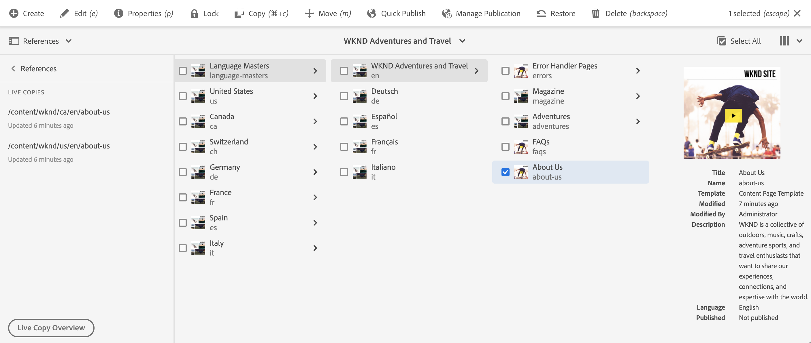
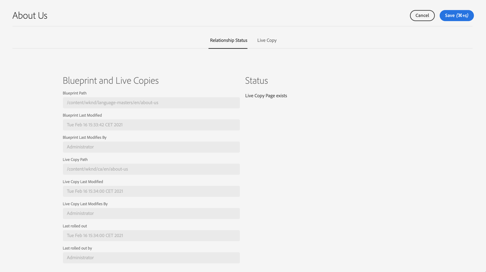

# Contoverconsole voor live kopiëren {#live-copy-overview-console}

Met de console **Live Copy Overview** kunt u:

* Overerving op een site weergeven/beheren.
   * De boomstructuur en de bijbehorende structuur van Actieve kopie samen met de overervingsstatus weergeven
   * De overervingsstatus wijzigen, zoals opschorten en hervatten
   * Vervaging en eigenschappen van Live Copy weergeven
* Voer rollout-handelingen uit.

## Het Live Copy-overzicht openen {#opening-the-live-copy-overview}

U kunt het Live Copy-overzicht openen via het volgende:

* [Referenties in het zijpaneel van een blauwdrukpagina (Sites-console)](#opening-live-copy-overview-references-for-a-blueprint-page)
* [Eigenschappen van een blauwdrukpagina](#opening-live-copy-overview-properties-of-a-blueprint-page)

### Verwijzingen naar een vervagingspagina {#references-to-a-blueprint-page}

Het **Live Copy-overzicht** kan worden geopend vanuit het zijpaneel **References** van de **Sites**-console:

1. In **Sites** console, [navigeer aan uw blauwdrukpagina en selecteer het.](/help/sites-cloud/authoring/getting-started/basic-handling.md#viewing-and-selecting-resources)
1. Open **[References](/help/sites-cloud/authoring/getting-started/basic-handling.md#references)** en selecteer **Actieve kopieën**.

   

   >[!TIP]
   >
   >U kunt verwijzingen ook eerst openen en vervolgens de blauwdruk selecteren.

1. Selecteer **Overzicht van actieve kopie** om het overzicht van alle actieve kopieën met betrekking tot de geselecteerde blauwdruk weer te geven en te gebruiken.
1. Gebruik **Close** om af te sluiten en terug te keren naar de **Sites**-console.

### Eigenschappen van een vervagingspagina {#properties-of-a-blueprint-page}

Het **Live Copy-overzicht** kan worden geopend wanneer u eigenschappen van een blauwdrukpagina bekijkt:

1. Open **Eigenschappen** voor de aangewezen blauwdrukpagina.
1. Open het tabblad **Vervagen** - de optie **Live kopie overzicht** wordt weergegeven op de bovenste werkbalk:

   

1. Selecteer **Overzicht van actieve kopie** om het overzicht van alle actieve kopieën met betrekking tot de huidige blauwdruk weer te geven en te gebruiken.

1. Gebruik **Close** om af te sluiten en terug te keren naar de **Sites**-console.

## Het gebruiken van het Levende Overzicht van het Exemplaar {#using-the-live-copy-overview}

In het venster **Overzicht van actieve kopie** vindt u een overzicht van de status van de actieve kopieën die betrekking hebben op de geselecteerde pagina.

Een rollout hangt van de synchronisatieacties af die in de specifieke rollout configuratie worden bepaald. Sommige acties zijn afhankelijk van wijzigingen in de inhoud. Er zijn echter ook veel acties die niet afhankelijk zijn van wijzigingen in de inhoud, maar die afhankelijk zijn van gebeurtenissen zoals paginanactivering. Dergelijke gebeurtenissen wijzigen de inhoud niet, maar wijzigen wel de interne eigenschappen die betrekking hebben op de inhoud.

De statusvelden zijn ook afhankelijk van de synchronisatiehandelingen die zijn gedefinieerd in de specifieke rollout-configuratie en geven aan of dergelijke acties zijn uitgevoerd voor de blauwdruk of de Live Copy sinds de laatste geslaagde rollout. Een statusgebied zal slechts op de acties in de specifieke rollout configuratie wijzen. Als er nooit een actieve kopie is uitgevoerd zonder dat dit is gelukt, wordt de status altijd bijgewerkt.

Een rollout-configuratie wordt bijvoorbeeld gedefinieerd als `targetActivate`. Daarom zal een uitrol alleen afhankelijk zijn van activeringsgebeurtenissen. Het statusveld geeft alleen aan of er activeringsgebeurtenissen zijn opgetreden sinds de laatste geslaagde implementatie.

Het **Live Copy-overzicht** kan ook worden gebruikt om handelingen uit te voeren op de actieve kopie:

1. Open **Live Copy Overview**.
1. Selecteer de gewenste blauwdruk of pagina Live kopie en de werkbalk wordt bijgewerkt met de beschikbare acties. De [beschikbare acties](overview.md#terms-used) hangen af van het feit of u een [blauwdruk](#actions-for-a-blueprint-page) of [Live Copy](#actions-for-a-live-copy-page) pagina selecteert.

### Handelingen voor een blauwdrukpagina {#actions-for-a-blueprint-page}

Wanneer u een blauwdrukpagina selecteert, zijn de volgende acties beschikbaar:

* **Bewerken**  - Open de pagina met de blauwdruk voor bewerking.
* **[Uitvoeren](overview.md#rollout-and-synchronize)**  - Een rollout uitvoeren om wijzigingen van de bron naar Live Copy door te voeren.

### Handelingen voor een pagina {#actions-for-a-live-copy-page} van Actieve kopie

Wanneer u een pagina voor Live kopie selecteert, zijn de volgende acties beschikbaar:

* **Bewerken**  - Open de pagina Live kopie voor bewerking.
* **[Relatiestatus](#relationship-status)**  - Informatie weergeven over de status en overerving.
* **[Synchroniseren](overview.md#rollout-and-synchronize)**  - Een actieve kopie synchroniseren om wijzigingen van de bron naar de actieve kopie over te brengen.
* **[Herstellen](creating-live-copies.md#resetting-a-live-copy-page)**  - Een pagina van Live kopie opnieuw instellen om alle annuleringen van overerving te verwijderen en de pagina terug te brengen naar dezelfde status als de bronpagina.
* **[Suspend](overview.md#suspending-and-cancelling-inheritance-and-synchronization)**  - Hiermee deactiveert u tijdelijk de live relatie tussen een actieve kopie en de bijbehorende blauwdrukpagina.
* **[Hervatten](creating-live-copies.md#resuming-inheritance-for-a-page)**  - hervat staat u toe om een geschorste verhouding te herstellen.
* **[Loskoppelen](overview.md#detaching-a-live-copy)**  - Hiermee verwijdert u permanent de live relatie tussen een actieve kopie en de bijbehorende blauwdrukpagina.

## Relatiestatus {#relationship-status}

De **Relationship Status** console heeft twee lusjes die een waaier van functionaliteit verstrekken.

* [Relationistatiestatus](#relationship-status-tab)
* [Live kopie](#live-copy-tab)

### Relatiestatus {#relationship-status-tab}

Dit tabblad bevat gedetailleerde informatie over de status van de relatie tussen de blauwdruk en Live kopie.

### Live kopie {#live-copy-tab}

Op dit tabblad kunt u de Live Copy-configuratie weergeven en bewerken.

