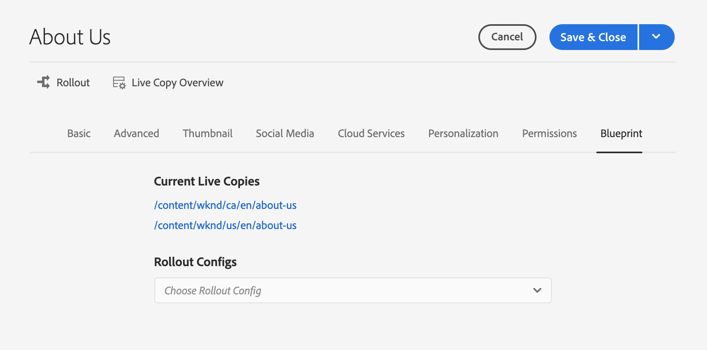
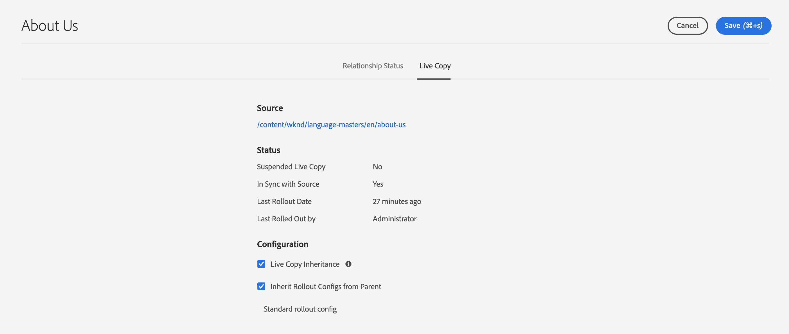

# Console voor live kopiëren {#live-copy-overview-console}

De **Levende console van het Overzicht van het Exemplaar** laat u toe:

* Overerving op een site weergeven/beheren.
   * De boomstructuur en de bijbehorende structuur van Actieve kopie samen met de overervingsstatus weergeven
   * De overervingsstatus wijzigen, zoals opschorten en hervatten
   * Vervaging en eigenschappen van Live Copy weergeven
* Voer rollout-handelingen uit.

## Het Live Copy-overzicht openen {#opening-the-live-copy-overview}

U kunt het Live Copy-overzicht openen via het volgende:

* [Referenties in het zijpaneel van een blauwdrukpagina (Sites-console)](#opening-live-copy-overview-references-for-a-blueprint-page)
* [Eigenschappen van een blauwdrukpagina](#opening-live-copy-overview-properties-of-a-blueprint-page)

### Verwijzingen naar een vervagingspagina {#references-to-a-blueprint-page}

Het **Levende Overzicht van het Exemplaar** kan van het **3&rbrace; zijpaneel van Verwijzingen van de** Sites **console worden geopend:**

1. In de **console van Plaatsen**, [&#x200B; navigeer aan uw blauwdruk pagina en selecteer het &#x200B;](/help/sites-cloud/authoring/basic-handling.md#viewing-and-selecting-resources).
1. Open het **[spoor van Verwijzingen](/help/sites-cloud/authoring/basic-handling.md#references)** en selecteer **Levende Exemplaren**.

   

   >[!TIP]
   >
   >U kunt verwijzingen ook eerst openen en vervolgens de blauwdruk selecteren.

1. Selecteer **Levend Overzicht van het Exemplaar** om het overzicht van alle Levende Exemplaren te tonen en te gebruiken met betrekking tot de geselecteerde blauwdruk.
1. Het gebruik **dicht** om weg te gaan en aan de **console van Plaatsen** terug te keren.

### Eigenschappen van een vervagingspagina {#properties-of-a-blueprint-page}

Het **Levende Overzicht van het Exemplaar** kan worden geopend wanneer het bekijken van eigenschappen van een blauwdrukpagina:

1. Open **Eigenschappen** voor de aangewezen blauwdrukpagina.
1. Open het **lusje van de Vervaging** - de **Levende optie van het Overzicht van het Exemplaar** wordt getoond in de hoogste toolbar:

   

1. Selecteer **Levend Overzicht van het Exemplaar** om het overzicht van alle Levende Exemplaren met betrekking tot de huidige blauwdruk te tonen en te gebruiken.

1. Het gebruik **dicht** om weg te gaan en aan de **console van Plaatsen** terug te keren.

## Het Live Copy-overzicht gebruiken {#using-the-live-copy-overview}

Het **Levende venster van het Overzicht van het Exemplaar** verstrekt en overzicht van het statuut van Levende Exemplaren met betrekking tot de geselecteerde pagina.

Een rollout hangt van de synchronisatieacties af die in de specifieke rollout configuratie worden bepaald. Sommige acties zijn afhankelijk van wijzigingen in de inhoud. Er zijn echter ook veel acties die niet afhankelijk zijn van wijzigingen in de inhoud, maar die afhankelijk zijn van gebeurtenissen zoals paginanactivering. Dergelijke gebeurtenissen wijzigen de inhoud niet, maar wijzigen wel de interne eigenschappen die betrekking hebben op de inhoud.

De statusvelden zijn ook afhankelijk van de synchronisatiehandelingen die zijn gedefinieerd in de specifieke rollout-configuratie en geven aan of dergelijke acties zijn uitgevoerd voor de blauwdruk of de Live Copy sinds de laatste geslaagde rollout. Een statusgebied zal slechts op de acties in de specifieke rollout configuratie wijzen. Als er nooit een actieve kopie is uitgevoerd zonder dat dit is gelukt, wordt de status altijd bijgewerkt.

Een rollout-configuratie wordt bijvoorbeeld gedefinieerd als `targetActivate` . Daarom zal een uitrol alleen afhankelijk zijn van activeringsgebeurtenissen. Het statusveld geeft alleen aan of er activeringsgebeurtenissen zijn opgetreden sinds de laatste geslaagde implementatie.

Het **Levende Overzicht van het Exemplaar** kan ook worden gebruikt om acties op Levend Exemplaar uit te voeren:

1. Open het **Levende Overzicht van het Exemplaar**.
1. Selecteer de gewenste blauwdruk of pagina Live kopie en de werkbalk wordt bijgewerkt om de beschikbare acties weer te geven. De [&#x200B; beschikbare acties &#x200B;](overview.md#terms-used) hangen van af of u a [&#x200B; blauwdruk &#x200B;](#actions-for-a-blueprint-page) of [&#x200B; Levende pagina van het Exemplaar &#x200B;](#actions-for-a-live-copy-page) selecteert.

### Handelingen voor een vervagingspagina {#actions-for-a-blueprint-page}

Wanneer u een blauwdrukpagina selecteert, zijn de volgende acties beschikbaar:

* **geeft** uit - open de blauwdruk pagina voor het uitgeven uit.
* **[Uitvoer](overview.md#rollout-and-synchronize)** - voer een rollout uit om veranderingen van de bron in Levend Exemplaar te duwen.

### Handelingen voor een Live Copy-pagina {#actions-for-a-live-copy-page}

Wanneer u een pagina voor Live kopie selecteert, zijn de volgende acties beschikbaar:

* **geef uit** - open de Levende pagina van het Exemplaar voor het uitgeven uit.
* **[Status van de Verhouding](#relationship-status)** - de informatie van de mening over de status en de overerving.
* **[synchroniseer](overview.md#rollout-and-synchronize)** - synchroniseer een Levende Exemplaar om veranderingen van de bron aan het Levende Exemplaar te trekken.
* **[Terugstellen](creating-live-copies.md#resetting-a-live-copy-page)** - terugstel een Levende pagina van het Exemplaar om alle overervingsannuleringen te verwijderen en de pagina aan de zelfde staat terug te keren zoals de bronpagina.
* **[Opgeschort](overview.md#suspending-and-cancelling-inheritance-and-synchronization)** - desactiveert tijdelijk het levende verband tussen Levend Exemplaar en zijn blauwdrukpagina.
* **[Hervatten](creating-live-copies.md#resuming-inheritance-for-a-page)** - hervat laat u een geschorste verhouding herstellen.
* **[losmaken](overview.md#detaching-a-live-copy)** - verwijdert permanent het levende verband tussen een Levend Exemplaar en zijn blauwdrukpagina.

## Relatie status {#relationship-status}

De **console van de Status van de Verhouding** heeft twee lusjes die een waaier van functionaliteit verstrekken.

* [Relatie status](#relationship-status-tab)
* [Live kopie](#live-copy-tab)

### Relatie status {#relationship-status-tab}

Dit tabblad bevat gedetailleerde informatie over de status van de relatie tussen de blauwdruk en Live kopie.

### Live kopie {#live-copy-tab}

Op dit tabblad kunt u de Live Copy-configuratie weergeven en bewerken.

