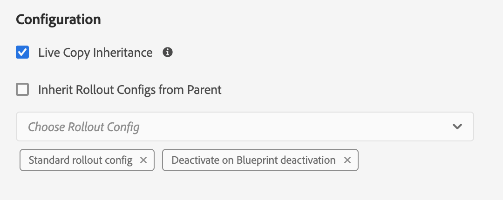

# Synchronisatie van actieve kopie configureren {#configuring-live-copy-synchronization}

Adobe Experience Manager biedt verschillende synchronisatieconfiguraties uit de verpakking. Voordat u Actieve kopieën gebruikt, moet u het volgende in overweging nemen om te bepalen hoe en wanneer Live kopieën worden gesynchroniseerd met de broninhoud ervan.

1. Bepaal of de bestaande rollout configuraties aan uw vereisten voldoen
1. Als de bestaande rollout configuraties niet, beslissen of u uw moet creëren.
1. Geef de rollout-configuraties op die u wilt gebruiken voor Live kopieën.

## Geïnstalleerde en Aangepaste implementatieconfiguraties {#installed-and-custom-rollout-configurations}

Deze sectie verstrekt informatie over de geïnstalleerde rollout configuraties en de synchronisatieacties die zij gebruiken, en hoe te om douaneconfiguraties tot stand te brengen indien nodig.

>[!CAUTION]
>
>Het bijwerken van of het veranderen van een uit-van-de-doos rollout configuratie is **niet** aanbevolen. Als er een vereiste voor een douanelevende actie is dan zou het in een aangepaste rollout configuratie moeten worden toegevoegd.

### Rollouttriggers {#rollout-triggers}

Elke rollout configuratie gebruikt een rollout trekker die de rollout veroorzaakt om voor te komen. Rolloutconfiguraties kunnen een van de volgende triggers gebruiken:

* **Bij rollout**: De **Uitrol** wordt gebruikt op de blauwe afdrukpagina, of **Synchroniseren** wordt gebruikt op de pagina Live kopiëren.
* **Bij wijziging**: De bronpagina wordt gewijzigd.
* **Bij activering**: De bronpagina wordt geactiveerd.
* **Bij deactivering**: De bronpagina is gedeactiveerd.

>[!NOTE]
>
>Gebruik van de **Bij wijziging** trigger kan van invloed zijn op de prestaties. Zie [MSM best practices](best-practices.md#onmodify) voor meer informatie .

### Uitrolconfiguraties {#rollout-configurations}

De volgende lijst maakt een lijst van de rollout configuraties die uit-van-de-doos met AEM worden verstrekt. De lijst omvat de trekker en synchronisatieacties van elke rollout configuratie.

Als de geïnstalleerde acties van de rollout configuratie niet aan uw vereisten voldoen, kunt u [een rollout-configuratie maken.](#creating-a-rollout-configuration)

| Naam | Beschrijving | Trigger | [Synchronisatiehandelingen](#synchronization-actions) |
|---|---|---|---|
| Standaardconfiguratie voor rollout | Standaardrollout-configuratie waarmee het rollout-proces kan worden gestart bij rollout-trigger en waarmee handelingen kunnen worden uitgevoerd: maken, bijwerken, verwijderen en bestellen van onderliggende knooppunten | Bij rollout | `contentUpdate` `contentCopy` `contentDelete` `referencesUpdate` `productUpdate` `orderChildren` |
| Activeren bij activering van blauwdruk | Live kopie publiceren wanneer de bron wordt gepubliceerd | Bij activering | `targetActivate` |
| Deactiveren bij deactivering van blauwdruk | Hiermee wordt Live kopie gedeactiveerd wanneer de bron is gedeactiveerd | Bij deactivering | `targetDeactivate` |
| Verschuiven bij wijzigen | Hiermee wordt de inhoud naar de live kopie gepusht wanneer de bron wordt gewijzigd Gebruik spaarzaam deze rollout configuratie aangezien het bij de trekker van de Wijziging gebruikt. | Bij wijziging | `contentUpdate` `contentCopy` `contentDelete` `referencesUpdate` `orderChildren` |
| Ingedrukt op wijzigen (ondiep) | Hiermee wordt inhoud in Live Copy gepusht wanneer de pagina Blauwdruk wordt gewijzigd, zonder referenties bij te werken (bijvoorbeeld voor oppervlakkige kopieën) Gebruik spaarzaam deze rollout configuratie aangezien het bij de trekker van de Wijziging gebruikt. | Bij wijziging | `contentUpdate` `contentCopy` `contentDelete` `orderChildren` |
| Starten bevorderen | Standaardrollout-configuratie voor het promoten van opstartiepagina&#39;s. | Bij rollout | `contentUpdate` `contentCopy` `contentDelete` `referencesUpdate` `orderChildren` `markLiveRelationship` |

### Synchronisatiehandelingen {#synchronization-actions}

De volgende lijst maakt een lijst van de synchronisatieacties die uit-van-de-doos met AEM worden verstrekt.

Als de geïnstalleerde acties niet aan uw vereisten voldoen, kunt u [Maak een nieuwe synchronisatiehandeling.](/help/implementing/developing/extending/msm.md#creating-a-new-synchronization-action)

| Naam van handeling | Beschrijving | Eigenschappen |
|---|---|---|
| `contentCopy` | Wanneer knooppunten van de bron niet aanwezig zijn in Live kopie, worden deze gekopieerd naar Live kopie. [Vorm **CQ MSM-inhoud kopiëren, actie** service](#excluding-properties-and-node-types-from-synchronization) om de knooppunttypes, paragraafpunten, en pagina-eigenschappen te specificeren om uit te sluiten. |  |
| `contentDelete` | Met deze handeling verwijdert u knooppunten van de actieve kopie die niet op de bron aanwezig zijn. [Vorm **CQ MSM-inhoud Handeling verwijderen** service](#excluding-properties-and-node-types-from-synchronization) om de knooppunttypes, paragraafpunten, en pagina-eigenschappen te specificeren om uit te sluiten. |  |
| `contentUpdate` | Met deze actie werkt u de inhoud van Live kopie bij met de wijzigingen van de bron. [Vorm **Update-actie CQ MSM-inhoud** service](#excluding-properties-and-node-types-from-synchronization) om de knooppunttypes, paragraafpunten, en pagina-eigenschappen te specificeren om uit te sluiten. |  |
| `editProperties` | Met deze handeling bewerkt u de eigenschappen van de actieve kopie. De `editMap` Deze eigenschap bepaalt welke eigenschappen worden bewerkt en de waarde ervan. De waarde van `editMap` eigenschap moet de volgende notatie gebruiken: `[property_name_n]#[current_value]#[new_value]` `current_value` en `new_value` zijn reguliere expressies en `n` is een verhoogd geheel getal. Neem bijvoorbeeld de volgende waarde voor `editMap`: `sling:resourceType#/(contentpage`bekrachtigen`homepage)#/mobilecontentpage,cq:template#/contentpage#/mobilecontentpage` Met deze waarde worden de eigenschappen van de knooppunten van Live Copy als volgt bewerkt: De `sling:resourceType` eigenschappen die zijn ingesteld op `contentpage` of aan `homepage` zijn ingesteld op `mobilecontentpage`. De `cq:template` eigenschappen die zijn ingesteld op `contentpage` zijn ingesteld op `mobilecontentpage`. | `editMap: (String)` identificeert de eigenschap, de huidige waarde en de nieuwe waarde. Zie de beschrijving voor meer informatie. |
| `notify` | Met deze actie wordt een paginagebeurtenis verzonden die de pagina heeft opgerold. Om op de hoogte te worden gesteld, moet u zich eerst abonneren op rollout-gebeurtenissen. |  |
| `orderChildren` | Met deze handeling worden de onderliggende knooppunten gesorteerd op basis van de volgorde op de blauwdruk. |  |
| `referencesUpdate` | Deze synchronisatiehandeling werkt verwijzingen naar Live Copy bij. Er wordt gezocht naar paden op de pagina&#39;s van Live Copy die naar een bron in de blauwdruk verwijzen. Als deze optie wordt gevonden, wordt het pad bijgewerkt zodat deze naar de gerelateerde bron in de Live kopie verwijst. Verwijzingen die doelen buiten de blauwdruk hebben, worden niet gewijzigd.  [Vorm **Update-actie CQ MSM-verwijzingen** service](#excluding-properties-and-node-types-from-synchronization) om de knooppunttypes, paragraafpunten, en pagina-eigenschappen te specificeren om uit te sluiten. |  |
| `targetVersion` | Met deze handeling maakt u een versie van Live Copy. Deze actie moet de enige synchronisatieactie inbegrepen in een rollout configuratie zijn. |  |
| `targetActivate` | Met deze actie activeert u de live kopie. Deze actie moet de enige synchronisatieactie inbegrepen in een rollout configuratie zijn. |  |
| `targetDeactivate` | Met deze handeling wordt de actieve kopie gedeactiveerd. Deze actie moet de enige synchronisatieactie inbegrepen in een rollout configuratie zijn. |  |
| `workflow` | Met deze handeling wordt de workflow gestart die door de eigenschap target (alleen voor pagina&#39;s) wordt gedefinieerd en wordt Live Copy als een payload uitgevoerd. Het doelpad is het pad van het modelknooppunt. | `target: (String)` is het pad naar het workflowmodel. |
| `mandatory` | Deze actie plaatst de toestemming van verscheidene ACLs op de Levende pagina van het Exemplaar aan read-only voor een specifieke gebruikersgroep. De volgende ACLs wordt gevormd: `ActionSet.ACTION_NAME_REMOVE` `ActionSet.ACTION_NAME_SET_PROPERTY` `ActionSet.ACTION_NAME_ACL_MODIFY` Gebruik deze handeling alleen voor pagina&#39;s. | `target: (String)` is identiteitskaart van de groep waarvoor u toestemmingen plaatst. |
| `mandatoryContent` | Deze actie plaatst de toestemming van verscheidene ACLs op de Levende pagina van het Exemplaar aan read-only voor een specifieke gebruikersgroep. De volgende ACLs wordt gevormd: `ActionSet.ACTION_NAME_SET_PROPERTY` `ActionSet.ACTION_NAME_ACL_MODIFY` Gebruik deze handeling alleen voor pagina&#39;s. | `target: (String)` is identiteitskaart van de groep waarvoor u toestemmingen plaatst. |
| `mandatoryStructure` | Met deze handeling wordt de machtiging van de `ActionSet.ACTION_NAME_REMOVE` ACL op de Levende pagina van het Exemplaar aan read-only voor een specifieke gebruikersgroep. Gebruik deze handeling alleen voor pagina&#39;s. | `target: (String)` is identiteitskaart van de groep waarvoor u toestemmingen plaatst. |
| `VersionCopyAction` | Als de blauwdruk-/bronpagina ten minste één keer is gepubliceerd, wordt met deze actie een pagina van Live kopie gemaakt met de versie die wordt gepubliceerd. Opmerking: deze handeling is alleen beschikbaar voor het maken van een Live Copy-pagina op basis van een gepubliceerde bronpagina, niet voor het bijwerken van een bestaande Live Copy-pagina. |  |
| `PageMoveAction` | De `PageMoveAction` wordt toegepast wanneer een pagina in de blauwdruk is verplaatst. De actie kopieert eerder dan verplaatst de (verwante) Levende pagina van het Exemplaar van de plaats vóór de beweging aan de plaats na. De `PageMoveAction` wijzigt de pagina Live kopie niet op de locatie vóór de verplaatsing. Daarom voor opeenvolgende rollout configuraties heeft het de status van een levende verhouding zonder een blauwdruk. [Vorm **Handeling Verplaatsen CQ MSM-pagina** service](#excluding-properties-and-node-types-from-synchronization) om de knooppunttypes, paragraafpunten, en pagina-eigenschappen te specificeren om uit te sluiten. Deze actie moet de enige synchronisatieactie inbegrepen in een rollout configuratie zijn. | Set `prop_referenceUpdate: (Boolean)` naar waar (standaard) om verwijzingen bij te werken. |
| `markLiveRelationship` | Deze actie geeft aan dat er een live relatie bestaat voor inhoud die is gemaakt met het opstarten. |  |

### Een rollout-configuratie maken {#creating-a-rollout-configuration}

U kunt [een rollout-configuratie maken](/help/implementing/developing/extending/msm.md#creating-a-new-rollout-configuration) als de geïnstalleerde implementatieconfiguraties niet voldoen aan de toepassingsvereisten door de volgende stappen uit te voeren.

1. [De rollout-configuratie maken](/help/implementing/developing/extending/msm.md#create-the-rollout-configuration)
1. [Synchronisatiehandelingen toevoegen aan de rollout-configuratie.](/help/implementing/developing/extending/msm.md#add-synchronization-actions-to-the-rollout-configuration)

De nieuwe rollout configuratie is dan beschikbaar aan u wanneer het vormen rollout configuraties op een blauwdruk of een Actieve pagina van het Exemplaar.

### Eigenschappen en knooppunttypen uitsluiten van synchronisatie {#excluding-properties-and-node-types-from-synchronization}

U kunt verscheidene diensten vormen OSGi die overeenkomstige synchronisatieacties steunen zodat zij geen specifieke knooptypes en eigenschappen beïnvloeden. Veel eigenschappen en subknooppunten die bijvoorbeeld betrekking hebben op de interne werking van AEM, mogen niet in een Live kopie worden opgenomen. Alleen de inhoud die relevant is voor de gebruiker van de pagina moet worden gekopieerd.

Wanneer het werken met AEM, zijn er verscheidene methodes om de configuratiemontages voor dergelijke diensten te beheren. Zie [OSGi configureren](/help/implementing/deploying/configuring-osgi.md) voor meer details en de aanbevolen werkwijzen.

In de volgende tabel worden de synchronisatiehandelingen weergegeven waarvoor u de knooppunten kunt opgeven die moeten worden uitgesloten. De lijst verstrekt de namen van de diensten om het gebruiken van de Console en PID van het Web voor het vormen van het gebruiken van een gegevensopslagknoop te vormen.

| Synchronisatie-actie | Servicenaam in webconsole | Service PID |
|---|---|---|
| `contentCopy` | CQ MSM-inhoud kopiëren, actie | `com.day.cq.wcm.msm.impl.actions.ContentCopyActionFactory` |
| `contentDelete` | CQ MSM-inhoud Handeling verwijderen | `com.day.cq.wcm.msm.impl.actions.ContentDeleteActionFactory` |
| `contentUpdate` | Update-actie CQ MSM-inhoud | `com.day.cq.wcm.msm.impl.actions.ContentUpdateActionFactory` |
| `PageMoveAction` | Handeling Verplaatsen CQ MSM-pagina | `com.day.cq.wcm.msm.impl.actions.PageMoveActionFactory` |
| `referencesUpdate` | Update-actie CQ MSM-verwijzingen | `com.day.cq.wcm.msm.impl.actions.ReferencesUpdateActionFactory` |

In de volgende tabel worden de eigenschappen beschreven die u kunt configureren:

| Webconsole-eigenschap | OSGi-eigenschap | Beschrijving |
|---|---|---|
| Uitgesloten knooppunttypen | `cq.wcm.msm.action.excludednodetypes` | Een reguliere expressie die overeenkomt met de knooppunttypen die moeten worden uitgesloten van de synchronisatiehandeling |
| Uitgesloten alinea-items | `cq.wcm.msm.action.excludedparagraphitems` | Een reguliere expressie die overeenkomt met de alinea-items die moeten worden uitgesloten van de synchronisatiehandeling |
| Eigenschappen van uitgesloten pagina | `cq.wcm.msm.action.excludedprops` | Een reguliere expressie die overeenkomt met de pagina-eigenschappen die moeten worden uitgesloten van de synchronisatiehandeling |
| Genegeerde Mixin NodeTypes | `cq.wcm.msm.action.ignoredMixin` | Een reguliere expressie die overeenkomt met de namen van knooppunttypen die moeten worden uitgesloten van de synchronisatiehandeling (alleen beschikbaar voor `contentUpdate` actie) |

#### Actie voor bijwerken van CQ MSM-inhoud - Uitsluitingen {#cq-msm-content-update-action-exclusions}

Verscheidene eigenschappen en knooptypes worden uitgesloten door gebrek, worden deze bepaald in de configuratie OSGi van **Update-actie CQ MSM-inhoud**, onder **Eigenschappen van uitgesloten pagina**.

Standaard worden eigenschappen die overeenkomen met de volgende reguliere expressies uitgesloten (dat wil zeggen niet bijgewerkt) bij rollout:

U kunt de expressies wijzigen die de uitsluitingslijst naar wens definiëren.

Als u bijvoorbeeld de pagina wilt **Titel** om te worden opgenomen in de wijzigingen die voor de uitrol worden overwogen, `jcr:title` van de uitsluitingen. Bijvoorbeeld met regex:

`jcr:(?!(title)$).*`

### Synchronisatie configureren voor het bijwerken van verwijzingen {#configuring-synchronization-for-updating-references}

U kunt verscheidene diensten vormen OSGi die overeenkomstige synchronisatieacties met betrekking tot het bijwerken van verwijzingen steunen.

Wanneer het werken met AEM, zijn er verscheidene methodes om de configuratiemontages voor dergelijke diensten te beheren. Zie [OSGi configureren](/help/implementing/deploying/configuring-osgi.md) voor meer details en de aanbevolen werkwijzen.

In de volgende tabel staan de synchronisatiehandelingen waarvoor u de update van de verwijzing kunt opgeven. De lijst verstrekt de namen van de diensten om het gebruiken van de Console en PID van het Web voor het vormen van het gebruiken van een gegevensopslagknoop te vormen.

| Webconsole-eigenschap | OSGi-eigenschap | Beschrijving |
|---|---|---|
| Referentie bijwerken in geneste LiveCopy&#39;s | `cq.wcm.msm.impl.action.referencesupdate.prop_updateNested` | Selecteer deze optie in de webconsole of stel deze Booleaanse eigenschap in op `true` het gebruiken van de bewaarplaatsconfiguratie om verwijzingen te vervangen die om het even welke bron richten die binnen de tak van het hoogste Levende Exemplaar is. Alleen beschikbaar voor `referencesUpdate` handeling. |
| Referentiepagina&#39;s bijwerken | `cq.wcm.msm.impl.actions.pagemove.prop_referenceUpdate` | Selecteer deze optie in de webconsole of stel deze Booleaanse eigenschap in op `true` met behulp van de configuratie van de opslagplaats verwijzingen bijwerken om de oorspronkelijke pagina te gebruiken en in plaats daarvan te verwijzen naar de pagina Live kopie. Alleen beschikbaar voor `PageMoveAction`. |

## De te gebruiken configuraties voor rollout opgeven {#specifying-the-rollout-configurations-to-use}

Met MSM kunt u sets van rollout-configuraties opgeven die algemeen worden gebruikt. Indien nodig kunt u deze voor specifieke live kopieën overschrijven. MSM verstrekt verscheidene plaatsen voor het specificeren van de rollout configuraties aan gebruik. De locatie bepaalt of de configuratie van toepassing is op een specifieke live kopie.

De volgende lijst met locaties waar u de te gebruiken rollout-configuraties kunt opgeven, beschrijft hoe MSM bepaalt welke rollout-configuraties moeten worden gebruikt voor een Live Copy:

* **[Live kopiëren, pagina-eigenschappen](live-copy-sync-config.md#setting-the-rollout-configurations-for-a-live-copy-page):** Wanneer een Live Copy-pagina is geconfigureerd voor het gebruik van een of meer rollout-configuraties, gebruikt MSM die rollout-configuraties.
* **[Eigenschappen van vervagingspagina](live-copy-sync-config.md#setting-the-rollout-configuration-for-a-blueprint-page):** Wanneer een Live kopie is gebaseerd op een blauwdruk en de pagina Live kopie niet is geconfigureerd met een rollout-configuratie, wordt de rollout-configuratie gebruikt die is gekoppeld aan de bronpagina van de blauwdruk.
* **Eigenschappen van bovenliggende pagina van live kopiëren:** Wanneer noch de Live Copy-pagina noch de bronpagina van de blauwdruk is geconfigureerd met een rollout-configuratie, wordt de rollout-configuratie gebruikt die van toepassing is op de bovenliggende pagina van de Live Copy-pagina.
* **[Systeemstandaard](live-copy-sync-config.md#setting-the-system-default-rollout-configuration):** Wanneer de rollout-configuratie van de bovenliggende pagina van Live Copy niet kan worden bepaald, wordt de standaardconfiguratie voor uitrol van het systeem gebruikt.

Een blauwdruk gebruikt bijvoorbeeld de [WKND-zelfstudie](/help/implementing/developing/introduction/develop-wknd-tutorial.md) site als broninhoud. Op basis van de blauwdruk wordt een site gemaakt. Elk punt in de volgende lijst beschrijft een verschillend scenario betreffende het gebruik van rollout configuraties:

* Geen van de pagina&#39;s van de blauwdruk of de Live Copy-pagina&#39;s is geconfigureerd om een rollout-configuratie te gebruiken. MSM gebruikt de standaardconfiguratie van de systeemuitloop voor alle Live Copy-pagina&#39;s.
* De wortelpagina van de plaats WKND wordt gevormd met verscheidene rollout configuraties. MSM gebruikt deze rollout configuraties voor alle Live Copy pagina&#39;s.
* De hoofdpagina van de WKND-site is geconfigureerd met verschillende rollout-configuraties en de hoofdpagina van de Live Copy-site is geconfigureerd met een andere set rollout-configuraties. MSM gebruikt de rollout configuraties die op de wortelpagina van de Levende plaats van het Exemplaar worden gevormd.

### De rollout-configuraties instellen voor een Live Copy-pagina {#setting-the-rollout-configurations-for-a-live-copy-page}

Configureer een Live Copy-pagina met de rollout-configuraties die moeten worden gebruikt wanneer de bronpagina wordt uitgerold. Onderliggende pagina&#39;s nemen de configuratie standaard over. Wanneer u de rollout configuratie aan gebruik vormt, treedt u de configuratie met voeten die de Live pagina van het Exemplaar van zijn ouder erft.

U kunt ook de rollout-configuraties configureren voor een Live Copy-pagina wanneer u [Live kopie maken](creating-live-copies.md#creating-a-live-copy-of-a-page).

1. Gebruik de **Sites** om de pagina Live kopie te selecteren.
1. Selecteren **Eigenschappen** op de werkbalk.
1. Open de **Live kopie** tab.

   De **Configuratie** toont de rollout configuraties die de pagina erft.

   

1. Pas indien nodig de **Overerving van Actieve kopie** markering. Als deze optie is ingeschakeld, is de configuratie van Live kopie effectief voor alle onderliggende elementen.

1. Wis de **De configuratie van de Overerving van de Uitvoer van Bovenliggend** eigenschap, selecteert u vervolgens een of meer rollout-configuraties in de lijst.

   De geselecteerde rollout configuraties verschijnen onder de drop-down lijst.

   

1. Selecteren **Opslaan en sluiten**.

### De configuratie van de Output instellen voor een vervagingspagina {#setting-the-rollout-configuration-for-a-blueprint-page}

Configureer een blauwdrukpagina met de rollout-configuraties die moeten worden gebruikt wanneer de blauwdrukpagina wordt uitgevouwen.

De onderliggende pagina&#39;s van de blauwdrukpagina nemen de configuratie over. Wanneer u de rollout configuratie aan gebruik vormt, zou u de configuratie kunnen met voeten treden die de pagina van zijn ouder erft.

1. Gebruik de **Sites** -console om de basispagina van de blauwdruk te selecteren.
1. Selecteren **Eigenschappen** op de werkbalk.
1. Open de **Blauwdruk** tab.
1. Selecteer een of meer **Uitrolconfiguraties** met de keuzelijst.
1. Updates blijven gebruiken met **Opslaan**.

### De standaardconfiguratie van de systeemuitrol instellen {#setting-the-system-default-rollout-configuration}

Om een rollout configuratie te specificeren om als systeemgebrek te gebruiken, vorm de volgende dienst OSGi.

* **Day CQ WCM Live Relationship Manager** met de dienst PID `com.day.cq.wcm.msm.impl.LiveRelationshipManagerImpl`

Vorm de dienst gebruikend of [webconsole](/help/implementing/deploying/configuring-osgi.md#osgi-configuration-with-the-web-console) of [opslagknooppunt](/help/implementing/deploying/configuring-osgi.md#osgi-configuration-in-the-repository).

* In de Webconsole, is de naam van het bezit te vormen **Standaardconfiguratie voor rollout**.
* Gebruikend een gegevensopslaggegevensopslagknoop, is de naam van het bezit te vormen `liverelationshipmgr.relationsconfig.default`.

Plaats deze bezitswaarde aan de weg van de rollout configuratie aan gebruik als systeemgebrek. De standaardwaarde is `/libs/msm/wcm/rolloutconfigs/default`, die **Standaardconfiguratie voor rollout**.
