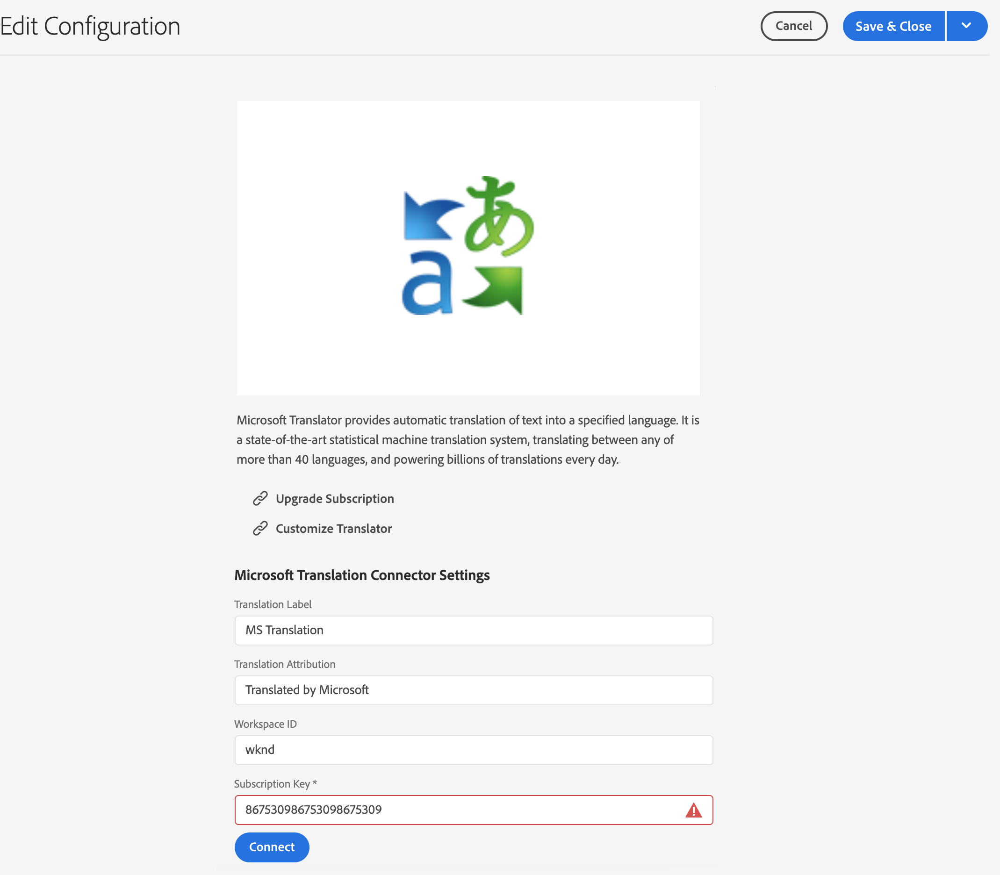

# Verbinding maken met Microsoft Translator {#connecting-to-microsoft-translator}

Maak een configuratie voor de [Microsoft Translator](https://hub.microsofttranslator.com)-cloudservice om uw Microsoft Translation-account te gebruiken voor het vertalen van AEM pagina-inhoud of -elementen.

>[!NOTE]
>
>AEM biedt een proefaccount van Microsoft Translation waarmee maximaal 2 000 000 gratis vertaalde tekens per maand kunnen worden gebruikt. Als u een accountabonnement wilt verkrijgen dat geschikt is voor productiesystemen, raadpleegt u [De configuratie van de proefversie van Microsoft Translator-licentie upgraden](#upgrading-the-microsoft-translator-trial-license-configuration).

| Eigenschap | Beschrijving |
|---|---|
| Vertaallabel | De weergavenaam voor de vertaalservice |
| Vertaalkenmerk | (Optioneel) Voor door de gebruiker gegenereerde inhoud wordt de toewijzing naast vertaalde tekst weergegeven, bijvoorbeeld `Translations by Microsoft` |
| Werkruimte-id | (Optioneel) De id van de aangepaste Microsoft Translator-engine die u wilt gebruiken |
| Subscription Key | Uw Microsoft Subscription Key voor Microsoft Translator |

Nadat u de configuratie creeert, moet u [het ](#activating-the-translator-service-configurations) activeren.

De volgende procedure leidt tot een configuratie van de Vertaler van Microsoft.

1. In [navigatievenster, ](/help/sites-cloud/authoring/getting-started/basic-handling.md#first-steps) klik of tik **Hulpmiddelen** -> **Cloud Services** -> **Vertaal Cloud Services**.
1. Navigeer naar de locatie waar u de configuratie wilt maken. Normaal gesproken bevindt dit zich in de hoofdmap van de site of kan het een algemene standaardconfiguratie zijn.
1. Tik of klik op de knop **Maken**.
1. Definieer uw configuratie.
   1. Selecteer **Microsoft Translator** in de vervolgkeuzelijst.
   1. Typ een titel voor de configuratie. De titel identificeert de configuratie in de console van Cloud Services evenals in de drop-down lijsten van het paginabezit.
   1. Typ desgewenst een naam die u wilt gebruiken voor het knooppunt in de opslagplaats dat de configuratie opslaat.

   

1. Klik **Maken**.
1. Geef in het venster **Configuratie bewerken** de waarden op voor de vertaalservice die in de vorige tabel is beschreven.

   

1. Tik of klik op **Connect** om de verbinding te controleren.
1. Tik of klik op **Opslaan en sluiten**.

## De Microsoft Translator-configuratie voor proefversies van licenties {#upgrading-the-microsoft-translator-trial-license-configuration} bijwerken

De de configuratiepagina&#39;s van de Vertaling van Microsoft verstrekken een geschikte verbinding aan de website van Microsoft voor het verkrijgen van een rekeningsabonnement dat voor productiesystemen adequaat is.

1. Tik in het navigatievenster [op **Gereedschappen** -> **Cloud Services** -> **Cloud Services voor vertaling**.](/help/sites-cloud/authoring/getting-started/basic-handling.md#first-steps)
1. Tik of klik op de bestaande Microsoft Translator-configuratie.
1. Tik of klik op **Bewerken**.
1. Tik in het venster **Configuratie bewerken** of klik op **Abonnement upgraden**. Er wordt een Microsoft-webpagina met meer informatie over de service geopend.

## De Microsoft Translator Engine {#customizing-your-microsoft-translator-engine} aanpassen

De de configuratiepagina&#39;s van de Vertaling van Microsoft verstrekken een gemakkelijke verbinding aan de website van Microsoft voor het aanpassen van uw Vertaalmachine van Microsoft.

1. Tik in het navigatievenster [op **Gereedschappen** -> **Cloud Services** -> **Cloud Services voor vertaling**.](/help/sites-cloud/authoring/getting-started/basic-handling.md#first-steps)
1. Tik of klik op de bestaande Microsoft Translator-configuratie.
1. Tik of klik op **Bewerken**.
1. Tik in het venster **Configuratie bewerken** of klik op **Vertaler aanpassen**. Gebruik de Microsoft-webpagina die wordt geopend om uw service aan te passen.

## De configuraties van de vertaalservice activeren {#activating-the-translator-service-configurations}

U moet uw configuraties van de wolkendienst activeren om vertaalde inhoud te steunen die aan de publicatie instantie wordt herhaald. Gebruik de methode van [het publiceren van een boom](/help/sites-cloud/authoring/fundamentals/publishing-pages.md#publishing-and-unpublishing-a-tree) om de gegevensopslagknopen te activeren die de configuraties van de Vertaler van Microsoft opslaan. De knooppunten bevinden zich onder de volgende bovenliggende knooppunten:

* `/libs/settings/cloudconfigs/translation/msft-translation`
