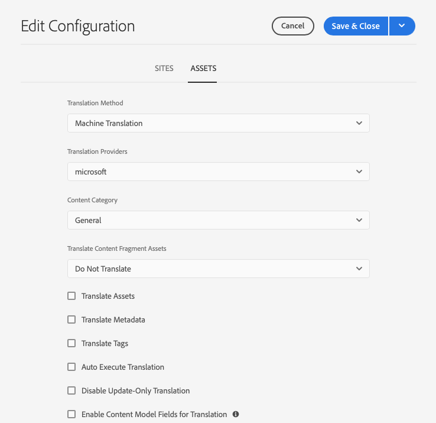

# Het Kader voor de Integratie van de Vertaling vormen {#configuring-the-translation-integration-framework}

Het vertaalintegratiekader integreert met vertaaldiensten van derden om de vertaling van AEM inhoud te ordenen. Het gaat om drie basisstappen.

1. [Maak verbinding met uw vertaalserviceprovider.](#connecting-to-a-translation-service-provider)
1. [Creeer een configuratie van het Kader van de Integratie van de Vertaling.](#creating-a-translation-integration-configuration)
1. [Koppel de cloudconfiguraties aan uw pagina&#39;s.](#configuring-pages-for-translation)

Voor een overzicht van de functies voor het vertalen van inhoud in AEM raadpleegt u [Inhoud vertalen voor meertalige sites](overview.md).

>[!TIP]
>
>Als u nog geen ervaring hebt met het vertalen van inhoud, raadpleegt u [Sites Translation Journey,](/help/journey-sites/translation/overview.md) Dit is een geleid pad door uw AEM Sites-inhoud te vertalen met AEM krachtige vertaalhulpmiddelen, ideaal voor mensen zonder AEM of vertaalervaring.

## Verbinding maken met een vertaalserviceprovider {#connecting-to-a-translation-service-provider}

Maak een cloudconfiguratie die AEM verbindt met uw vertaalserviceprovider. AEM omvat de mogelijkheid om [Verbinding maken met Microsoft® Translator](connect-ms-translator.md) standaard.

De volgende vertaalverkopers verstrekken een implementatie van AEM API voor vertaalprojecten.

* [Microsoft](connect-ms-translator.md)
* [Translations.com](https://exchange.adobe.com/experiencecloud.details.90104.globallink-connect-plus-for-aem.html)
* [Clay Tablet Technologieën](https://exchange.adobe.com/experiencecloud.details.90064.clay-tablet-translation-for-experience-manager.html)
* [Lionbridge](https://exchange.adobe.com/experiencecloud.details.100064.lionbridge-connector-for-experience-manager-63.html)
* [Memsource](https://exchange.adobe.com/experiencecloud.details.103166.memsource-connector-for-adobe-experience-manager.html)
* [Wolken](https://exchange.adobe.com/experiencecloud.details.90019.html)
* [XTM Cloud](https://exchange.adobe.com/experiencecloud.details.105037.xtm-connect-for-adobe-experience-manager.html)
* [Lingotek](https://exchange.adobe.com/experiencecloud.details.90088.lingotek-collaborative-translation-platform.html)
<!-- THIS URL IS 404 * [RWS](https://partners.adobe.com/exchangeprogram/experiencecloud/exchange.details.108277.html) -->
* [Smartling](https://www.smartling.com/software/integrations/adobe-experience-manager/)
* [Systran](https://exchange.adobe.com/experiencecloud.details.90233.systran-for-adobe-experience-manager.html)

Nadat u een schakelaarpakket installeert, kunt u een wolkenconfiguratie voor de schakelaar creëren. Doorgaans moet u uw referenties opgeven voor verificatie bij de vertaalservice. Voor informatie over het toevoegen van een cloudconfiguratie voor de Microsoft® Translator-aansluiting raadpleegt u [Integreren met Microsoft® Translator](connect-ms-translator.md).

Indien nodig kunt u meerdere cloudconfiguraties voor dezelfde aansluiting maken. U kunt bijvoorbeeld één configuratie maken voor elk van de accounts of projecten die u bij dezelfde leverancier hebt.

Nadat u een verbinding vormt, kunt u de configuratie tot stand brengen van het kader van de vertaalintegratie die het gebruikt.

## Een configuratie voor vertaalintegratie maken {#creating-a-translation-integration-configuration}

Maak een configuratie van het vertaalintegratieframework, zodat u kunt opgeven hoe u uw inhoud wilt vertalen. De configuratie bevat de volgende informatie:

* Welke vertaalserviceprovider moet worden gebruikt?
* Of het vertalen van mensen of machines moet worden uitgevoerd
* Of andere inhoud die aan een pagina of element is gekoppeld, zoals codes, moet worden vertaald

Nadat u een kaderconfiguratie creeert, associeert u de wolkenconfiguratie met de pagina&#39;s die u volgens de configuratie wilt vertalen. Wanneer het vertaalproces wordt gestart, gaat de vertaalworkflow verder volgens de bijbehorende frameworkconfiguratie.

Wanneer verschillende gedeelten van uw website verschillende vertaalvereisten hebben, kunt u overeenkomstig meerdere frameworkconfiguraties maken. Een meertalige website kan bijvoorbeeld kopieën in de Engelse, Spaanse en Japanse taal bevatten. De eigenaar van de site gebruikt twee verschillende vertaalserviceproviders voor Spaanse en Japanse vertalingen. Daarom worden twee configuraties van het kader gevormd. Elke configuratie gebruikt een verschillende leverancier van vertaaldiensten.

Nadat u een vertaalintegratieframework hebt geconfigureerd, kunt u [koppelen aan de pagina&#39;s](preparation.md) die het gebruiken.

>[!TIP]
>
>Voor een overzicht van de functies voor het vertalen van inhoud in AEM raadpleegt u [Inhoud vertalen voor meertalige sites](overview.md).

Eén configuratie van het framework bepaalt hoe pagina-inhoud en elementen worden vertaald. Een vertaalconfiguratie maken:

1. In de [algemeen navigatiemenu,](/help/sites-cloud/authoring/basic-handling.md#global-navigation) selecteren **Gereedschappen > Cloud Servicen en Cloud Servicen voor vertaling**.
1. Navigeer naar de plaats waar u de configuratie in uw inhoudsstructuur wilt creëren. Dit is vaak gebaseerd op een bepaalde site of kan globaal zijn.
1. Geef de volgende informatie op in de velden en selecteer **Maken**.:
   1. Selecteren **Configuratietype** in de vervolgkeuzelijst.
   1. Voer een **Titel** voor uw configuratie. De **Titel** identificeert de configuratie in de **Cloud Servicen** console en in de drop-down lijsten van het paginabezit.
   1. Typ desgewenst een **Naam** om te gebruiken voor het gegevensopslagknooppunt dat de configuratie opslaat.
1. In de **Configuratie bewerken** venster, de eigenschappen op het **Sites** en **Activa** tabs en selecteer vervolgens **Opslaan en sluiten**.

### Eigenschappen van siteconfiguratie {#sites-configuration-properties}

De **Sites** bepaalt hoe de vertaling van pagina-inhoud wordt uitgevoerd.

| Eigenschap | Beschrijving |
|---|---|
| Omzettingsmethode | Deze eigenschap definieert de vertaalmethode die het framework uitvoert voor site-inhoud: - Machinevertaling: de vertaalprovider voert de vertaling in real-time uit met behulp van automatische vertaling. - Menselijke vertaling: de inhoud wordt naar de vertaler gestuurd om door vertalers te worden vertaald. - Niet vertalen: inhoud wordt niet verzonden voor vertaling. Hiermee slaat u bepaalde vertakkingen met inhoud over die niet worden vertaald, maar wel kunnen worden bijgewerkt met de meest recente inhoud. |
| Vertaalbureau | Deze eigenschap definieert de vertaalprovider die de vertaling moet uitvoeren. Een leverancier verschijnt in de lijst wanneer zijn overeenkomstige schakelaar wordt geïnstalleerd. |
| Inhoudscategorie | (Alleen machinevertaling) Deze eigenschap is een categorie die de inhoud beschrijft die u wilt vertalen. De categorie kan van invloed zijn op de keuze van terminologie en woordgebruik bij het vertalen van inhoud. |
| Tags vertalen | Met deze optie schakelt u het vertalen van codes in die aan de pagina zijn gekoppeld. |
| Pagina-elementen vertalen | This property define how to translate assets that are added to components from the file system or referenced from assets: - Niet vertalen: pagina-elementen worden niet vertaald. - Workflow voor het vertalen van sites gebruiken: elementen worden verwerkt volgens de configuratie-eigenschappen op de **Sites** tab. - Workflow voor het vertalen van middelen gebruiken: elementen worden verwerkt volgens de eigenschappen die op de **Activa** tab. |
| Vertaling automatisch uitvoeren | Schakel deze eigenschap in om na het maken van vertaalprojecten automatisch vertaaltaken uit te voeren. U hebt geen mogelijkheid om de vertaaltaak te beoordelen en te vergroten wanneer u deze optie selecteert. |
| Alleen-bijwerken translatie uitschakelen | Als deze optie is ingeschakeld, worden bij het bijwerken van het vertaalproject alle vertaalbare velden voor vertaling ingediend, niet alleen de velden die zijn gewijzigd sinds de laatste vertaling. |

### Eigenschappen van middelenconfiguratie {#assets-configuration-properties}

De eigenschappen van activa bepalen hoe te om activa te vormen. Zie voor meer informatie over het vertalen van elementen [Taalkopieën voor middelen maken](/help/assets/translate-assets.md).

| Eigenschap | Beschrijving |
|---|---|
| Omzettingsmethode | Met deze eigenschap wordt het type vertaling geselecteerd dat het framework uitvoert voor elementen: - Machinevertaling: de vertaalprovider voert de vertaling direct uit met behulp van machinevertaling. - Menselijke vertaling: inhoud wordt automatisch naar de vertaalprovider verzonden om handmatig te worden vertaald. -Niet vertalen: middelen worden niet verzonden voor vertaling. |
| Vertaalbureau | Deze eigenschap definieert de vertaalprovider die de vertaling moet uitvoeren. Een leverancier verschijnt in de lijst wanneer zijn overeenkomstige schakelaar wordt geïnstalleerd. |
| Inhoudscategorie | (Alleen machinevertaling) Met deze eigenschap wordt de inhoud beschreven die u wilt vertalen. De categorie kan van invloed zijn op de keuze van terminologie en woordgebruik bij het vertalen van inhoud. |
| Elementen vertalen | Activeer deze eigenschap om elementen in het vertaalproject op te nemen. |
| Metagegevens vertalen | Activeer deze eigenschap zodat u metagegevens van elementen kunt vertalen. |
| Tags vertalen | Activeer deze eigenschap zodat u tags kunt vertalen die aan het element zijn gekoppeld. |
| Vertaling automatisch uitvoeren | Selecteer deze eigenschap zodat u na het maken van vertaalprojecten automatisch vertaaltaken kunt uitvoeren. U hebt geen gelegenheid om de vertaalbaan te herzien of te behandelen wanneer u deze optie selecteert. |
| Alleen-bijwerken translatie uitschakelen | Als deze optie is ingeschakeld, worden bij het bijwerken van het vertaalproject alle vertaalbare velden voor vertaling ingediend, niet alleen de velden die zijn gewijzigd sinds de laatste vertaling. |
| Velden voor inhoudsmodellen inschakelen voor vertaling | Als u deze optie inschakelt, wordt de optie **Vertaalbaar** veld op [Modellen van inhoudsfragmenten](/help/sites-cloud/administering/content-fragments/content-fragment-models.md#properties) bepalen of het veld wordt vertaald en automatisch wordt gemaakt [vertaalregels](rules.md) dienovereenkomstig. Deze optie vervangt de vertaalregels die u hebt gemaakt. |

## Pagina&#39;s voor omzetting configureren {#configuring-pages-for-translation}

Als u de vertaling van uw bronpagina&#39;s in andere talen wilt configureren, koppelt u de pagina&#39;s aan de volgende cloudconfiguraties:

* De wolkenconfiguratie die AEM met uw vertaalleverancier verbindt.
* Het kader voor vertaalintegratie dat de details van de vertaling vormt.

De cloudconfiguratie van het vertaalintegratieframework identificeert de cloudconfiguratie die moet worden gebruikt om verbinding te maken met de serviceprovider. Wanneer u een bronpagina aan een configuratie van de kaderwolk associeert, moet de pagina met de configuratie van de de dienstverlener wolk worden geassocieerd die de configuratie van de kaderwolk gebruikt.

Wanneer u een pagina aan een wolkenconfiguratie associeert, erven de nakomelingen van de pagina de vereniging. Als u bijvoorbeeld het `/content/wknd/language-masters/en/magazine` pagina met een vertaalintegratieframework, de `magazine` pagina&#39;s en onderliggende pagina&#39;s eronder worden vertaald volgens het framework.

Indien nodig, kunt u de koppeling op een afstammende pagina overschrijven. De inhoud van een website gaat bijvoorbeeld vooral over reizen en levensstijl. Eén vertakking met pagina&#39;s beschrijft het bedrijf echter. In dat geval kan de hoofdpagina van de site worden gekoppeld aan een vertaalintegratieframework dat automatische vertaling opgeeft met de categorie Lifestyle. De tak die het bedrijf beschrijft zou een kader gebruiken dat machinevertaling gebruikend de Algemene categorie uitvoert.

### Een pagina koppelen aan een vertaalbureau {#associating-a-page-with-a-translation-provider}

Koppel een pagina aan de vertaalprovider die u gebruikt om de pagina en afstammende pagina&#39;s te vertalen.

1. Selecteer in de siteconsole de pagina die u wilt configureren en selecteer **Eigenschappen weergeven**.
1. Selecteer de **Cloud Servicen** tab.
1. In de **Configuratie toevoegen** vervolgkeuzelijst, selecteert u de configuratie.
1. Selecteren **Opslaan en sluiten**.

### Pagina&#39;s koppelen aan een vertaalintegratieframework {#associating-pages-with-a-translation-integration-framework}

Koppel een pagina aan het vertaalintegratieframework dat definieert hoe u de vertaling van de pagina en afstammende pagina&#39;s wilt uitvoeren.

1. Selecteer in de siteconsole de pagina die u wilt configureren en selecteer **Eigenschappen weergeven**.
1. Selecteer de **Cloud Servicen** tab.
1. In de **Configuratie toevoegen** vervolgkeuzelijst, selecteert u de configuratie.
1. Selecteren **Opslaan en sluiten**.
