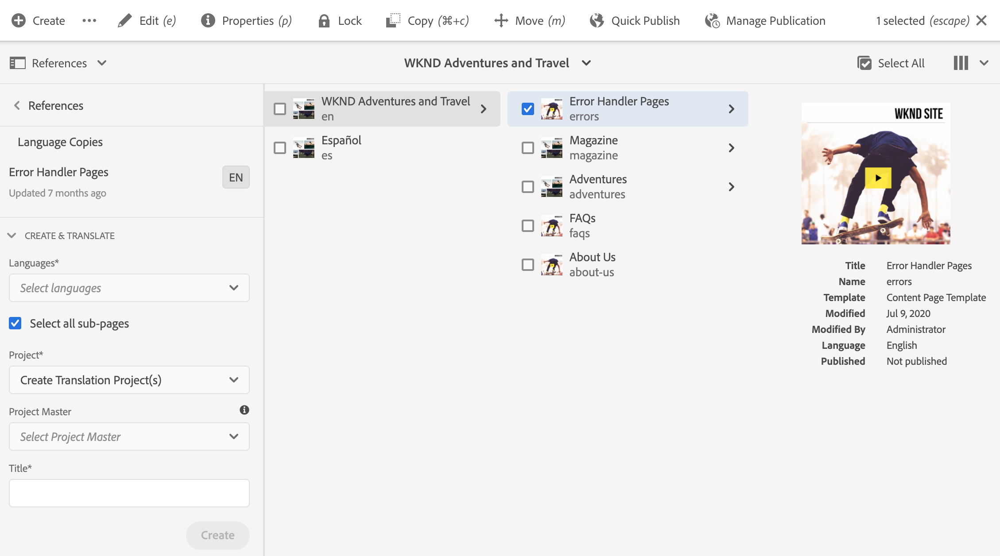
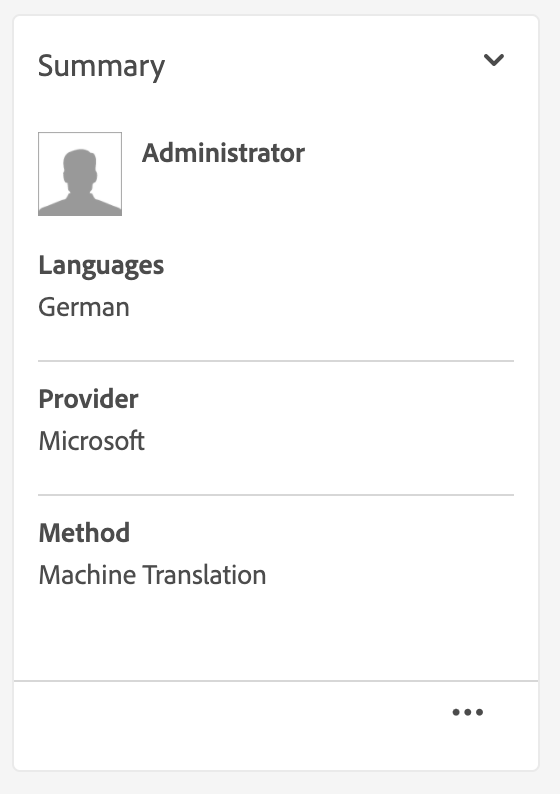
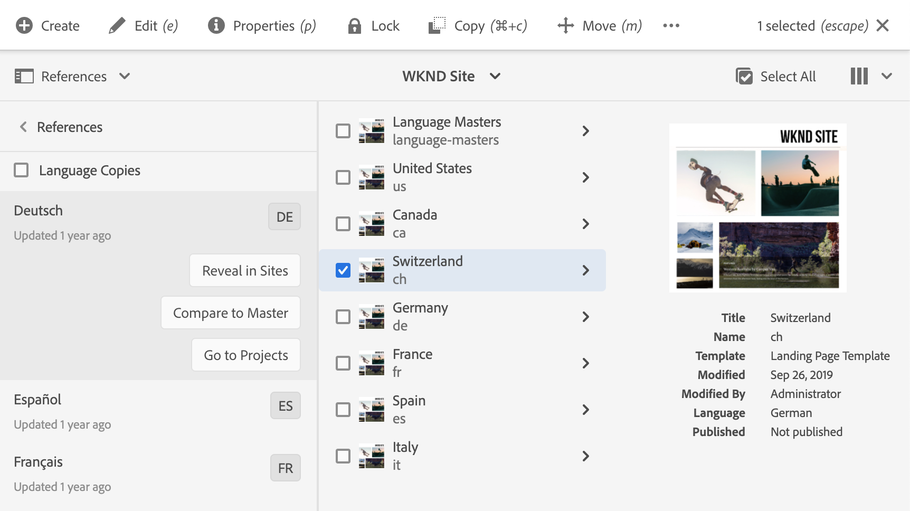

# Vertaalprojecten beheren {#managing-translation-projects}

Met vertaalprojecten kunt u de vertaling van AEM inhoud beheren. Een vertaalproject is een type van AEM [ project ](/help/sites-cloud/authoring/projects/overview.md) dat middelen bevat die in andere talen moeten worden vertaald. Deze middelen zijn de pagina&#39;s en de activa van de [ taalexemplaren ](preparation.md) die van de taalmeester worden gecreeerd.

>[!TIP]
>
>Als u aan het vertalen van inhoud nieuw bent, zie ](/help/journey-sites/translation/overview.md) de Vertaalreis van 0} Plaatsen, die geleid weg door uw inhoud van AEM Sites te vertalen gebruikend AEM krachtige vertaalhulpmiddelen, ideaal voor die zonder AEM of vertaalervaring.[

Wanneer middelen aan een vertaalproject worden toegevoegd, wordt een vertaalbaan gecreeerd voor hen. Taken bieden opdrachten en statusinformatie die u gebruikt om de workflows voor het vertalen van mensen en computers die op de bronnen worden uitgevoerd, te beheren.

Vertaalprojecten zijn langlopende items, die door taal- en vertaalmethode/provider worden gedefinieerd om te worden afgestemd op organisatorisch bestuur voor globalization. Zij moeten eenmaal worden gestart, hetzij tijdens de eerste vertaling, hetzij handmatig, en blijven van kracht gedurende de gehele update van inhoud en vertaling.

Vertaalprojecten en -taken worden gecreëerd met workflows voor het voorbereiden van vertalingen. Deze workflows hebben drie opties, voor zowel de eerste vertaling (Maken en vertalen) als de updates (Vertaling bijwerken):

1. [Nieuw project maken](#creating-translation-projects-using-the-references-panel)
1. [Toevoegen aan bestaand project](#adding-pages-to-a-translation-project)
1. [Alleen inhoudsstructuur](#creating-the-structure-of-a-language-copy)

AEM ontdekt of een vertaalproject voor de aanvankelijke vertaling van inhoud wordt gecreeerd, of reeds-vertaalde taalexemplaren bijwerken. Wanneer u een vertaalproject voor een pagina creeert en de taalexemplaren aangeeft waarvoor u vertaalt, AEM ontdekt of de bronpagina reeds in de gerichte taalexemplaren bestaat:

* **het taalexemplaar omvat niet de pagina:** AEM behandelt deze situatie als aanvankelijke vertaling. De pagina wordt onmiddellijk gekopieerd naar de taalkopie en opgenomen in het project. Wanneer de vertaalde pagina in AEM wordt geïmporteerd, AEM deze rechtstreeks naar de taalkopie gekopieerd.
* **het taalexemplaar omvat reeds de pagina:** AEM behandelt deze situatie als bijgewerkte vertaling. Er wordt een startpagina gemaakt en een kopie van de pagina wordt toegevoegd aan de startpagina en opgenomen in het project. Met behulp van Starten kunt u bijgewerkte vertalingen controleren voordat u deze doorgeeft aan de taalkopie:

   * Wanneer de vertaalde pagina in AEM wordt geïmporteerd, wordt de pagina tijdens het opstarten overschreven.
   * De vertaalde pagina overschrijft de taalkopie alleen wanneer de introductie wordt bevorderd.

De hoofdtaal van `/content/wknd/fr` wordt bijvoorbeeld gemaakt voor de Franse vertaling van de hoofdtaal van `/content/wknd/en` . Er zijn geen andere pagina&#39;s in de Franse taalkopie.

* Er wordt een vertaalproject gemaakt voor de pagina `/content/wknd/en/products` en alle onderliggende pagina&#39;s, die zich richten op de Franse taalkopie. Omdat de taalkopie geen pagina `/content/wknd/fr/products` bevat, worden AEM de pagina `/content/wknd/en/products` en alle onderliggende pagina&#39;s direct gekopieerd naar de Franse taalkopie. De kopieën worden ook in het vertaalproject opgenomen.
* Er wordt een vertaalproject gemaakt voor de pagina `/content/wknd/en` en alle onderliggende pagina&#39;s, die zich richten op de Franse taalkopie. Omdat de taalkopie de pagina bevat die overeenkomt met de pagina `/content/wknd/en` (de hoofdmap van de taal), AEM de pagina `/content/wknd/en` en alle onderliggende pagina&#39;s gekopieerd en aan een opstart toegevoegd. De kopieën worden ook in het vertaalproject opgenomen.

## Vertalen vanuit de siteconsole {#performing-initial-translations-and-updating-existing-translations}

De vertaalprojecten kunnen direct van de plaatsenconsole worden gecreeerd of worden bijgewerkt.

### Vertaalprojecten maken met het deelvenster Verwijzingen {#creating-translation-projects-using-the-references-panel}

Maak vertaalprojecten zodat u de workflow voor het vertalen van de bronnen van uw taalmaster kunt uitvoeren en beheren. Wanneer u projecten maakt, geeft u de pagina op in het taalstramien dat u vertaalt en de taalkopieën waarvoor u de vertaling uitvoert:

* De wolkenconfiguratie van het kader van de vertaalintegratie dat met de geselecteerde pagina wordt geassocieerd bepaalt vele eigenschappen van de vertaalprojecten, zoals het vertaalwerkschema aan gebruik.
* Er wordt een project gemaakt voor elke geselecteerde taalkopie.
* Er wordt een kopie van de geselecteerde pagina en de bijbehorende elementen gemaakt en aan elk project toegevoegd. Deze kopieën worden later naar de vertaalprovider verzonden voor vertaling.

U kunt opgeven dat de onderliggende pagina&#39;s van de geselecteerde pagina ook worden geselecteerd. In dit geval worden ook kopieën van de onderliggende pagina&#39;s aan elk project toegevoegd, zodat deze worden vertaald. Wanneer om het even welke kindpagina&#39;s met verschillende configuraties van het kader van de vertaalintegratie worden geassocieerd, AEM leidt tot extra projecten.

U kunt ook [ manueel vertaalprojecten ](#creating-a-translation-project-using-the-projects-console) tot stand brengen.

>[!NOTE]
>
>Uw account moet lid zijn van de `project-administrators` -groep om een project te maken.

### Eerste vertalingen en vertalingen bijwerken {#initial-and-updating}

In het deelvenster Referenties wordt aangegeven of de bestaande taalkopieën worden bijgewerkt of dat de eerste versie van de taalkopieën wordt gemaakt. Wanneer een taalexemplaar voor de geselecteerde pagina bestaat, lijkt het lusje van de Exemplaren van de Taal van de Update toegang tot project-verwante bevelen te verlenen.

Na het vertalen, kunt u [ de vertaling ](#reviewing-and-promoting-updated-content) herzien alvorens het taalexemplaar met het te beschrijven. Als er geen taalkopie voor de geselecteerde pagina bestaat, wordt op het tabblad Maken en vertalen toegang weergegeven tot opdrachten die betrekking hebben op het project.

### Vertaalprojecten maken voor een kopie van nieuwe taal {#create-translation-projects-for-a-new-language-copy}

1. Gebruik de console van Plaatsen om de pagina te selecteren die u aan vertaalprojecten toevoegt.

1. Gebruikend de toolbar, open het **spoor van Verwijzingen**.

   

1. Selecteer **Exemplaren van de Taal**, en selecteer dan de taalexemplaren waarvoor u de bronpagina&#39;s vertaalt.
1. Selecteer **creeer en vertaal** en vorm dan de vertaalbaan:

   * Gebruik **Talen** drop-down om een taalexemplaar te selecteren waarvoor u wilt vertalen. Selecteer desgewenst extra talen. Talen die in de lijst verschijnen beantwoorden aan de [ taalwortels die u ](preparation.md#creating-a-language-root) hebt gecreeerd.
      * Als u meerdere talen selecteert, wordt er één project gemaakt met een vertaaltaak voor elke taal.
   * Om de pagina te vertalen die u en alle kindpagina&#39;s selecteerde, uitgezochte **alle subpagina&#39;s**. Als u alleen de geselecteerde pagina wilt vertalen, schakelt u de optie uit.
   * Voor **Project**, uitgezochte **creeer Omzettingsproject(en)**.
   * Naar keuze voor **Hoofd van het Project**, selecteer een project waarvan om gebruikersrollen en toestemmingen te erven.
   * In **Titel** type een naam voor het project.

   

1. Selecteer **creeer**.

### Vertaalprojecten maken voor een bestaande taalkopie {#create-translation-projects-for-an-existing-language-copy}

1. Gebruik de console van Plaatsen om de pagina te selecteren die u aan de vertaalprojecten toevoegt.

1. Gebruikend de toolbar, open het **spoor van Verwijzingen**.

   

1. Selecteer **Exemplaren van de Taal**, en selecteer dan de taalexemplaren waarvoor u de bronpagina&#39;s vertaalt.
1. Selecteer {de Kopieën van de Taal van 0} Update **en vorm dan de vertaalbaan:**

   * Om de pagina te vertalen die u en alle kindpagina&#39;s selecteerde, uitgezochte **alle subpagina&#39;s**. Als u alleen de geselecteerde pagina wilt vertalen, schakelt u de optie uit.
   * Voor **Project**, uitgezochte **creeer Omzettingsproject(en)**.
   * Naar keuze voor **Hoofd van het Project**, selecteer een project waarvan om gebruikersrollen en toestemmingen te erven.
   * In **Titel** type een naam voor het project.

    bij te werken

1. Selecteer **creeer**.

### Pagina&#39;s toevoegen aan een vertaalproject {#adding-pages-to-a-translation-project}

Nadat u een vertaalproject hebt gecreeerd, kunt u het **spoor van Middelen** gebruiken om pagina&#39;s aan het project toe te voegen. Het toevoegen van pagina&#39;s is handig wanneer u pagina&#39;s van verschillende vertakkingen in hetzelfde project opneemt.

Wanneer u pagina&#39;s toevoegt aan een vertaalproject, worden de pagina&#39;s opgenomen in een nieuwe vertaaltaak. U kunt ook [ pagina&#39;s aan een bestaande baan ](#adding-pages-assets-to-a-translation-job) toevoegen.

Net als bij het maken van een project worden bij het toevoegen van pagina&#39;s kopieën van de pagina&#39;s zo nodig toegevoegd aan een opstart om te voorkomen dat bestaande taalkopieën worden overschreven. (Zie [ Creërend Vertaalprojecten voor Bestaande Exemplaren van de Taal ](#performing-initial-translations-and-updating-existing-translations).)

1. Gebruik de console van Plaatsen om de pagina te selecteren die u aan het vertaalproject toevoegt.

1. Gebruikend de toolbar, open het **spoor van Verwijzingen**.

   

1. Selecteer **Exemplaren van de Taal**, en selecteer dan de taalexemplaren waarvoor u de bronpagina&#39;s vertaalt.

   

1. Selecteer {de Kopieën van de Taal van 0} Update **en vorm dan de eigenschappen:**

   * Om de pagina te vertalen die u en alle kindpagina&#39;s selecteerde, uitgezochte **alle subpagina&#39;s**. Als u alleen de geselecteerde pagina wilt vertalen, schakelt u de optie uit.
   * Voor **Project**, uitgezocht **voeg aan bestaand Vertaalproject** toe.
   * Selecteer het project in **Bestaand Project van de Vertaling**.

   >[!NOTE]
   >
   >De doeltaal die in het vertaalproject is ingesteld, moet overeenkomen met het pad van de taalkopie zoals die in het referentietraject wordt getoond.

1. Selecteer **Update**.

### De structuur van een taalkopie maken {#creating-the-structure-of-a-language-copy}

Het is mogelijk om alleen de structuur van de taalkopie te maken, zodat u inhoud en structurele wijzigingen in de hoofdtaal kunt kopiëren naar (onvertaalde) taalkopieën. Dit houdt geen verband met een vertaalbaan of een project. U kunt dit gebruiken om uw taalmeesters synchroon te houden, zelfs zonder vertaling.

Vul de taalkopie zodanig dat deze inhoud bevat uit de hoofdtaal die u vertaalt. Alvorens u uw taalexemplaar bevolkt, moet u [ tot de taalwortel ](preparation.md#creating-a-language-root) van het taalexemplaar hebben gecreeerd.

1. Gebruik de plaatsenconsole om de taalwortel van de hoofdtaal te selecteren die u als bron gebruikt.
1. Open de verwijzingenspoorstaaf door **Verwijzingen** in de toolbar te klikken of te tikken.

   

1. Selecteer **Exemplaren van de Taal**, en selecteer dan de taalexemplaren die u wilt bevolken.

   

1. Selecteer {de Kopieën van de Taal van 0} Update **om de vertaalhulpmiddelen te openbaren, en de eigenschappen te vormen:**

   * Selecteer **Uitgezochte alle sub-pagina&#39;s** optie.
   * Voor **Project**, uitgezochte **creeer slechts Structuur**.

   

1. Selecteer **Update**.

### Vertaalgeheugen bijwerken {#updating-translation-memory}

Handmatige bewerkingen van vertaalde inhoud kunnen worden gesynchroniseerd met het TMS (Translation Management System) om het vertaalgeheugen te trainen.

1. Van de plaatsenconsole, na het bijwerken van tekstinhoud in een vertaalde pagina, selecteer **het Geheugen van de Vertaling van de Update**.
1. Een lijstmening toont een zij-aan-zij vergelijking van de bron en de vertaling voor elke tekstcomponent die werd uitgegeven. Selecteer welke vertaalupdates aan vertaalgeheugen zouden moeten worden gesynchroniseerd, en **Geheugen van de Update** selecteren.

AEM werkt de vertaling van de bestaande koorden in het vertaalgeheugen van gevormde TMS bij.

* De actie werkt de vertaling van bestaande koorden in het vertaalgeheugen van gevormde TMS bij.
* Het creëert geen nieuwe vertaalbanen.
* De vertalingen worden via AEM vertalings-API teruggestuurd naar de TMS (zie hieronder).

Deze functie gebruiken:

* Een TMS moet voor gebruik met AEM worden gevormd.
* De schakelaar moet de methode [`storeTranslation` uitvoeren ](https://developer.adobe.com/experience-manager/reference-materials/cloud-service/javadoc/com/adobe/granite/translation/api/TranslationService.html).
   * De code binnen deze methode bepaalt wat met het verzoek van de vertaalgeheugenupdate gebeurt.
   * Het AEM vertaalkader verzendt de koordwaardeparen (originele en bijgewerkte vertaling) terug naar TMS via deze methodeimplementatie.

De updates van het vertaalgeheugen kunnen worden onderschept en naar een douanebestemming worden verzonden, voor gevallen waar een merkgebonden vertaalgeheugen wordt gebruikt.

### Vertaalstatus van een pagina controleren {#check-translation-status}

Een bezit kan in de lijstmening van de plaatsenconsole worden geselecteerd die toont als een pagina is vertaald, in vertaling is, of nog niet is vertaald.

1. In de plaatsenconsole, schakelaar aan [ lijstmening ](/help/sites-cloud/authoring/basic-handling.md#viewing-and-selecting-resources).
1. Selecteer, **Montages van de Mening** in de meningsdrop-down.
1. In de dialoog, controleer het **Vertaalde** bezit en selecteer **Update**.

De plaatsenconsole toont nu de **Vertaalde** kolom die de vertaalstatus van de vermelde pagina&#39;s toont.

## Vertaalprojecten beheren vanuit de projectconsole

Vele vertaaltaken en geavanceerde opties kunnen in de projectenconsole worden betreden.

### De projectenconsole begrijpen

De vertaalprojecten in AEM gebruiken de standaard [ AEM projectenconsole ](/help/sites-cloud/authoring/projects/overview.md). Als u niet vertrouwd met AEM projecten bent, herzie die documentatie.

Net als elk ander project bestaat een vertaalproject uit tegels die een overzicht geven van de projecttaken.

* **Samenvatting** - een overzicht van het project
* **Taken** - één of meerdere vertaaltaken
* **Team** - de Gebruikers die aan het vertaalproject samenwerken
* **Taken** - Punten die als deel van de vertaalinspanning moeten worden voltooid

Gebruik de opdrachten en de elliptische knoppen boven en onder aan de tegels (respectievelijk) voor toegang tot de besturingselementen en opties voor de verschillende tegels.

### Een vertaalproject maken met de projectconsole {#creating-a-translation-project-using-the-projects-console}

U kunt een vertaalproject manueel tot stand brengen als u verkiest de projectenconsole in plaats van de plaatsenconsole te gebruiken.

>[!NOTE]
>
>Uw account moet lid zijn van de `project-administrators` -groep om een project te maken.

Wanneer u manueel een vertaalproject creeert, moet u waarden voor de volgende op vertaling betrekking hebbende eigenschappen naast de [ basiseigenschappen ](/help/sites-cloud/authoring/projects/managing.md#creating-a-project) verstrekken:

* **Naam:** de naam van het Project
* **Taal van Source:** De taal van de broninhoud
* **Taal van het Doel:** de taal of de talen waarin de inhoud wordt vertaald
   * Als er meerdere talen zijn geselecteerd, wordt er een taak gemaakt voor elke taal in het project.
* **Vertaalmethode:** Uitgezochte **Menselijke Vertaling** om erop te wijzen dat de vertaling manueel moet worden uitgevoerd.

1. Voor de toolbar van de projectenconsole, creeert de uitgezochte ****.
1. Selecteer het **malplaatje van het Project van de Vertaling** en selecteer dan **daarna**.
1. Ga waarden voor de **Basis** eigenschappen tabel in.
1. Selecteer **Geavanceerd** en verstrek waarden voor de op vertaling betrekking hebbende eigenschappen.
1. Selecteer **Maken**. In het bevestigingsvakje, uitgezochte **Gedaan** om aan de projectenconsole terug te keren, of **Open Project** te selecteren om het project te openen en te beginnen te leiden.

### Pagina&#39;s en Assets toevoegen aan een vertaaltaak {#adding-pages-assets-to-a-translation-job}

U kunt pagina&#39;s, elementen of codes toevoegen aan de vertaaltaak van uw vertaalproject. Pagina&#39;s of elementen toevoegen:

1. Selecteer de ellips onder aan de tegel voor vertaaltaken van het vertaalproject.

   

1. In het volgende venster selecteer **toevoegen** knoop in de toolbar en dan selecteren **Assets/Pagina&#39;s**.

    toe

1. Selecteer in het modale venster het bovenste item van de vertakking die u wilt toevoegen en selecteer vervolgens het pictogram van het vinkje. Multi-select is ingeschakeld in dit venster.

   

1. U kunt ook het zoekpictogram selecteren om gemakkelijk te zoeken naar pagina&#39;s of elementen die u aan uw vertaaltaak wilt toevoegen.

   

1. Zodra geselecteerd, uitgezochte **Uitgezochte**. Uw pagina&#39;s en/of middelen worden toegevoegd aan de vertaaltaak.

>[!TIP]
>
>Met deze methode voegt u pagina&#39;s/elementen en de onderliggende elementen ervan toe aan het project. Selecteer **Activa/Pagina (zonder kinderen)** als u slechts de ouders wilt toevoegen.

### Tags toevoegen aan een vertaaltaak {#adding-tags-to-a-translation-job}

U kunt markeringen aan een vertaalproject gelijkend op [ toevoegen hoe u activa en pagina&#39;s aan een project ](#adding-pages-assets-to-a-translation-job) toevoegt. Enkel uitgezochte **Markeringen** onder **voegt** menu dan de zelfde stappen toe.

### Details van vertaalproject bekijken {#seeing-translation-project-details}

De eigenschappen van het vertaalproject zijn toegankelijk via de ellipsieknoop van de projectoverzicht. Naast de generische [ projectinformatie ](/help/sites-cloud/authoring/projects/overview.md#project-info), bevatten de eigenschappen van het vertaalproject vertaling-specifiek.

In uw vertaalproject, selecteer de ellips bij de bodem van de Vertaling Summiere tegel. De meeste project-specifieke eigenschappen zijn op **Geavanceerd** tabel.

* **Taal van Source:** De taal van de pagina&#39;s die worden vertaald
* **Taal van het Doel:** de taal of de talen waarin de pagina&#39;s worden vertaald
* **Configuratie van de Wolk:** de wolkenconfiguratie voor de schakelaar van de vertaaldienst die voor het project wordt gebruikt
* **Vertaalmethode:** het vertaalwerkschema, of **Menselijke Vertaling** of **Vertaling van de Machine**
* **Vertaalleverancier:** De leverancier van de vertaaldienst die de vertaling uitvoert
* **Categorie van de Inhoud:** (de Vertaling van de Machine) de inhoudscategorie die voor het vertalen wordt gebruikt
* **Referentie van de Leverancier van de Vertaling:** De geloofsbrieven om in de leverancier te ondertekenen
* **bevordert automatisch Vertaallanceringen:** na het ontvangen van vertaalde inhoud, worden de vertaallanceringen automatisch bevorderd
   * **Schrap Lancering na Bevordering:** als de vertaallanceringen automatisch worden bevorderd, schrap de lancering na bevordering
* **keurt automatisch Vertalingen goed:** na het ontvangen van vertaalde inhoud, worden de vertaalbanen automatisch goedgekeurd
* **Herhaal Vertaling:** Vorm terugkomende uitvoering van een vertaalproject door de frequentie te selecteren dat het project automatisch vertaalbanen zal creëren en uitvoeren

Wanneer een project wordt gecreeerd gebruikend de verwijzingsspoorlijn van een pagina, worden deze eigenschappen automatisch gevormd gebaseerd op de eigenschappen van de bronpagina.

### De status van een vertalingstaak controleren {#monitoring-the-status-of-a-translation-job}

De tegel voor vertaaltaken van een vertaalproject geeft de status van een vertaaltaak en het aantal pagina&#39;s en middelen in de taak.

In de volgende tabel wordt elke status beschreven die een taak of een item in de taak kan hebben:

| Status | Beschrijving |
|---|---|
| **Ontwerp** | De vertaaltaak is niet gestart. De banen van de vertaling zijn in **Laag** status wanneer zij worden gecreeerd. |
| **Voorgelegd** | Bestanden in de vertaaltaak hebben deze status wanneer ze naar de vertaalservice zijn verzonden. Deze status kan voorkomen nadat het **bevel van het Toepassingsgebied van het Verzoek** of het **bevel van het Begin** wordt uitgegeven. |
| **Gevraagd Geëist Toepassingsgebied** | Voor de workflow voor menselijke vertaling zijn de bestanden in de taak voor bereiking naar de leverancier van de vertaling verzonden. Deze status verschijnt nadat het **bevel van het Toepassingsgebied van het Verzoek** wordt uitgegeven. |
| **Voltooid Bereik** | De leverancier heeft het bereik van de vertaaltaak. |
| **die voor Vertaling wordt begaan** | De eigenaar van het project heeft het toepassingsgebied geaccepteerd. Deze status geeft aan dat de leverancier van de vertaling moet beginnen met het vertalen van de bestanden in de taak. |
| **Bezig Vertaling** | Voor een taak is de vertaling van een of meer bestanden in de taak nog niet voltooid. Voor een item in de taak wordt het item vertaald. |
| **Vertaald** | Voor een taak is de vertaling van alle bestanden in de taak voltooid. Voor een item in de taak wordt het item vertaald. |
| **Klaar voor Overzicht** | Het item in de taak wordt omgezet en het bestand is geïmporteerd in AEM. |
| **Volledig** | De eigenaar van het project heeft aangegeven dat het vertaalcontract volledig is. |
| **annuleert** | Geeft aan dat de leverancier van de vertaling moet stoppen met het werken aan een vertaaltaak. |
| **Update van de Fout** | Er is een fout opgetreden bij het overdragen van bestanden tussen AEM en de vertaalservice. |
| **Onbekende Staat** | Er is een onbekende fout opgetreden. |

Als u de status van elk bestand in de taak wilt zien, selecteert u de ellips onder aan de tegel.

### Vaststelling van de vervaldatum van de vertaaltaken {#setting-the-due-date-of-translation-jobs}

Geef de datum op waarop de leverancier van de vertaling vertaalde bestanden moet retourneren. Het instellen van de vervaldatum werkt alleen correct wanneer de leverancier van de vertaling die u gebruikt deze functie ondersteunt.

1. Selecteer de ellips onder aan de samenvattingstabel van de vertaling.

   

1. Op het **Basis** lusje, gebruik de datumplukker van het **Verschuldigde bezit van de Datum** om de verouderde datum te selecteren.

   

1. Selecteer **sparen &amp; Sluiten**.

### Een vertaaltaak splitsen {#scoping-a-translation-job}

Bereik een vertaalbaan om een schatting van de kosten van vertaling van uw vertaaldienstverlener te verkrijgen. Wanneer u een taak instelt, worden bronbestanden verzonden naar de leverancier van de vertaling die de tekst vergelijkt met de groep met opgeslagen vertalingen (vertaalgeheugen). Doorgaans is het bereik het aantal woorden dat moet worden vertaald.

Neem contact op met uw vertaalleverancier voor meer informatie over bereikresultaten.

>[!NOTE]
>
>Scoping is optioneel en is alleen van toepassing op menselijke vertaling. U kunt een vertaalbaan zonder scoping beginnen.

Wanneer u een vertaalbaan werkingsgebied, is het statuut van de baan gevraagd **Geëist Toepassingsgebied**. Wanneer de vertaalverkoper het werkingsgebied terugkeert, wordt de status veranderd in **Voltooid Werkingsgebied**. Wanneer het scoping wordt voltooid kunt u **gebruiken toont het bevel van het Toepassingsgebied** om het scoping resultaten te herzien.

De functie Scoping werkt alleen correct wanneer de leverancier van de vertaling die u gebruikt deze functie ondersteunt.

1. In de projectenconsole, open uw vertaalproject.
1. Voor de titel van de vertaalbaan, selecteer het bevelenmenu, dan selecteren **het Toepassingsgebied van het Verzoek**.
1. Wanneer de baanstatus in **Voltooid Werkgebied** verandert, selecteer het bevelenmenu, dan **toont het Werkingsgebied**.

### Vertaal-taken starten {#starting-translation-jobs}

Start een vertaaltaak om de bronpagina&#39;s naar de doeltaal te vertalen. De vertaling wordt uitgevoerd volgens de bezitswaarden van de de samenvattingstegel van de vertaling.

U kunt een individuele baan van binnen het project beginnen.

1. In de projectenconsole, open het vertaalproject.
1. Voor de tegel van de vertaalbaan, selecteer het bevelenmenu, dan selecteren **Begin**.
1. In de actiedialoog die het begin van de vertaling bevestigt, uitgezochte **dicht**.

Nadat u de vertaalbaan begint, toont de tegel van de vertaalbaan de vertaling in **Bezig** status.

U kunt ook alle vertaaltaken voor een project starten.

1. In de projectconsole, selecteer het vertaalproject.
1. In de hulpmiddelbar selecteert **Vertaal de Taak of de Taken van het Begin**.
1. In de dialoogdoos, herzie de lijst van banen die zijn begonnen en bevestig dan met **Begin** of met **afbreken annuleert**.

### Een vertaaltaak annuleren {#canceling-a-translation-job}

Een vertaaltaak annuleren om het vertaalproces te stoppen en te voorkomen dat de leverancier van de vertaling verdere vertalingen uitvoert. U kunt een baan annuleren wanneer de baan **voor Vertaling** wordt begaan of **Bezig Vertaling** status heeft.

1. In de projectenconsole, open het vertaalproject.
1. Voor de tegel van de vertaalbaan, selecteer het bevelenmenu, dan uitgezocht **annuleert**.
1. In de actiedialoog die de annulering van de vertaling bevestigt, uitgezochte **O.K.**.

### Workflow accepteren en afwijzen {#accept-reject-workflow}

Wanneer de inhoud na vertaling terugkomt en in **Klaar voor de status van het Overzicht** is, kunt u in de vertaalbaan gaan en inhoud goedkeuren/verwerpen.

Als u **Vertaling van de Weigering** selecteert, hebt u de optie om een commentaar toe te voegen.

Als u inhoud afwijst, wordt deze teruggestuurd naar de vertaalleverancier waar deze de opmerking kan zien.

### Vertaaltaken voltooien en archiveren {#completing-and-archiving-translation-jobs}

Voltooi een vertaalbaan nadat u de vertaalde dossiers van de verkoper hebt herzien.

1. In de projectenconsole, open het vertaalproject.
1. Voor de tegel van de vertaalbaan, selecteer het bevelenmenu, dan selecteren **Voltooid**.
1. De baan heeft nu de status **Voltooid**.

Voor workflows voor menselijke vertaling geeft het voltooien van een vertaling de verkoper aan dat het vertaalcontract is uitgevoerd en dat hij de vertaling in zijn vertaalgeheugen moet opslaan.

Archiveer een vertaaltaak nadat deze is voltooid en u hoeft de gegevens over de taakstatus niet meer te zien.

1. In de projectenconsole, open het vertaalproject.
1. Voor de tegel van de vertaalbaan, selecteer het bevelenmenu, dan selecteren **Archief**.

Wanneer u de taak archiveert, wordt de tegel van de vertaalbaan verwijderd uit het project.

## Vertaalde inhoud evalueren en gebruiken {#reviewing-and-promoting-updated-content}

U kunt de siteconsole gebruiken om inhoud te controleren, taalkopieën te vergelijken en de inhoud te activeren.

### Bijgewerkte inhoud promoten {#promoting-updated-content}

Wanneer de inhoud voor een bestaand taalexemplaar wordt vertaald, herzie de vertalingen, breng veranderingen indien nodig aan, en publiceer dan de vertalingen om het naar het taalexemplaar te bewegen. U kunt vertaalde dossiers herzien wanneer de vertaalbaan **voor de status van het Overzicht** klaar toont.

1. Selecteer de pagina in de taalmeester, uitgezochte **Verwijzingen**, dan selecteren **de Kopieën van de Taal**.
1. Selecteer de taalkopie die u wilt controleren.

   

1. Selecteer **Lancering** om op lancering betrekking hebbende bevelen te openbaren.

   

1. Om het lanceringsexemplaar van de pagina te openen om de inhoud te herzien en uit te geven, klik **Open Pagina**.
1. Nadat u de inhoud hebt herzien en noodzakelijke veranderingen aangebracht, om het lanceringsexemplaar te bevorderen klikt **bevorderen**.
1. Op **bevorderen de pagina van de Lancering**, specificeer welke pagina&#39;s te bevorderen en dan te selecteren **bevorderen**.

### Taalkopieën vergelijken {#comparing-language-copies}

U kunt als volgt de taalkopieën vergelijken met de hoofdtaal:

1. In de plaatsenconsole, navigeer aan het taalexemplaar u wilt vergelijken.
1. Open het [ spoor van Verwijzingen ](/help/sites-cloud/authoring/basic-handling.md#references).
1. Onder de **koppen** kopbal selecteren **de Kopieën van de Taal.**
1. Selecteer uw specifiek taalexemplaar en dan kunt u of **** vergelijken of **vergelijken met Vorige** indien van toepassing.

   

1. De twee pagina&#39;s (opstart en bron) worden naast elkaar geopend.
   * Voor volledige informatie over het gebruiken van deze eigenschap zie [ Afschuiving van de Pagina ](/help/sites-cloud/authoring/sites-console/page-diff.md).

## Source-pagina&#39;s verplaatsen of hernoemen {#move-source}

Als een reeds vertaalde bronpagina [ moet worden anders genoemd of worden bewogen ](/help/sites-cloud/authoring/sites-console/managing-pages.md#moving-or-renaming-a-page), leidt het vertalen van de pagina opnieuw na de beweging tot een taalexemplaar dat op de nieuwe paginanaam/de plaats wordt gebaseerd. De oude taalkopie op basis van de vorige naam/locatie is er nog. Om dit te voorkomen, kunt u de functionaliteit voor het kopiëren van de updatetaal na de verplaatsing gebruiken:

1. Verplaats een pagina met een taalkopie.
1. Selecteer de hoofdmap van de taalkopie.
1. Open het **paneel van Verwijzingen**.
1. Selecteer **Exemplaren van Talen**.
1. Selecteer de doeltalen die u wilt bijwerken.
1. Selecteer **de taalexemplaren van de Update**.

   

1. Klik **Update**. A [ Lancering ](/help/sites-cloud/authoring/launches/promoting.md) zal worden gecreeerd.
1. Navigeer naar de vereiste hoofdtaal en selecteer deze.
1. Gebruikend het **paneel van Verwijzingen**, uitgezochte **Lanceringen**.

   

1. Klik op de Lancering die werd gecreeerd en klik **bevorderen lancering**.

Nu is de bronpagina verplaatst en de bijbehorende taalkopie.

## Vertaaltaken importeren en exporteren {#import-export}

Hoewel AEM diverse vertaaloplossingen en interfaces biedt, is het ook mogelijk om vertaalbaaninformatie manueel in te voeren en uit te voeren.

### Een vertaaltaak exporteren {#exporting-a-translation-job}

U kunt de inhoud van een vertaalbaan downloaden, bijvoorbeeld, om naar een vertaalleverancier te verzenden die niet met AEM via een schakelaar geïntegreerd is, of de inhoud te herzien.

1. Van het drop-down menu van de tegel van de vertaalbaan, uitgezochte **Uitvoer**.
1. In de dialoogdoos, uitgezochte **Geëxporteerd Dossier van de Download**, en gebruik indien nodig de de dialoogdoos van Webbrowser om het dossier te bewaren.
1. In de dialoogdoos, uitgezochte **Sluiten**.

### Een vertaaltaak importeren {#importing-a-translation-job}

U kunt vertaalde inhoud bijvoorbeeld importeren in AEM, wanneer uw vertaalbureau de inhoud naar u stuurt omdat deze niet is geïntegreerd met AEM via een connector.

1. Van het drop-down menu van de tegel van de vertaalbaan, uitgezochte **Invoer**.
1. Selecteer in het dialoogvenster van de webbrowser het bestand dat u wilt importeren.
1. In de dialoogdoos, uitgezochte **Sluiten**.
