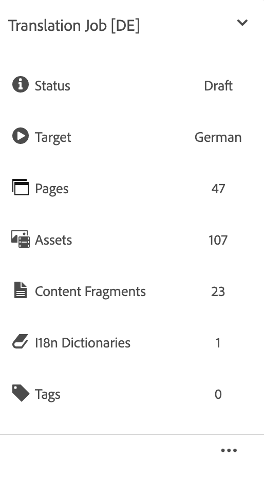

# Vertaalprojecten beheren {#managing-translation-projects}

Met vertaalprojecten kunt u de vertaling van AEM inhoud beheren. Een vertaalproject is een soort AEM [project](/help/sites-cloud/authoring/projects/overview.md) die bronnen bevat die in andere talen moeten worden vertaald. Deze bronnen zijn de pagina&#39;s en elementen van de [taalkopieën](preparation.md) die zijn gemaakt op basis van de taalmaster.

>[!TIP]
>
>Als u nog geen ervaring hebt met het vertalen van inhoud, raadpleegt u [Sites Translation Journey,](/help/journey-sites/translation/overview.md) Dit is een geleid pad door uw AEM Sites-inhoud te vertalen met AEM krachtige vertaalhulpmiddelen, ideaal voor mensen zonder AEM of vertaalervaring.

Wanneer middelen aan een vertaalproject worden toegevoegd, wordt een vertaalbaan gecreeerd voor hen. Taken bieden opdrachten en statusinformatie die u gebruikt om de workflows voor het vertalen van mensen en computers die op de bronnen worden uitgevoerd, te beheren.

Vertaalprojecten zijn langlopende items, die door taal- en vertaalmethode/provider worden gedefinieerd om te worden afgestemd op organisatorisch bestuur voor globalization. Zij moeten eenmaal worden gestart, hetzij tijdens de eerste vertaling, hetzij handmatig, en blijven van kracht gedurende de gehele update van inhoud en vertaling.

Vertaalprojecten en -taken worden gecreëerd met workflows voor het voorbereiden van vertalingen. Deze workflows hebben drie opties, voor zowel de eerste vertaling (Maken en vertalen) als de updates (Vertaling bijwerken):

1. [Nieuw project maken](#creating-translation-projects-using-the-references-panel)
1. [Toevoegen aan bestaand project](#adding-pages-to-a-translation-project)
1. [Alleen inhoudsstructuur](#creating-the-structure-of-a-language-copy)

AEM ontdekt of een vertaalproject voor de aanvankelijke vertaling van inhoud wordt gecreeerd, of reeds-vertaalde taalexemplaren bijwerken. Wanneer u een vertaalproject voor een pagina creeert en de taalexemplaren aangeeft waarvoor u vertaalt, AEM ontdekt of de bronpagina reeds in de gerichte taalexemplaren bestaat:

* **De pagina is niet opgenomen in de taalkopie:** AEM beschouwt deze situatie als de eerste vertaling. De pagina wordt onmiddellijk gekopieerd naar de taalkopie en opgenomen in het project. Wanneer de vertaalde pagina in AEM wordt geïmporteerd, AEM deze rechtstreeks naar de taalkopie gekopieerd.
* **De taalkopie bevat al de pagina:** AEM beschouwt deze situatie als een bijgewerkte vertaling. Er wordt een startpagina gemaakt en een kopie van de pagina wordt toegevoegd aan de startpagina en opgenomen in het project. Met behulp van Starten kunt u bijgewerkte vertalingen controleren voordat u deze doorgeeft aan de taalkopie:

   * Wanneer de vertaalde pagina in AEM wordt geïmporteerd, wordt de pagina tijdens het opstarten overschreven.
   * De vertaalde pagina overschrijft de taalkopie alleen wanneer de introductie wordt bevorderd.

Bijvoorbeeld de `/content/wknd/fr` de hoofdtaal van de taal wordt gecreeerd voor de Franse vertaling van `/content/wknd/en` hoofdtaal. Er zijn geen andere pagina&#39;s in de Franse taalkopie.

* Er wordt een vertaalproject gemaakt voor de `/content/wknd/en/products` pagina en alle onderliggende pagina&#39;s, gericht op de Franse taalkopie. Omdat de taalkopie geen `/content/wknd/fr/products` pagina, AEM de `/content/wknd/en/products` pagina en alle onderliggende pagina&#39;s naar de Franse taalkopie. De kopieën worden ook in het vertaalproject opgenomen.
* Er wordt een vertaalproject gemaakt voor de `/content/wknd/en` pagina en alle onderliggende pagina&#39;s, gericht op de Franse taalkopie. Omdat de taalkopie de pagina bevat die overeenkomt met de `/content/wknd/en` pagina (de hoofdtaal), AEM kopieert de `/content/wknd/en` pagina en alle onderliggende pagina&#39;s en voegt deze toe aan een opstart. De kopieën worden ook in het vertaalproject opgenomen.

## Vertalen vanuit de siteconsole {#performing-initial-translations-and-updating-existing-translations}

De vertaalprojecten kunnen direct van de plaatsenconsole worden gecreeerd of worden bijgewerkt.

### Vertaalprojecten maken met het deelvenster Verwijzingen {#creating-translation-projects-using-the-references-panel}

Maak vertaalprojecten zodat u de workflow voor het vertalen van de bronnen van uw taalmaster kunt uitvoeren en beheren. Wanneer u projecten maakt, geeft u de pagina op in het taalstramien dat u vertaalt en de taalkopieën waarvoor u de vertaling uitvoert:

* De wolkenconfiguratie van het kader van de vertaalintegratie dat met de geselecteerde pagina wordt geassocieerd bepaalt vele eigenschappen van de vertaalprojecten, zoals het vertaalwerkschema aan gebruik.
* Er wordt een project gemaakt voor elke geselecteerde taalkopie.
* Er wordt een kopie van de geselecteerde pagina en de bijbehorende elementen gemaakt en aan elk project toegevoegd. Deze kopieën worden later naar de vertaalprovider verzonden voor vertaling.

U kunt opgeven dat de onderliggende pagina&#39;s van de geselecteerde pagina ook worden geselecteerd. In dit geval worden ook kopieën van de onderliggende pagina&#39;s aan elk project toegevoegd, zodat deze worden vertaald. Wanneer om het even welke kindpagina&#39;s met verschillende configuraties van het kader van de vertaalintegratie worden geassocieerd, AEM leidt tot extra projecten.

U kunt [handmatig vertaalprojecten maken](#creating-a-translation-project-using-the-projects-console).

>[!NOTE]
>
>Als u een project wilt maken, moet uw account lid zijn van de `project-administrators` groep.

### Eerste vertalingen en vertalingen bijwerken {#initial-and-updating}

In het deelvenster Referenties wordt aangegeven of de bestaande taalkopieën worden bijgewerkt of dat de eerste versie van de taalkopieën wordt gemaakt. Wanneer een taalexemplaar voor de geselecteerde pagina bestaat, lijkt het lusje van de Exemplaren van de Taal van de Update toegang tot project-verwante bevelen te verlenen.

Na het vertalen kunt u [de vertaling bekijken](#reviewing-and-promoting-updated-content) voordat u de taalkopie overschrijft. Als er geen taalkopie voor de geselecteerde pagina bestaat, wordt op het tabblad Maken en vertalen toegang weergegeven tot opdrachten die betrekking hebben op het project.

### Vertaalprojecten maken voor een kopie van nieuwe taal {#create-translation-projects-for-a-new-language-copy}

1. Gebruik de console van Plaatsen om de pagina te selecteren die u aan vertaalprojecten toevoegt.

1. Open met de werkbalk de **Verwijzingen** spoorwegen.

   

1. Selecteren **Taalkopieën** en selecteer vervolgens de taalkopieën waarvoor u de bronpagina&#39;s wilt vertalen.
1. Selecteren **Maken en vertalen** en configureer vervolgens de vertaaltaak:

   * Gebruik de **Talen** om een taalkopie te selecteren waarvoor u wilt vertalen. Selecteer desgewenst extra talen. Talen in de lijst komen overeen met de [door u gemaakte taalwortels](preparation.md#creating-a-language-root).
      * Als u meerdere talen selecteert, wordt er één project gemaakt met een vertaaltaak voor elke taal.
   * Als u de geselecteerde pagina en alle onderliggende pagina&#39;s wilt vertalen, selecteert u **Alle subpagina&#39;s selecteren**. Als u alleen de geselecteerde pagina wilt vertalen, schakelt u de optie uit.
   * Voor **Project**, selecteert u **Vertaalproject(en) maken**.
   * Optioneel voor **Projecthoofd**, selecteer een project waarvan om gebruikersrollen en toestemmingen te erven.
   * In **Titel** Typ een naam voor het project.

   

1. Selecteren **Maken**.

### Vertaalprojecten maken voor een bestaande taalkopie {#create-translation-projects-for-an-existing-language-copy}

1. Gebruik de console van Plaatsen om de pagina te selecteren die u aan de vertaalprojecten toevoegt.

1. Open met de werkbalk de **Verwijzingen** spoorwegen.

   

1. Selecteren **Taalkopieën** en selecteer vervolgens de taalkopieën waarvoor u de bronpagina&#39;s wilt vertalen.
1. Selecteren **Taalkopieën bijwerken** en configureer vervolgens de vertaaltaak:

   * Als u de geselecteerde pagina en alle onderliggende pagina&#39;s wilt vertalen, selecteert u **Alle subpagina&#39;s selecteren**. Als u alleen de geselecteerde pagina wilt vertalen, schakelt u de optie uit.
   * Voor **Project**, selecteert u **Vertaalproject(en) maken**.
   * Optioneel voor **Projecthoofd**, selecteer een project waarvan om gebruikersrollen en toestemmingen te erven.
   * In **Titel** Typ een naam voor het project.

   

1. Selecteren **Maken**.

### Pagina&#39;s toevoegen aan een vertaalproject {#adding-pages-to-a-translation-project}

Nadat u een vertaalproject hebt gemaakt, kunt u de opdracht **Bronnen** rail om pagina&#39;s aan het project toe te voegen. Het toevoegen van pagina&#39;s is handig wanneer u pagina&#39;s van verschillende vertakkingen in hetzelfde project opneemt.

Wanneer u pagina&#39;s toevoegt aan een vertaalproject, worden de pagina&#39;s opgenomen in een nieuwe vertaaltaak. U kunt [pagina&#39;s toevoegen aan een bestaande taak](#adding-pages-assets-to-a-translation-job).

Net als bij het maken van een project worden bij het toevoegen van pagina&#39;s kopieën van de pagina&#39;s zo nodig toegevoegd aan een opstart om te voorkomen dat bestaande taalkopieën worden overschreven. (Zie [Vertaalprojecten maken voor bestaande taalkopieën](#performing-initial-translations-and-updating-existing-translations).)

1. Gebruik de console van Plaatsen om de pagina te selecteren die u aan het vertaalproject toevoegt.

1. Open met de werkbalk de **Verwijzingen** spoorwegen.

   

1. Selecteren **Taalkopieën** en selecteer vervolgens de taalkopieën waarvoor u de bronpagina&#39;s wilt vertalen.

   

1. Selecteren **Taalkopieën bijwerken** en configureer vervolgens de eigenschappen:

   * Als u de geselecteerde pagina en alle onderliggende pagina&#39;s wilt vertalen, selecteert u **Alle subpagina&#39;s selecteren**. Als u alleen de geselecteerde pagina wilt vertalen, schakelt u de optie uit.
   * Voor **Project**, selecteert u **Toevoegen aan bestaand vertaalproject**.
   * Selecteer het project in **Bestaand vertaalproject**.

   >[!NOTE]
   >
   >De doeltaal die in het vertaalproject is ingesteld, moet overeenkomen met het pad van de taalkopie zoals die in het referentietraject wordt getoond.

1. Selecteren **Bijwerken**.

### De structuur van een taalkopie maken {#creating-the-structure-of-a-language-copy}

Het is mogelijk om alleen de structuur van de taalkopie te maken, zodat u inhoud en structurele wijzigingen in de hoofdtaal kunt kopiëren naar (onvertaalde) taalkopieën. Dit houdt geen verband met een vertaalbaan of een project. U kunt dit gebruiken om uw taalmeesters synchroon te houden, zelfs zonder vertaling.

Vul de taalkopie zodanig dat deze inhoud bevat uit de hoofdtaal die u vertaalt. Voordat u uw taalkopie kunt vullen, moet u beschikken over [heeft de hoofdmap van de taal gemaakt](preparation.md#creating-a-language-root) van de taalkopie.

1. Gebruik de plaatsenconsole om de taalwortel van de hoofdtaal te selecteren die u als bron gebruikt.
1. Open de referentierail door te klikken of te tikken **Verwijzingen** in de werkbalk.

   

1. Selecteren **Taalkopieën** en selecteer vervolgens de taalkopieën die u wilt vullen.

   

1. Selecteren **Taalkopieën bijwerken** om de vertaalhulpmiddelen te openbaren, en de eigenschappen te vormen:

   * Selecteer de **Alle subpagina&#39;s selecteren** -optie.
   * Voor **Project**, selecteert u **Alleen structuur maken**.

   

1. Selecteren **Bijwerken**.

### Vertaalgeheugen bijwerken {#updating-translation-memory}

Handmatige bewerkingen van vertaalde inhoud kunnen worden gesynchroniseerd met het TMS (Translation Management System) om het vertaalgeheugen te trainen.

1. Selecteer in de siteconsole na het bijwerken van tekstinhoud in een vertaalde pagina de optie **Vertaalgeheugen bijwerken**.
1. Een lijstmening toont een zij-aan-zij vergelijking van de bron en de vertaling voor elke tekstcomponent die werd uitgegeven. Selecteer welke vertalingsupdates moeten worden gesynchroniseerd met het vertaalgeheugen en selecteer **Geheugen bijwerken**.

AEM werkt de vertaling van de bestaande koorden in het vertaalgeheugen van gevormde TMS bij.

* De actie werkt de vertaling van bestaande koorden in het vertaalgeheugen van gevormde TMS bij.
* Het creëert geen nieuwe vertaalbanen.
* De vertalingen worden via AEM vertalings-API teruggestuurd naar de TMS (zie hieronder).

Deze functie gebruiken:

* Een TMS moet voor gebruik met AEM worden gevormd.
* De schakelaar moet de methode uitvoeren [`storeTranslation`](https://developer.adobe.com/experience-manager/reference-materials/cloud-service/javadoc/com/adobe/granite/translation/api/TranslationService.html).
   * De code binnen deze methode bepaalt wat met het verzoek van de vertaalgeheugenupdate gebeurt.
   * Het AEM vertaalkader verzendt de koordwaardeparen (originele en bijgewerkte vertaling) terug naar TMS via deze methodeimplementatie.

De updates van het vertaalgeheugen kunnen worden onderschept en naar een douanebestemming worden verzonden, voor gevallen waar een merkgebonden vertaalgeheugen wordt gebruikt.

### Vertaalstatus van een pagina controleren {#check-translation-status}

Een bezit kan in de lijstmening van de plaatsenconsole worden geselecteerd die toont als een pagina is vertaald, in vertaling is, of nog niet is vertaald.

1. Schakel in de siteconsole over naar [lijstweergave](/help/sites-cloud/authoring/basic-handling.md#viewing-and-selecting-resources).
1. Selecteren **Instellingen weergeven** in de weergave-vervolgkeuzelijst.
1. Controleer in het dialoogvenster de **Vertaald** eigenschap en selecteer **Bijwerken**.

De siteconsole geeft nu de **Vertaald** kolom met de vertaalstatus van de vermelde pagina&#39;s.

## Vertaalprojecten beheren vanuit de projectconsole

Vele vertaaltaken en geavanceerde opties kunnen in de projectenconsole worden betreden.

### De projectenconsole begrijpen

De vertaalprojecten in AEM gebruiken de norm [AEM Projectconsole](/help/sites-cloud/authoring/projects/overview.md). Als u niet vertrouwd met AEM projecten bent, herzie die documentatie.

Net als elk ander project bestaat een vertaalproject uit tegels die een overzicht geven van de projecttaken.

* **Samenvatting** - een overzicht van het project;
* **Taken** - Een of meer vertaaltaken
* **Team** - Gebruikers die samenwerken aan het vertaalproject
* **Taken** - Items die in het kader van de vertaalwerkzaamheden moeten worden ingevuld

Gebruik de opdrachten en de elliptische knoppen boven en onder aan de tegels (respectievelijk) voor toegang tot de besturingselementen en opties voor de verschillende tegels.

### Een vertaalproject maken met de projectconsole {#creating-a-translation-project-using-the-projects-console}

U kunt een vertaalproject manueel tot stand brengen als u verkiest de projectenconsole in plaats van de plaatsenconsole te gebruiken.

>[!NOTE]
>
>Als u een project wilt maken, moet uw account lid zijn van de `project-administrators` groep.

Wanneer u handmatig een vertaalproject maakt, moet u naast de eigenschappen voor vertaling ook waarden opgeven voor de volgende eigenschappen [basiseigenschappen](/help/sites-cloud/authoring/projects/managing.md#creating-a-project):

* **Naam:** Projectnaam
* **Brontaal:** De taal van de broninhoud
* **Doeltaal:** De taal of talen waarin de inhoud wordt vertaald
   * Als er meerdere talen zijn geselecteerd, wordt er een taak gemaakt voor elke taal in het project.
* **Omzettingsmethode:** Selecteren **Menselijke vertaling** om aan te geven dat de vertaling handmatig moet worden uitgevoerd.

1. Selecteer op de werkbalk van de projectenconsole de optie **Maken**.
1. Selecteer de **Omzettingsproject** sjabloon en selecteer vervolgens **Volgende**.
1. Voer waarden in voor de **Basis** tabblad Eigenschappen.
1. Selecteren **Geavanceerd** en geef waarden op voor de eigenschappen die betrekking hebben op vertaling.
1. Selecteer **Maken**. Selecteer in het bevestigingsvak de optie **Gereed** om aan de projectenconsole terug te keren, of te selecteren **Project openen** om het project te openen en te beheren.

### Pagina&#39;s en elementen toevoegen aan een vertaaltaak {#adding-pages-assets-to-a-translation-job}

U kunt pagina&#39;s, elementen of codes toevoegen aan de vertaaltaak van uw vertaalproject. Pagina&#39;s of elementen toevoegen:

1. Selecteer de ellips onder aan de tegel voor vertaaltaken van het vertaalproject.

   

1. Selecteer in het volgende venster de optie **Toevoegen** in de werkbalk en selecteert u vervolgens **Middelen/Pagina&#39;s**.

   

1. Selecteer in het modale venster het bovenste item van de vertakking die u wilt toevoegen en selecteer vervolgens het pictogram van het vinkje. Multi-select is ingeschakeld in dit venster.

   

1. U kunt ook het zoekpictogram selecteren om gemakkelijk te zoeken naar pagina&#39;s of elementen die u aan uw vertaaltaak wilt toevoegen.

   

1. Als deze optie is geselecteerd, selecteert u **Selecteren**. Uw pagina&#39;s en/of middelen worden toegevoegd aan de vertaaltaak.

>[!TIP]
>
>Met deze methode voegt u pagina&#39;s/elementen en de onderliggende elementen ervan toe aan het project. Selecteren **Element/pagina (zonder onderliggende elementen)** als u alleen de ouders wilt toevoegen.

### Tags toevoegen aan een vertaaltaak {#adding-tags-to-a-translation-job}

U kunt labels toevoegen aan een vertaalproject dat lijkt op [hoe u elementen en pagina&#39;s toevoegt aan een project](#adding-pages-assets-to-a-translation-job). Alleen selecteren **Tags** onder de **Toevoegen** en voert u vervolgens dezelfde stappen uit.

### Details van vertaalproject bekijken {#seeing-translation-project-details}

De eigenschappen van het vertaalproject zijn toegankelijk via de ellipsieknoop van de projectoverzicht. Naast de generieke [projectinformatie](/help/sites-cloud/authoring/projects/overview.md#project-info), bevatten de eigenschappen van het vertaalproject vertalingsspecifiek.

In uw vertaalproject, selecteer de ellips bij de bodem van de Vertaling Summiere tegel. De meeste projectspecifieke eigenschappen bevinden zich op de **Geavanceerd** tab.

* **Brontaal:** De taal van de pagina&#39;s die worden vertaald
* **Doeltaal:** De taal of talen waarin de pagina&#39;s worden vertaald
* **Cloudconfiguratie:** De wolkenconfiguratie voor de schakelaar van de vertaaldienst die voor het project wordt gebruikt
* **Omzettingsmethode:** De vertaalworkflow **Menselijke vertaling** of **Machinevertaling**
* **Vertaalbureau:** De aanbieder van vertaaldiensten die de vertaling uitvoert
* **Categorie inhoud:** (Machine Translation) De inhoudscategorie die wordt gebruikt voor transleren
* **Referentienummer vertaalprovider:** De referenties om u aan te melden bij de provider
* **Start vertaling automatisch bevorderen:** Nadat u vertaalde inhoud hebt ontvangen, wordt het starten van de vertaling automatisch bevorderd
   * **Starten na aanbieding verwijderen:** Als het starten van een vertaling automatisch wordt bevorderd, verwijdert u de introductie na de promotie
* **Automatisch vertalingen goedkeuren:** Na ontvangst van vertaalde inhoud worden vertaaltaken automatisch goedgekeurd
* **Vertaling herhalen:** Vorm terugkomende uitvoering van een vertaalproject door de frequentie te selecteren dat het project automatisch vertaalbanen zal creëren en uitvoeren

Wanneer een project wordt gecreeerd gebruikend de verwijzingsspoorlijn van een pagina, worden deze eigenschappen automatisch gevormd gebaseerd op de eigenschappen van de bronpagina.

### De status van een vertalingstaak controleren {#monitoring-the-status-of-a-translation-job}

De tegel voor vertaaltaken van een vertaalproject geeft de status van een vertaaltaak en het aantal pagina&#39;s en middelen in de taak.

In de volgende tabel wordt elke status beschreven die een taak of een item in de taak kan hebben:

| Status | Beschrijving |
|---|---|
| **Concept** | De vertaaltaak is niet gestart. Vertaaltaken bevinden zich in **Concept** status wanneer ze worden gemaakt. |
| **Verzonden** | Bestanden in de vertaaltaak hebben deze status wanneer ze naar de vertaalservice zijn verzonden. Deze status kan optreden na de **Toepassingsgebied aanvragen** of de **Start** wordt uitgegeven. |
| **Gevraagd bereik** | Voor de workflow voor menselijke vertaling zijn de bestanden in de taak voor bereiking naar de leverancier van de vertaling verzonden. Deze status wordt weergegeven na de **Toepassingsgebied aanvragen** wordt uitgegeven. |
| **Bereik voltooid** | De leverancier heeft het bereik van de vertaaltaak. |
| **Toegewezen voor vertaling** | De eigenaar van het project heeft het toepassingsgebied geaccepteerd. Deze status geeft aan dat de leverancier van de vertaling moet beginnen met het vertalen van de bestanden in de taak. |
| **Bezig met omzetten** | Voor een taak is de vertaling van een of meer bestanden in de taak nog niet voltooid. Voor een item in de taak wordt het item vertaald. |
| **Vertaald** | Voor een taak is de vertaling van alle bestanden in de taak voltooid. Voor een item in de taak wordt het item vertaald. |
| **Gereed voor revisie** | Het item in de taak wordt omgezet en het bestand is geïmporteerd in AEM. |
| **Voltooid** | De eigenaar van het project heeft aangegeven dat het vertaalcontract volledig is. |
| **Annuleren** | Geeft aan dat de leverancier van de vertaling moet stoppen met het werken aan een vertaaltaak. |
| **Foutupdate** | Er is een fout opgetreden bij het overdragen van bestanden tussen AEM en de vertaalservice. |
| **Onbekende status** | Er is een onbekende fout opgetreden. |

Als u de status van elk bestand in de taak wilt zien, selecteert u de ellips onder aan de tegel.

### Vaststelling van de vervaldatum van de vertaaltaken {#setting-the-due-date-of-translation-jobs}

Geef de datum op waarop de leverancier van de vertaling vertaalde bestanden moet retourneren. Het instellen van de vervaldatum werkt alleen correct wanneer de leverancier van de vertaling die u gebruikt deze functie ondersteunt.

1. Selecteer de ellips onder aan de samenvattingstabel van de vertaling.

   

1. Op de **Basis** tabblad, gebruikt u de datumkiezer van het dialoogvenster **Vervaldatum** eigenschap om de vervaldatum te selecteren.

   

1. Selecteren **Opslaan en sluiten**.

### Een vertaaltaak splitsen {#scoping-a-translation-job}

Bereik een vertaalbaan om een schatting van de kosten van vertaling van uw vertaaldienstverlener te verkrijgen. Wanneer u een taak instelt, worden bronbestanden verzonden naar de leverancier van de vertaling die de tekst vergelijkt met de groep met opgeslagen vertalingen (vertaalgeheugen). Doorgaans is het bereik het aantal woorden dat moet worden vertaald.

Neem contact op met uw vertaalleverancier voor meer informatie over bereikresultaten.

>[!NOTE]
>
>Scoping is optioneel en is alleen van toepassing op menselijke vertaling. U kunt een vertaalbaan zonder scoping beginnen.

Wanneer u een vertaaltaak instelt, is de status van de taak **Gevraagd bereik**. Wanneer de vertaalverkoper het werkingsgebied terugkeert, wordt de status veranderd in **Bereik voltooid**. Wanneer het werkingsgebied is voltooid, kunt u **Bereik tonen** gebruiken om de bereikresultaten te bekijken.

De functie Scoping werkt alleen correct wanneer de leverancier van de vertaling die u gebruikt deze functie ondersteunt.

1. In de projectenconsole, open uw vertaalproject.
1. Selecteer in de titel van de vertaaltaak het menu met opdrachten en selecteer vervolgens **Toepassingsgebied aanvragen**.
1. Wanneer de taakstatus verandert in **Bereik voltooid** selecteert u het menu met opdrachten en selecteert u vervolgens **Bereik tonen**.

### Vertaal-taken starten {#starting-translation-jobs}

Start een vertaaltaak om de bronpagina&#39;s naar de doeltaal te vertalen. De vertaling wordt uitgevoerd volgens de bezitswaarden van de de samenvattingstegel van de vertaling.

U kunt een individuele baan van binnen het project beginnen.

1. In de projectenconsole, open het vertaalproject.
1. Selecteer in de tegel Vertaaltaak het menu met opdrachten en selecteer vervolgens **Start**.
1. Selecteer in het dialoogvenster Handeling dat het begin van de vertaling bevestigt de optie **Sluiten**.

Nadat u de vertaaltaak hebt gestart, wordt de vertaling in de tegel van de vertaaltaak weergegeven **In uitvoering** status.

U kunt ook alle vertaaltaken voor een project starten.

1. In de projectconsole, selecteer het vertaalproject.
1. Selecteer in de gereedschapsbalk **Vertaaltaak(en) starten**.
1. Controleer in het dialoogvenster de lijst met taken die zijn gestart en bevestig vervolgens met **Start** of afbreken met **Annuleren**.

### Een vertaaltaak annuleren {#canceling-a-translation-job}

Een vertaaltaak annuleren om het vertaalproces te stoppen en te voorkomen dat de leverancier van de vertaling verdere vertalingen uitvoert. U kunt een taak annuleren als de taak de **Toegewezen voor vertaling** of **Bezig met omzetten** status.

1. In de projectenconsole, open het vertaalproject.
1. Selecteer in de tegel Vertaaltaak het menu met opdrachten en selecteer vervolgens **Annuleren**.
1. Selecteer in het dialoogvenster Handeling dat de annulering van de vertaling bevestigt de optie **OK**.

### Workflow accepteren en afwijzen {#accept-reject-workflow}

Wanneer de inhoud na de vertaling terugkomt en binnen is **Gereed voor revisie** status, kunt u de vertaaltaak uitvoeren en inhoud accepteren/afwijzen.

Als u **Vertaling negeren**, kunt u een opmerking toevoegen.

Als u inhoud afwijst, wordt deze teruggestuurd naar de vertaalleverancier waar deze de opmerking kan zien.

### Vertaaltaken voltooien en archiveren {#completing-and-archiving-translation-jobs}

Voltooi een vertaalbaan nadat u de vertaalde dossiers van de verkoper hebt herzien.

1. In de projectenconsole, open het vertaalproject.
1. Selecteer in de tegel Vertaaltaak het menu met opdrachten en selecteer vervolgens **Voltooid**.
1. De taak heeft nu de status **Voltooid**.

Voor workflows voor menselijke vertaling geeft het voltooien van een vertaling de verkoper aan dat het vertaalcontract is uitgevoerd en dat hij de vertaling in zijn vertaalgeheugen moet opslaan.

Archiveer een vertaaltaak nadat deze is voltooid en u hoeft de gegevens over de taakstatus niet meer te zien.

1. In de projectenconsole, open het vertaalproject.
1. Selecteer in de tegel Vertaaltaak het menu met opdrachten en selecteer vervolgens **Archief**.

Wanneer u de taak archiveert, wordt de tegel van de vertaalbaan verwijderd uit het project.

## Vertaalde inhoud evalueren en gebruiken {#reviewing-and-promoting-updated-content}

U kunt de siteconsole gebruiken om inhoud te controleren, taalkopieën te vergelijken en de inhoud te activeren.

### Bijgewerkte inhoud promoten {#promoting-updated-content}

Wanneer de inhoud voor een bestaand taalexemplaar wordt vertaald, herzie de vertalingen, breng veranderingen indien nodig aan, en publiceer dan de vertalingen om het naar het taalexemplaar te bewegen. U kunt vertaalde bestanden reviseren wanneer de vertaaltaak de knop **Gereed voor revisie** status.

1. Selecteer de pagina in het taalstramien en selecteer **Verwijzingen** selecteert u vervolgens **Taalkopieën**.
1. Selecteer de taalkopie die u wilt controleren.

   

1. Selecteren **Starten** om de aan het starten gerelateerde opdrachten weer te geven.

   

1. Als u het startexemplaar van de pagina wilt openen om de inhoud te bekijken en bewerken, klikt u op **Pagina openen**.
1. Klik op **Bevorderen**.
1. Op de **Starten bevorderen** pagina, geeft u op welke pagina&#39;s u wilt promoten en selecteert u **Bevorderen**.

### Taalkopieën vergelijken {#comparing-language-copies}

U kunt als volgt de taalkopieën vergelijken met de hoofdtaal:

1. In de plaatsenconsole, navigeer aan het taalexemplaar u wilt vergelijken.
1. Open de [Referenties spoorstaaf](/help/sites-cloud/authoring/basic-handling.md#references).
1. Onder de **Exemplaren** kop selecteren **Taalkopieën.**
1. Selecteer uw specifieke taalkopie en klik op **Vergelijken met stramien** of **Vergelijken met vorige** indien van toepassing.

   

1. De twee pagina&#39;s (opstart en bron) worden naast elkaar geopend.
   * Zie voor meer informatie over het gebruik van deze functie [Pagina grijs](/help/sites-cloud/authoring/sites-console/page-diff.md).

## Een bronpagina verplaatsen of de naam ervan wijzigen {#move-source}

Als een reeds vertaalde bronpagina moet zijn [hernoemd of verplaatst](/help/sites-cloud/authoring/sites-console/managing-pages.md#moving-or-renaming-a-page)Als u de pagina na de verplaatsing opnieuw vertaalt, wordt een kopie van de taal gemaakt op basis van de nieuwe paginanaam/locatie. De oude taalkopie op basis van de vorige naam/locatie is er nog. Om dit te voorkomen, kunt u de functionaliteit voor het kopiëren van de updatetaal na de verplaatsing gebruiken:

1. Verplaats een pagina met een taalkopie.
1. Selecteer de hoofdmap van de taalkopie.
1. Open de **Verwijzingen** deelvenster.
1. Selecteren **Kopieën van talen**.
1. Selecteer de doeltalen die u wilt bijwerken.
1. Selecteren **Taalkopieën bijwerken**.

   

1. Klikken **Bijwerken**. A [Starten](/help/sites-cloud/authoring/launches/promoting.md) wordt gemaakt.
1. Navigeer naar de vereiste hoofdtaal en selecteer deze.
1. Met de **Verwijzingen** deelvenster, selecteert u **Starten**.

   

1. Klik op de Launch die is gemaakt en klik op **Starten bevorderen**.

Nu is de bronpagina verplaatst en de bijbehorende taalkopie.

## Vertaaltaken importeren en exporteren {#import-export}

Hoewel AEM diverse vertaaloplossingen en interfaces biedt, is het ook mogelijk om vertaalbaaninformatie manueel in te voeren en uit te voeren.

### Een vertaaltaak exporteren {#exporting-a-translation-job}

U kunt de inhoud van een vertaalbaan downloaden, bijvoorbeeld, om naar een vertaalleverancier te verzenden die niet met AEM via een schakelaar geïntegreerd is, of de inhoud te herzien.

1. Selecteer in het keuzemenu van de tegel voor vertaaltaken de optie **Exporteren**.
1. Selecteer in het dialoogvenster **Geëxporteerd bestand downloaden** en het bestand indien nodig opslaan in het dialoogvenster van de webbrowser.
1. Selecteer in het dialoogvenster **Sluiten**.

### Een vertaaltaak importeren {#importing-a-translation-job}

U kunt vertaalde inhoud bijvoorbeeld importeren in AEM, wanneer uw vertaalbureau de inhoud naar u stuurt omdat deze niet is geïntegreerd met AEM via een connector.

1. Selecteer in het keuzemenu van de tegel voor vertaaltaken de optie **Importeren**.
1. Selecteer in het dialoogvenster van de webbrowser het bestand dat u wilt importeren.
1. Selecteer in het dialoogvenster **Sluiten**.
