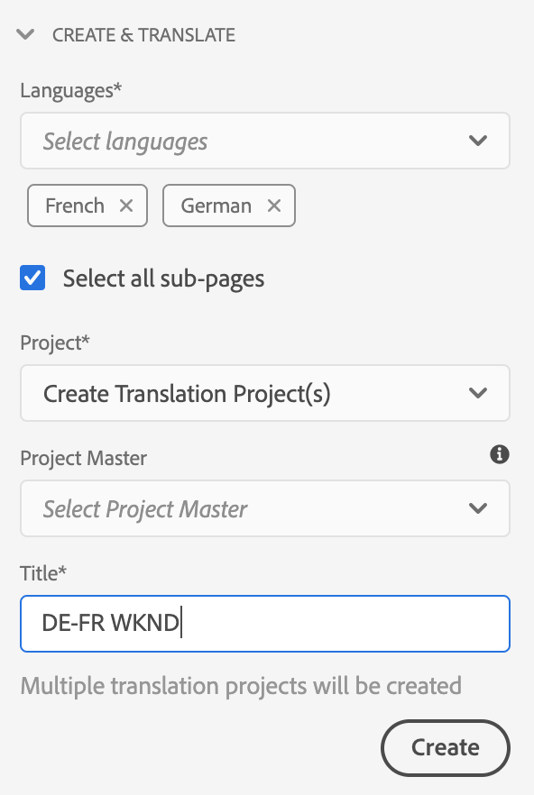
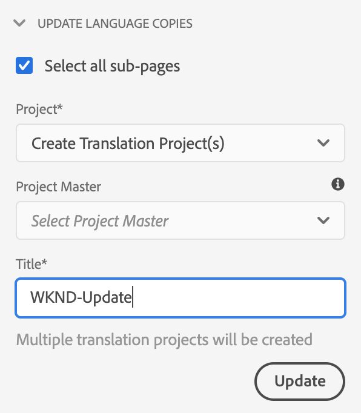
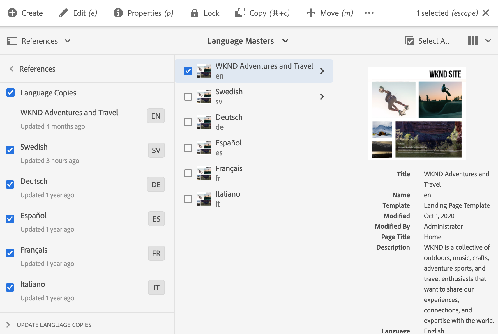

# Vertaalprojecten beheren {#managing-translation-projects}

Met vertaalprojecten kunt u de vertaling van AEM inhoud beheren. Een vertaalproject is een type van AEM [project](/help/sites-cloud/authoring/projects/overview.md) dat middelen bevat die in andere talen moeten worden vertaald. Deze bronnen zijn de pagina&#39;s en elementen van de [taalkopieën](preparation.md) die zijn gemaakt op basis van de master taal.

Wanneer middelen aan een vertaalproject worden toegevoegd, wordt een vertaalbaan gecreeerd voor hen. Taken bieden opdrachten en statusinformatie die u gebruikt om de workflows voor het vertalen van mensen en computers die op de bronnen worden uitgevoerd, te beheren.

Vertaalprojecten zijn langlopende items, die door taal- en vertaalmethode/provider worden gedefinieerd om te worden afgestemd op organisatorisch bestuur voor globalization. Zij moeten eenmaal worden gestart, hetzij tijdens de eerste vertaling, hetzij handmatig, en blijven van kracht gedurende de gehele update van inhoud en vertaling.

Vertaalprojecten en -taken worden gecreëerd met workflows voor het voorbereiden van vertalingen. Deze workflows hebben drie opties, voor zowel de eerste vertaling (Maken en vertalen) als de updates (Vertaling bijwerken):

1. [Nieuw project maken](#creating-translation-projects-using-the-references-panel)
1. [Toevoegen aan bestaand project](#adding-pages-to-a-translation-project)
1. [Alleen inhoudsstructuur](#creating-the-structure-of-a-language-copy)

AEM ontdekt of een vertaalproject voor de aanvankelijke vertaling van inhoud wordt gecreeerd, of reeds-vertaalde taalexemplaren bijwerken. Wanneer u een vertaalproject voor een pagina creeert en de taalexemplaren aangeeft waarvoor u vertaalt, AEM ontdekt of de bronpagina reeds in de gerichte taalexemplaren bestaat:

* **De pagina is niet opgenomen in de taalkopie:** AEM behandelt deze situatie als de eerste vertaling. De pagina wordt onmiddellijk gekopieerd naar de taalkopie en opgenomen in het project. Wanneer de vertaalde pagina in AEM wordt geïmporteerd, AEM deze rechtstreeks naar de taalkopie gekopieerd.
* **De taalkopie bevat al de pagina:** AEM behandelt deze situatie als een bijgewerkte vertaling. Er wordt een startpagina gemaakt en een kopie van de pagina wordt toegevoegd aan de startpagina en opgenomen in het project. Met behulp van Starten kunt u bijgewerkte vertalingen controleren voordat u deze doorgeeft aan de taalkopie:

   * Wanneer de vertaalde pagina in AEM wordt geïmporteerd, wordt de pagina tijdens het opstarten overschreven.
   * De vertaalde pagina overschrijft de taalkopie alleen wanneer de introductie wordt bevorderd.

De hoofdtaal `/content/wknd/fr` wordt bijvoorbeeld gemaakt voor de Franse vertaling van de master taal `/content/wknd/en`. Er zijn geen andere pagina&#39;s in de Franse taalkopie.

* Er wordt een vertaalproject gemaakt voor de pagina `/content/wknd/en/products` en alle onderliggende pagina&#39;s, die zich richten op de Franse taalkopie. Omdat de taalkopie de pagina `/content/wknd/fr/products` niet bevat, kopieert AEM onmiddellijk de pagina `/content/wknd/en/products` en alle onderliggende pagina&#39;s naar de Franse taalkopie. De kopieën worden ook in het vertaalproject opgenomen.
* Er wordt een vertaalproject gemaakt voor de pagina `/content/wknd/en` en alle onderliggende pagina&#39;s, die zich richten op de Franse taalkopie. Omdat de taalkopie de pagina bevat die overeenkomt met de `/content/wknd/en`-pagina (de hoofdtaal), AEM de pagina `/content/wknd/en` en alle onderliggende pagina&#39;s kopiëren en deze aan een introductie toevoegen. De kopieën worden ook in het vertaalproject opgenomen.

## Vertaling via de siteconsole {#performing-initial-translations-and-updating-existing-translations}

De vertaalprojecten kunnen direct van de plaatsenconsole worden gecreeerd of worden bijgewerkt.

### Vertaalprojecten maken met het deelvenster Verwijzingen {#creating-translation-projects-using-the-references-panel}

Maak vertaalprojecten zodat u de workflow voor het vertalen van de master bronnen kunt uitvoeren en beheren. Wanneer u projecten maakt, geeft u de pagina op in de master taal die u vertaalt en de taalkopieën waarvoor u de vertaling uitvoert:

* De wolkenconfiguratie van het kader van de vertaalintegratie dat met de geselecteerde pagina wordt geassocieerd bepaalt vele eigenschappen van de vertaalprojecten, zoals het vertaalwerkschema aan gebruik.
* Er wordt een project gemaakt voor elke geselecteerde taalkopie.
* Er wordt een kopie van de geselecteerde pagina en de bijbehorende elementen gemaakt en aan elk project toegevoegd. Deze kopieën worden later naar de vertaalprovider verzonden voor vertaling.

U kunt opgeven dat de onderliggende pagina&#39;s van de geselecteerde pagina ook worden geselecteerd. In dit geval worden ook kopieën van de onderliggende pagina&#39;s aan elk project toegevoegd, zodat deze worden vertaald. Wanneer om het even welke kindpagina&#39;s met verschillende configuraties van het kader van de vertaalintegratie worden geassocieerd, AEM leidt tot extra projecten.

U kunt ook [handmatig vertaalprojecten maken](#creating-a-translation-project-using-the-projects-console).

>[!NOTE]
>
>Als u een project wilt maken, moet uw account lid zijn van de groep `project-administrators`.

### Eerste vertalingen en Bijwerken van vertalingen {#initial-and-updating}

In het deelvenster Verwijzingen wordt aangegeven of de bestaande taalkopieën worden bijgewerkt of dat de eerste versie van de taalkopieën wordt gemaakt. Wanneer een taalexemplaar voor de geselecteerde pagina bestaat, lijkt het lusje van de Exemplaren van de Taal van de Update toegang tot project-verwante bevelen te verlenen.

Na het vertalen, kunt u [de vertaling ](#reviewing-and-promoting-updated-content) alvorens het taalexemplaar met het te beschrijven herzien. Als er geen taalkopie voor de geselecteerde pagina bestaat, wordt op het tabblad Maken en vertalen toegang weergegeven tot opdrachten die betrekking hebben op het project.

### Vertaalprojecten maken voor een nieuwe taalkopie {#create-translation-projects-for-a-new-language-copy}

1. Gebruik de console van Plaatsen om de pagina te selecteren die u aan vertaalprojecten toevoegt.

1. Open met behulp van de werkbalk de **References** rail.

   

1. Selecteer **Taalkopieën** en selecteer vervolgens de taalkopieën waarvoor u de bronpagina&#39;s vertaalt.
1. Klik of tik **Maken en vertalen** en configureer de vertaaltaak vervolgens:

   * Gebruik de vervolgkeuzelijst **Talen** om een taalkopie te selecteren waarvoor u wilt vertalen. Selecteer desgewenst extra talen. Talen die in de lijst verschijnen komen overeen met de [taalwortels die u](preparation.md#creating-a-language-root) hebt gecreeerd.
      * Als u meerdere talen selecteert, wordt er één project gemaakt met een vertaaltaak voor elke taal.
   * Selecteer **Alle subpagina&#39;s selecteren om de pagina die u hebt geselecteerd en alle onderliggende pagina&#39;s te vertalen.** Als u alleen de geselecteerde pagina wilt vertalen, schakelt u de optie uit.
   * Voor **Project** selecteert u **Vertaalproject(en) maken**.
   * Naar keuze voor **Project Master**, selecteer een project waarvan om gebruikersrollen en toestemmingen te erven.
   * Typ in **Titel** een naam voor het project.

   

1. Klik of tik **Create**.

### Vertaalprojecten maken voor een bestaande taalkopie {#create-translation-projects-for-an-existing-language-copy}

1. Gebruik de console van Plaatsen om de pagina te selecteren die u aan de vertaalprojecten toevoegt.

1. Open met behulp van de werkbalk de **References** rail.

   

1. Selecteer **Taalkopieën** en selecteer vervolgens de taalkopieën waarvoor u de bronpagina&#39;s vertaalt.
1. Klik of tik **Taalkopieën bijwerken** en configureer vervolgens de vertaaltaak:

   * Selecteer **Alle subpagina&#39;s selecteren om de pagina die u hebt geselecteerd en alle onderliggende pagina&#39;s te vertalen.** Als u alleen de geselecteerde pagina wilt vertalen, schakelt u de optie uit.
   * Voor **Project** selecteert u **Vertaalproject(en) maken**.
   * Naar keuze voor **Project Master**, selecteer een project waarvan om gebruikersrollen en toestemmingen te erven.
   * Typ in **Titel** een naam voor het project.

   

1. Klik of tik **Create**.

### Pagina&#39;s toevoegen aan een vertaalproject {#adding-pages-to-a-translation-project}

Nadat u een vertaalproject hebt gecreeerd, kunt u **Middelen** spoorstaaf gebruiken om pagina&#39;s aan het project toe te voegen. Het toevoegen van pagina&#39;s is handig wanneer u pagina&#39;s van verschillende vertakkingen in hetzelfde project opneemt.

Wanneer u pagina&#39;s toevoegt aan een vertaalproject, worden de pagina&#39;s opgenomen in een nieuwe vertaaltaak. U kunt ook [pagina&#39;s toevoegen aan een bestaande taak](#adding-pages-assets-to-a-translation-job).

Net zoals bij het maken van een nieuw project, worden bij het toevoegen van pagina&#39;s kopieën van de pagina&#39;s zo nodig toegevoegd aan een opstart om te voorkomen dat bestaande taalkopieën worden overschreven. (Zie [Vertaalprojecten maken voor bestaande taalkopieën](#performing-initial-translations-and-updating-existing-translations).)

1. Gebruik de console van Plaatsen om de pagina te selecteren die u aan het vertaalproject toevoegt.

1. Open met behulp van de werkbalk de **References** rail.

   

1. Selecteer **Taalkopieën** en selecteer vervolgens de taalkopieën waarvoor u de bronpagina&#39;s vertaalt.

   

1. Klik of tik **Taalkopieën bijwerken** en configureer vervolgens de eigenschappen:

   * Selecteer **Alle subpagina&#39;s selecteren om de pagina die u hebt geselecteerd en alle onderliggende pagina&#39;s te vertalen.** Als u alleen de geselecteerde pagina wilt vertalen, schakelt u de optie uit.
   * Selecteer **Toevoegen aan bestaand vertaalproject** voor **Project**.
   * Selecteer het project in **Bestaand Vertaalproject**.

   >[!NOTE]
   >
   >De doeltaal die in het vertaalproject is ingesteld, moet overeenkomen met het pad van de taalkopie zoals die in het referentietraject wordt getoond.

1. Klik of tik **Update**.

### De structuur maken van een taalkopie {#creating-the-structure-of-a-language-copy}

Het is mogelijk om alleen de structuur van de taalkopie te maken, zodat u inhoud en structurele wijzigingen in de taal die is master voor (onvertaalde) taalkopieën kunt kopiëren. Dit houdt geen verband met een vertaalbaan of een project. U kunt dit gebruiken om uw taalmeesters synchroon te houden, zelfs zonder vertaling.

Vul de taalkopie zodanig dat deze inhoud bevat uit de master taal die u vertaalt. Voordat u uw taalkopie kunt vullen, moet u [de hoofdtaal](preparation.md#creating-a-language-root) van de taalkopie hebben gemaakt.

1. Gebruik de plaatsenconsole om de taalwortel van de master taal te selecteren die u als bron gebruikt.
1. Open de verwijzingsrail door **References** in de toolbar te klikken of te tikken.

   

1. Selecteer **Taalkopieën** en selecteer vervolgens de taalkopieën die u wilt vullen.

   

1. Klik of tik **Taalkopieën bijwerken** om de vertaalgereedschappen weer te geven en de eigenschappen te configureren:

   * Selecteer de optie **Selecteer alle subpagina&#39;s**.
   * Selecteer **Structuur alleen maken** voor **Project**.

   

1. Klik of tik **Update**.

### Vertaalgeheugen {#updating-translation-memory} bijwerken

Handmatige bewerkingen van vertaalde inhoud kunnen worden gesynchroniseerd met het TMS (Translation Management System) om het vertaalgeheugen te trainen.

1. Selecteer **Vertaalgeheugen bijwerken** in de siteconsole na het bijwerken van tekstinhoud in een vertaalde pagina.
1. Een lijstmening toont een zij-aan-zij vergelijking van de bron en de vertaling voor elke tekstcomponent die werd uitgegeven. Selecteer welke vertalingsupdates moeten worden gesynchroniseerd met het vertaalgeheugen en selecteer **Geheugen bijwerken**.

AEM stuurt de geselecteerde tekenreeksen terug naar het vertaalbeheersysteem.

### Vertaalstatus van een pagina {#check-translation-status} controleren

Een bezit kan in de lijstmening van de plaatsenconsole worden geselecteerd die toont als een pagina is vertaald, in vertaling is, of nog niet is vertaald.

1. Schakel in de siteconsole over naar [lijstweergave.](/help/sites-cloud/authoring/getting-started/basic-handling.md#viewing-and-selecting-resources)
1. Tik of klik op **Instellingen weergeven** in de keuzelijst Weergave.
1. Controleer in het dialoogvenster de eigenschap **Vertaald** en tik op **Bijwerken** of klik op Bijwerken.

De siteconsole geeft nu de kolom **Vertaald** weer met de vertaalstatus van de vermelde pagina&#39;s.

## Vertaalprojecten beheren vanuit de projectconsole

Vele vertaaltaken en geavanceerde opties kunnen in de projectenconsole worden betreden.

### De projectenconsole begrijpen

De vertaalprojecten in AEM gebruiken standaard [AEM projectenconsole.](/help/sites-cloud/authoring/projects/overview.md) Als u niet bekend bent met AEM projecten, raadpleegt u die documentatie.

Net als elk ander project bestaat een vertaalproject uit tegels die een overzicht geven van de projecttaken.

* **Samenvatting**  - Een overzicht van het project
* **Taken**  - Een of meer vertaaltaken
* **Team**  - Gebruikers die aan het vertaalproject samenwerken
* **Taken**  - Items die moeten worden ingevuld als onderdeel van de vertaalwerkzaamheden

Gebruik de opdrachten en de elliptische knoppen boven en onder aan de tegels (respectievelijk) voor toegang tot de besturingselementen en opties voor de verschillende tegels.

### Een vertaalproject maken met de projectconsole {#creating-a-translation-project-using-the-projects-console}

U kunt een vertaalproject manueel tot stand brengen als u verkiest de projectenconsole in plaats van de plaatsenconsole te gebruiken.

>[!NOTE]
>
>Als u een project wilt maken, moet uw account lid zijn van de groep `project-administrators`.

Wanneer u handmatig een vertaalproject maakt, moet u naast de [basiseigenschappen](/help/sites-cloud/authoring/projects/managing.md#creating-a-project) ook waarden opgeven voor de volgende translatie-gerelateerde eigenschappen:

* **Naam:** projectnaam
* **Brontaal:** de taal van de broninhoud
* **Doeltaal:** de taal of talen waarin de inhoud wordt vertaald
   * Als er meerdere talen zijn geselecteerd, wordt er een taak gemaakt voor elke taal in het project.
* **Omzettingsmethode:** selecteer  **Menselijke** Vertaling om erop te wijzen dat de vertaling manueel moet worden uitgevoerd.

1. Klik of tik op **Maken** op de werkbalk van de projectenconsole.
1. Selecteer de sjabloon **Vertaalproject** en klik of tik op **Volgende**.
1. Voer waarden in voor het tabblad **Basis**-eigenschappen.
1. Klik of tik **Geavanceerd** en verstrek waarden voor de op vertaling betrekking hebbende eigenschappen.
1. Klik of tik **Create**. Klik of tik in het bevestigingsvak op **Done** om terug te keren naar de projectconsole, of klik of tik op **Project openen** om het project te openen en te beheren.

### Pagina&#39;s en elementen toevoegen aan een vertaaltaak {#adding-pages-assets-to-a-translation-job}

U kunt pagina&#39;s, elementen of codes toevoegen aan de vertaaltaak van uw vertaalproject. Pagina&#39;s of elementen toevoegen:

1. Klik of tik op de ellips onder aan de tegel voor vertaaltaken van het vertaalproject.

   

1. Klik of tik in het volgende venster op de knop **Toevoegen** op de werkbalk en selecteer **Middelen/Pagina&#39;s**.

   

1. Selecteer in het modale venster het bovenste item van de vertakking die u wilt toevoegen en klik of tik op het pictogram van het vinkje. Multi-select is ingeschakeld in dit venster.

   

1. U kunt ook het zoekpictogram selecteren om gemakkelijk te zoeken naar pagina&#39;s of elementen die u aan uw vertaaltaak wilt toevoegen.

   

1. Tik of klik op **Select** als deze optie is geselecteerd. Uw pagina&#39;s en/of middelen worden toegevoegd aan de vertaaltaak.

>[!TIP]
>
>Met deze methode voegt u pagina&#39;s/elementen en de onderliggende elementen ervan toe aan het project. Selecteer **Element/pagina (zonder onderliggende elementen)** als u alleen de bovenliggende elementen wilt toevoegen.

### Tags toevoegen aan een vertaaltaak {#adding-tags-to-a-translation-job}

U kunt labels toevoegen aan een vertaalproject, vergelijkbaar met [hoe u elementen en pagina&#39;s toevoegt aan een project.](#adding-pages-assets-to-a-translation-job) Selecteer gewoon  **** Tags onder het menu  **** Toevoegen en volg vervolgens dezelfde stappen.

### Details van vertaalproject bekijken {#seeing-translation-project-details}

De eigenschappen van het vertaalproject zijn toegankelijk via de ellipsieknoop van de projectoverzicht. Naast generische [projectinformatie](/help/sites-cloud/authoring/projects/overview.md#project-info), bevatten de eigenschappen van het vertaalproject vertaling-specifiek.

Klik of tik in uw vertaalproject op de ellips onder aan de tegel Vertaaloverzicht. De meeste projectspecifieke eigenschappen zijn op **Geavanceerd** tabel.

* **Brontaal:** de taal van de pagina&#39;s die worden vertaald
* **Doeltaal:** de taal of talen waarin de pagina&#39;s worden vertaald
* **Cloudconfiguratie:** de cloudconfiguratie voor de vertaalserviceconnector die voor het project wordt gebruikt
* **Omzettingsmethode:** de vertaalworkflow,  **menselijke** omzetting of  **machinevertaling**
* **Vertaalprovider:** de vertaalserviceprovider die de vertaling uitvoert
* **Inhoudscategorie:** (Machine Translation) De inhoudscategorie die wordt gebruikt voor het vertalen
* **Referentie vertaalprovider:** de referenties om u aan te melden bij de provider
* **Automatisch introducties van vertalingen bevorderen:** na ontvangst van vertaalde inhoud worden de lanceringen van vertalingen automatisch bevorderd
   * **Starten na aanbieding verwijderen:** Als het starten van de vertaling automatisch wordt bevorderd, verwijdert u de introductie na de promotie
* **Automatisch vertalingen goedkeuren:** na ontvangst van vertaalde inhoud worden vertaaltaken automatisch goedgekeurd
* **Vertaling herhalen:Herhalende uitvoering van een vertaalproject** configureren door de frequentie te selecteren die het project automatisch vertaaltaken maakt en uitvoert

Wanneer een project wordt gecreeerd gebruikend de verwijzingsspoorlijn van een pagina, worden deze eigenschappen automatisch gevormd gebaseerd op de eigenschappen van de bronpagina.

### De status van een vertaaltaak {#monitoring-the-status-of-a-translation-job} controleren

De tegel voor vertaaltaken van een vertaalproject geeft de status van een vertaaltaak en het aantal pagina&#39;s en middelen in de taak.

In de volgende tabel wordt elke status beschreven die een taak of een item in de taak kan hebben:

| Status | Beschrijving |
|---|---|
| **Concept** | De vertaaltaak is niet gestart. Vertaaltaken krijgen de status **Concept**** wanneer ze worden gemaakt. |
| **Verzonden** | Bestanden in de vertaaltaak hebben deze status wanneer ze naar de vertaalservice zijn verzonden. Deze status kan voorkomen nadat **Request Scope** bevel of **Start** bevel wordt uitgegeven. |
| **Gevraagd bereik** | Voor de workflow voor menselijke vertaling zijn de bestanden in de taak voor bereiking naar de leverancier van de vertaling verzonden. Deze status wordt weergegeven nadat de opdracht **Request Scope** is uitgegeven. |
| **Bereik voltooid** | De leverancier heeft het bereik van de vertaaltaak. |
| **Toegewezen voor vertaling** | De eigenaar van het project heeft het toepassingsgebied geaccepteerd. Deze status geeft aan dat de leverancier van de vertaling moet beginnen met het vertalen van de bestanden in de taak. |
| **Bezig met omzetten** | Voor een taak is de vertaling van een of meer bestanden in de taak nog niet voltooid. Voor een item in de taak wordt het item vertaald. |
| **Vertaald** | Voor een taak is de vertaling van alle bestanden in de taak voltooid. Voor een item in de taak wordt het item vertaald. |
| **Gereed voor revisie** | Het item in de taak wordt omgezet en het bestand is geïmporteerd in AEM. |
| **Voltooid** | De eigenaar van het project heeft aangegeven dat het vertaalcontract volledig is. |
| **Annuleren** | Geeft aan dat de leverancier van de vertaling moet stoppen met het werken aan een vertaaltaak. |
| **Foutupdate** | Er is een fout opgetreden bij het overdragen van bestanden tussen AEM en de vertaalservice. |
| **Onbekende status** | Er is een onbekende fout opgetreden. |

Als u de status van elk bestand in de taak wilt zien, klikt of tikt u op de ellips onder aan de tegel.

### Vervaldatum van vertaaltaken instellen {#setting-the-due-date-of-translation-jobs}

Geef de datum op waarop de leverancier van de vertaling vertaalde bestanden moet retourneren. Het instellen van de vervaldatum werkt alleen correct wanneer de leverancier van de vertaling die u gebruikt deze functie ondersteunt.

1. Klik of tik de ellips bij de bodem van de de summiere tegel van de vertaling.

   

1. Gebruik op het tabblad **Standaard** de datumkiezer van de eigenschap **Einddatum** om de vervaldatum te selecteren.

   

1. Klik of tik **Opslaan en sluiten**.

### Een vertaaltaak opsplitsen {#scoping-a-translation-job}

Bereik een vertaalbaan om een schatting van de kosten van vertaling van uw vertaaldienstverlener te verkrijgen. Wanneer u een taak instelt, worden bronbestanden verzonden naar de leverancier van de vertaling die de tekst vergelijkt met de groep met opgeslagen vertalingen (vertaalgeheugen). Doorgaans is het bereik het aantal woorden dat moet worden vertaald.

Neem contact op met uw vertaalleverancier voor meer informatie over bereikresultaten.

>[!NOTE]
>
>Scoping is optioneel en is alleen van toepassing op menselijke vertaling. U kunt een vertaalbaan zonder scoping beginnen.

Wanneer u een vertaalbaan werkingsgebied, is de status van de baan **Gevraagd Toepassingsgebied**. Wanneer de vertaalverkoper het werkingsgebied terugkeert, wordt de status veranderd in **Voltooid Werkingsgebied**. Wanneer het werkingsgebied wordt voltooid kunt u **Show het bevel van het Toepassingsgebied** gebruiken om het scoping resultaten te herzien.

De bereikfuncties werken alleen correct wanneer de leverancier van de vertaling die u gebruikt deze functie ondersteunt.

1. In de projectenconsole, open uw vertaalproject.
1. Tik op de titel van de vertaaltaak of klik op het menu Opdrachten en tik op **Toepassingsgebied aanvragen** of klik op Toepassingsgebied aanvragen.
1. Als de taakstatus verandert in **Voltooid bereik**, klikt of tikt u op het menu met opdrachten en klikt of tikt u op **Bereik tonen**.

### Translatietaken starten {#starting-translation-jobs}

Start een vertaaltaak om de bronpagina&#39;s naar de doeltaal te vertalen. De vertaling wordt uitgevoerd volgens de bezitswaarden van de de samenvattingstegel van de vertaling.

U kunt een individuele baan van binnen het project beginnen.

1. In de projectenconsole, open het vertaalproject.
1. Klik of tik op het menu Opdrachten in de tegel van de vertaaltaak en klik of tik op **Start**.
1. Klik of tik op **Close** in het dialoogvenster Handeling dat het starten van de vertaling bevestigt.

Nadat u de vertaalbaan begint, toont de tegel van de vertaalbaan de vertaling in **Bezig** status.

U kunt ook alle vertaaltaken voor een project starten.

1. In de projectconsole, selecteer het vertaalproject.
1. Tik in de werkbalk of klik op **Vertaal taak(en) starten**.
1. Controleer in het dialoogvenster de lijst met taken die worden gestart en bevestig vervolgens met **Start** of abort met **Cancel**.

### Een vertaaltaak {#canceling-a-translation-job} annuleren

Een vertaaltaak annuleren om het vertaalproces te stoppen en te voorkomen dat de leverancier van de vertaling verdere vertalingen uitvoert. U kunt een taak annuleren wanneer de taak de status **Toegewezen voor vertaling** of **Bezig met omzetten** heeft.

1. In de projectenconsole, open het vertaalproject.
1. Klik of tik op het menu Opdrachten in de tegel van de vertaaltaak en klik of tik op **Annuleren**.
1. Klik of tik **OK** in het dialoogvenster Handeling dat de annulering van de vertaling bevestigt.

### Workflow {#accept-reject-workflow} accepteren en afwijzen

Wanneer de inhoud na vertaling terug komt en **Klaar voor Overzicht** status is, kunt u in de vertaalbaan gaan en inhoud goedkeuren/verwerpen.

Als u **Vertaling afwijzen** selecteert, kunt u een opmerking toevoegen.

Als u inhoud afwijst, wordt deze teruggestuurd naar de vertaalleverancier waar deze de opmerking kan zien.

### Vertaal- en archiveringstaken {#completing-and-archiving-translation-jobs} voltooien

Voltooi een vertaalbaan nadat u de vertaalde dossiers van de verkoper hebt herzien.

1. In de projectenconsole, open het vertaalproject.
1. Klik of tik op het menu Opdrachten in de tegel van de vertaaltaak en klik of tik op **Voltooien**.
1. De taak heeft nu de status **Complete**.

Voor workflows voor menselijke vertaling geeft het voltooien van een vertaling de verkoper aan dat het vertaalcontract is uitgevoerd en dat hij de vertaling in zijn vertaalgeheugen moet opslaan.

Archiveer een vertaaltaak nadat deze is voltooid en u hoeft de gegevens over de taakstatus niet meer te zien.

1. In de projectenconsole, open het vertaalproject.
1. Klik of tik op het menu Opdrachten in de tegel van de vertaaltaak en klik of tik op **Archief**.

Wanneer u de taak archiveert, wordt de tegel van de vertaalbaan verwijderd uit het project.

## Vertaalde inhoud evalueren en gebruiken {#reviewing-and-promoting-updated-content}

U kunt de siteconsole gebruiken om inhoud te controleren, taalkopieën te vergelijken en de inhoud te activeren.

### Bijgewerkte inhoud promoten {#promoting-updated-content}

Wanneer de inhoud voor een bestaand taalexemplaar wordt vertaald, herzie de vertalingen, breng veranderingen indien nodig aan, en publiceer dan de vertalingen om het naar het taalexemplaar te bewegen. U kunt vertaalde bestanden bekijken wanneer de vertaaltaak de status **Gereed voor revisie** weergeeft.

1. Selecteer de pagina in de master taal, klik of tik **References**, dan klik of tik **Taalkopieën**.
1. Klik of tik op de taalkopie om te reviseren.

   

1. Klik of tik **Launch** om de op lancering betrekking hebbende bevelen te onthullen.

   

1. Klik op **Pagina openen** om de opstartafbeelding van de pagina te openen om de inhoud te bekijken en bewerken.
1. Nadat u de inhoud hebt bekeken en de benodigde wijzigingen hebt aangebracht, klikt u op **Promote** om de opstartafbeelding te promoten.
1. Geef op de pagina **Starten promoten** op welke pagina&#39;s u wilt promoten en klik of tik op **Promote**.

### Taalkopieën vergelijken {#comparing-language-copies}

U kunt als volgt master taalkopieën vergelijken met de taal:

1. In de plaatsenconsole, navigeer aan het taalexemplaar u wilt vergelijken.
1. Open [References rail.](/help/sites-cloud/authoring/getting-started/basic-handling.md#references)
1. Selecteer onder de kop **Kopieën** **Taalkopieën.**
1. Selecteer uw specifieke taalexemplaar en dan kunt u of **vergelijken met Master** of **vergelijken met Vorige** indien van toepassing.

   

1. De twee pagina&#39;s (opstart en bron) worden naast elkaar geopend.
   * Zie [Paginadiff](/help/sites-cloud/authoring/features/page-diff.md) voor volledige informatie over het gebruik van deze functie.

## Vertaaltaken {#import-export} importeren en exporteren

Hoewel AEM een aantal vertaaloplossingen en interfaces biedt, is het ook mogelijk om vertaalbaaninformatie manueel in te voeren en uit te voeren.

### Een vertaaltaak exporteren {#exporting-a-translation-job}

U kunt de inhoud van een vertaalbaan downloaden, bijvoorbeeld om naar een vertaalleverancier te verzenden die niet met AEM via een schakelaar geïntegreerd is, of om de inhoud te herzien.

1. Klik of tik in het keuzemenu van de vertaaltaaktegel op **Exporteren**.
1. Klik of tik in het dialoogvenster op **Geëxporteerd bestand downloaden** en gebruik indien nodig het dialoogvenster van de webbrowser om het bestand op te slaan.
1. Klik of tik op **Close** in het dialoogvenster.

### Een vertaaltaak {#importing-a-translation-job} importeren

U kunt vertaalde inhoud in AEM importeren, bijvoorbeeld wanneer uw vertaalbureau de inhoud naar u stuurt omdat deze niet via een connector is geïntegreerd met AEM.

1. Klik of tik in het keuzemenu van de vertaaltaaktegel op **Importeren**.
1. Selecteer in het dialoogvenster van de webbrowser het bestand dat u wilt importeren.
1. Klik of tik op **Close** in het dialoogvenster.
