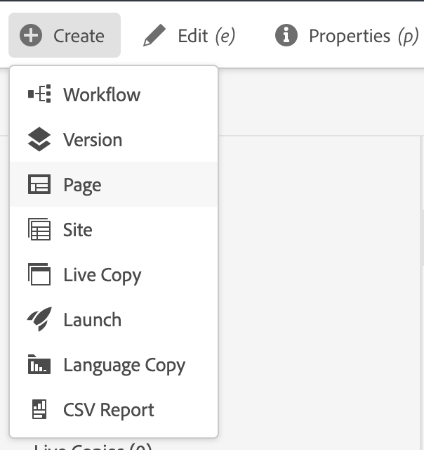

# Inhoud voorbereiden voor vertaling {#preparing-content-for-translation}

Meertalige websites bieden over het algemeen inhoud in meerdere talen. De site is gemaakt in één taal en wordt vervolgens vertaald in andere talen. In het algemeen bestaan meertalige sites uit vertakkingen van pagina&#39;s, waarbij elke vertakking de pagina&#39;s van de site in een andere taal bevat.

De [WKND-zelfstudiesite](/help/implementing/developing/introduction/develop-wknd-tutorial.md) bevat verschillende taalvertakkingen en gebruikt de volgende structuur:

```text
/content
    |- wknd
        |- language-masters
            |- en
            |- de
            |- es
            |- fr
            |- it
        |- us
            |- en
            |- es
        |- ca
            |- en
            |- fr
        |- ch
            |- de
            |- fr
            |- it
        |- de
            |- de
        |- fr
            |- fr
        |- es
            |- es
        |- it
            |- it
```

De taalkopie waarvoor u oorspronkelijk site-inhoud hebt gemaakt, is de master taal. De master taal is de bron die in andere talen wordt vertaald.

Elke taalvertakking van een site wordt een taalkopie genoemd. De hoofdpagina van een taalkopie, ook wel de hoofdtaal genoemd, identificeert de taal van de inhoud in de taalkopie. `/content/wknd/fr` is bijvoorbeeld de hoofdtaal voor de Franse taalkopie. De exemplaren van de taal moeten [correct-gevormde taalwortel](preparation.md#creating-a-language-root) gebruiken zodat de correcte taal wordt gericht wanneer de vertalingen van een bronplaats worden uitgevoerd.

Gebruik de volgende stappen om uw site voor te bereiden op vertaling:

1. Maak de hoofdmap van de master taal. De hoofdtaalsite van de Engelse WKND-demosite is bijvoorbeeld `/content/wknd/language-masters/en`. Zorg ervoor dat de taalwortel correct volgens de informatie in [Creërend een Wortel van de Taal](preparation.md#creating-a-language-root) wordt gevormd.
1. Ontwerp de inhoud van uw master taal.
1. Maak de hoofdmap van elke taalkopie voor uw site. De Franse taalkopie van de WKND-voorbeeldsite is bijvoorbeeld `/content/wknd/language-masters/fr`.

Nadat u de inhoud hebt voorbereid voor vertaling, kunt u automatisch ontbrekende pagina&#39;s maken in uw taalkopieën en bijbehorende vertaalprojecten. (Zie [Een vertaalproject maken](managing-projects.md).) Zie [Inhoud vertalen voor meertalige websites](overview.md) voor een overzicht van het proces voor het vertalen van inhoud in AEM.

## Een taalbasis maken {#creating-a-language-root}

Maak een taalhoofdmap als de hoofdpagina van een taalkopie die de taal van de inhoud identificeert. Nadat u de taalwortel creeert, kunt u vertaalprojecten tot stand brengen die het taalexemplaar omvatten.

Als u de hoofdtaal wilt maken, maakt u een pagina en gebruikt u een ISO-taalcode als waarde voor de eigenschap **Naam**. De taalcode moet een van de volgende notaties hebben:

* `<language-code>` - De ondersteunde taalcode is bijvoorbeeld een tweelettercode zoals gedefinieerd in ISO-639-1  `en`.
* `<language-code>_<country-code>` of  `<language-code>-<country-code>` - De ondersteunde landcode is een tweeletterige code in kleine letters of hoofdletters, zoals gedefinieerd in ISO 3166, bijvoorbeeld  `en_US`,  `en_us`,  `en_GB`,  `en-gb`.

U kunt beide indelingen gebruiken op basis van de structuur die u voor uw globale site hebt gekozen.  De basispagina van de Franse taalkopie van de WKND-site heeft bijvoorbeeld `fr` als de eigenschap **Name**. Merk op dat **Naam** bezit als naam van de paginaknooppunt in de bewaarplaats wordt gebruikt, en daarom de weg van de pagina (`http://<host>:<4502>/content/wknd/language-masters/fr.html`) bepaalt.

1. Navigeer naar sites.
1. Klik of tik op de site waarvoor u een taalkopie wilt maken.
1. Klik of tik **Create**, en klik of tik dan **Pagina**.

   

1. Selecteer de paginasjabloon en klik of tik op **Volgende**.
1. Typ in het veld **Naam** de landcode in de notatie `<language-code>` of `<language-code>_<country-code>`, bijvoorbeeld `en`, `en_US`, `en_us`, `en_GB`, `en_gb`. Typ een titel voor de pagina.

   

1. Klik of tik **Create**. Klik of tik in het bevestigingsdialoogvenster op **Done** om terug te keren naar de Sites-console of **Open** om de taalkopie te openen.

## De status van taalhoofdmappen bekijken {#seeing-the-status-of-language-roots}

AEM biedt een **References**-spoor met een lijst met taalwortels die zijn gemaakt.


Gebruik de volgende procedure om de taalexemplaren voor een pagina te bekijken gebruikend [spoorselecteur.](/help/sites-cloud/authoring/getting-started/basic-handling.md#rail-selector)

1. Selecteer op de siteconsole een pagina van de site en klik of tik op **References**.

   

1. Klik of tik **Taalkopieën** in de verwijzingstag. De spoorstaaf toont de taalexemplaren van de website.

## Taalkopieën op meerdere niveaus {#multiple-levels}

Taalwortels kunnen ook worden gegroepeerd onder knooppunten, bijvoorbeeld per regio, terwijl ze nog steeds worden herkend als wortels van taalkopieën.

```text
/content
    |- wknd
        |- language-masters
            |- europe
                |- de
                |- fr
                |- it
                |- es
                ]- pt
            |- americas
                |- en
                |- es
                |- fr
                |- pt
            |- asia
                |- ...
            |- africa
                |- ...
            |- oceania
                |- ...
        |- europe
        |- americas
        |- asia
        |- africa
        |- oceania            
```

>[!NOTE]
>
>Er is slechts één niveau toegestaan. Met de volgende code kan de pagina `es` bijvoorbeeld niet worden omgezet in een taalkopie:
>
>* `/content/wknd/language-masters/en`
>* `/content/wknd/language-masters/americas/central-america/es`

>
> 
Dit `es` taalexemplaar zal niet worden ontdekt aangezien het 2 niveaus (`americas/central-america`) vanaf `en` knoop is.

>[!TIP]
>
>In dergelijke opstelling, kunnen de taalwortels om het even welke paginanaam, eerder dan enkel de ISO-code van de taal hebben. AEM zal altijd het pad en de naam eerst controleren, maar als de paginanaam geen taal identificeert, zal AEM de `cq:language` eigenschap van de pagina voor de taalidentificatie controleren.
