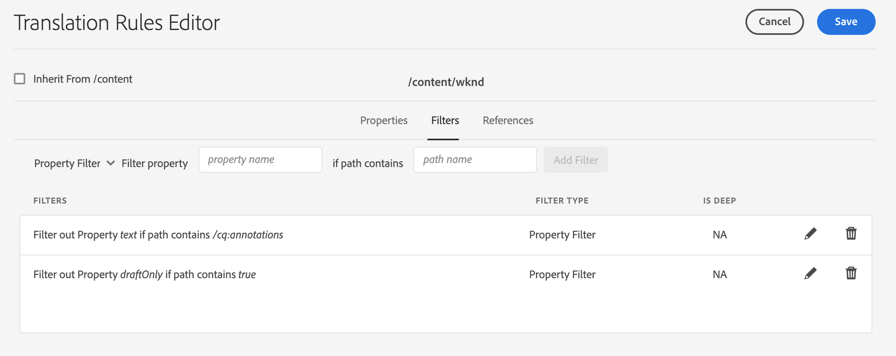

# Te vertalen inhoud identificeren {#identifying-content-to-translate}

De vertaalregels identificeren de inhoud om voor pagina&#39;s, componenten, en activa te vertalen die in, of van, vertaalprojecten inbegrepen zijn. Wanneer een pagina of element wordt vertaald, extraheert AEM deze inhoud zodat deze naar de vertaalservice kan worden verzonden.

Pagina&#39;s en elementen worden weergegeven als knooppunten in de JCR-opslagplaats. De inhoud die wordt geëxtraheerd, is een of meer eigenschapwaarden van de knooppunten. De vertaalregels identificeren de eigenschappen die de inhoud bevatten die moet worden geëxtraheerd.

De omzettingsregels worden uitgedrukt in het formaat van XML en in deze mogelijke plaatsen opgeslagen:

* `/libs/settings/translation/rules/translation_rules.xml`
* `/apps/settings/translation/rules/translation_rules.xml`
* `/conf/global/settings/translation/rules/translation_rules.xml`

Het bestand is van toepassing op alle vertaalprojecten.

De regels omvatten de volgende informatie:

* Het pad van het knooppunt waarop de regel van toepassing is
   * De regel is ook op de nakomelingen van de knoop van toepassing.
* De namen van de knoopeigenschappen die de te vertalen inhoud bevatten
   * Het bezit kan voor een specifiek middeltype of voor alle middeltypes specifiek zijn.

U kunt bijvoorbeeld een regel maken die de inhoud vertaalt die auteurs aan alle tekstcomponenten op uw pagina&#39;s toevoegen. De regel kan de `/content` knoop en `text` bezit voor `core/wcm/components/text/v2/text` component identificeren.

Er is een [console](#translation-rules-ui) die voor het vormen vertaalregels is toegevoegd. De definities in UI zullen het dossier voor u bevolken.

Zie [Inhoud vertalen voor meertalige sites](overview.md) voor een overzicht van de functies voor het vertalen van inhoud in AEM.

>[!NOTE]
>
>AEM ondersteunt een-op-een-toewijzing tussen typen bronnen en verwijzingskenmerken voor het vertalen van inhoud waarnaar wordt verwezen op een pagina.

## De Syntaxis van de regel voor Pagina&#39;s, Componenten, en Activa {#rule-syntax-for-pages-components-and-assets}

Een regel is een `node`-element met een of meer onderliggende `property`-elementen en nul of meer onderliggende `node`-elementen:

```xml
<node path="content path">
          <property name="property name" [translate="false"]/>
          <node resourceType="component path" >
               <property name="property name" [translate="false"]/>
          </node>
</node>
```

Elk van deze `node` elementen heeft de volgende kenmerken:

* Het `path` attribuut bevat de weg aan de wortelknoop van de tak waarop de regels van toepassing zijn.
* De onderliggende elementen `property` identificeren de knoopeigenschappen om voor alle middeltypes te vertalen:
   * Het `name` attribuut bevat de bezitsnaam.
   * Het optionele `translate`-kenmerk is `false` als de eigenschap niet is omgezet. De standaardwaarde is `true`. Dit kenmerk is handig wanneer u vorige regels overschrijft.
* De onderliggende elementen `node` identificeren de knoopeigenschappen om voor specifieke middeltypes te vertalen:
   * Het `resourceType` attribuut bevat de weg die aan de component oplost die het middeltype uitvoert.
   * Onderliggende `property`-elementen identificeren de eigenschap node die moet worden vertaald. Gebruik dit knooppunt op dezelfde manier als de onderliggende `property`-elementen voor knooppuntregels.

De volgende voorbeeldregel zorgt ervoor dat de inhoud van alle `text` eigenschappen voor alle pagina&#39;s onder de `/content` knoop wordt vertaald. De regel is effectief voor om het even welke component die inhoud in een `text` bezit, zoals de tekstcomponent opslaat.

```xml
<node path="/content">
          <property name="text"/>
</node>
```

In het volgende voorbeeld wordt de inhoud van alle `text`-eigenschappen omgezet en worden ook andere eigenschappen van de afbeeldingscomponent omgezet. Als andere componenten eigenschappen met dezelfde naam hebben, is de regel niet op hen van toepassing.

```xml
<node path="/content">
      <property name="text"/>
      <node resourceType="core/wcm/components/image/v2/image">
         <property name="image/alt"/>
         <property name="image/jcr:description"/>
         <property name="image/jcr:title"/>
      </node>
</node>
```

## Regelsyntaxis voor het uitnemen van elementen van pagina&#39;s {#rule-syntax-for-extracting-assets-from-pages}

Gebruik de volgende regelsyntaxis om elementen op te nemen die zijn ingesloten in of waarnaar wordt verwezen vanuit componenten:

```xml
<assetNode resourceType="path to component" assetReferenceAttribute="property that stores asset"/>
```

Elk `assetNode` element heeft de volgende kenmerken:

* Eén `resourceType`-kenmerk dat gelijk is aan het pad dat naar de component wordt omgezet
* Een `assetReferenceAttribute`-kenmerk dat gelijk is aan de naam van de eigenschap die het element binair (voor ingesloten elementen) of het pad naar het element waarnaar wordt verwezen, opslaat

In het volgende voorbeeld worden afbeeldingen uit de afbeeldingscomponent geëxtraheerd:

```xml
<assetNode resourceType="core/wcm/components/image/v2/image" assetReferenceAttribute="fileReference"/>
```

## Regels {#overriding-rules} overschrijven

Het `translation_rules.xml`-bestand bestaat uit een `nodelist`-element met verschillende onderliggende `node`-elementen. AEM leest de nodenlijst van boven naar beneden. Wanneer de veelvoudige regels de zelfde knoop richten, wordt de regel die lager in het dossier is gebruikt. De volgende regels zorgen er bijvoorbeeld voor dat alle inhoud in `text`-eigenschappen wordt vertaald, behalve de `/content/mysite/en`-vertakking van pagina&#39;s:

```xml
<nodelist>
     <node path="/content”>
           <property name="text" />
     </node>
     <node path=“/content/mysite/en”>
          <property name=“text” translate=“false" />
     </node>
<nodelist>
```

## Filtereigenschappen {#filtering-properties}

U kunt knopen filtreren die een specifiek bezit door een `filter` element te gebruiken.

De volgende regels zorgen er bijvoorbeeld voor dat alle inhoud in `text`-eigenschappen wordt vertaald, behalve de knooppunten waarvoor de eigenschap `draft` is ingesteld op `true`.

```xml
<nodelist>
    <node path="/content”>
     <filter>
   <node containsProperty="draft" propertyValue="true" />
     </filter>
        <property name="text" />
    </node>
<nodelist>
```

## UI voor omzettingsregels {#translation-rules-ui}

Een console is ook beschikbaar voor het vormen van vertaalregels.

Toegang tot dit bestand:

1. Navigeer naar **Tools** en vervolgens **General**.

1. Selecteer **Omzetconfiguratie**.

In de interface met vertaalregels kunt u:

1. **Voeg context** toe, die u toestaat om een weg toe te voegen.

   

1. Gebruik de padbrowser om de vereiste context te selecteren en tik op de knop **Bevestigen** om op te slaan.

   

1. Dan moet u uw context selecteren en dan **Edit** klikken. Hiermee opent u de Editor voor de vertaalregels.

   

Er zijn vier attributen die u via UI kunt veranderen:

* `isDeep`
* `inherit`
* `translate`
* `updateDestinationLanguage`

### isDeep {#isdeep}

**`isDeep`**  is van toepassing op knooppuntfilters en is standaard waar. Het controleert of de knoop (of zijn voorouders) die bezit met de gespecificeerde bezitswaarde in de filter bevat. Indien false, wordt alleen het huidige knooppunt gecontroleerd.

Bijvoorbeeld, worden de kindknopen toegevoegd aan een vertaalbaan zelfs wanneer de ouderknoop het bezit `draftOnly` geplaatst aan waar heeft om ontwerp inhoud te markeren. Hier `isDeep` komt in spel en controleert als de ouderknopen bezit `draftOnly` als waar hebben en die kindknopen uitsluiten.

In de redacteur, kunt u **Is Diep** in **Filters** tabel controleren/uncheck.



Hier is een voorbeeld van resulterende XML wanneer **Is Diep** in UI wordt ongecontroleerd:

```xml
 <filter>
    <node containsProperty="draftOnly" isDeep="false" propertyValue="true"/>
</filter>
```

### {#inherit} overnemen

**`inherit`** is van toepassing op eigenschappen. Standaard wordt elke eigenschap overgeërfd, maar als u wilt dat een eigenschap niet door het onderliggende domein wordt overgeërfd, kunt u deze eigenschap als onwaar markeren, zodat deze alleen op dat specifieke knooppunt wordt toegepast.

In UI, kunt u **overerven** in **Eigenschappen** tabel controleren/uncheck.

### vertalen {#translate}

**`translate`** wordt gebruikt om eenvoudig te specificeren of om een bezit al dan niet te vertalen.

In UI, kunt u **Omzetten** in **Eigenschappen** tabel controleren/uncheck.

### updateDestinationLanguage {#updatedestinationlanguage}

**`updateDestinationLanguage`** wordt gebruikt voor eigenschappen die geen tekst maar taalcodes hebben, bijvoorbeeld  `jcr:language`. De gebruiker vertaalt geen tekst maar de taallandinstelling van bron tot doel. Dergelijke eigenschappen worden niet verzonden voor vertaling.

In UI, kunt u **Omzetten** in **Eigenschappen** lusje controleren/uncheck om deze waarde te wijzigen, maar voor de specifieke eigenschappen die taalcodes als waarde hebben.

Om het verschil tussen `updateDestinationLanguage` en `translate` te helpen verduidelijken, is hier een eenvoudig voorbeeld van een context met slechts twee regels:


Het resultaat in de xml ziet er als volgt uit:

```xml
<property inherit="true" name="text" translate="true" updateDestinationLanguage="false"/>
<property inherit="true" name="jcr:language" translate="false" updateDestinationLanguage="true"/>
```

## Het bestand Regels handmatig bewerken {#editing-the-rules-file-manually}

Het `translation_rules.xml`-bestand dat met AEM is geïnstalleerd, bevat een standaardset vertaalregels. U kunt het bestand bewerken ter ondersteuning van de vereisten van uw vertaalprojecten. U kunt bijvoorbeeld regels toevoegen zodat de inhoud van uw aangepaste componenten wordt vertaald.

Als u het `translation_rules.xml` dossier uitgeeft, houd een reserveexemplaar in een inhoudspakket. Als u bepaalde AEM opnieuw installeert, wordt het huidige `translation_rules.xml`-bestand vervangen door het origineel. Om uw regels in deze situatie te herstellen, kunt u het pakket installeren dat uw reservekopie bevat.

>[!NOTE]
>
>Nadat u het inhoudspakket hebt gemaakt, moet u het pakket elke keer opnieuw samenstellen wanneer u het bestand bewerkt.

## Voorbeeld van omzettingsregels bestand {#example-translation-rules-file}

```xml
<?xml version="1.0" encoding="UTF-8"?><nodelist>
  <node path="/content">
    <property name="addLabel"/>
    <property name="allowedResponses"/>
    <property name="alt"/>
    <property name="attachFileLabel"/>
    <property name="benefits"/>
    <property name="buttonLabel"/>
    <property name="chartAlt"/>
    <property name="confirmationMessageToggle"/>
    <property name="confirmationMessageUntoggle"/>
    <property name="constraintMessage"/>
    <property name="contentLabel"/>
    <property name="denyText"/>
    <property name="detailDescription"/>
    <property name="emptyText"/>
    <property name="helpMessage"/>
    <property name="image/alt"/>
    <property name="image/jcr:description"/>
    <property name="image/jcr:title"/>
    <property name="jcr:description"/>
    <property name="jcr:title"/>
    <property name="heading"/>
    <property name="label"/>
    <property name="main"/>
    <property name="listLabel"/>
    <property name="moreText"/>
    <property name="pageTitle"/>
    <property name="placeholder"/>
    <property name="requiredMessage"/>
    <property name="resetTitle"/>
    <property name="subjectLabel"/>
    <property name="subtitle"/>
    <property name="tableData"/>
    <property name="text"/>
    <property name="title"/>
    <property name="navTitle"/>
    <property name="titleDivContent"/>
    <property name="toggleLabel"/>
    <property name="transitionLabel"/>
    <property name="untoggleLabel"/>
    <property name="name"/>
    <property name="occupations"/>
    <property name="greetingLabel"/>
    <property name="signInLabel"/>
    <property name="signOutLabel"/>
    <property name="pretitle"/>
    <property name="cq:panelTitle"/>
    <property name="actionText"/>
    <property name="cq:language" updateDestinationLanguage="true"/>
    <node pathContains="/cq:annotations">
      <property name="text" translate="false"/>
    </node>
    <node path="/content/wknd"/>
  </node>
  <node path="/content/forms">
    <property name="text" translate="false"/>
  </node>
  <node path="/content/dam">
    <property name="dc:description"/>
    <property name="dc:rights"/>
    <property name="dc:subject"/>
    <property name="dc:title"/>
    <property name="defaultContent"/>
    <property name="jcr:description"/>
    <property name="jcr:title"/>
    <property name="pdf:Title"/>
    <property name="xmpRights:UsageTerms"/>
    <property name="main"/>
    <property name="adventureActivity"/>
    <property name="adventureDescription"/>
    <property name="adventureDifficulty"/>
    <property name="adventureGearList"/>
    <property name="adventureGroupSize"/>
    <property name="adventureItinerary"/>
    <property name="adventurePrice"/>
    <property name="adventureTitle"/>
    <property name="adventureTripLength"/>
    <property name="adventureType"/>
    <node pathContains="/jcr:content/metadata/predictedTags">
      <property name="name"/>
    </node>
  </node>
  <assetNode assetReferenceAttribute="fragmentPath" resourceType="cq/experience-fragments/editor/components/experiencefragment"/>
  <assetNode assetReferenceAttribute="fragmentVariationPath" resourceType="core/wcm/components/experiencefragment/v1/experiencefragment"/>
  <assetNode assetReferenceAttribute="fileReference" resourceType="dam/cfm/components/contentfragment"/>
  <assetNode resourceType="docs/components/download"/>
  <assetNode resourceType="docs/components/image"/>
  <assetNode assetReferenceAttribute="fileReference" resourceType="foundation/components/image"/>
  <assetNode assetReferenceAttribute="asset" resourceType="foundation/components/video"/>
  <assetNode assetReferenceAttribute="fileReference" resourceType="foundation/components/download"/>
  <assetNode assetReferenceAttribute="fileReference" resourceType="core/wcm/components/download/v1/download"/>
  <assetNode assetReferenceAttribute="fileReference" resourceType="wcm/foundation/components/image"/>
  <assetNode assetReferenceAttribute="fragmentPath" resourceType="core/wcm/components/contentfragment/v1/contentfragment"/>
  <assetNode assetReferenceAttribute="fileReference" resourceType="core/wcm/components/image/v2/image"/>
</nodelist>
```
