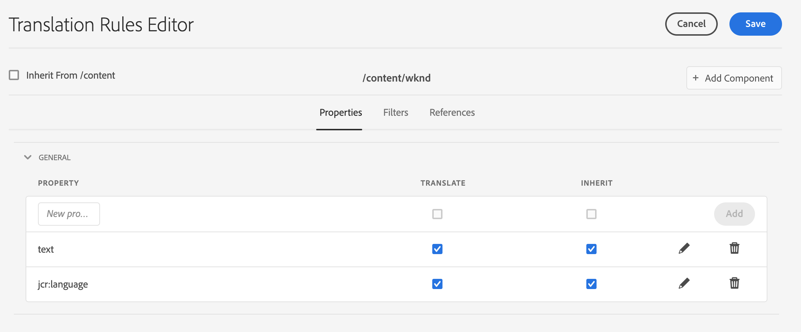

# Te vertalen inhoud identificeren {#identifying-content-to-translate}

De vertaalregels identificeren de inhoud om voor pagina&#39;s, componenten, en activa te vertalen die in, of van, vertaalprojecten inbegrepen zijn. Wanneer een pagina of element wordt vertaald, extraheert AEM deze inhoud zodat deze naar de vertaalservice kan worden verzonden.

>[!TIP]
>
>Als u nog geen ervaring hebt met het vertalen van inhoud, raadpleegt u [Sites Translation Journey,](/help/journey-sites/translation/overview.md) Dit is een geleid pad door uw AEM Sites-inhoud te vertalen met AEM krachtige vertaalhulpmiddelen, ideaal voor mensen zonder AEM of vertaalervaring.

## Inhoudsfragmenten en vertaalregels {#content-fragments}

De in dit document beschreven vertaalregels zijn alleen van toepassing op inhoudsfragmenten als de **Velden voor inhoudsmodellen inschakelen voor vertaling** Deze optie is niet geactiveerd op het tabblad [configuratieniveau van het framework voor vertaalintegratie.](integration-framework.md#assets-configuration-properties)

Als de **Velden voor inhoudsmodellen inschakelen voor vertaling** -optie is actief, AEM gebruikt de optie **Vertaalbaar** veld op [Modellen van inhoudsfragmenten](/help/sites-cloud/administering/content-fragments/content-fragment-models.md#properties) om te bepalen of het veld moet worden vertaald, worden automatisch vertaalregels vastgesteld. Deze optie vervangt de vertaalregels die u hebt gemaakt en vereist geen interventie of extra stappen.

Als u vertaalregels wilt gebruiken voor het vertalen van uw Content Fragments, **Velden voor inhoudsmodellen inschakelen voor vertaling** Deze optie in de configuratie van het vertaalintegratieframework moet worden uitgeschakeld en u moet de onderstaande stappen volgen om uw regels te maken.

## Overzicht {#overview}

Pagina&#39;s en elementen worden weergegeven als knooppunten in de JCR-opslagplaats. De inhoud die wordt geëxtraheerd, is een of meer eigenschapwaarden van de knooppunten. De vertaalregels identificeren de eigenschappen die de inhoud bevatten die moet worden geëxtraheerd.

De omzettingsregels worden uitgedrukt in het formaat van XML en in deze mogelijke plaatsen opgeslagen:

* `/libs/settings/translation/rules/translation_rules.xml`
* `/apps/settings/translation/rules/translation_rules.xml`
* `/conf/global/settings/translation/rules/translation_rules.xml`

Het bestand is van toepassing op alle vertaalprojecten.

De regels omvatten de volgende informatie:

* Het pad van het knooppunt waarop de regel van toepassing is
   * De regel is ook op de nakomelingen van de knoop van toepassing.
* De namen van de knoopeigenschappen die de te vertalen inhoud bevatten
   * Het bezit kan voor een specifiek middeltype of voor alle middeltypes specifiek zijn.

U kunt bijvoorbeeld een regel maken die de inhoud vertaalt die auteurs aan alle tekstcomponenten op uw pagina&#39;s toevoegen. De regel kan de `/content` en de `text` eigenschap voor de `core/wcm/components/text/v2/text` component.

Er is een [console](#translation-rules-ui) dat is toegevoegd voor het vormen van vertaalregels. De definities in UI zullen het dossier voor u bevolken.

Voor een overzicht van de functies voor het vertalen van inhoud in AEM raadpleegt u [Inhoud vertalen voor meertalige sites](overview.md).

>[!NOTE]
>
>AEM ondersteunt een-op-een-toewijzing tussen typen bronnen en verwijzingskenmerken voor het vertalen van inhoud waarnaar wordt verwezen op een pagina.

## De Syntaxis van de regel voor Pagina&#39;s, Componenten, en Activa {#rule-syntax-for-pages-components-and-assets}

Een regel is een `node` element met een of meer onderliggende elementen `property` elementen en nul of meer onderliggende elementen `node` elementen:

```xml
<node path="content path">
          <property name="property name" [translate="false"]/>
          <node resourceType="component path" >
               <property name="property name" [translate="false"]/>
          </node>
</node>
```

Elk van deze `node` elementen hebben de volgende kenmerken:

* De `path` Het kenmerk bevat het pad naar het hoofdknooppunt van de vertakking waarop de regels van toepassing zijn.
* Onderliggend `property` de elementen identificeren de knoopeigenschappen om voor alle middeltypes te vertalen:
   * De `name` bevat de eigenschapsnaam.
   * De optionele `translate` kenmerk is gelijk aan `false` als de eigenschap niet is vertaald. Standaard is de waarde `true`. Dit kenmerk is handig wanneer u vorige regels overschrijft.
* Onderliggend `node` de elementen identificeren de knoopeigenschappen om voor specifieke middeltypes te vertalen:
   * De `resourceType` Het kenmerk bevat het pad dat wordt omgezet naar de component die het resourcetype implementeert.
   * Onderliggend `property` de elementen identificeren het knoopbezit om te vertalen. Dit knooppunt gebruiken op dezelfde manier als het onderliggende knooppunt `property` elementen voor knoopregels.

De volgende voorbeeldregel veroorzaakt de inhoud van allen `text` eigenschappen die moeten worden vertaald voor alle pagina&#39;s onder de `/content` knooppunt. De regel is effectief voor elke component die inhoud in een `text` eigenschap, zoals de tekstcomponent.

```xml
<node path="/content">
          <property name="text"/>
</node>
```

In het volgende voorbeeld wordt de inhoud van alle `text` en worden ook andere eigenschappen van de afbeeldingscomponent omgezet. Als andere componenten eigenschappen met dezelfde naam hebben, is de regel niet op hen van toepassing.

```xml
<node path="/content">
      <property name="text"/>
      <node resourceType="core/wcm/components/image/v2/image">
         <property name="image/alt"/>
         <property name="image/jcr:description"/>
         <property name="image/jcr:title"/>
      </node>
</node>
```

## Regelsyntaxis voor het uitnemen van elementen van pagina&#39;s  {#rule-syntax-for-extracting-assets-from-pages}

Gebruik de volgende regelsyntaxis om elementen op te nemen die zijn ingesloten in of waarnaar wordt verwezen vanuit componenten:

```xml
<assetNode resourceType="path to component" assetReferenceAttribute="property that stores asset"/>
```

Elk `assetNode` element heeft de volgende kenmerken:

* Eén `resourceType` kenmerk dat gelijk is aan het pad dat naar de component wordt omgezet
* Eén `assetReferenceAttribute` kenmerk dat gelijk is aan de naam van de eigenschap die het element binair (voor ingesloten elementen) of het pad opslaat naar het element waarnaar wordt verwezen

In het volgende voorbeeld worden afbeeldingen uit de afbeeldingscomponent geëxtraheerd:

```xml
<assetNode resourceType="core/wcm/components/image/v2/image" assetReferenceAttribute="fileReference"/>
```

## Regels overschrijven {#overriding-rules}

De `translation_rules.xml` bestand bestaat uit een `nodelist` element met meerdere onderliggende elementen `node` elementen. AEM leest de nodenlijst van boven naar beneden. Wanneer de veelvoudige regels de zelfde knoop richten, wordt de regel die lager in het dossier is gebruikt. De volgende regels veroorzaken bijvoorbeeld alle inhoud in `text` eigenschappen die moeten worden vertaald, met uitzondering van `/content/mysite/en` vertakking van pagina&#39;s:

```xml
<nodelist>
     <node path="/content">
           <property name="text" />
     </node>
     <node path="/content/mysite/en">
          <property name="text" translate="false" />
     </node>
<nodelist>
```

## Filtereigenschappen {#filtering-properties}

U kunt knooppunten met een specifieke eigenschap filteren met een `filter` element.

De volgende regels veroorzaken bijvoorbeeld alle inhoud in `text` te vertalen eigenschappen, behalve de knooppunten die de eigenschap hebben `draft` instellen op `true`.

```xml
<nodelist>
    <node path="/content">
     <filter>
   <node containsProperty="draft" propertyValue="true" />
     </filter>
        <property name="text" />
    </node>
<nodelist>
```

## UI voor omzettingsregels {#translation-rules-ui}

Een console is ook beschikbaar voor het vormen van vertaalregels.

Toegang tot dit bestand:

1. Navigeren naar **Gereedschappen** en vervolgens **Algemeen**.

1. Selecteren **Omzetconfiguratie**.

In de interface met vertaalregels kunt u:

1. **Context toevoegen**, waarmee u een pad kunt toevoegen.

   

1. Gebruik de padbrowser om de vereiste context te selecteren en selecteer de **Bevestigen** op te slaan.

   

1. Vervolgens moet u de context selecteren en vervolgens op **Bewerken**. Hiermee opent u de Editor voor vertaalregels.

   

Er zijn vier attributen die u via UI kunt veranderen:

* `isDeep`
* `inherit`
* `translate`
* `updateDestinationLanguage`

### isDeep {#isdeep}

**`isDeep`**  is van toepassing op knooppuntfilters en is standaard waar. Het controleert of de knoop (of zijn voorouders) die bezit met de gespecificeerde bezitswaarde in de filter bevat. Indien false, wordt alleen het huidige knooppunt gecontroleerd.

Bijvoorbeeld, worden de kindknopen toegevoegd aan een vertaalbaan zelfs wanneer de ouderknoop het bezit heeft `draftOnly` is ingesteld op true om concepten te markeren. hier `isDeep` komt in spel en controleert als de ouderknopen bezit hebben `draftOnly` als true en sluit die onderliggende knooppunten uit.

In de redacteur, kunt u controleren/uncheck **Is diep** in de **Filters** tab.


Hier volgt een voorbeeld van de resulterende XML wanneer **Is diep** is uitgeschakeld in de gebruikersinterface:

```xml
 <filter>
    <node containsProperty="draftOnly" isDeep="false" propertyValue="true"/>
</filter>
```

### erven {#inherit}

**`inherit`** is van toepassing op eigenschappen. Standaard wordt elke eigenschap overgeërfd, maar als u wilt dat een eigenschap niet door het onderliggende domein wordt overgeërfd, kunt u deze eigenschap als onwaar markeren, zodat deze alleen op dat specifieke knooppunt wordt toegepast.

In de UI kunt u controleren/uncheck **Overnemen** in de **Eigenschappen** tab.

### vertalen {#translate}

**`translate`** wordt gebruikt om eenvoudig te specificeren of om een bezit al dan niet te vertalen.

In de UI kunt u controleren/uncheck **Vertalen** in de **Eigenschappen** tab.

### updateDestinationLanguage {#updatedestinationlanguage}

**`updateDestinationLanguage`** wordt gebruikt voor eigenschappen die geen tekst maar taalcodes hebben, bijvoorbeeld `jcr:language`. De gebruiker vertaalt geen tekst maar de taallandinstelling van bron tot doel. Dergelijke eigenschappen worden niet verzonden voor vertaling.

In de UI kunt u controleren/uncheck **Vertalen** in de **Eigenschappen** om deze waarde te wijzigen, maar voor de specifieke eigenschappen die taalcodes als waarde hebben.

Om het verschil tussen `updateDestinationLanguage` en `translate`Hier is een eenvoudig voorbeeld van een context met slechts twee regels:



Het resultaat in de xml ziet er als volgt uit:

```xml
<property inherit="true" name="text" translate="true" updateDestinationLanguage="false"/>
<property inherit="true" name="jcr:language" translate="false" updateDestinationLanguage="true"/>
```

## Het bestand Regels handmatig bewerken {#editing-the-rules-file-manually}

De `translation_rules.xml` Het bestand dat met AEM wordt geïnstalleerd, bevat een standaardset vertaalregels. U kunt het bestand bewerken ter ondersteuning van de vereisten van uw vertaalprojecten. U kunt bijvoorbeeld regels toevoegen zodat de inhoud van uw aangepaste componenten wordt vertaald.

Als u de `translation_rules.xml` een reservekopie in een inhoudspakket bewaren. Als u bepaalde AEM opnieuw installeert, kan de huidige `translation_rules.xml` samen met het origineel. Om uw regels in deze situatie te herstellen, kunt u het pakket installeren dat uw reservekopie bevat.

>[!NOTE]
>
>Nadat u het inhoudspakket hebt gemaakt, moet u het pakket elke keer opnieuw samenstellen wanneer u het bestand bewerkt.

## Voorbeeld omzettingsregels-bestand {#example-translation-rules-file}

```xml
<?xml version="1.0" encoding="UTF-8"?><nodelist>
  <node path="/content">
    <property name="addLabel"/>
    <property name="allowedResponses"/>
    <property name="alt"/>
    <property name="attachFileLabel"/>
    <property name="benefits"/>
    <property name="buttonLabel"/>
    <property name="chartAlt"/>
    <property name="confirmationMessageToggle"/>
    <property name="confirmationMessageUntoggle"/>
    <property name="constraintMessage"/>
    <property name="contentLabel"/>
    <property name="denyText"/>
    <property name="detailDescription"/>
    <property name="emptyText"/>
    <property name="helpMessage"/>
    <property name="image/alt"/>
    <property name="image/jcr:description"/>
    <property name="image/jcr:title"/>
    <property name="jcr:description"/>
    <property name="jcr:title"/>
    <property name="heading"/>
    <property name="label"/>
    <property name="main"/>
    <property name="listLabel"/>
    <property name="moreText"/>
    <property name="pageTitle"/>
    <property name="placeholder"/>
    <property name="requiredMessage"/>
    <property name="resetTitle"/>
    <property name="subjectLabel"/>
    <property name="subtitle"/>
    <property name="tableData"/>
    <property name="text"/>
    <property name="title"/>
    <property name="navTitle"/>
    <property name="titleDivContent"/>
    <property name="toggleLabel"/>
    <property name="transitionLabel"/>
    <property name="untoggleLabel"/>
    <property name="name"/>
    <property name="occupations"/>
    <property name="greetingLabel"/>
    <property name="signInLabel"/>
    <property name="signOutLabel"/>
    <property name="pretitle"/>
    <property name="cq:panelTitle"/>
    <property name="actionText"/>
    <property name="cq:language" updateDestinationLanguage="true"/>
    <node pathContains="/cq:annotations">
      <property name="text" translate="false"/>
    </node>
    <node path="/content/wknd"/>
  </node>
  <node path="/content/forms">
    <property name="text" translate="false"/>
  </node>
  <node path="/content/dam">
    <property name="dc:description"/>
    <property name="dc:rights"/>
    <property name="dc:subject"/>
    <property name="dc:title"/>
    <property name="defaultContent"/>
    <property name="jcr:description"/>
    <property name="jcr:title"/>
    <property name="pdf:Title"/>
    <property name="xmpRights:UsageTerms"/>
    <property name="main"/>
    <property name="adventureActivity"/>
    <property name="adventureDescription"/>
    <property name="adventureDifficulty"/>
    <property name="adventureGearList"/>
    <property name="adventureGroupSize"/>
    <property name="adventureItinerary"/>
    <property name="adventurePrice"/>
    <property name="adventureTitle"/>
    <property name="adventureTripLength"/>
    <property name="adventureType"/>
    <node pathContains="/jcr:content/metadata/predictedTags">
      <property name="name"/>
    </node>
  </node>
  <assetNode assetReferenceAttribute="fragmentPath" resourceType="cq/experience-fragments/editor/components/experiencefragment"/>
  <assetNode assetReferenceAttribute="fragmentVariationPath" resourceType="core/wcm/components/experiencefragment/v1/experiencefragment"/>
  <assetNode assetReferenceAttribute="fileReference" resourceType="dam/cfm/components/contentfragment"/>
  <assetNode resourceType="docs/components/download"/>
  <assetNode resourceType="docs/components/image"/>
  <assetNode assetReferenceAttribute="fileReference" resourceType="foundation/components/image"/>
  <assetNode assetReferenceAttribute="asset" resourceType="foundation/components/video"/>
  <assetNode assetReferenceAttribute="fileReference" resourceType="foundation/components/download"/>
  <assetNode assetReferenceAttribute="fileReference" resourceType="core/wcm/components/download/v1/download"/>
  <assetNode assetReferenceAttribute="fileReference" resourceType="wcm/foundation/components/image"/>
  <assetNode assetReferenceAttribute="fragmentPath" resourceType="core/wcm/components/contentfragment/v1/contentfragment"/>
  <assetNode assetReferenceAttribute="fileReference" resourceType="core/wcm/components/image/v2/image"/>
</nodelist>
```
