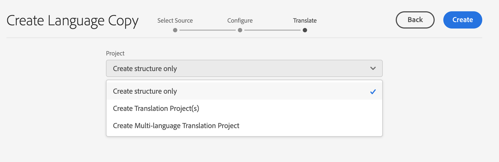

# Wizard Taalkopie {#language-copy-wizard}

De wizard Taalkopie is een begeleide ervaring voor het maken en van instrumenten voorzien voor de structuur van meertalige inhoud. De wizard maakt het maken van een taalkopie eenvoudig en snel.

>[!NOTE]
>
>De gebruiker moet lid zijn van de `project-administrators` groep om een taalexemplaar van een plaats tot stand te brengen.

De wizard openen:

1. Selecteer een pagina in de siteconsole en tik op **Maken** of selecteer **Taalkopie**.

   

1. De tovenaar opent aan **Uitgezochte Bron** stap die u toestaat om pagina&#39;s toe te voegen/te verwijderen. U kunt ook subpagina&#39;s opnemen of uitsluiten. Selecteer de pagina&#39;s die u wilt opnemen en tik op **Volgende**.

   

1. Met de stap **Configureren** van de wizard kunt u talen toevoegen of verwijderen en een vertaalmethode selecteren. Tik of klik op **Volgende**.

   

   >[!NOTE]
   >
   >Standaard is er slechts één vertaalinstelling. Om andere montages te kunnen selecteren, moet u wolkenconfiguraties eerst vormen. Zie [Het vormen van het Kader van de Integratie van de Vertaling](integration-framework.md).

1. In de stap **Translate** van de wizard kunt u kiezen tussen het maken van alleen de structuur, het maken van een nieuw vertaalproject of het toevoegen aan een bestaand vertaalproject.

   >[!NOTE]
   >
   >Als u in de vorige stap meerdere talen hebt geselecteerd, worden er meerdere vertaalprojecten gemaakt.

   

1. De **Create** knoop beëindigt de tovenaar. Tik of klik op **Done** om de wizard te sluiten of **Open** om het resulterende vertaalproject weer te geven.

   
