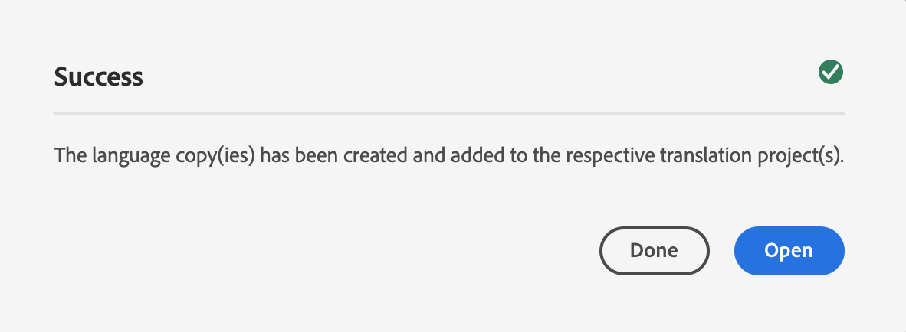

# Wizard Taalkopie {#language-copy-wizard}

De wizard Taalkopie is een begeleide ervaring voor het maken en van instrumenten voorzien voor de structuur van meertalige inhoud. De wizard maakt het maken van een taalkopie eenvoudig en snel.

>[!TIP]
>
>Als u nog geen ervaring hebt met het vertalen van inhoud, raadpleegt u [Sites Translation Journey,](/help/journey-sites/translation/overview.md) Dit is een geleid pad door uw AEM Sites-inhoud te vertalen met de krachtige vertaalgereedschappen van AEM, ideaal voor mensen zonder AEM of vertaalervaring.

>[!NOTE]
>
>De gebruiker moet lid zijn van de `project-administrators` een taalkopie van een site maken.

De wizard openen:

1. Selecteer een pagina in de siteconsole en selecteer **Maken** en selecteert u **Taalkopie**.

   

1. De wizard wordt geopend voor de **Bron selecteren** stap waarmee u pagina&#39;s kunt toevoegen/verwijderen. U kunt ook subpagina&#39;s opnemen of uitsluiten. Selecteer de pagina&#39;s die u wilt opnemen en selecteer **Volgende**.

   

1. De **Configureren** Met de stap van de wizard kunt u talen toevoegen of verwijderen en een vertaalmethode selecteren. Selecteren **Volgende**.

   

   >[!NOTE]
   >
   >Standaard is er slechts één vertaalinstelling. Om andere montages te kunnen selecteren, moet u wolkenconfiguraties eerst vormen. Zie [Het Kader voor de Integratie van de Vertaling vormen](integration-framework.md).

1. In de **Vertalen** kunt u kiezen tussen het maken van alleen de structuur, het maken van een vertaalproject of het toevoegen aan een bestaand vertaalproject.

   >[!NOTE]
   >
   >Als u in de vorige stap meerdere talen hebt geselecteerd, worden er meerdere vertaalprojecten gemaakt.

   

1. De **Maken** de knop beëindigt de wizard. Selecteren **Gereed** om de wizard of **Openen** om het resulterende vertaalproject te bekijken.

   
