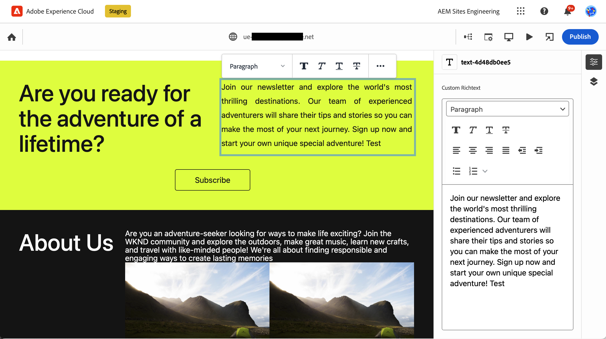
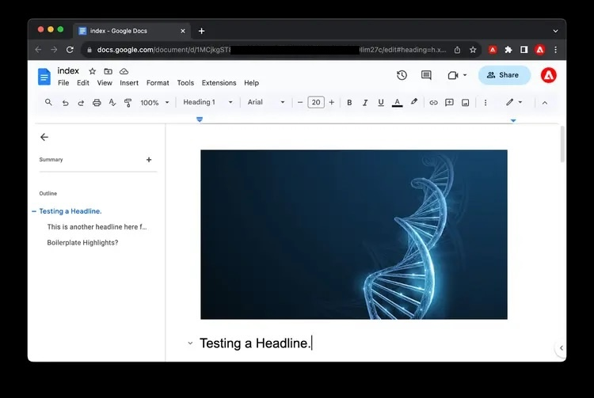

# Methoden voor het schrijven van inhoud in AEM {#authoring-methods}

Leer de verschillende manieren waarop u inhoud in AEM kunt ontwerpen, hoe deze verschillen en wanneer u de ene methode op de andere kunt gebruiken.

## Flexibiliteit in AEM-authoring {#authoring-flexibility}

AEM as a Cloud Service biedt verschillende editors om verschillende typen inhoud te bewerken en biedt ondersteuning voor verschillende gebruiksgevallen bij het ontwerpen.

* [ WYSIWYG Authoring using the Universal Editor ](#universal-editor) - De Universal Editor is een moderne UI die u toestaat om AEM-inhoud op een content-agnostische manier te schrijven en is beschikbaar voor AEM-projecten die Edge Delivery Services gebruiken.
* [ het Authoring van WYSIWYG die de Redacteur van de Pagina ](#page-editor) gebruikt - de Redacteur van de Pagina is de klassieke redacteur voor auteursinhoud in AEM, die voor duizenden op duizenden websites wordt geprobeerd en wordt vertrouwd.
* [ op document-Gebaseerde Authoring ](#document-based) - als u de diensten van Edge Delivery gebruikt, kunt u verkiezen om uw inhoud als conventionele documenten zoals Microsoft Word of Google Docs volledig buiten de consoles van AEM te schrijven.
* [ de Redacteur van het Fragment van de Inhoud van AEM ](#cf-editor) - dit is de redacteur van keus voor het creëren van hoofdloze inhoud.

Vanwege de geïntegreerde en schaalbare aard van AEM kunnen deze methoden uitsluitend of in combinatie met elkaar worden gebruikt, afhankelijk van de behoeften van uw project.

Raadpleeg uw systeembeheerder of projectmanager als u onzeker bent welke auteursopties aan u beschikbaar zijn of als u nieuwe opties voor het ontwerpen van uw inhoud wilt onderzoeken.

## WYSIWYG Authoring met de Universal Editor {#universal-editor}

De Universele Redacteur is een moderne UI die u toestaat om de inhoud van AEM op een tevreden-agnostische manier te schrijven en is de eerste keus voor de projecten van AEM leveraging Edge Delivery Services.

De Universal Editor is toegankelijk via de Sites-console in AEM, maar biedt de auteur de kracht en de flexibiliteit om inhoud niet alleen aan uw AEM-inhoud te besteden, maar ook correct geïnstrueerde externe inhoud.

Om meer over de Universele Redacteur te leren, te zien gelieve het document [ Authoring Inhoud met de Universele Redacteur ](/help/sites-cloud/authoring/universal-editor/authoring.md).

## WYSIWYG Authoring met de paginaeditor {#page-editor}

Dit is de klassieke editor voor het ontwerpen van inhoud in traditionele AEM-projecten, die duizenden op duizenden websites zijn uitgeprobeerd en vertrouwd.

De AEM-pagina-editor biedt een geïntegreerde omgeving voor het ontwerpen van inhoud met behulp van een &#39;what-you-see-is-what-you-get&#39;-interface (WYSIWYG). Met vooraf gedefinieerde componenten voor slepen en neerzetten kunt u de pagina samenstellen en inhoud op plaats bewerken.

Om meer over de de paginageditor van AEM te leren, te zien gelieve het document [ de Redacteur van de Pagina van AEM ](/help/sites-cloud/authoring/page-editor/introduction.md).

## Authoring op basis van documenten  {#document-based}

Als u de diensten van Edge Delivery gebruikt, kunt u verkiezen om uw inhoud als conventionele documenten zoals Microsoft Word of Google Docs volledig buiten de [ AEM **console van Plaatsen** ](/help/sites-cloud/authoring/sites-console/introduction.md) te schrijven.

Met op documenten gebaseerde authoring kunnen auteurs de gereedschappen gebruiken die ze al kennen en profiteren nog steeds van de snelheid en prestaties van AEM Edge Delivery Services om hun inhoud te publiceren. Voor schrijven op basis van documenten is geen gebruik van de AEM-console vereist.

Meer over op document-gebaseerde creatie leren, zie [ Authoring en het Publiceren Inhoud ](/help/edge/docs/authoring.md).

## AEM Content Fragment Editor {#cf-editor}

De AEM Content Fragment-editor is de editor waarin u inhoud zonder kop kunt maken.

De AEM Content Fragment-editor biedt een duidelijke interface voor het maken en beheren van gestructureerde inhoud, ideaal voor levering zonder kop.

Meer over de redacteur van het Fragment van de Inhoud van AEM leren, gelieve de documenten [ te zien die de Fragmenten van de Inhoud ](/help/sites-cloud/administering/content-fragments/managing.md) leiden en [ Begeleidende de Fragmenten van de Inhoud ](/help/sites-cloud/administering/content-fragments/managing.md).

>[!NOTE]
>
>De *nieuwe* die redacteur in deze sectie wordt benadrukt is niet beschikbaar wanneer het ontwikkelen plaatselijk voor AEM as a Cloud Service.
>
>De [*originele* redacteur van het Fragment van de Inhoud ](/help/assets/content-fragments/content-fragments-variations.md) is ook beschikbaar.
