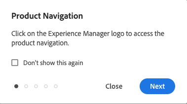
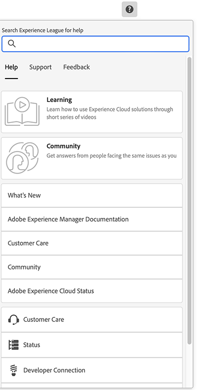

# Basisverwerking {#basic-handling}

Dit document is ontworpen om een overzicht te geven van de basisafhandeling bij het gebruik van de AEM-auteursomgeving.

>[!TIP]
>
>Sneltoetsen zijn beschikbaar in alle AEM. Met name wanneer [het gebruiken van de plaatsenconsole](/help/sites-cloud/authoring/sites-console/keyboard-shortcuts.md) en [de paginaeditor](/help/sites-cloud/authoring/page-editor/keyboard-shortcuts.md).

{{edge-delivery-authoring}}

## Een interface met aanraakbediening {#a-touch-enabled-ui}

AEM gebruikersinterface is ingeschakeld voor aanraking. Met een interface met aanraakbediening kunt u aanrakingen gebruiken om met de software te communiceren via bewegingen zoals tikken, tikken en vegen. Omdat de AEM-interface aanraakbediening is, kunt u de aanraakbewegingen gebruiken op uw aanraakapparaten, zoals uw mobiele telefoon of tablet. De muishandelingen op een traditioneel desktopapparaat zijn echter ook beschikbaar, zodat u op een flexibele manier uw inhoud kunt ontwerpen.

## Eerste stappen {#first-steps}

Onmiddellijk nadat u zich hebt aangemeld, arriveert u op de [Navigatievenster](#navigation-panel). Als u een van de opties selecteert, wordt de desbetreffende console geopend.

Voor een goed inzicht in het basisgebruik van AEM is dit document gebaseerd op de **Sites** console. Selecteren op **Sites** aan de slag.

## Productnavigatie {#product-navigation}

Wanneer een gebruiker eerst tot een console toegang heeft, wordt een zelfstudie over productnavigatie gestart. Neem een minuut om door te selecteren om een goed overzicht van de basisbehandeling van AEM te krijgen.

Selecteren **Volgende** om naar de volgende pagina van het overzicht te gaan. Selecteren **Sluiten** of selecteer buiten het overzichtsdialoogvenster om te sluiten.

Het overzicht zal de volgende keer opnieuw beginnen u tot een console toegang hebt tenzij u of alle dia&#39;s bekijkt of de optie controleert **Dit niet meer weergeven**.

## Algemene navigatie {#global-navigation}

U kunt tussen de consoles navigeren met het algemene navigatievenster. Dit wordt teweeggebracht als volledig-schermdrop-down wanneer u selecteert **Adobe Experience Manager** links boven in het scherm.

U kunt het globale navigatievenster sluiten door te klikken of te tikken **Sluiten** om terug te keren naar uw vorige locatie.

Globale navigatie heeft twee deelvensters, weergegeven door pictogrammen aan de linkermarge van het scherm:

* **[Navigatie](#navigation-panel)** - Wordt vertegenwoordigd door een kompas en het standaarddeelvenster wanneer u zich aanmeldt bij AEM
* **[Gereedschappen](#tools-panel)** - Vertegenwoordigd door een hamer

De opties in deze deelvensters worden hieronder beschreven.

### Deelvenster Navigatie {#navigation-panel}

De **Navigatie** paneel:

De titel van het browsertabblad wordt aangepast aan uw locatie wanneer u door de consoles en inhoud navigeert.

Vanuit Navigatie zijn de beschikbare consoles:

| Console | Doel |
|---|---|
| Projecten | De console van Projecten geeft u directe toegang tot uw projecten. [Projecten zijn virtuele dashboards](/help/sites-cloud/authoring/projects/overview.md) die kan worden gebruikt om een team te bouwen. U kunt dat team dan toegang tot middelen, werkschema&#39;s, en taken geven, zo toestaand mensen om aan een gemeenschappelijk doel te werken. |
| Sites | [De Sites-console](/help/sites-cloud/authoring/sites-console/introduction.md) Hiermee kunt u sites maken, weergeven en beheren die op uw AEM worden uitgevoerd. Via deze console kunt u pagina&#39;s maken, bewerken, kopiëren, verplaatsen en verwijderen, workflows starten en pagina&#39;s publiceren. |
| Ervaar fragmenten | An [Ervaar fragment](/help/sites-cloud/authoring/fragments/content-fragments.md) is een stand-alone ervaring die kan worden hergebruikt over kanalen en variaties hebben, die het probleem van het herhaaldelijk kopiëren en het kleven ervaringen of delen van ervaringen bespaart. |
| Assets | Met de middelenconsole kunt u importeren en beheren [digitale elementen, zoals afbeeldingen, video&#39;s, documenten en audiobestanden](/help/assets/overview.md). Deze elementen kunnen vervolgens worden gebruikt door elke site die op dezelfde AEM wordt uitgevoerd. U kunt ook maken en beheren [Inhoudsfragmenten](/help/assets/content-fragments/content-fragments.md) vanaf de middelenconsole. |
| Personalisatie | Deze console biedt een raamwerk van gereedschappen voor [doelgerichte inhoud ontwerpen en persoonlijke ervaringen presenteren](/help/sites-cloud/authoring/personalization/overview.md). |
| Inhoudsfragmenten | [Inhoudsfragmenten](/help/sites-cloud/administering/content-fragments/overview.md) kunt u pagina-onafhankelijke inhoud ontwerpen, maken, beheren en publiceren. Met deze sjablonen kunt u gestructureerde inhoud voorbereiden, klaar voor gebruik op meerdere locaties/via meerdere kanalen, en ideaal voor zowel paginaontwerp als levering zonder kop. |
| Variaties genereren | [Variaties genereren](/help/generative-ai/generate-variations.md) Gebruikt generatieve Intelligentie van de Kunst (AI) om inhoudvariaties tot stand te brengen die op herinneringen worden gebaseerd; deze herinneringen worden of verstrekt door Adobe of gecreeerd, en beheerd, door gebruikers. |

## Deelvenster Gereedschappen {#tools-panel}

De **Gereedschappen** paneel heeft een zijpaneel dat een waaier van categorieën bevat, die groeperen gelijkaardige consoles. De **Gereedschappen** consoles bieden toegang tot verschillende gespecialiseerde gereedschappen en consoles die u helpen uw websites, digitale middelen en andere aspecten van de opslagplaats voor inhoud te beheren.

## De koptekst {#the-header}

De koptekst staat altijd boven aan het scherm. Hoewel de meeste opties in de koptekst ongewijzigd blijven, ongeacht waar u zich in het systeem bevindt, zijn sommige contextspecifiek.

* [Algemene navigatie](#global-navigation) - Selecteer de **Adobe Experience Manager** koppeling om tussen consoles te navigeren.

  

* Feedback

  

* Uw IMS-organisatie - selecteer indien nodig om deze te wijzigen.

* [Oplossingen](https://www.adobe.com/experience-cloud.html) - Selecteer deze optie om toegang te krijgen tot uw andere Adobe-oplossingen.

  

* [Zoeken](/help/sites-cloud/authoring/search.md) - U kunt ook de [sneltoets](/help/sites-cloud/authoring/sites-console/keyboard-shortcuts.md) `/` (forward slash) om het zoeken vanuit elke console aan te roepen.

  

* [Help](#accessing-help)

  

* [Meldingen](/help/sites-cloud/authoring/inbox.md) - Dit pictogram is gemarkeerd met het aantal momenteel toegewezen onvolledige meldingen.

  

* [Gebruikerseigenschappen](/help/sites-cloud/authoring/account-environment.md) - Selecteer deze optie om uw gebruikersinstellingen te wijzigen.

  

## Toegang tot Help {#accessing-help}

Er zijn een aantal beschikbare hulpmiddelen en een paar manieren om tot het toegang te hebben.

* **Werkbalk** - Afhankelijk van uw locatie **Help** het pictogram opent de aangewezen middelen:

  

* **Console** - De eerste keer dat u door het systeem navigeert, [een reeks dia&#39;s introduceert AEM navigatie](#product-navigation).

  

* **Pagina-editor** - De eerste keer dat u een pagina bewerkt, wordt de pagina-editor geïntroduceerd in een reeks dia&#39;s.

  

   * Navigeren in dit overzicht zoals u [overzicht van productnavigatie](#product-navigation) wanneer eerst het openen van om het even welke console.
   * Van de [**Pagina-informatie** menu dat u kunt selecteren **Help**](#accessing-help) om dit op elk moment weer te tonen.

* **Tools Console** - van de **Gereedschappen** console u tot de externe **Bronnen**:

   * **Documentatie** - Bekijk de documentatie van het Web Experience Management
   * **Bronnen voor ontwikkelaars** - Bronnen en downloads voor ontwikkelaars

>[!TIP]
>
>Met de sneltoets hebt u op elk gewenst moment toegang tot een overzicht van de beschikbare sneltoetsen `?` (vraagteken) wanneer in een console.
>
>Raadpleeg de volgende documentatie voor een overzicht van alle sneltoetsen:
>
>* [Sneltoetsen voor het bewerken van pagina&#39;s](/help/sites-cloud/authoring/page-editor/keyboard-shortcuts.md)
>* [Sneltoetsen voor consoles](/help/sites-cloud/authoring/sites-console/keyboard-shortcuts.md)
