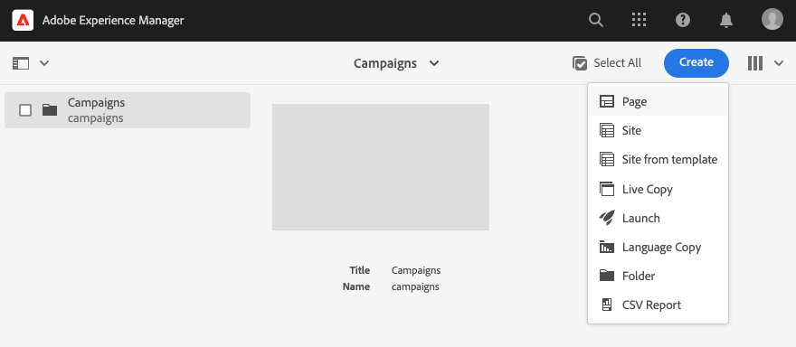
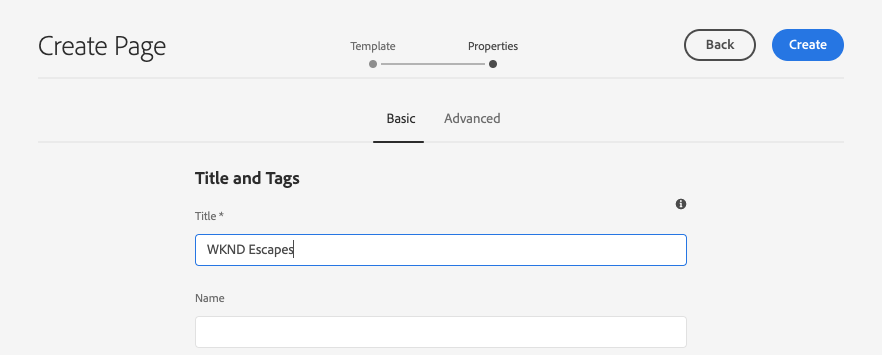
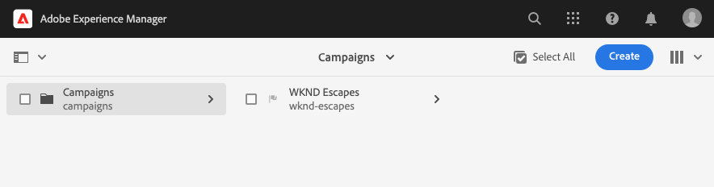
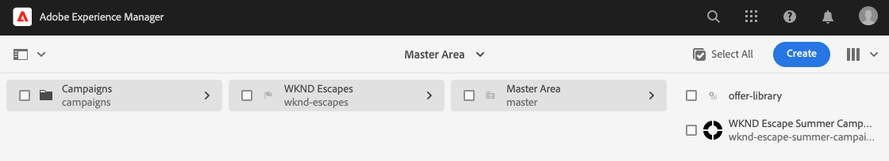
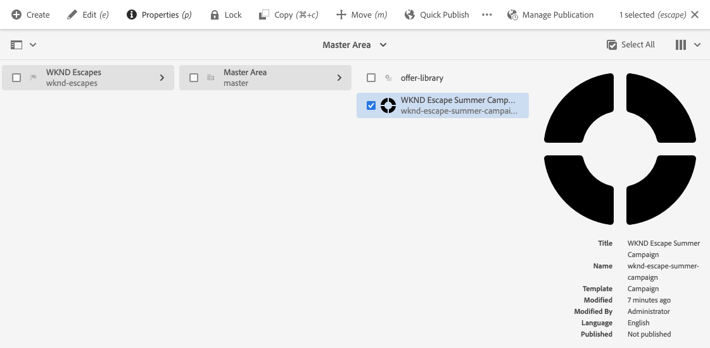
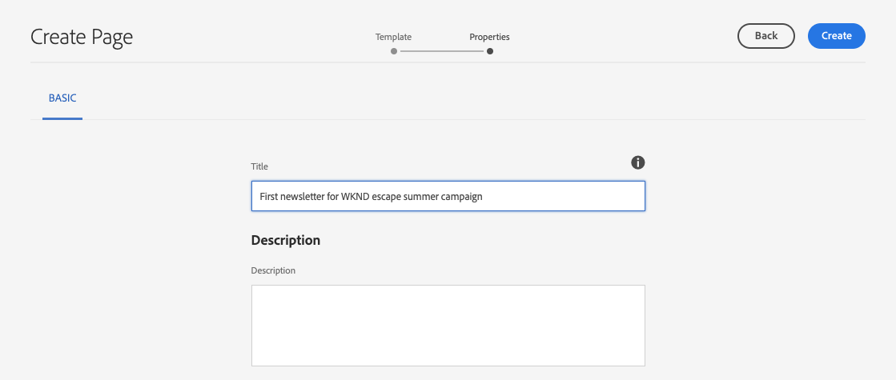
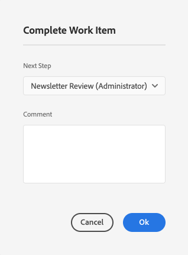
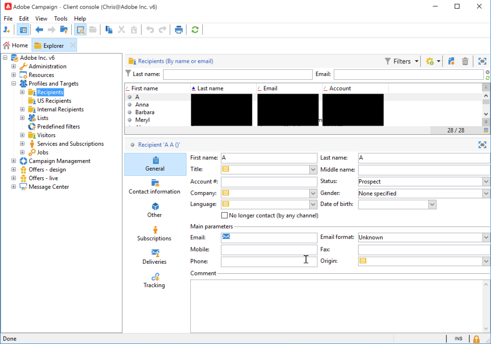

# Campagnenieuwsbrieven maken met AEM {#creating-newsletters}

In dit document leert u hoe u AEM as a Cloud Service kunt gebruiken om nieuwsbrieven te maken die met Adobe Campaign Classic kunnen worden verzonden.

Door de integratie tussen AEM as a Cloud Service en Adobe Campaign Classic te benutten, kunt u uw nieuwsbrieven maken met behulp van AEM krachtige ontwerpgereedschappen. Wanneer u klaar bent om uw nieuwsbrief te verzenden, kunt u het ontvankelijke beheer en de distributiefuncties van Campagne gebruiken om het te verzenden.

## Vereisten {#prerequisites}

Voordat u een nieuwsbrief kunt maken met AEM en deze kunt verzenden met Campagne, moet u eerst [Adobe Campaign Classic en AEM as a Cloud Service integreren.](/help/sites-cloud/integrating/integrating-campaign-classic.md)

## Newsletter-structuur maken {#create-structure}

De inhoud van de nieuwsbrief wordt beheerd in AEM veel als u uw plaatsinhoud zou beheren. U begint met het maken van een &quot;site&quot; die uw inhoud bevat. Binnen deze &quot;site&quot; kunt u uw nieuwsbrieven per merk verzamelen.

1. Meld u aan bij de AEM auteur.

1. Open vanaf de hoofdnavigatiepagina de **Sites** console.

1. In een standaardinstallatie van AEM bestaat **Campagne** map. Selecteer het en klik op de knop **Maken** en vervolgens **Pagina**.

   

1. Selecteren **Merk** als uw sitesjabloon en klik op **Volgende**.

   

1. Voer een **Titel** en klik op **Maken** en vervolgens **Gereed**.

   

U hebt nu een basisstructuur voor de inhoud van uw campagnes.

## Een campagne maken {#create-campaign}

Nu u een basisstructuur voor de inhoud van uw campagne hebt, kunt u de campagne zelf maken. De campagne wordt gebruikt om mogelijk meerdere nieuwsbrieven te organiseren.

1. Gebruiken [kolomweergave](/help/sites-cloud/authoring/getting-started/basic-handling.md#viewing-and-selecting-resources) in de siteconsole, selecteer het merk dat u eerder creeerde (in dit geval, **WKND-scapes**) en selecteer vervolgens **Master gebied**, die automatisch voor u is gemaakt, en klik vervolgens op de knop **Maken** en vervolgens **Pagina**.

   

1. Selecteren **Campagne** als de sjabloon klikt u vervolgens op **Volgende** en **Gereed**.

   

1. Voer een **Titel** voor de campagne en klik vervolgens op **Maken** en **Gereed**.

   

U hebt nu een campagne om uw nieuwsbrieven te creëren.

## Campagneconfiguratie selecteren {#campaign-configuration}

AEM kan meerdere integratieconfiguraties ondersteunen. Voor uw nieuwe campagne, moet u bepalen welke configuraties aan gebruik om uw nieuwsbrief inhoud te verzenden.

1. Gebruiken [kolomweergave](/help/sites-cloud/authoring/getting-started/basic-handling.md#viewing-and-selecting-resources) in de plaatsenconsole, vind de campagne die u eerder creeerde (in dit geval, **WKND Escape Summer Campaign**) en selecteert u het vervolgens met het selectievakje en klikt u op de knop **Eigenschappen** op de werkbalk.

   

1. In de **Eigenschappen** venster, selecteert u de **Cloud Service** om de integratie te bepalen die met deze campagne moet worden gebruikt.

   * Selecteren **Adobe Campaign** van de **Configuraties van Cloud Servicen** vervolgkeuzelijst.
   * Selecteer de gewenste Adobe Campaign-integratieconfiguratie in het menu **Adobe Campaign** vervolgkeuzelijst.
   * Klikken **Opslaan en sluiten**.

   

Uw campagne is nu gekoppeld aan uw Adobe Campaign-integratie. U kunt een nieuwsbrief maken in AEM en verzenden met Adobe Campaign.

## Een nieuwsbrief maken {#create-newsletter}

U maakt en beheert uw nieuwsbrieven onder de structuur van de campagne-inhoud die u al hebt gemaakt en geconfigureerd.

1. Gebruiken [kolomweergave](/help/sites-cloud/authoring/getting-started/basic-handling.md#viewing-and-selecting-resources) in de plaatsenconsole, vind de campagne die u eerder (in dit geval) vormde **WKND Escape Summer Campaign**), selecteert u deze en klikt u op de knop **Maken** en vervolgens **Pagina**.

   

1. Selecteer in de wizard Pagina maken de optie **Adobe Campaign-e-mail (AC 6.1)** sjabloon en klik op **Volgende**.

   

1. Voor de **Eigenschappen** Voer de stap van de wizard in **Titel** voor de nieuwsbrief klikt u op **Maken** en **Openen**.

   

1. Bewerk de pagina met nieuwsbrieven op dezelfde manier als elke andere AEM inhoudspagina om aan uw vereisten te voldoen.

Je hebt nu een nieuwsbrief die je kunt verzenden met Adobe Campaign.

## Uw nieuwsbrief publiceren {#publishing-newsletter}

U moet uw nieuwsbrief publiceren om deze beschikbaar te maken voor Adobe Campaign.

1. Gebruiken [kolomweergave](/help/sites-cloud/authoring/getting-started/basic-handling.md#viewing-and-selecting-resources) vindt u in de siteconsole de nieuwsbrief die u eerder hebt gemaakt (in dit geval: **Eerste nieuwsbrief voor WKND-vluchtzomercampagne**), selecteert u deze en klikt u op de knop **Pagina-informatie** knop linksboven en klik op **Pagina publiceren**.

1. Selecteer de configuratie(s) waarvoor de pagina moet worden gepubliceerd en klik op **Publiceren**.

   

De pagina met nieuwsbrieven wordt nu gepubliceerd naar het AEM publicatieexemplaar en is zichtbaar in Adobe Campaign Classic. Om het binnen Adobe Campaign te kunnen selecteren, moet het worden goedgekeurd.

1. Klik op de knop **Pagina-informatie** nogmaals voor de nieuwsbrief en selecteer **Workflow starten**.

1. Selecteren **Goedkeuren voor Adobe Campaign** als het workflowmodel (optioneel met een beschrijving) en klik op de knop **Workflow starten** knop.

   

1. Een banner wordt boven aan de pagina-editor voor nieuwsbrieven weergegeven met de volgende stappen in het goedkeuringsproces. Klikken **Voltooid**.

   

1. In de **Voltooid het werkitem** dialoogvenster, selecteren **Nieuwsbrief (beheerder)** in de **Volgende stap** vervolgkeuzelijst en klik op de knop **OK** knop.

   

1. Klik in de banner die boven aan de pagina-editor voor nieuwsbrieven wordt weergegeven nogmaals op **Voltooid**.

1. In de **Voltooid het werkitem** dialoogvenster, selecteren **Goedkeuring van nieuwsbrief** in de **Volgende stap** vervolgkeuzelijst en klik op de knop **OK** knop.

   

1. Wanneer het dialoogvenster wordt gesloten, verdwijnt de banner die boven aan de pagina-editor voor nieuwsbrieven werd weergegeven omdat de goedkeuringswerkstroom is voltooid.

De nieuwsbrief wordt nu gepubliceerd in AEM en goedgekeurd voor gebruik in Adobe Campaign.

>[!TIP]
>
>De beschreven workflowstappen worden hier vereenvoudigd om het proces te illustreren. In een normale werkstroom zijn het maken van de nieuwsbrief en het goedkeuren van de nieuwsbrief normaal gesproken verschillende rollen
>
>Zie het document [Werken met workflows](/help/sites-cloud/authoring/workflows/overview.md) voor meer informatie over het gebruik van workflows.

## Een ontvanger maken {#creating-recipient}

Als u de nieuwsbrief wilt verzenden die u in AEM hebt gemaakt, moet u eerst de ontvangers definiëren in Adobe Campaign Classic.

1. Meld u aan bij Adobe Campaign Classic met de clientconsole.

1. Selecteren **Gereedschappen** -> **Verkenner** in de menubalk.

1. Navigeer in de verkenner naar de **Profielen en doelen** -> **Ontvangers** knooppunt.

   

1. Klikken op **Nieuw** in de werkbalk en de gegevens van de ontvanger vermelden.

   * Voornaam
   * Achternaam
   * E-mailadres

1. Klikken **Opslaan**.

U hebt nu een ontvanger aan wie u uw nieuwsbrief kunt leveren gebruikend Adobe Campaign Classic.

## Een e-maillevering maken {#create-delivery}

De laatste stap bestaat uit het verzenden van uw nieuwsbrief die u in AEM hebt gemaakt naar de ontvanger die u in Adobe Campaign Classic hebt toegevoegd.

1. Meld u aan bij Adobe Campaign Classic met de clientconsole.

1. Selecteren **Gereedschappen** -> **Verkenner** in de menubalk.

1. Navigeer in de verkenner naar de **Campaign Management** -> **Leveringen** knoop en klik **Nieuw**.

   

1. In de **Aflevering** dialoogvenster, selecteren **E-maillevering met AEM inhoud** als de **Afleveringssjabloon** in de vervolgkeuzelijst en klik op **Doorgaan**.

   

1. In de **E-mailparameters** klikt u op de **Van** en voer de informatie van de afzender in en klik op **OK**.

   * Adres van afzender
   * Van veld

   

1. In de **E-mailparameters** klikt u op de **Naar** de koppeling openen **Doel selecteren** en klik vervolgens op **Toevoegen**.

   

1. In de **Doelelement selecteren** dialoogvenster, selecteren **Een ontvanger** en klik op **Volgende**.

   

1. Selecteer met de filters de ontvanger die u wilt gebruiken [eerder gemaakt](#creating-recipient) en klik op **Voltooien**.

   

1. Terug in de **Doel selecteren** dialoogvenster, klikt u op **OK**.

1. Klik in het leveringsvenster op **Synchroniseren**.

   

1. In de **Synchroniseren met AEM inhoud** selecteert u de eerder gemaakte nieuwsbrief in de lijst en klikt u op **OK**.

1. De e-mailinhoud van Adobe Campaign wordt gesynchroniseerd met de inhoud van de nieuwsbrief die u in AEM hebt gemaakt.

   * Klikken **Inhoud vernieuwen** als de inhoud niet automatisch wordt geladen.

1. Klikken **Verzenden** om de e-mail te verzenden.

1. In de **Verzenden naar hoofdleveringsdoel** dialoogvenster, selecteren **Zo snel mogelijk leveren** en klik vervolgens op **Analyseren**.

   

1. De analysestap bouwt de levering voort, die de inhoud met de ontvangers combineert. Nadat de levering is gemaakt, klikt u op **Levering bevestigen** naar het verzenden van de e-mail. Klikken **Ja** ter bevestiging.

1. De levering is gestart. Klikken **Sluiten**.

   

1. Klikken **Opslaan** om de levering op te slaan.

Uw nieuwsbrief is verzonden!

>[!TIP]
>
>In dit voorbeeld ziet u een vereenvoudigde verzending van een nieuwsbrief naar één ontvanger. Natuurlijk zou een normale levering veel verschillende ontvangers bevatten, die Adobe Campaign eenvoudig te beheren maakt. Raadpleeg de [Adobe Campaign Classic-documentatie](https://experienceleague.adobe.com/docs/campaign-classic.html) voor meer details over levering en ontvangend beheer.
