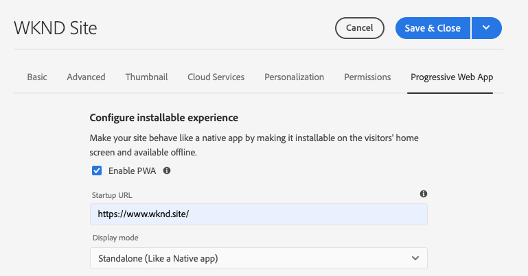

# Progressieve Web App-functies inschakelen {#enabling-pwa}

Dankzij een eenvoudige configuratie kan een auteur van inhoud nu functies (PWA) voor progressieve webtoepassingen inschakelen voor ervaringen die zijn gemaakt in AEM Sites.

>[!CAUTION]
>
>Dit is een geavanceerde functie die het volgende vereist:
>
>* Kennis van PWA
>* Kennis van uw site en inhoudsstructuur
>* Begrip van cachestrategieën
>* Ondersteuning van uw ontwikkelingsteam

>
>
Voordat u deze functie gebruikt, wordt u aangeraden dit met uw ontwikkelingsteam te bespreken om de beste manier te definiëren om deze voor uw project te gebruiken.

## Inleiding {#introduction}

[Met progressieve webapps (PWA)](https://developer.mozilla.org/en-US/docs/Web/Progressive_web_apps) kunnen websites op een overweldigende manier op een app lijken, omdat ze lokaal op de computer van een gebruiker kunnen worden opgeslagen en offline toegankelijk zijn. Een gebruiker kan onderweg door een site bladeren, zelfs als hij een internetverbinding verliest. PWA maken naadloze ervaringen mogelijk, zelfs als het netwerk verloren of instabiel is.

In plaats van dat de site opnieuw moet worden gecodeerd, kan een auteur van de inhoud PWA-eigenschappen configureren als een extra tabblad in de [pagina-eigenschappen](/help/sites-cloud/authoring/fundamentals/page-properties.md) van een site.

* Wanneer deze configuratie wordt opgeslagen of gepubliceerd, wordt een gebeurtenishandler geactiveerd die de [manifestbestanden](https://developer.mozilla.org/en-US/docs/Web/Manifest) en [serviceworker](https://developer.mozilla.org/en-US/docs/Web/API/Service_Worker_API) schrijft die PWA-functies op de site inschakelen.
* De manifest en de dienstarbeider worden opgeslagen in [context bewuste configuratie](https://experienceleague.adobe.com/docs/experience-manager-core-components/using/developing/context-aware-configs.html) van toepassing op de plaats. Er worden ook segmenttoewijzingen bijgehouden om ervoor te zorgen dat de serviceworker wordt aangeboden vanuit de hoofdmap van de toepassing, zodat inhoud die buiten de app valt, kan worden vernieuwd en offline mogelijkheden worden toegestaan.

Met PWA beschikt de gebruiker over een lokale kopie van de site, zodat hij zelfs zonder internetverbinding een app-achtige ervaring heeft.

>[!NOTE]
>
>Progressieve webtoepassingen zijn een technologie die zich ontwikkelt en ondersteuning voor de installatie van lokale apps en andere functies [is afhankelijk van de browser die u gebruikt.](https://developer.mozilla.org/en-US/docs/Web/Progressive_web_apps/Installable_PWAs#Summary)

## Vereisten {#prerequisites}

Als u PWA-functies voor uw site wilt gebruiken, hebt u twee vereisten voor uw projectomgeving:

1. [Pas de ](#adjust-components) componenten aan om deze functie in te schakelen
1. [Pas de ](#adjust-dispatcher) verzendregels aan om de vereiste bestanden beschikbaar te maken

Dit zijn technische stappen die de auteur met het ontwikkelingsteam zal moeten coördineren. Deze stappen zijn slechts eenmaal per site vereist.

### Uw componenten {#adjust-components} aanpassen

Uw componenten moeten [manifestdossiers](https://developer.mozilla.org/en-US/docs/Web/Manifest) en [de dienstarbeider,](https://developer.mozilla.org/en-US/docs/Web/API/Service_Worker_API) omvatten die de eigenschappen van PWA steunen.

Hiervoor moet de ontwikkelaar de volgende koppeling toevoegen aan het `customheaderlibs.html`-bestand van uw paginacomponent.

```xml
<link rel="manifest" href="/content/<projectName>/manifest.webmanifest" crossorigin="use-credentials"/>
```

De ontwikkelaar moet ook de volgende koppeling toevoegen aan het `customfooterlibs.html`-bestand van uw paginacomponent.

```xml
<script>
        // Check that service workers are supported
        if ('serviceWorker' in navigator) {
            // Use the window load event to make sure the page load performs well
            window.addEventListener('load', () => {
                let serviceWorker = '/<projectName>sw.js';
                navigator.serviceWorker.register(serviceWorker);
            });
        }
</script>
```

>[!NOTE]
>
>In toekomstige versies van [Core Components](https://experienceleague.adobe.com/docs/experience-manager-core-components/using/introduction.html) worden deze functies automatisch opgenomen. Als u echter aangepaste componenten gebruikt in plaats van de Core Components, zijn deze aanpassingen altijd vereist.

### Uw Dispatcher {#adjust-dispatcher} aanpassen

De functie PWA genereert en gebruikt `/content/<sitename>/manifest.webmanifest` bestanden. Door gebrek, [verzender](/help/implementing/dispatcher/overview.md) stelt dergelijke dossiers niet bloot. Om deze dossiers bloot te stellen, moet de ontwikkelaar de volgende configuratie aan uw plaatsproject toevoegen.

```text
File location: [project directory]/dispatcher/src/conf.dispatcher.d/filters/filters.any >

# Allow webmanifest files
/0102 { /type "allow" /extension "webmanifest" /path "/content/*/manifest" }
```

>[!NOTE]
>
>Toekomstige versies van [AEM Project Archetype](https://experienceleague.adobe.com/docs/experience-manager-core-components/using/developing/archetype/overview.html?lang=en#developing) zullen deze configuratie omvatten.

## PWA inschakelen voor uw site {#enabling-pwa-for-your-site}

Als aan [de voorwaarden](#prerequisites) is voldaan, is het voor een inhoudsontwerper heel eenvoudig om PWA-functies voor een site in te schakelen. Hieronder volgt een basisoverzicht van hoe u dit kunt doen. Afzonderlijke opties worden beschreven in sectie [Gedetailleerde opties.](#detailed-options)

1. Meld u aan bij AEM.
1. Tik of klik in het hoofdmenu op **Navigatie** -> **Sites**.
1. Selecteer uw siteproject en tik of klik op [**Eigenschappen**](/help/sites-cloud/authoring/fundamentals/page-properties.md) of gebruik de sneltoets `p`.
1. Selecteer het **Progressieve lusje van het Web App** en vorm de toepasselijke eigenschappen. U wilt minimaal:
   1. Selecteer de optie **PWA inschakelen**.
   1. Definieer de **URL voor opstarten**.

      

   1. Upload een pictogram van 512 x 512 png naar de DAM en verwijs naar dat pictogram voor de app.

      

   1. Vorm de wegen u de de dienstarbeider offline wilt nemen. Typische paden zijn:
      * `/content/<sitename>`
      * `/content/experiencefragements/<sitename>`
      * `/content/dam/<sitename>`
      * Alle fontverwijzingen van derden
      * `/etc/clientlibs/<sitename>`

      


1. Tik of klik op **Opslaan en sluiten**.

Uw site is nu geconfigureerd en u kunt deze [installeren als een lokale app.](#using-pwa-enabled-site)

## Het gebruiken van Uw PWA-Toegelaten Plaats {#using-pwa-enabled-site}

Nu u [uw plaats hebt gevormd om PWA te steunen, ](#enabling-pwa-for-your-site) kunt u het voor zich ervaren.

1. Open de site in een [ondersteunde browser.](https://developer.mozilla.org/en-US/docs/Web/Progressive_web_apps/Installable_PWAs#Summary)
1. Er verschijnt een pictogram `+` op de adresbalk van de browser om aan te geven dat de site kan worden geïnstalleerd als een lokale app.
   * Afhankelijk van de browser wordt mogelijk ook een melding (zoals een banner of een dialoogvenster) weergegeven waarin wordt aangegeven dat het mogelijk is om de toepassing als een lokale app te installeren.
1. Installeer de toepassing.
1. De app wordt geïnstalleerd op het beginscherm van uw apparaat.
1. Open de app, blader een beetje, en zie dat de pagina&#39;s offline beschikbaar zijn.

## Gedetailleerde opties {#detailed-options}

De volgende sectie bevat meer informatie over de opties die beschikbaar zijn wanneer [uw site wordt geconfigureerd voor PWA.](#enabling-pwa-for-your-site)

### Installeerbare ervaring {#configure-installable-experience} configureren

Met deze instellingen kan uw site zich gedragen als een native app door deze te installeren op het thuisscherm van de bezoeker en offline beschikbaar te maken.

* **PWA**  inschakelen - Dit is de belangrijkste schakeloptie om PWA voor de site in te schakelen.
* **URL**  van opstarten - Dit is de  [voorkeursstart-URL ](https://developer.mozilla.org/en-US/docs/Web/Manifest/start_url) die de app opent wanneer de gebruiker de lokaal geïnstalleerde app laadt.
   * Dit kan elk pad in de inhoudsstructuur zijn.
   * Dit hoeft niet de basis te zijn en is vaak een speciale welkomstpagina voor de app.
   * Als deze URL relatief is, wordt de manifest-URL gebruikt als basis-URL om deze op te lossen.
   * Als deze functie leeg blijft, gebruikt deze het adres van de webpagina van waaruit de webtoepassing is geïnstalleerd.
   * U wordt aangeraden een waarde in te stellen.
* **Weergavemodus**  - Een app waarvoor PWA is ingeschakeld, is nog steeds een AEM site die via een browser wordt geleverd. [Met deze ](https://developer.mozilla.org/en-US/docs/Web/Manifest/display) weergaveopties wordt gedefinieerd hoe de browser moet worden verborgen of op een andere manier aan de gebruiker op het lokale apparaat moet worden getoond.
   * **Zelfstandig**  - De browser is volledig verborgen voor de gebruiker en lijkt op een native app. Dit is de standaardwaarde.
      * Met deze optie moet toepassingsnavigatie volledig door uw inhoud gebruikend verbindingen en componenten op de pagina&#39;s van de plaats zonder de browser navigatiecontroles mogelijk zijn.
   * **Browser**  - De browser wordt op dezelfde manier weergegeven als wanneer u de site bezoekt.
   * **Minimale interface** : de browser is meestal verborgen, net als een native app, maar de standaardbesturingselementen voor navigatie worden weergegeven.
   * **Volledig scherm**  - De browser is volledig verborgen, zoals een native app, maar wordt weergegeven in de modus Volledig scherm.
      * Met deze optie moet toepassingsnavigatie volledig door uw inhoud gebruikend verbindingen en componenten op de pagina&#39;s van de plaats zonder de browser navigatiecontroles mogelijk zijn.
* **Schermoriëntatie**  - Als lokale app moet de PWA weten hoe de oriëntaties van het  [apparaat moeten worden verwerkt.](https://developer.mozilla.org/en-US/docs/Web/Manifest/orientation)
   * **Willekeurig**  - De app past de oriëntatie van het apparaat van de gebruiker aan. Dit is de standaardwaarde.
   * **Staand**  - Hierdoor wordt de toepassing staand geopend, ongeacht de richting van het apparaat van de gebruiker.
   * **Liggend**  - Hierdoor wordt de toepassing liggend geopend, ongeacht de oriëntatie van het apparaat van de gebruiker.
* **Themakleur** : hiermee definieert u de  [kleur van de ](https://developer.mozilla.org/en-US/docs/Web/Manifest/theme_color) toepassing die van invloed is op de manier waarop de native UI-werkbalk en navigatiebesturingselementen worden weergegeven in het besturingssysteem van de lokale gebruiker. Afhankelijk van de browser kan dit invloed hebben op andere presentatie-elementen van de app.
   * Gebruik het pop-upvenster Kleurenvak om een kleur te selecteren.
   * De kleur kan ook worden gedefinieerd door hexadecimale of RGB-waarde.
* **Achtergrondkleur**  - Hiermee definieert u de  [achtergrondkleur van de app, ](https://developer.mozilla.org/en-US/docs/Web/Manifest/background_color) die wordt weergegeven wanneer de app wordt geladen.
   * Gebruik het pop-upvenster Kleurenvak om een kleur te selecteren.
   * De kleur kan ook worden gedefinieerd door hexadecimale of RGB-waarde.
   * Bepaalde browsers [bouwen automatisch een welkomstscherm](https://developer.mozilla.org/en-US/docs/Web/Manifest#Splash_screens) op basis van de toepassingsnaam, achtergrondkleur en pictogram.
* **Pictogram**  - Hiermee definieert u  [het ](https://developer.mozilla.org/en-US/docs/Web/Manifest/icons) pictogram dat de toepassing op het apparaat van de gebruiker vertegenwoordigt.
   * Het pictogram moet een png-bestand van 512x512 pixels zijn.
   * Het pictogram moet [zijn opgeslagen in DAM.](/help/assets/overview.md)

### Cachebeheer (geavanceerd) {#offline-configuration}

Deze instellingen stellen delen van deze site offline beschikbaar en lokaal beschikbaar op het apparaat van uw bezoeker. Hierdoor kunt u de cache van de webtoepassing beheren om netwerkaanvragen te optimaliseren en offline ervaringen te ondersteunen.

* **De cachestrategie en de frequentie waarmee de inhoud wordt vernieuwd** : met deze instelling wordt het cachemodel voor de PWA gedefinieerd.
   * **Matig**  -  [Dit ](https://web.dev/stale-while-revalidate/) plaatsen is het geval voor de meeste plaatsen en is de standaardwaarde.
      * Met deze instelling wordt de inhoud die eerst door de gebruiker wordt weergegeven, vanuit de cache geladen en terwijl de gebruiker die inhoud gebruikt, wordt de rest van de inhoud in de cache opnieuw gevalideerd.
   * **Vaak**  - Dit is het geval voor plaatsen die updates nodig hebben om zeer snel te zijn zoals veilinghuizen.
      * Met deze instelling zoekt de toepassing eerst naar de meest recente inhoud via het netwerk en als deze niet beschikbaar is, wordt de lokale cache hersteld.
   * **Zelden**  - dit is het geval voor plaatsen die bijna statisch zoals verwijzingspagina&#39;s zijn.
      * Met deze instelling zoekt de toepassing eerst naar de inhoud in de cache en als deze niet beschikbaar is, wordt deze teruggezet naar het netwerk om de inhoud op te halen.
* **Het dossier pre-caching**  - Deze dossiers die op AEM worden ontvangen zullen aan het lokale browser geheime voorgeheugen worden bewaard wanneer de de dienstarbeider installeert en alvorens het wordt gebruikt. Dit garandeert dat de webtoepassing volledig functioneert wanneer deze offline is.
* **De inbegrepen**  van wegen - de verzoeken van het netwerk voor de bepaalde wegen worden onderschept en de caching inhoud is terugkeer in overeenstemming met de gevormde  **Caching strategie en de frequentie van inhoud verfrissen**.
* **Uitsluitingen**  cache - Deze bestanden worden nooit in de cache geplaatst, ongeacht de instellingen onder  **Bestanden vóór** caching en  **Padindelingen**.

>[!TIP]
>
>Uw ontwikkelingsteam heeft waarschijnlijk waardevolle input betreffende hoe uw off-line configuratie zou moeten opstelling.

## Beperkingen {#limitations}

Niet alle PWA-functies zijn beschikbaar voor AEM Sites. Dit zijn een paar opmerkelijke beperkingen.

* Een gebruiker moet minstens één keer door de pagina bladeren voordat deze offline in de cache wordt geplaatst.
* Pagina&#39;s worden niet automatisch gesynchroniseerd of bijgewerkt als de gebruiker de app niet gebruikt.
