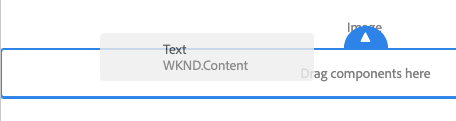
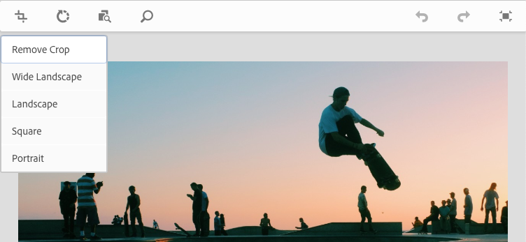

# Pagina-inhoud bewerken met de AEM Page Editor {#edit-content}

De AEM-pagina-editor is een krachtig hulpmiddel voor het schrijven van de inhoud van een pagina. Leer hoe u dit kunt gebruiken om inhoud te slepen en neer te zetten en inhoud op plaats te bewerken.

## Overzicht {#overview}

U kunt in de pagina-editor drie basishandelingen uitvoeren om de inhoud te bewerken:

1. [ Toevoegend nieuwe componenten ](#adding-components) door hen op de pagina te slepen en te laten vallen.
1. [ Toevoegend nieuwe activa ](#adding-asset) door hen op de pagina te slepen en te laten vallen.
1. [ het uitgeven componenten op zijn plaats ](#edit-in-place) die reeds op de pagina bestaan.

De AEM-pagina-editor biedt een intuïtieve gebruikersinterface voor het uitvoeren van deze taken, maar biedt ook toegang tot meer geavanceerde functies.

Bovendien kunt u in de editor de bestaande inhoud op uw pagina ordenen door u toe te staan om

* [Componenten verplaatsen](#moving-components)
* [Componentindeling bewerken](#editing-component-layout)
* [Componentovererving bewerken](#inherited-components)

>[!NOTE]
>
>Uw projectteam kan de redacteur indien nodig aanpassen. Zie [ het Aanpassen van de Authoring van de Pagina ](/help/implementing/developing/extending/page-authoring.md) voor verdere details.

## Componenten toevoegen {#adding-components}

U kunt nieuwe componenten op uw pagina slepen-en-daling door hen van [ componentenbrowser in het zijpaneel ](/help/sites-cloud/authoring/page-editor/editor-side-panel.md#components-browser) te selecteren en hen te laten vallen in componentenplaceholder.

### Tijdelijke aanduiding voor onderdeel {#component-placeholder}

De plaatsaanduiding van de component is een indicator die aangeeft waar een component wordt geplaatst wanneer u deze neerzet. Het ziet er twee uit.

* Wanneer u een nieuwe component aan de pagina toevoegt (vanuit de deelbrowser), wordt deze weergegeven als een grijs vak met details over de component die u plaatst.

  

* Wanneer [ het bewegen van een bestaande component ](#movging-components), zal het als blauw vierkant verschijnen.

  

In beide gevallen wordt het geselecteerde doel weergegeven als een blauwe omtrek onder de component die u sleept. Het doel als waar de component zal worden geplaatst wanneer u het vrijgeeft.

### Een component toevoegen vanuit de Componentbrowser {#adding-a-component-from-the-components-browser}

U kunt een nieuwe component toevoegen door [ componentenbrowser ](/help/sites-cloud/authoring/page-editor/editor-side-panel.md#components-browser) te gebruiken. De [ componentenplaceholder ](#component-placeholder) toont u waar u de component plaatst.

1. Zorg ervoor dat de paginaredacteur op [**is geef** wijze ](/help/sites-cloud/authoring/page-editor/introduction.md#mode-selector) uit.
1. Open [ componentenbrowser ](/help/sites-cloud/authoring/page-editor/editor-side-panel.md#components-browser).
1. Sleep de vereiste component aan de [ vereiste positie ](#component-placeholder) en versie.
1. [ geeft ](#edit-content) de onlangs-geplaatste component uit.

>[!NOTE]
>
>Op een mobiel apparaat vult de componentbrowser het volledige scherm. Nadat u een component hebt gesleept, wordt de pagina in de browser weer weergegeven, zodat u de component kunt plaatsen.

### Een component toevoegen vanuit het alineasysteem {#adding-a-component-from-the-paragraph-system}

U kunt een nieuwe component toevoegen door de **componenten van de Belemmering hier** placeholder van het paragraafsysteem te gebruiken:

1. Zorg ervoor dat de paginaredacteur op [**is geef** wijze ](/help/sites-cloud/authoring/page-editor/introduction.md#mode-selector) uit.
1. Er zijn twee manieren om een nieuwe component in het alineasysteem te selecteren en toe te voegen:

   * Selecteer de **optie van de Component van het Tussenvoegsel** (+) van of de toolbar van een bestaande component of de **componenten van de Belemmering hier** doos.

      op

   * Als u op een Desktopapparaat bent kunt u de **componenten van de Belemmering hier** doos tweemaal klikken.

1. De **dialoog van het Tussenvoegsel Nieuwe Component** open om u uw vereiste component te laten selecteren. Tik of klik op de component die u wilt toevoegen.

   * Gebruik de zoekfilters om de component te zoeken.
   * Gebruik het informatiepictogram naast componentnamen voor meer informatie over de component.

   

1. De geselecteerde component wordt toegevoegd aan het doel dat u had geselecteerd. [ geeft ](#edit-content) de component zoals vereist uit.

## Een element toevoegen {#adding-asset}

U kunt een nieuwe component aan de pagina ook toevoegen door activa van [ activa te slepen browser ](/help/sites-cloud/authoring/page-editor/editor-side-panel.md#assets-browser). Hiermee wordt automatisch een component van het juiste type gemaakt (en die het element bevat).

Dit gedrag kan voor uw installatie worden gevormd. Gelieve te zien de Gids van de Verwijzing van de Document [ Componenten ](/help/implementing/developing/components/reference.md#component-placeholders) voor verdere details.

Een component maken door een van de bovenstaande elementtypen te slepen:

1. Zorg ervoor dat uw pagina op [**is geef** wijze ](/help/sites-cloud/authoring/page-editor/introduction.md#mode-selector) uit.
1. Open [ activa browser ](/help/sites-cloud/authoring/page-editor/editor-side-panel.md#assets-browser).
1. Sleep het vereiste element naar de gewenste positie. De [ componentenplaceholder ](#component-placeholder) toont u waar de component wordt geplaatst en een doel zal tonen waar het zal worden opgenomen.
1. Laat het element los op het doel. Een component die geschikt is voor het type element, wordt gemaakt op de vereiste locatie die het geselecteerde element bevat.
1. [ geef ](#edit-content) de component indien nodig uit.

>[!NOTE]
>
>Op een mobiel apparaat vult de middelenbrowser het volledige scherm. Nadat u een element hebt gesleept, wordt de pagina in de browser weergegeven, zodat u het element kunt plaatsen.

Als wanneer het doorbladeren van de activa u vindt dat u een snelle verandering in activa moet aanbrengen, kunt u de [ activaredacteur ](/help/assets/manage-digital-assets.md) direct van browser beginnen door het uitgeven pictogram naast de naam van activa te klikken.

## Onderdelen op plaats bewerken {#edit-in-place}

Als u een component selecteert, wordt de werkbalk van de component geopend. Dit verleent toegang tot diverse acties die op de component kunnen worden uitgevoerd.

De acties beschikbaar in de componententoolbar zijn aangewezen voor de geselecteerde component. Afhankelijk van de geselecteerde component ziet u mogelijk meer of minder en deze worden hier mogelijk al dan niet beschreven.

* **geeft** uit staat u toe om de inhoud van de component te wijzigen, vaak op zijn plaats. Het gedrag ervan is afhankelijk van de component.

   uit

* **vormt** staat u toe om sommige parameters van de component te veranderen niet direct met zijn inhoud, normaal in een dialoog verwant. Het gedrag ervan is afhankelijk van de component.

  

* **Exemplaar** kopieert de component aan het klembord om elders te kleven. De oorspronkelijke component blijft ongewijzigd.

  

* **Knip** kopieert de component aan het klembord. De oorspronkelijke component wordt verwijderd.

  

* **Schrapping** schrapt de component van de pagina met uw bevestiging.

  

* **de component van het Tussenvoegsel** opent de dialoog [ een nieuwe component ](#adding-a-component-from-the-paragraph-system) toe te voegen.

  

* **kleeft** de component van het klembord aan de pagina. Of origineel blijft, hangt af van of u **Exemplaar** of **Besnoeiing** gebruikte.

   * U kunt op dezelfde pagina of op een andere pagina plakken.
   * Als u plakt naar een andere pagina die al was geopend vóór de knip-/kopieerbewerking, moet u de pagina vernieuwen om de geplakte inhoud te zien.
   * Het geplakte item wordt boven het item geplakt waar u de plakactie selecteert.
   * De handeling Pate wordt alleen weergegeven als er inhoud op het klembord staat.

  

* **Groep** laat u veelvoudige componenten tegelijkertijd selecteren. Het zelfde kan op een Desktopapparaat door a **worden bereikt Control+Click** of **Command+Click**.

  

* **Ouder** selecteert de oudercomponent van de geselecteerde component.

  

* **Lay-out** laat u de [ lay-out ](#editing-component-layout) van de geselecteerde component wijzigen.

   * Dit is slechts op de geselecteerde component van toepassing en activeert niet de [ wijze van de Lay-out ](/help/sites-cloud/authoring/page-editor/introduction.md#mode-selector) voor de volledige pagina.

  

* **Bekeerling in een variatie van het ervaringsfragment** laat u een [ ervaringsfragment ](/help/sites-cloud/authoring/fragments/content-fragments.md) van de geselecteerde component tot stand brengen of het toevoegen aan een bestaand ervaringsfragment.

  

### Dialoogvenster Component Edit {#component-edit-dialog}

Sommige componenten bieden extra bewerkingsopties die verder gaan dan wat op locatie beschikbaar is. U kunt component openen uitgeeft dialoog [ uitgeven (potlood) pictogram van de componententoolbar ](#component-toolbar) om tot extra configuratieopties toegang te hebben.

De exacte bewerkingsopties zijn afhankelijk van de component. Voor sommige componenten [ zullen sommige acties slechts op het volledige schermwijze ](#edit-content-full-screen-mode) beschikbaar zijn. Bijvoorbeeld:

* Tekstcomponent

  

* Afbeeldingscomponent

  

### Componenten bewerken in de modus Volledig scherm {#edit-content-full-screen-mode}

Veel componenten beschikken over een modus Volledig scherm voor bewerking die met deze knop kan worden geopend.

Bij Volledig scherm kunt u meer bewerkingsopties weergeven dan in de interne editor, bijvoorbeeld voor de afbeeldingscomponent.

Gebruik **minimaliseer** knoop om het volledig-schermwijze te bestaan.

## Componenten verplaatsen {#moving-components}

Een component verplaatsen:

1. Selecteer de component die u wilt verplaatsen met Tikken en vasthouden of klikken en vasthouden.
1. Sleep de component naar de nieuwe locatie.

   * De paginaredacteur wijst op de positie van de component met a [ placeholder ](#component-placeholder) en waar de paragraaf met een doel kan worden gelaten vallen.

   

1. Zet het neer op de gewenste plaats.

>[!TIP]
>
>U kunt ook gebruiken [ Besnoeiing en Deeg ](#component-toolbar) om een component te bewegen.

## Component-indeling bewerken {#editing-component-layout}

In plaats van herhaaldelijk over te schakelen van de bewerkingsmodus naar [de lay-outmodus](/help/sites-cloud/authoring/page-editor/responsive-layout.md) om een component aan te passen, kunt u de actie **Lay-out** selecteren zodat een component de lay-out van die component kan wijzigen en tijd kan besparen door de bewerkingsmodus niet te verlaten.

1. Wanneer op **&#x200B;**&#x200B;wijze van de plaatsenconsole uitgeeft, selecteer een component om de toolbar van de component te openbaren.

1. Selecteer de **Lay-out** actie om de lay-out van de component aan te passen.

   

1. Zodra de actie van de Lay-out wordt geselecteerd, kunt u de lay-out van de component wijzigen aangezien u op [ lay-outwijze ](/help/sites-cloud/authoring/page-editor/responsive-layout.md#defining-layouts-layout-mode) zou.

   * De formaatgrepen voor de componentweergave.
   * De emulatorwerkbalk wordt boven in het scherm weergegeven.
   * De acties van de lay-out in plaats van de standaard geeft acties uit tonen op de componententoolbar.

   

1. Na het aanbrengen van de noodzakelijke lay-outveranderingen, tik of klik **dicht** knoop in het menu van de componentenactie ophouden wijzigend de lay-out van de component en de de toolbarwinst van de component aan zijn normale geeft staat uit.

   

>[!TIP]
>
>De actie Lay-out is beperkt in werkingsgebied tot de geselecteerde component. Als u bijvoorbeeld de lay-out van een component bewerkt en vervolgens op een andere component klikt, wordt de werkbalk voor standaardbewerking (niet de layoutwerkbalk) weergegeven voor de zojuist geselecteerde component en verdwijnen de formaatgrepen en de emulatorwerkbalk.
>
>Als u de algemene lay-out van de pagina moet uitgeven, die veelvoudige componenten beïnvloeden, schakelaar aan de [ lay-outwijze ](/help/sites-cloud/authoring/page-editor/responsive-layout.md).

## Componentovererving bewerken {#inherited-components}

Overerving is het mechanisme waarbij inhoud kan worden gekoppeld, zodat het ene element automatisch het andere verandert. Overerfde componenten kunnen het product van diverse scenario&#39;s zijn, die omvatten:

* [Beheer van meerdere sites](/help/sites-cloud/administering/msm/overview.md)
* [Lanceringen](/help/sites-cloud/authoring/launches/overview.md)

U kunt de overerving annuleren en opnieuw inschakelen. Afhankelijk van de component zijn deze opties beschikbaar op de werkbalk van de component als de component deel uitmaakt van een live kopie of opstart.

* **annuleert Overerving**

  

* **re-enable Overerving** als de erving reeds wordt geannuleerd

  

* **Uitvoer** is ook beschikbaar in de blauwdruk of Live bron van het Exemplaar

  
