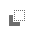
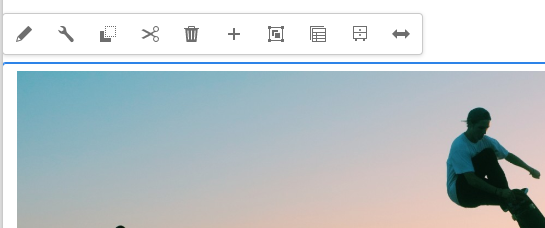

# Pagina-inhoud bewerken met de AEM Pagina-editor {#edit-content}

De AEM pagina-editor is een krachtig hulpmiddel voor het schrijven van de inhoud van een pagina. Leer hoe u dit kunt gebruiken om inhoud te slepen en neer te zetten en inhoud op plaats te bewerken.

## Overzicht {#overview}

U kunt in de pagina-editor drie basishandelingen uitvoeren om de inhoud te bewerken:

1. [Nieuwe componenten toevoegen](#adding-components) door deze naar de pagina te slepen.
1. [Nieuwe elementen toevoegen](#adding-asset) door deze naar de pagina te slepen.
1. [Onderdelen op plaats bewerken](#edit-in-place) die al op de pagina staan.

De AEM pagina-editor biedt een intuïtieve gebruikersinterface voor het uitvoeren van deze taken, maar biedt ook toegang tot meer geavanceerde functies.

Bovendien kunt u in de editor de bestaande inhoud op uw pagina ordenen door u toe te staan om

* [Componenten verplaatsen](#moving-components)
* [Componentindeling bewerken](#editing-component-layout)
* [Componentovererving bewerken](#inherited-components)

## Componenten toevoegen {#adding-components}

U kunt nieuwe componenten naar de pagina slepen door ze te selecteren in het dialoogvenster [componentbrowser in het zijpaneel](/help/sites-cloud/authoring/page-editor/editor-side-panel.md#components-browser) en zet ze neer in een tijdelijke aanduiding voor onderdelen.

### Tijdelijke aanduiding voor onderdeel {#component-placeholder}

De plaatsaanduiding van de component is een indicator die aangeeft waar een component wordt geplaatst wanneer u deze neerzet. Het ziet er twee uit.

* Wanneer u een nieuwe component aan de pagina toevoegt (vanuit de deelbrowser), wordt deze weergegeven als een grijs vak met details over de component die u plaatst.

  

* Wanneer [het verplaatsen van een bestaand onderdeel;](#movging-components) het wordt weergegeven als een blauw vierkant.

  

In beide gevallen wordt het geselecteerde doel weergegeven als een blauwe omtrek onder de component die u sleept. Het doel als waar de component zal worden geplaatst wanneer u het vrijgeeft.

### Een component toevoegen vanuit de Componentbrowser {#adding-a-component-from-the-components-browser}

U kunt een nieuwe component toevoegen door de [componentbrowser](/help/sites-cloud/authoring/page-editor/editor-side-panel.md#components-browser). De [tijdelijke aanduiding voor onderdeel](#component-placeholder) toont u waar u de component plaatst.

1. Zorg ervoor dat de pagina-editor zich bevindt in [**Bewerken** -modus.](/help/sites-cloud/authoring/page-editor/introduction.md#mode-selector)
1. Open de [componentbrowser.](/help/sites-cloud/authoring/page-editor/editor-side-panel.md#components-browser)
1. Sleep de vereiste component naar de [vereiste positie](#component-placeholder) en loslaten.
1. [Bewerken](#edit-content) de nieuw geplaatste component.

>[!NOTE]
>
>Op een mobiel apparaat vult de componentbrowser het volledige scherm. Nadat u een component hebt gesleept, wordt de pagina in de browser weer weergegeven, zodat u de component kunt plaatsen.

### Een component toevoegen vanuit het alineasysteem {#adding-a-component-from-the-paragraph-system}

U kunt een nieuwe component toevoegen door de **Componenten hierheen slepen** tijdelijke aanduiding van het alineasysteem:

1. Zorg ervoor dat de pagina-editor zich bevindt in [**Bewerken** -modus.](/help/sites-cloud/authoring/page-editor/introduction.md#mode-selector)
1. Er zijn twee manieren om een nieuwe component in het alineasysteem te selecteren en toe te voegen:

   * Selecteer de **Component invoegen** van de werkbalk van een bestaande component of van de **Componenten hierheen slepen** doos.

     

   * Als u zich op een desktopapparaat bevindt, kunt u dubbelklikken op de knop **Componenten hierheen slepen** doos.

1. De **Nieuwe component invoegen** wordt geopend, zodat u de gewenste component kunt selecteren. Tik of klik op de component die u wilt toevoegen.

   * Gebruik de zoekfilters om de component te zoeken.
   * Gebruik het informatiepictogram naast componentnamen voor meer informatie over de component.

   

1. De geselecteerde component wordt toegevoegd aan het doel dat u had geselecteerd. [Bewerken](#edit-content) de component naar wens.

## Een element toevoegen {#adding-asset}

U kunt ook een nieuwe component aan de pagina toevoegen door een element van de [de middelenbrowser.](/help/sites-cloud/authoring/page-editor/editor-side-panel.md#assets-browser) Hiermee wordt automatisch een component van het juiste type gemaakt (en die het element bevat).

Dit gedrag kan voor uw installatie worden gevormd. Zie het document [Referentiehandleiding voor componenten](/help/implementing/developing/components/reference.md#component-placeholders) voor nadere bijzonderheden.

Een component maken door een van de bovenstaande elementtypen te slepen:

1. Zorg ervoor dat de pagina zich bevindt in [**Bewerken** -modus.](/help/sites-cloud/authoring/page-editor/introduction.md#mode-selector)
1. Open de [middelenbrowser](/help/sites-cloud/authoring/page-editor/editor-side-panel.md#assets-browser).
1. Sleep het vereiste element naar de gewenste positie. De [tijdelijke aanduiding voor onderdeel](#component-placeholder) toont u waar de component wordt geplaatst en een doel zal tonen waar het zal worden opgenomen.
1. Laat het element los op het doel. Een component die geschikt is voor het type element, wordt gemaakt op de vereiste locatie die het geselecteerde element bevat.
1. [Bewerken](#edit-content) het onderdeel, indien nodig.

>[!NOTE]
>
>Op een mobiel apparaat vult de middelenbrowser het volledige scherm. Nadat u een element hebt gesleept, wordt de pagina in de browser weergegeven, zodat u het element kunt plaatsen.

Als u bij het bladeren in de elementen opmerkt dat u snel een wijziging in een element moet aanbrengen, kunt u het dialoogvenster [middeleneditor](/help/assets/manage-digital-assets.md) rechtstreeks vanuit de browser door op het pictogram Bewerken naast de naam van het element te klikken.

## Onderdelen op plaats bewerken {#edit-in-place}

Als u een component selecteert, wordt de werkbalk van de component geopend. Dit verleent toegang tot diverse acties die op de component kunnen worden uitgevoerd.

De acties beschikbaar in de componententoolbar zijn aangewezen voor de geselecteerde component. Afhankelijk van de geselecteerde component ziet u mogelijk meer of minder en deze worden hier mogelijk al dan niet beschreven.

* **Bewerken** kunt u de inhoud van de component, vaak op zijn plaats, wijzigen. Het gedrag ervan is afhankelijk van de component.

  

* **Configureren** Hiermee kunt u bepaalde parameters van de component wijzigen die niet rechtstreeks samenhangen met de inhoud, normaal gesproken in een dialoogvenster. Het gedrag ervan is afhankelijk van de component.

  

* **Kopiëren** Hiermee kopieert u de component naar het klembord om elders te plakken. De oorspronkelijke component blijft ongewijzigd.

  

* **Knippen** Hiermee wordt de component naar het klembord gekopieerd. De oorspronkelijke component wordt verwijderd.

  

* **Verwijderen** Hiermee verwijdert u de component van de pagina met uw bevestiging.

  

* **Component invoegen** opent het dialoogvenster voor [voeg een nieuwe component toe.](#adding-a-component-from-the-paragraph-system)

  

* **Plakken** plakt de component van het klembord naar de pagina. Of het origineel overblijft, hangt af van of u gebruikte **Kopiëren** of **Knippen**.

   * U kunt op dezelfde pagina of op een andere pagina plakken.
   * Als u plakt naar een andere pagina die al was geopend vóór de knip-/kopieerbewerking, moet u de pagina vernieuwen om de geplakte inhoud te zien.
   * Het geplakte item wordt boven het item geplakt waar u de plakactie selecteert.
   * De handeling Pate wordt alleen weergegeven als er inhoud op het klembord staat.

  

* **Groep** Hiermee kunt u meerdere componenten tegelijk selecteren. Hetzelfde kan worden bereikt op een desktopapparaat met een **Ctrl+klikken** of **Command+klikken**.

  

* **Bovenliggend** selecteert de bovenliggende component van de geselecteerde component.

  

* **Layout** Hiermee kunt u de [layout](#editing-component-layout) van de geselecteerde component.

   * Dit geldt alleen voor de geselecteerde component en activeert de component [Lay-outmodus](/help/sites-cloud/authoring/page-editor/introduction.md#mode-selector) voor de gehele pagina.

  

* **Omzetten in een ervaringsfragmentvariatie** Hiermee kunt u een [ervaren, fragment](/help/sites-cloud/authoring/fragments/content-fragments.md) van de geselecteerde component of voeg het aan een bestaand ervaringsfragment toe.

  

### Dialoogvenster Component Edit {#component-edit-dialog}

Sommige componenten bieden extra bewerkingsopties die verder gaan dan wat op locatie beschikbaar is. U kunt het bewerkingsdialoogvenster van een component openen via [Pictogram Bewerken (potlood) van de componentwerkbalk](#component-toolbar) voor toegang tot extra configuratieopties.

De exacte bewerkingsopties zijn afhankelijk van de component. Voor sommige componenten [sommige acties zijn alleen beschikbaar in de modus Volledig scherm](#edit-content-full-screen-mode). Bijvoorbeeld:

* Tekstcomponent

  

* Afbeeldingscomponent

  

### Componenten bewerken in de modus Volledig scherm {#edit-content-full-screen-mode}

Veel componenten beschikken over een modus Volledig scherm voor bewerking die met deze knop kan worden geopend.

Bij Volledig scherm kunt u meer bewerkingsopties weergeven dan in de interne editor, bijvoorbeeld voor de afbeeldingscomponent.

Gebruik de **Minimaliseren** om de modus Volledig scherm te gebruiken.

## Componenten verplaatsen {#moving-components}

Een component verplaatsen:

1. Selecteer de component die u wilt verplaatsen met Tikken en vasthouden of klikken en vasthouden.
1. Sleep de component naar de nieuwe locatie.

   * De pagina-editor geeft de positie van de component aan met een [plaatsaanduiding](#component-placeholder) en waar de alinea met een doel kan worden verwijderd.

   

1. Zet het neer op de gewenste plaats.

>[!TIP]
>
>U kunt ook [Knippen en plakken](#component-toolbar) een component verplaatsen.

## Component-indeling bewerken {#editing-component-layout}

In plaats van herhaaldelijk over te schakelen van de bewerkingsmodus naar [de lay-outmodus](/help/sites-cloud/authoring/page-editor/responsive-layout.md) om een component aan te passen, kunt u de actie **Lay-out** selecteren zodat een component de lay-out van die component kan wijzigen en tijd kan besparen door de bewerkingsmodus niet te verlaten.

1. Wanneer in **Bewerken** van de plaatsenconsole, selecteer een component om de toolbar van de component te openbaren.

1. Selecteer de **Layout** actie om de lay-out van de component aan te passen.

   

1. Als de handeling Lay-out is geselecteerd, kunt u de indeling van de component wijzigen zoals u dat zou doen in [layout.](/help/sites-cloud/authoring/page-editor/responsive-layout.md#defining-layouts-layout-mode)

   * De formaatgrepen voor de componentweergave.
   * De emulatorwerkbalk wordt boven in het scherm weergegeven.
   * De acties van de lay-out in plaats van de standaard geeft acties uit tonen op de componententoolbar.

   

1. Tik of klik op de knop **Sluiten** in het actiemenu van de component ophouden wijzigend de lay-out van de component en de toolbar van de component keert aan zijn normale uitgeeft staat terug.

   

>[!TIP]
>
>De actie Lay-out is beperkt in werkingsgebied tot de geselecteerde component. Als u bijvoorbeeld de lay-out van een component bewerkt en vervolgens op een andere component klikt, wordt de werkbalk voor standaardbewerking (niet de layoutwerkbalk) weergegeven voor de zojuist geselecteerde component en verdwijnen de formaatgrepen en de emulatorwerkbalk.
>
>Als u de algemene lay-out van de pagina moet bewerken, wat van invloed is op meerdere componenten, schakelt u over naar de [lay-outmodus](/help/sites-cloud/authoring/page-editor/responsive-layout.md).

## Componentovererving bewerken {#inherited-components}

Overerving is het mechanisme waarbij inhoud kan worden gekoppeld, zodat het ene element automatisch het andere verandert. Overerfde componenten kunnen het product van diverse scenario&#39;s zijn, die omvatten:

* [Beheer van meerdere sites](/help/sites-cloud/administering/msm/overview.md)
* [Lanceringen](/help/sites-cloud/authoring/launches/overview.md)

U kunt de overerving annuleren en opnieuw inschakelen. Afhankelijk van de component zijn deze opties beschikbaar op de werkbalk van de component als de component deel uitmaakt van een live kopie of opstart.

* **Overerving annuleren**

  

* **Overerving opnieuw inschakelen** als overerving al is geannuleerd

  

* **Uitrol** is ook beschikbaar in de blauwdruk of de Live Copy-bron

  
