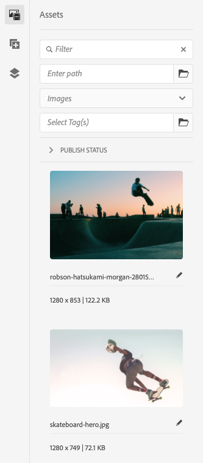

# Zijpaneel paginaeditor {#side-panel}

Leer hoe u het zijpaneel in de AEM sites-editor kunt gebruiken om componenten en elementen aan uw pagina toe te voegen.

## Zijdeelvenstermodi {#modes}

Het zijpaneel is altijd toegankelijk in de pagina-editor door te tikken op **Zijpaneel in-/uitschakelen** in de werkbalk van de pagina-editor.

Wanneer u het zijpaneel opent, schuift het van de linkerkant open en u kunt dan uit drie belangrijke lusjes selecteren:

* [De componentenbrowser](#components-browser) om nieuwe inhoud aan uw pagina toe te voegen
* [De middelenbrowser](#assets-browser) om nieuwe elementen aan uw pagina toe te voegen
* [De inhoudsstructuur](#content-tree) om door de structuur van uw pagina te bladeren

## Browser voor componenten {#components-browser}

[Componenten](/help/implementing/developing/components/overview.md) Dit zijn de bouwstenen die worden gebruikt om inhoud te maken met de AEM paginaeditor. U plaatst veelvoudige componenten op een pagina en vormt hun opties om uw inhoudspagina te bouwen.

De componentenbrowser toont alle componenten die voor gebruik op uw huidige pagina beschikbaar zijn. U kunt deze naar de juiste locatie slepen en vervolgens bewerken om uw inhoud toe te voegen.

Tik of klik op de knop **Componenten** in het zijpaneel om toegang te krijgen tot de **Componenten** browser.

De werkelijke weergave en afhandeling is afhankelijk van het apparaattype dat u gebruikt.

### Mobiel apparaat {#mobile-device-components-browser}

Wanneer u de componentbrowser op een mobiel apparaat opent, wordt de pagina die wordt bewerkt, volledig afgedekt.

Als u een component aan de pagina wilt toevoegen, selecteert u de component en sleept u deze naar rechts. De componentbrowser wordt gesloten om de pagina weer te geven, waar u de component kunt plaatsen.

>[!NOTE]
>
>Een mobiel apparaat wordt gedetecteerd wanneer de breedte minder dan 1024 px is.

### Bureaubladapparaat {#desktop-device-components-browser}

Wanneer u de componentbrowser op een desktopapparaat opent, wordt deze aan de linkerkant van het venster weergegeven.

Als u een component aan de pagina wilt toevoegen, klikt u op de gewenste component en sleept u deze naar de gewenste locatie.

### De Componentenbrowser gebruiken {#using-component-browser}

Componenten in het dialoogvenster **Componenten** browser wordt vertegenwoordigd door:

* Componentnaam
* Componentgroep (grijs)
* Pictogram of afkorting
   * De standaardcomponentpictogrammen zijn monochroom.
   * Afkortingen zijn altijd de eerste twee tekens van de componentnaam.

Vanaf de bovenste werkbalk in het dialoogvenster **Componenten** browser die u kunt:

* Componenten filteren op naam.
* Beperk de weergave tot een specifieke groep met behulp van de vervolgkeuzelijst.

Voor een meer gedetailleerde beschrijving van de component kunt u het informatiepictogram naast de component in het dialoogvenster **Componenten** browser (indien beschikbaar). Bijvoorbeeld voor **Inhoudsfragment**:

Voor meer gedetailleerde informatie over de componenten beschikbaar u ziet [Component Console.](/help/sites-cloud/authoring/components-console.md)

## Browser voor middelen {#assets-browser}

De **Activa** browser toont alle [elementen](/help/assets/overview.md) die beschikbaar zijn voor gebruik op uw huidige pagina.

Tik of klik op de knop **Activa** op het zijpaneel om door de elementen te bladeren.

Met oneindig schuiven vouwt u de lijst met elementen zo nodig uit terwijl u schuift.

De daadwerkelijke verschijning en behandeling zijn afhankelijk van het apparatentype u gebruikt:

### Mobiel apparaat {#mobile-device-assets-browser}

Wanneer u de middelenbrowser op een mobiel apparaat opent, wordt de pagina die wordt bewerkt, volledig afgedekt.

Als u een element aan uw pagina wilt toevoegen, selecteert u het gewenste element en sleept u het naar rechts. De middelenbrowser wordt gesloten om de pagina weer te tonen, waar u het element aan de vereiste component kunt toevoegen.

>[!NOTE]
>
>Een mobiel apparaat wordt gedetecteerd wanneer de breedte minder dan 1024 px is.

### Bureaubladapparaat {#desktop-device-assets-browser}

Wanneer u de middelenbrowser op een desktopapparaat opent, wordt deze links in het venster geopend.

Als u een element aan uw pagina wilt toevoegen, selecteert u het gewenste element en sleept u het naar de gewenste component of locatie.

### De middelenbrowser gebruiken {#using-assets-browser}

Als u een element aan de pagina wilt toevoegen, selecteert u het element en sleept u het naar de gewenste locatie. Dit kan zijn:

* Een bestaand onderdeel van het desbetreffende type.
   * U kunt bijvoorbeeld een element van het type afbeelding naar een afbeeldingscomponent slepen.
* A [plaatsaanduiding](/help/sites-cloud/authoring/page-editor/edit-content.md#component-placeholder) in het alineasysteem om een onderdeel van het juiste type te maken.
   * U kunt bijvoorbeeld een element van het type afbeelding naar het alineasysteem slepen om een component Image te maken.

>[!NOTE]
>
>Het slepen en neerzetten van elementen is beschikbaar voor specifieke elementen en componenttypen. Zie [Een component invoegen met de middelenbrowser](/help/sites-cloud/authoring/page-editor/edit-content.md#adding-a-component-from) voor meer informatie .

Vanuit de bovenste werkbalk van de middelenbrowser kunt u de elementen filteren op:

* Naam
* Pad
* Elementtype zoals afbeeldingen, video&#39;s, documenten, alinea&#39;s, inhoudsfragmenten en ervaringsfragmenten
* Elementkenmerken zoals oriëntatie en stijl
   * Alleen beschikbaar voor bepaalde typen elementen

Als u snel een wijziging in een element moet aanbrengen, kunt u de opdracht [middeleneditor](/help/assets/manage-digital-assets.md) rechtstreeks vanuit de elementenbrowser door op het bewerkingspictogram naast de naam van het element te klikken.

## Inhoudsstructuur {#content-tree}

De **Inhoudsstructuur** geeft een overzicht van alle componenten op de pagina in een hiërarchie zodat u in een oogopslag kunt zien hoe de pagina is samengesteld.

>[!NOTE]
>
>De inhoudsstructuur is niet beschikbaar als u een pagina bewerkt op een mobiel apparaat (als de breedte van de browser minder dan 1024 px is).

Tik of klik op de knop **Inhoudsstructuur** gebruiken om toegang te krijgen tot de inhoudsstructuur.

Wanneer open kunt u een vertegenwoordiging van de boommening van uw pagina of malplaatje zien, zodat het gemakkelijker is om te begrijpen hoe zijn inhoud hiërarchisch gestructureerd is. Op een complexe pagina is het bovendien gemakkelijker om tussen componenten van de pagina te schakelen.

Een pagina kan gemakkelijk uit veel van hetzelfde type componenten bestaan, zodat in de inhoudsstructuur beschrijvende tekst (grijs) achter de naam van het componenttype (in zwart) wordt weergegeven. De beschrijvende tekst is afkomstig uit gemeenschappelijke eigenschappen van de component, zoals titel of tekst.

Componenttypen worden weergegeven in de taal van de gebruiker, terwijl de tekst van de componentbeschrijving uit de paginataal komt.

Als u klikt op het chevron naast een component, wordt dat niveau samengevouwen of uitgevouwen.

Wanneer u op de component klikt, wordt de component in de pagina-editor gemarkeerd. Welke acties beschikbaar zijn, is afhankelijk van de paginastatus. Bijvoorbeeld:

## Een basispagina {#basic-page}

De componenten van een basispagina hebben de gebruikelijke opties.

Als de component waarop u klikt in de structuur bewerkbaar is, wordt er een moersleutelpictogram rechts van de naam weergegeven. Wanneer u op dit pictogram klikt, wordt het dialoogvenster Bewerken voor de component gestart.

### Een actieve kopie {#live-copy}

Een pagina die deel uitmaakt van een [livecopy](/help/sites-cloud/administering/msm/overview.md), waarbij componenten van een andere pagina worden overgeërfd, hebt u verschillende opties.

## Gekoppelde inhoudsbrowser {#associated-content-browser}

Als uw pagina inhoudsfragmenten bevat, hebt u ook toegang tot de [browser voor gekoppelde inhoud.](/help/sites-cloud/authoring/fragments/content-fragments.md#using-associated-content)
