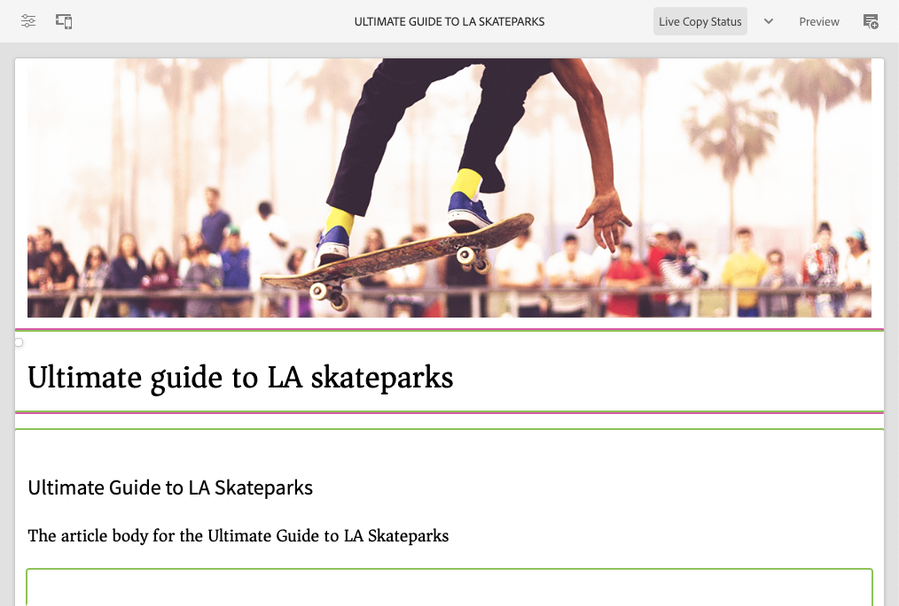

# De AEM Page Editor {#editing-page-content}

Zodra uw pagina in de **console van de Plaatsen[** {wordt gecreeerd, kunt u de inhoud van de pagina uitgeven gebruikend de de paginaredacteur van AEM, een krachtig hulpmiddel om uw inhoud te ontwerpen.](/help/sites-cloud/authoring/sites-console/introduction.md)

>[!NOTE]
>
>Wanneer het uitgeven van een pagina in de **console van Plaatsen ](/help/sites-cloud/authoring/sites-console/introduction.md), zal de console de redacteur aangewezen aan het 3} malplaatje van de pagina ](/help/sites-cloud/authoring/page-editor/templates.md) of de paginaredacteur openen die in dit document wordt beschreven, of [ Universele Redacteur ](/help/sites-cloud/authoring/universal-editor/authoring.md).[**[

>[!NOTE]
>
>Uw account heeft de juiste toegangsrechten en machtigingen nodig om pagina&#39;s te kunnen bewerken. Neem contact op met de systeembeheerder als u geen machtigingen hebt.

{{traditional-aem}}

## Afdrukstand {#orientation}

De AEM-pagina-editor bestaat voornamelijk uit drie secties:

1. [ de toolbar ](#toolbar) - de toolbar geeft u snelle toegang om paginamodus te veranderen en tot extra paginamontages toegang te hebben.
1. [ het zijpaneel ](#side-panel) - het zijpaneel geeft u toegang tot paginacomponenten en activa evenals andere auteurshulpmiddelen.
1. [ de redacteur ](#editor) - de redacteur is waar u veranderingen in uw inhoud aanbrengt en het voorproef.

De inhoud wordt toegevoegd gebruikend [ componenten ](/help/sites-cloud/authoring/components-console.md) (aangewezen aan het inhoudstype) die op de pagina kunnen worden gesleept. Deze kunnen vervolgens worden bewerkt, verplaatst of verwijderd.

### Werkbalk {#page-toolbar}

De paginaboolbar biedt toegang tot context-aangewezen functionaliteit, afhankelijk van de paginasonfiguratie.

#### Zijpaneel {#side-panel-button}

Dit opent/sluit het [ zijpaneel ](/help/sites-cloud/authoring/page-editor/editor-side-panel.md), dat Browser van Activa, Browser van de Component, en de Boom van de Inhoud houdt.

#### Pagina-informatie {#page-information}

Zo hebt u toegang tot gedetailleerde pagina-informatie, waaronder paginagegevens en handelingen die op de pagina kunnen worden uitgevoerd, zoals het weergeven en bewerken van pagina-informatie, het weergeven van pagina-eigenschappen en het publiceren/ongedaan maken van de publicatie van de pagina.

**de Informatie van de Pagina** opent een drop-down menu dat details over laatste uitgeeft en de laatste publicatie van de geselecteerde pagina verstrekt. Afhankelijk van de kenmerken van de pagina, de site en uw exemplaar zijn aanvullende acties beschikbaar.

* [Eigenschappen openen](/help/sites-cloud/authoring/sites-console/page-properties.md)
* [Uitrolpagina](/help/sites-cloud/administering/msm/overview.md#msm-from-the-ui)
* [Workflow starten](/help/sites-cloud/authoring/workflows/applying.md#starting-a-workflow-from-the-page-editor)
* [Pagina vergrendelen](/help/sites-cloud/authoring/page-editor/introduction.md#locking-unlocking)
* [Pagina publiceren](/help/sites-cloud/authoring/sites-console/publishing-pages.md#publishing-pages-1)
* [Publicatie van pagina ongedaan maken](/help/sites-cloud/authoring/sites-console/publishing-pages.md#unpublishing-pages)
* [Sjabloon bewerken](/help/sites-cloud/authoring/page-editor/templates.md)
* [Weergeven als gepubliceerd](/help/sites-cloud/authoring/page-editor/introduction.md#view-as-published)
* [Weergeven in Admin](/help/sites-cloud/authoring/basic-handling.md#viewing-and-selecting-resources)
* [Help](/help/sites-cloud/authoring/basic-handling.md#accessing-help)
* [ bevorderen Lanceer ](/help/sites-cloud/authoring/launches/promoting.md) (slechts als de pagina een lancering is)

Bovendien **de Informatie van de Pagina** kan toegang tot analyses en aanbevelingen, wanneer aangewezen verlenen.

#### Emulator {#emulator}

Dit knevels de [ mededingertoolbar ](/help/sites-cloud/authoring/page-editor/responsive-layout.md#selecting-a-device-to-emulate), die wordt gebruikt om het blik-en-gevoel van de pagina op een ander apparaat na te bootsen. Dit wordt automatisch ingeschakeld in de lay-outmodus.

#### ContextHub {#context-hub}

Dit opent [ ContextHub ](/help/sites-cloud/authoring/personalization/contexthub.md). Het is slechts beschikbaar op **1} wijze van de Voorproef {.**

#### Paginatitel {#page-title}

Dit is de titel van de pagina, weergegeven in hoofdletters als informatie.

#### Modus selecteren {#mode-selector}

De wijzeselecteur toont de huidige [ wijze ](/help/sites-cloud/authoring/page-editor/introduction.md#mode-selector) en laat u een andere wijze zoals uitgeven, lay-out, timewarp, of het richten selecteren.

Er zijn verschillende modi voor het bewerken van een pagina die verschillende handelingen mogelijk maken:

* [ geeft ](/help/sites-cloud/authoring/page-editor/edit-content.md) uit - de wijze om te gebruiken wanneer het uitgeven van de paginainhoud
* [ Lay-out ](/help/sites-cloud/authoring/page-editor/responsive-layout.md) - laat u uw ontvankelijke lay-out afhankelijk van apparaat tot stand brengen en uitgeven (als de pagina op een lay-outcontainer gebaseerd is)
* [ het richten ](/help/sites-cloud/authoring/personalization/targeted-content.md) - verbetert inhoudrelevantie door het richten en het meten over alle kanalen
* [ Timewarp ](/help/sites-cloud/authoring/sites-console/page-versions.md#timewarp) - bekijk een paginastaat op een bepaald punt in tijd
* [ Levende Status van het Exemplaar ](/help/sites-cloud/authoring/page-editor/introduction.md#live-copy-status) - staat een snel overzicht van de levende exemplaarstatus toe en welke componenten worden/niet geërft
* [Modus voor ontwikkelaars](/help/implementing/developing/tools/developer-mode.md)
* [ Voorproef ](/help/sites-cloud/authoring/page-editor/introduction.md#previewing-pages) - bekijk de pagina aangezien het op publiceer milieu wordt getoond; of om het gebruiken van verbindingen in de inhoud te navigeren
* [ Annoteert ](/help/sites-cloud/authoring/page-editor/annotations.md) - voeg of meningsannotaties op de pagina toe

>[!NOTE]
>
>* Afhankelijk van de kenmerken van de pagina zijn bepaalde modi mogelijk niet beschikbaar.
>* Voor toegang tot bepaalde modi zijn de juiste machtigingen/bevoegdheden vereist.
>* De modus Ontwikkelaar is niet beschikbaar op mobiele apparaten vanwege ruimtebeperkingen.
>* Er is a [ toetsenbordkortere weg ](/help/sites-cloud/authoring/sites-console/keyboard-shortcuts.md) ( `Ctrl-Shift-M`) om tussen **Voorproef** en momenteel geselecteerde wijze (bijvoorbeeld, **uitgeeft**, **Lay-out**, etc.) van een knevel te voorzien.

#### Voorvertoning {#preview}

De **knoop van de Voorproef** laat [ voorproefwijze ](#preview-mode) toe, tonend de pagina aangezien het zal verschijnen wanneer gepubliceerd.

#### Annoteren {#annotate}

**annoteert** wijze laat u [ annotaties ](/help/sites-cloud/authoring/page-editor/annotations.md) aan de pagina toevoegen wanneer het herzien van een pagina. Na de eerste annotatie schakelt het pictogram over naar een getal dat het aantal annotaties op de pagina aangeeft.

### Zijpaneel {#side-panel}

In het zijpaneel hebt u toegang tot drie verschillende tabbladen.

* De componentenbrowser om nieuwe inhoud aan uw pagina toe te voegen
* De middelenbrowser om nieuwe elementen aan uw pagina toe te voegen
* In de inhoudsstructuur bladert u door de structuur van de pagina

Gelieve te zien het document [ Zijpaneel van de Redacteur van de Pagina ](/help/sites-cloud/authoring/page-editor/editor-side-panel.md) voor meer informatie.

### Editor {#editor}

In de editor kunt u rechtstreeks wijzigingen in uw pagina-inhoud aanbrengen. De pagina wordt weergegeven zoals u deze zou zien en u kunt nieuwe inhoud slepen en neerzetten met de middelen- of componentbrowsers in het zijpaneel en inhoud op plaats bewerken.

## Inhoud bewerken {#editing-content}

Nu u de pagina-editor begrijpt, kunt u de inhoud bewerken.

Gelieve te zien het document [ Uitgevend Inhoud met de Redacteur van de Pagina van AEM ](/help/sites-cloud/authoring/page-editor/edit-content.md) voor meer informatie.

## Statusmelding {#status-notification}

Als een pagina deel van a [ werkschema ](/help/sites-cloud/authoring/workflows/overview.md) of veelvoudige werkschema&#39;s uitmaakt, wordt deze informatie getoond in een berichtbar onder de toolbar wanneer het uitgeven van de pagina.

>[!NOTE]
>
>De statusbalk is alleen zichtbaar voor gebruikersaccounts met de juiste rechten.

In het bericht wordt de workflow weergegeven die op de pagina wordt uitgevoerd. Als de gebruiker in de huidige werkschemastap geïmpliceerd is, beïnvloeden de opties [ de werkschemastatus ](/help/sites-cloud/authoring/workflows/participating.md) en krijgen meer informatie over het werkschema ook beschikbaar zoals:

* **Volledig** - opent de **Volledige dialoog van het Punt van het Werk**
* **Afgevaardigde** - opent de **Volledige dialoog van het Punt van het Werk**
* **Details van de Mening** - opent het **venster van Details** van het werkschema

Het voltooien van en het delegeren van werkschemastappen via de kennisgevingsbar werken aangezien het wanneer [ deelnemend aan werkschema&#39;s ](/help/sites-cloud/authoring/workflows/participating.md) van het Bericht inbox.

Als de pagina aan veelvoudige werkschema&#39;s onderworpen is, wordt het aantal werkschema&#39;s getoond aan het rechtereind van het bericht samen met pijlknopen om u toe te staan om door de werkschema&#39;s te scrollen.

## Status van live kopiëren {#live-copy-status}

De **Levende de paginamodus van de Status van het Exemplaar** geeft u een snel overzicht van de levende exemplaarstatus en welke componenten niet worden/worden geërft:

* Groene rand: Overgenomen
* Roze rand: overerving is geannuleerd

Bijvoorbeeld:

## Pagina&#39;s voorvertonen {#previewing-pages}

Er zijn twee opties voor het voorvertonen van een pagina:

* ](#preview-mode) de Wijze van de Voorproef van 0} - een snelle, op zijn plaats voorproef[
* [ Mening zoals Gepubliceerd ](#view-as-published) - een volledige voorproef die de pagina in een nieuw lusje opent

>[!TIP]
>
>* De verbindingen in de inhoud zijn zichtbaar, maar niet toegankelijk op **geeft** wijze uit.
>* Gebruik een van de voorvertoningsopties als u door de koppelingen wilt navigeren.
>* Gebruik de [ toetsenbordkortere weg ](/help/sites-cloud/authoring/sites-console/keyboard-shortcuts.md) `Ctrl-Shift-M` om tussen voorproef en de laatste geselecteerde wijze te schakelen.

>[!NOTE]
>
>Het WCM-modencookie wordt ingesteld voor beide voorvertoningsopties.

### Voorvertoningsmodus {#preview-mode}

Wanneer u inhoud bewerkt, kunt u een voorvertoning van de pagina weergeven in de voorvertoningsmodus. Deze modus:

* Hiermee verbergt u verschillende bewerkingsmechanismen waarmee u snel kunt zien hoe de pagina er bij het publiceren uitziet.
* Hiermee kunt u navigeren met koppelingen.
* Vernieuw **** niet de paginainhoud.

Bij het ontwerpen is de modus Voorvertoning beschikbaar met behulp van het pictogram rechtsboven in de paginaeditor:

### Weergeven als gepubliceerd {#view-as-published}

De **Mening zoals Gepubliceerde** optie is beschikbaar bij het [ menu van de Informatie van de Pagina ](#page-information). Hierdoor wordt de pagina op een nieuw tabblad geopend, wordt de inhoud vernieuwd en wordt de pagina precies zo weergegeven als in de publicatieomgeving.

## Een pagina vergrendelen en ontgrendelen {#locking-unlocking}

Met AEM kunt u een pagina vergrendelen, zodat niemand anders de inhoud kan bewerken. Vergrendelen is handig wanneer u meerdere bewerkingen op een bepaalde pagina uitvoert of wanneer u een pagina een korte tijd wilt stilzetten.

1. Selecteer het **pictogram van de Informatie van de Pagina** om het menu te openen.
1. Selecteer de **optie van de Pagina van het Slot**.

Wanneer de optie is vergrendeld, wordt een vergrendelingssymbool weergegeven op de werkbalk van de pagina-editor.

Het ontgrendelen van een pagina is zeer gelijkaardig aan [ het sluiten van de pagina ](#locking-a-page). Nadat de pagina is vergrendeld, worden de vergrendelingsopties vervangen door ontgrendelingsacties.

>[!CAUTION]
>
>* U kunt een pagina vergrendelen wanneer u een gebruiker imiteert. Een pagina die op deze manier is vergrendeld, kan echter alleen dan worden ontgrendeld (door klanten) met de gebruiker die zich heeft voorgedaan.
>* Pagina&#39;s kunnen niet worden ontgrendeld door zich voor te doen als de gebruiker die de pagina heeft vergrendeld.
>* Als de gebruiker die de pagina heeft vergrendeld niet beschikbaar is om de pagina te ontgrendelen, neemt u contact op met de Klantenondersteuning om de opties voor het verwijderen van de vergrendeling te evalueren.

## Paginabewerkingen ongedaan maken en opnieuw uitvoeren {#undoing-and-redoing-page-edits}

Met de volgende pictogrammen kunt u een handeling ongedaan maken of opnieuw uitvoeren. Deze worden in voorkomend geval weergegeven op de werkbalk:

>[!TIP]
>
>* De [ toetsenbordkortere weg ](/help/sites-cloud/authoring/sites-console/keyboard-shortcuts.md) `Ctrl-Z` is ook beschikbaar om pagina uit te geven acties.
>* De sneltoets `Ctrl-Y` is ook beschikbaar voor het opnieuw uitvoeren van paginabewerkingsacties.

>[!NOTE]
>
>Gelieve te zien het document [ Ongedaan maken en Opnieuw Beperkingen ](/help/sites-cloud/authoring/page-editor/undo-redo.md) voor de volledige details van wat mogelijk is wanneer het ongedaan maken en het opnieuw doen van pagina geeft uit.
