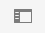
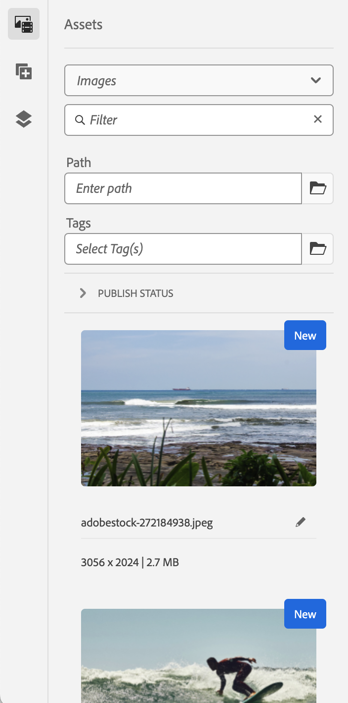

# De AEM Pagina-editor {#editing-page-content}

Nadat de pagina in het dialoogvenster [**Sites** console,](/help/sites-cloud/authoring/sites-console/introduction.md) U kunt de inhoud van de pagina bewerken met de AEM pagina-editor, een krachtig gereedschap voor het ontwerpen van de inhoud.

>[!NOTE]
>
>Wanneer u een pagina bewerkt in het dialoogvenster [**Sites** console,](/help/sites-cloud/authoring/sites-console/introduction.md) de console zal de redacteur aangewezen aan de pagina openen [sjabloon:](/help/sites-cloud/authoring/sites-console/templates.md) de pagina-editor die in dit document wordt beschreven, of de [Universele editor.](/help/sites-cloud/authoring/universal-editor/authoring.md)

>[!NOTE]
>
>Uw account heeft de juiste toegangsrechten en machtigingen nodig om pagina&#39;s te kunnen bewerken. Neem contact op met de systeembeheerder als u geen machtigingen hebt.

## Afdrukstand {#orientation}

De AEM pagina-editor bestaat voornamelijk uit drie secties:

1. [De werkbalk](#toolbar) - Met de werkbalk hebt u snel toegang tot het wijzigen van de paginamodus en het openen van aanvullende pagina-instellingen.
1. [Het zijpaneel](#side-panel) - Met het zijpaneel hebt u toegang tot pagina-componenten en -elementen en tot andere ontwerpgereedschappen.
1. [De editor](#editor) - In de editor brengt u wijzigingen aan in de inhoud en geeft u een voorvertoning weer.

Inhoud wordt toegevoegd met [componenten](/help/sites-cloud/authoring/components-console.md) (van toepassing op het inhoudstype) dat naar de pagina kan worden gesleept. Deze kunnen vervolgens worden bewerkt, verplaatst of verwijderd.

### Werkbalk {#page-toolbar}

De paginaboolbar biedt toegang tot context-aangewezen functionaliteit, afhankelijk van de paginasonfiguratie.

#### Zijpaneel {#side-panel-button}

Hiermee opent/sluit u de [zijpaneel,](/help/sites-cloud/authoring/page-editor/editor-side-panel.md) die de Asset Browser, de Componentbrowser en de Inhoudsstructuur bevat.

#### Pagina-informatie {#page-information}

Zo hebt u toegang tot gedetailleerde pagina-informatie, waaronder paginagegevens en handelingen die op de pagina kunnen worden uitgevoerd, zoals het weergeven en bewerken van pagina-informatie, het weergeven van pagina-eigenschappen en het publiceren/ongedaan maken van de publicatie van de pagina.

**Pagina-informatie** Hiermee opent u een vervolgkeuzelijst met informatie over de laatste bewerking en de laatste publicatie van de geselecteerde pagina. Afhankelijk van de kenmerken van de pagina, de site en uw exemplaar zijn aanvullende acties beschikbaar.

* [Eigenschappen openen](/help/sites-cloud/authoring/sites-console/page-properties.md)
* [Uitrolpagina](/help/sites-cloud/administering/msm/overview.md#msm-from-the-ui)
* [Workflow starten](/help/sites-cloud/authoring/workflows/applying.md#starting-a-workflow-from-the-page-editor)
* [Pagina vergrendelen](/help/sites-cloud/authoring/page-editor/introduction.md#locking-unlocking)
* [Pagina publiceren](/help/sites-cloud/authoring/sites-console/publishing-pages.md#publishing-pages-1)
* [Publicatie van pagina ongedaan maken](/help/sites-cloud/authoring/sites-console/publishing-pages.md#unpublishing-pages)
* [Sjabloon bewerken](/help/sites-cloud/authoring/sites-console/templates.md)
* [Weergeven als gepubliceerd](/help/sites-cloud/authoring/page-editor/introduction.md#view-as-published)
* [Weergeven in Admin](/help/sites-cloud/authoring/basic-handling.md#viewing-and-selecting-resources)
* [Help](/help/sites-cloud/authoring/basic-handling.md#accessing-help)
* [Starten bevorderen](/help/sites-cloud/authoring/launches/promoting.md) (alleen als de pagina een startpagina is)

Daarnaast **Pagina-informatie** waar nodig toegang kunnen verlenen tot analyses en aanbevelingen.

#### Emulator {#emulator}

Hiermee schakelt u [emulator, werkbalk](/help/sites-cloud/authoring/page-editor/responsive-layout.md#selecting-a-device-to-emulate), die wordt gebruikt om het uiterlijk van de pagina op een ander apparaat na te bootsen. Dit wordt automatisch ingeschakeld in de lay-outmodus.

#### ContextHub {#context-hub}

Hierdoor wordt het [ContextHub.](/help/sites-cloud/authoring/personalization/contexthub.md) Het is alleen beschikbaar in **Voorvertoning** -modus.

#### Paginatitel {#page-title}

Dit is de titel van de pagina, weergegeven in hoofdletters als informatie.

#### Modus selecteren {#mode-selector}

De moduskiezer geeft de huidige [mode](/help/sites-cloud/authoring/page-editor/introduction.md#mode-selector) en kunt u een andere modus selecteren, zoals bewerken, lay-out, tijdverdraaiing of doelversie.

Er zijn verschillende modi voor het bewerken van een pagina die verschillende handelingen mogelijk maken:

* [Bewerken](/help/sites-cloud/authoring/page-editor/edit-content.md) - De modus die moet worden gebruikt bij het bewerken van de pagina-inhoud
* [Layout](/help/sites-cloud/authoring/page-editor/responsive-layout.md) - Hiermee kunt u afhankelijk van het apparaat de responsieve indeling maken en bewerken (als de pagina is gebaseerd op een lay-outcontainer)
* [Targeting](/help/sites-cloud/authoring/personalization/targeted-content.md) - Verbetert de relevantie van inhoud door het richten en het meten over alle kanalen
* [Timewarp](/help/sites-cloud/authoring/sites-console/page-versions.md#timewarp) - Een paginastaat op een bepaald tijdstip weergeven
* [Status van live kopiëren](/help/sites-cloud/authoring/page-editor/introduction.md#live-copy-status) - Hiermee krijgt u een snel overzicht van de status van de live kopie en van de onderdelen die u/zij niet hebt geërfd
* [Modus voor ontwikkelaars](/help/implementing/developing/tools/developer-mode.md)
* [Voorvertoning](/help/sites-cloud/authoring/page-editor/introduction.md#previewing-pages) - De pagina weergeven zoals deze wordt weergegeven in de publicatieomgeving, of navigeren met koppelingen in de inhoud
* [Annoteren](/help/sites-cloud/authoring/page-editor/annotations.md) - Annotaties toevoegen of weergeven op de pagina

>[!NOTE]
>
>* Afhankelijk van de kenmerken van de pagina zijn bepaalde modi mogelijk niet beschikbaar.
>* Voor toegang tot bepaalde modi zijn de juiste machtigingen/bevoegdheden vereist.
>* De modus Ontwikkelaar is niet beschikbaar op mobiele apparaten vanwege ruimtebeperkingen.
>* Er is een [sneltoets](/help/sites-cloud/authoring/sites-console/keyboard-shortcuts.md) ( `Ctrl-Shift-M`) om te schakelen tussen **Voorvertoning** en de momenteel geselecteerde modus (bijvoorbeeld **Bewerken**, **Layout**, enzovoort).

#### Voorvertoning {#preview}

De **Voorvertoning** knop schakelt [voorvertoningsmodus.](#preview-mode), waarbij de pagina wordt weergegeven zoals deze wordt weergegeven bij publicatie.

#### Annoteren {#annotate}

**Annoteren** in de modus kunt u toevoegen [annotaties](/help/sites-cloud/authoring/page-editor/annotations.md) naar de pagina wanneer een pagina wordt gecontroleerd. Na de eerste annotatie schakelt het pictogram over naar een getal dat het aantal annotaties op de pagina aangeeft.

### Zijpaneel {#side-panel}

In het zijpaneel hebt u toegang tot drie verschillende tabbladen.

* De componentenbrowser om nieuwe inhoud aan uw pagina toe te voegen
* De middelenbrowser om nieuwe elementen aan uw pagina toe te voegen
* In de inhoudsstructuur bladert u door de structuur van de pagina

Zie het document [Zijpaneel paginaeditor](/help/sites-cloud/authoring/page-editor/editor-side-panel.md) voor meer informatie .

### Editor {#editor}

In de editor kunt u rechtstreeks wijzigingen in uw pagina-inhoud aanbrengen. De pagina wordt weergegeven zoals u deze zou zien en u kunt nieuwe inhoud slepen en neerzetten met de middelen- of componentbrowsers in het zijpaneel en inhoud op plaats bewerken.

## Inhoud bewerken {#editing-content}

Nu u de pagina-editor begrijpt, kunt u de inhoud bewerken.

Zie het document [Inhoud bewerken met de AEM Pagina-editor](/help/sites-cloud/authoring/page-editor/edit-content.md) voor meer informatie .

## Statusmelding {#status-notification}

Als een pagina deel uitmaakt van een [werkstroom](/help/sites-cloud/authoring/workflows/overview.md) Voor meerdere workflows wordt deze informatie weergegeven in een berichtenbalk onder de werkbalk wanneer u de pagina bewerkt.

>[!NOTE]
>
>De statusbalk is alleen zichtbaar voor gebruikersaccounts met de juiste rechten.

In het bericht wordt de workflow weergegeven die op de pagina wordt uitgevoerd. Als de gebruiker betrokken is bij de huidige workflowstap, kunt u [de workflowstatus beïnvloeden](/help/sites-cloud/authoring/workflows/participating.md) en meer informatie over de workflow vindt u onder andere :

* **Voltooid** - Opent de **Voltooid het werkitem** dialoogvenster
* **Delegeren** - Opent de **Voltooid het werkitem** dialoogvenster
* **Details weergeven** - Opent de **Details** venster van de workflow

Workflowstappen uitvoeren en delegeren via de berichtenbalk werkt op dezelfde manier als wanneer [deelnemen aan workflows](/help/sites-cloud/authoring/workflows/participating.md) in het vak Melding.

Als de pagina aan veelvoudige werkschema&#39;s onderworpen is, wordt het aantal werkschema&#39;s getoond aan het rechtereind van het bericht samen met pijlknopen om u toe te staan om door de werkschema&#39;s te scrollen.

## Status van live kopiëren {#live-copy-status}

De **Status van live kopiëren** In de paginamodus krijgt u een snel overzicht van de status van de live kopie en van de onderdelen die u wel of niet wilt overnemen:

* Groene rand: Overgenomen
* Roze rand: overerving is geannuleerd

Bijvoorbeeld:

## Pagina&#39;s voorvertonen {#previewing-pages}

Er zijn twee opties voor het voorvertonen van een pagina:

* [Voorvertoningsmodus](#preview-mode) - Een snelle voorvertoning op plaats
* [Weergeven als gepubliceerd](#view-as-published) - Een volledige voorvertoning waarmee de pagina in een nieuw tabblad wordt geopend

>[!TIP]
>
>* Koppelingen in de inhoud zijn zichtbaar, maar niet toegankelijk in **Bewerken** -modus.
>* Gebruik een van de voorvertoningsopties als u door de koppelingen wilt navigeren.
>* Gebruik de [sneltoets](/help/sites-cloud/authoring/sites-console/keyboard-shortcuts.md) `Ctrl-Shift-M` om te schakelen tussen de voorvertoning en de laatst geselecteerde modus.

>[!NOTE]
>
>Het WCM-modencookie wordt ingesteld voor beide voorvertoningsopties.

### Voorvertoningsmodus {#preview-mode}

Wanneer u inhoud bewerkt, kunt u een voorvertoning van de pagina weergeven in de voorvertoningsmodus. Deze modus:

* Hiermee verbergt u verschillende bewerkingsmechanismen waarmee u snel kunt zien hoe de pagina er bij het publiceren uitziet.
* Hiermee kunt u navigeren met koppelingen.
* doet **niet** Vernieuw de pagina-inhoud.

Bij het ontwerpen is de modus Voorvertoning beschikbaar met behulp van het pictogram rechtsboven in de paginaeditor:

### Weergeven als gepubliceerd {#view-as-published}

De **Weergeven als gepubliceerd** Deze optie is beschikbaar via de [Pagina-informatie](#page-information) -menu. Hierdoor wordt de pagina op een nieuw tabblad geopend, wordt de inhoud vernieuwd en wordt de pagina precies zo weergegeven als in de publicatieomgeving.

## Een pagina vergrendelen en ontgrendelen {#locking-unlocking}

Met AEM kunt u een pagina vergrendelen, zodat niemand anders de inhoud kan bewerken. Vergrendelen is handig wanneer u meerdere bewerkingen op een bepaalde pagina uitvoert of wanneer u een pagina een korte tijd wilt stilzetten.

1. Selecteer de **Pagina-informatie** om het menu te openen.
1. Selecteer de **Pagina vergrendelen** -optie.

Wanneer de optie is vergrendeld, wordt een vergrendelingssymbool weergegeven op de werkbalk van de pagina-editor.

Het ontgrendelen van een pagina lijkt veel op [de pagina vergrendelen](#locking-a-page). Nadat de pagina is vergrendeld, worden de vergrendelingsopties vervangen door ontgrendelingsacties.

>[!CAUTION]
>
>* U kunt een pagina vergrendelen wanneer u een gebruiker imiteert. Een pagina die op deze manier is vergrendeld, kan echter alleen dan worden ontgrendeld (door klanten) met de gebruiker die zich heeft voorgedaan.
>* Pagina&#39;s kunnen niet worden ontgrendeld door zich voor te doen als de gebruiker die de pagina heeft vergrendeld.
>* Als de gebruiker die de pagina heeft vergrendeld niet beschikbaar is om de pagina te ontgrendelen, neemt u contact op met de Klantenondersteuning om de opties voor het verwijderen van de vergrendeling te evalueren.

## Paginabewerkingen ongedaan maken en opnieuw uitvoeren {#undoing-and-redoing-page-edits}

Met de volgende pictogrammen kunt u een handeling ongedaan maken of opnieuw uitvoeren. Deze worden in voorkomend geval weergegeven op de werkbalk:

>[!TIP]
>
>* De [sneltoets](/help/sites-cloud/authoring/sites-console/keyboard-shortcuts.md) `Ctrl-Z` is ook beschikbaar voor het ongedaan maken van paginabewerkingsacties.
>* De sneltoets `Ctrl-Y` is ook beschikbaar voor het opnieuw uitvoeren van paginabewerkingsacties.

>[!NOTE]
>
>Zie het document [Beperkingen ongedaan maken en opnieuw uitvoeren](/help/sites-cloud/authoring/page-editor/undo-redo.md) voor de volledige details van wat mogelijk is wanneer het ongedaan maken van en het opnieuw doen van paginaedetingen.
