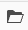

# Padselectie {#path-selection}

Vaak is het tijdens het ontwerpen nodig een andere bron te selecteren, bijvoorbeeld wanneer u een koppeling naar een andere pagina definieert of een afbeelding selecteert. Om een pad gemakkelijk te selecteren, [padvelden](#path-fields) aanbieden en de [padbrowser](#path-browser) maakt een robuustere selectie mogelijk.

## Padvelden {#path-fields}

Het voorbeeld dat hier wordt gebruikt om te illustreren is de afbeeldingscomponent. Zie voor meer informatie over het gebruik en bewerken van componenten [Componenten voor pagina-ontwerp.](/help/sites-cloud/authoring/page-editor/components.md)

De gebieden van de weg hebben auto-volledige en vooruitblik functionaliteit om het vinden van een middel gemakkelijker te maken.

Klik op de knop **Dialoogvenster Selectie openen** in het veld Pad wordt de knop [padbrowser](#path-browser) voor gedetailleerdere selectieopties.

U kunt ook beginnen te typen in het veld Pad en AEM biedt overeenkomende paden terwijl u typt.

## Padbrowser {#path-browser}

De padbrowser is geordend als de [kolomweergave](/help/sites-cloud/authoring/basic-handling.md#column-view) van de [**Sites** console,](/help/sites-cloud/authoring/sites-console/introduction.md) de mogelijkheid van een gedetailleerdere selectie van de middelen.

* Wanneer een bron is geselecteerd, wordt de **Selecteren** in de rechterbovenhoek van het dialoogvenster wordt geactiveerd.
   * Selecteer deze optie om de selectie te bevestigen of **Annuleren** om af te breken.
* Als de context de selectie van meerdere bronnen toestaat, wordt door het selecteren van een bron ook het **Selecteren** , maar voegt ook een telling van het aantal geselecteerde middelen aan het hoger-recht van het venster toe.
   * Klik op de **X** naast het getal om de selectie op te heffen.
* Wanneer u door de boom navigeert, wordt uw plaats weerspiegeld in de broodkruimels bij de bovenkant van de dialoog.
   * Deze broodkruimels kunnen ook worden gebruikt om snel binnen de middelhiërarchie te springen.
* U kunt op elk gewenst moment het zoekveld boven in het dialoogvenster gebruiken.
   * Klik op de knop **X** in het zoekveld om de zoekopdracht te wissen.
* Als u uw zoekopdracht wilt beperken, kunt u de filteropties zichtbaar maken en de resultaten filteren op basis van een bepaald pad.

