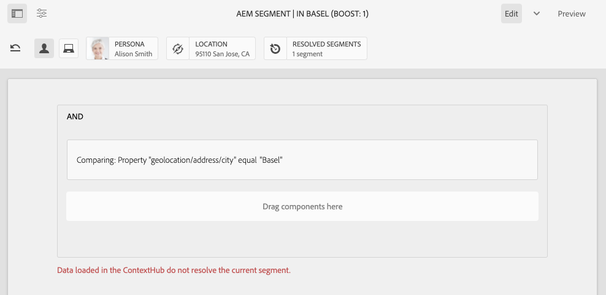

# Het vormen Segmentatie met ContextHub{#configuring-segmentation-with-contexthub}

Segmentering is een belangrijke overweging bij het maken van een campagne. Zie Segmentatie [](segmentation.md) begrijpen voor informatie over hoe segmentatie werkt en zeer belangrijke termijnen.

Afhankelijk van de informatie die u reeds over uw plaatsbezoekers en de doelstellingen hebt verzameld u wilt bereiken, zult u de segmenten en de strategieën nodig voor uw gerichte inhoud moeten bepalen.

Deze segmenten worden vervolgens gebruikt om een bezoeker specifieke inhoud te bieden. [De hier gedefinieerde activiteiten](activities.md) kunnen op elke pagina worden opgenomen en definiëren voor welk bezoekerssegment de gespecialiseerde inhoud van toepassing is.

AEM kunt u de ervaringen van uw gebruikers eenvoudig aanpassen. Het staat u ook toe om de resultaten van uw segmentdefinities te verifiëren.

## Segmenten openen {#accessing-segments}

De console van het [publiek](audiences.md) wordt gebruikt om segmenten voor ContextHub evenals publiek voor uw rekening van Adobe Target te beheren. Deze documentatie behandelt het beheren van segmenten voor ContextHub.

Als u toegang wilt krijgen tot uw segmenten, selecteert u **Navigatie > Aanpassing aanpassen > Soorten publiek**.


## Segmenteditor {#segment-editor}

<!--The **Segment Editor** allows you to easily modify a segment. To edit a segment, select a segment in the [list of segments](/help/sites-administering/segmentation.md#accessing-segments) and click the **Edit** button.-->
Met de **segmenteditor** kunt u een segment gemakkelijk wijzigen. Als u een segment wilt bewerken, selecteert u een segment in de lijst met segmenten en klikt u op de knop **Bewerken** .


Met de componentenbrowser kunt u **EN** en **OF** containers toevoegen om de segmentlogica te bepalen, dan extra componenten toevoegen om eigenschappen en waarden of verwijzingsmanuscripten en andere segmenten te vergelijken om de selectiecriteria (zie het [Creëren van een Nieuw Segment](#creating-a-new-segment)) te bepalen om het nauwkeurige scenario voor het selecteren van het segment te bepalen.

Wanneer de volledige verklaring aan waar evalueert dan heeft het segment opgelost. Wanneer meerdere segmenten van toepassing zijn, wordt ook de **Boost** -factor gebruikt. Zie [Een nieuw segment](#creating-a-new-segment) maken voor meer informatie over de versterkingsfactor.

>[!CAUTION]
>
>De segmentredacteur controleert geen cirkelverwijzingen. Zo verwijst segment A bijvoorbeeld naar een ander segment B, dat op zijn beurt weer naar segment A verwijst. U moet ervoor zorgen dat de segmenten geen cirkelverwijzingen bevatten.

### Containers {#containers}

De volgende containers zijn beschikbaar uit-van-de-doos en staan u toe om vergelijkingen en verwijzingen samen te groeperen voor booleaanse evaluatie. U kunt deze vanuit de componentbrowser naar de editor slepen. Zie de volgende sectie [Using AND and OR Containers](#using-and-and-or-containers) voor meer informatie.

|  |  |
|---|---|
| Container en | De operator Boolean AND |
| Container OF | De operator Boolean OR |

### Vergelijkingen {#comparisons}

De volgende segmentvergelijkingen zijn beschikbaar uit-van-de-doos om segmenteigenschappen te evalueren. U kunt deze vanuit de componentbrowser naar de editor slepen.

|  |  |
|---|---|
| Eigenschap-waarde | Vergelijkt een bezit van een opslag met een bepaalde waarde |
| Eigenschap-eigenschap | Vergelijkt één bezit van een opslag aan een ander bezit |
| Eigenschap-segmentverwijzing | Vergelijkt een bezit van een opslag aan een ander referenced segment |
| Eigenschapverwijzing | Vergelijkt een bezit van een opslag met de resultaten van een manuscript |
| Referentie-script voor segment | Vergelijkt een segment waarnaar wordt verwezen met de resultaten van een script |

>[!NOTE]
>
>Wanneer het vergelijken van waarden, als het gegevenstype van de vergelijking niet (d.w.z. wordt geplaatst om auto te ontdekken) wordt geplaatst, zal de segmenteringsmotor van ContextHub eenvoudig de waarden zoals javascript vergelijken. Er worden geen waarden naar de verwachte typen gecast, wat tot misleidende resultaten kan leiden. Bijvoorbeeld:
>
>`null < 30 // will return true`
>
>Daarom wanneer [het creëren van een segment](#creating-a-new-segment), zou u een **gegevenstype** moeten selecteren wanneer de types van vergeleken waarden gekend zijn. Bijvoorbeeld:
>
>Wanneer het vergelijken van het bezit `profile/age`, weet u reeds dat het vergeleken type **aantal** zal zijn, zodat zelfs als `profile/age` niet geplaatst is, zal een vergelijking `profile/age` minder-dan 30 **vals** terugkeren, zoals u zou verwachten.

### Verwijzingen {#references}

De volgende verwijzingen zijn beschikbaar uit-van-de-doos om rechtstreeks met een manuscript of een ander segment te verbinden. U kunt deze vanuit de componentbrowser naar de editor slepen.

|  |  |
|---|---|
| Segmentverwijzing | Evalueer het referenced segment |
| Scriptreferentie | Evalueer het referenced manuscript. Zie de volgende sectie [Scriptverwijzingen](#using-script-references) gebruiken voor meer informatie. |

## Een nieuw segment maken {#creating-a-new-segment}

Het nieuwe segment definiëren:

1. Na de [toegang tot van de segmenten](#accessing-segments), [navigeer aan de omslag](#organizing-segments) waar u het segment zou willen tot stand brengen, of het in de wortel verlaten.

1. Tik of klik op de knop **Maken** en selecteer ContextHub-segment **maken**.

   

1. In het **Nieuwe Segment** ContextHub, ga een titel voor het segment evenals een verhogingswaarde in indien vereist en tik dan of klik **creeert**.

   

   Elk segment heeft een verhogingsparameter die als weegfactor wordt gebruikt. Een hoger getal geeft aan dat het segment bij voorkeur wordt geselecteerd boven een segment met een lager getal in gevallen waarin meerdere segmenten geldig zijn.

   * Minimumwaarde: `0`
   * Maximumwaarde: `1000000`

1. Van de segmentconsole, geef uw onlangs-gecreeerd segment uit om het in de segmentredacteur te openen.
1. Sleep een vergelijking of een verwijzing naar de segmentredacteur het in het gebrek EN container zal verschijnen.
1. Dubbelklik op of tik op de configureoptie van de nieuwe verwijzing of het nieuwe segment om de specifieke parameters te bewerken. In dit voorbeeld testen we mensen in Bazel.

   

   Stel indien mogelijk altijd een **gegevenstype** in om ervoor te zorgen dat uw vergelijkingen goed worden geëvalueerd. Zie [Vergelijkingen](#comparisons) voor meer informatie.

1. Klik op **Gereed** om uw definitie op te slaan:
1. Voeg desgewenst meer componenten toe. U kunt booleaanse expressies formuleren met behulp van de containercomponenten voor AND en OR vergelijkingen (zie [Using AND and Or Containers](#using-and-and-or-containers) verderop). Met de segmentredacteur kunt u componenten schrappen niet meer nodig, of hen slepen aan nieuwe posities binnen de verklaring.

### AND en OR-containers gebruiken {#using-and-and-or-containers}

Gebruikend EN en OF containercomponenten, kunt u complexe segmenten in AEM construeren. Hierbij is het nuttig om op een aantal basispunten te letten:

* Het hoogste niveau van de definitie is altijd de EN container die aanvankelijk wordt gecreeerd. Dit kan niet worden veranderd, maar heeft geen effect op de rest van uw segmentdefinitie.
* Zorg ervoor dat het nesten van de container zinvol is. De containers kunnen als steunen van uw booleaanse uitdrukking worden bekeken.

In het volgende voorbeeld worden bezoekers geselecteerd die worden beschouwd in onze doelgroep Zwitserland:

```text
 People in Basel

 OR

 People in Zürich
```

U begint door een OF containercomponent binnen het gebrek EN container te plaatsen. Binnen de container OR kunt u de bezit of verwijzingscomponenten toevoegen.


U kunt meerdere AND- en OR-operatoren naar wens nesten.

### Scriptverwijzingen gebruiken {#using-script-references}

Door de component van de Verwijzing van het Manuscript te gebruiken, kan de evaluatie van een segmentbezit aan een extern manuscript worden afgevaardigd. Zodra het manuscript behoorlijk wordt gevormd, kan het als een andere component van een segmentvoorwaarde worden gebruikt.

#### Een script definiëren als naslaggids {#defining-a-script-to-reference}

1. Bestand toevoegen aan `contexthub.segment-engine.scripts` clientlib.
1. Voer een functie uit die een waarde terugkeert. Bijvoorbeeld:

   ```javascript
   ContextHub.console.log(ContextHub.Shared.timestamp(), '[loading] contexthub.segment-engine.scripts - script.profile-info.js');
   
   (function() {
       'use strict';
   
       /**
        * Sample script returning profile information. Returns user info if data is available, false otherwise.
        *
        * @returns {Boolean}
        */
       var getProfileInfo = function() {
           /* let the SegmentEngine know when script should be re-run */
           this.dependOn(ContextHub.SegmentEngine.Property('profile/age'));
           this.dependOn(ContextHub.SegmentEngine.Property('profile/givenName'));
   
           /* variables */
           var name = ContextHub.get('profile/givenName');
           var age = ContextHub.get('profile/age');
   
           return name === 'Joe' && age === 123;
       };
   
       /* register function */
       ContextHub.SegmentEngine.ScriptManager.register('getProfileInfo', getProfileInfo);
   
   })();
   ```

1. Registreer het script bij `ContextHub.SegmentEngine.ScriptManager.register`.

Als het script afhankelijk is van aanvullende eigenschappen, moet het script worden aangeroepen `this.dependOn()`. Als het script bijvoorbeeld afhankelijk is van `profile/age`:

```javascript
this.dependOn(ContextHub.SegmentEngine.Property('profile/age'));
```

#### Naar een script verwijzen {#referencing-a-script}

1. Maak een ContextHub-segment.
1. Voeg **de component van de Verwijzing** van het Manuscript in de gewenste plaats van het segment toe.
1. Open het dialoogvenster Bewerken van de **component Scriptreferentie** . Als het script [correct is geconfigureerd](#defining-a-script-to-reference), moet het beschikbaar zijn in de vervolgkeuzelijst **Scriptnaam** .

## Segmenten ordenen {#organizing-segments}

Als u veel segmenten hebt, kunnen deze moeilijk te beheren worden als een platte lijst. In dergelijke gevallen kan het handig zijn om mappen te maken voor het beheer van uw segmenten.

### Een nieuwe map maken {#create-folder}

1. Nadat u de segmenten [hebt](#accessing-segments)geopend, klikt of tikt u op de knop **Maken** en selecteert u **Map**.

   

1. Geef een **titel** en een **naam** voor de map op.
   * De **titel** moet beschrijvend zijn.
   * De **Naam** wordt de knooppuntnaam in de gegevensopslagruimte.
      * Deze wordt automatisch gegenereerd op basis van de titel en aangepast volgens de naamgevingsconventies [AEM.](/help/implementing/developing/introduction/naming-conventions.md)
      * Deze kan zo nodig worden aangepast.

   

1. Tik of klik op **Maken**.

   

1. De map wordt weergegeven in de lijst met segmenten.
   * Hoe u de kolommen sorteert, is van invloed op de plaats in de lijst waar de nieuwe map wordt weergegeven.
   * Tik of klik op de kolomkoppen om de sortering aan te passen.
      

### Bestaande mappen wijzigen {#modify-folders}

1. Nadat u de segmenten [hebt](#accessing-segments)geopend, klikt of tikt u op de map die u wilt wijzigen om deze te selecteren.

   

1. Tik of klik op Naam **wijzigen** op de werkbalk om de naam van de map te wijzigen.

1. Geef een nieuwe **maptitel** op en tik of klik op **Opslaan**.

   

>[!NOTE]
>
>Bij het wijzigen van de mapnaam kan alleen de titel worden gewijzigd. De naam kan niet worden gewijzigd.

### Een map verwijderen

1. Nadat u de segmenten [hebt](#accessing-segments)geopend, klikt of tikt u op de map die u wilt wijzigen om deze te selecteren.

   

1. Tik of klik op **Verwijderen** op de werkbalk om de map te verwijderen.

1. Een dialoogvenster bevat een lijst met mappen die zijn geselecteerd om te worden verwijderd.

   

   * Tik of klik op **Verwijderen** om te bevestigen.
   * Tik of klik op **Annuleren** om af te breken.

1. Als een van de geselecteerde mappen submappen of segmenten bevat, moet de verwijdering ervan worden bevestigd.

   

   * Tik of klik op **Verwijderen** forceren om te bevestigen.
   * Tik of klik op **Annuleren** om af te breken.

>[!NOTE]
>
> Het is niet mogelijk een segment van de ene map naar de andere te verplaatsen.

## De toepassing van een segment testen {#testing-the-application-of-a-segment}

Zodra het segment is bepaald, kunnen de potentiële resultaten met de hulp van **[ContextHub](contexthub.md)worden getest.**

1. Een voorvertoning van een pagina weergeven
1. Klik het pictogram ContextHub om de toolbar te openbaren ContextHub
1. Selecteer een persoon die overeenkomt met het segment dat u hebt gemaakt
1. ContextHub zal de toepasselijke segmenten voor de geselecteerde persoon oplossen

Bijvoorbeeld, is onze eenvoudige segmentdefinitie om gebruikers in Bazel te identificeren gebaseerd op de plaats van de gebruiker. Als u een specifieke persoon laadt die overeenkomt met die criteria, wordt getoond of het segment is opgelost:


Of indien deze niet is opgelost:



>[!NOTE]
>
>Alle kenmerken worden onmiddellijk opgelost, maar de meeste wijzigingen worden alleen toegepast wanneer de pagina opnieuw wordt geladen.

Dergelijke tests kunnen ook worden uitgevoerd op inhoudspagina&#39;s en in combinatie met gerichte inhoud en verwante **activiteiten** en **ervaringen**.

Als u een activiteit en ervaring hebt ingesteld, kunt u uw segment gemakkelijk testen met de activiteit. Zie de verwante [documentatie over het ontwerpen van doelinhoud](targeted-content.md)voor meer informatie over het instellen van een activiteit.

1. In de bewerkingsmodus van een pagina waarop u doelinhoud hebt ingesteld, ziet u dat de inhoud als doel is ingesteld via het pijlpictogram op de inhoud.
1. De schakelaar aan voorproefwijze en het gebruiken van de contexthub, schakelaar aan een persoon die niet de segmentatie aanpast die voor de ervaring wordt gevormd.
1. De schakelaar aan een persoon die de segmentatie aanpast die voor de ervaring wordt gevormd en ziet dat de ervaring dienovereenkomstig verandert.

## Uw segment gebruiken {#using-your-segment}

Segmenten worden gebruikt om de werkelijke inhoud te bepalen die door specifieke doelgroepen wordt gezien. Zie Soorten publiek [beheren](audiences.md) voor meer informatie over doelgroepen en segmenten en [Doelinhoud](targeted-content.md) ontwerpen over het gebruik van doelgroepen en segmenten om inhoud te sturen.
