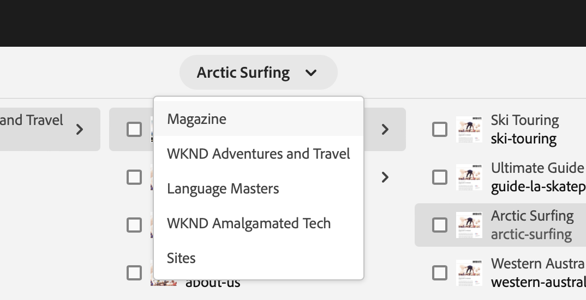

# Handleiding Snel aan de slag voor ontwerpen {#quick-guide-to-authoring}

Begin hier voor een snelle gids op hoog niveau waarmee u inhoud kunt gaan ontwerpen met de **Sites** console.

>[!TIP]
>
>Deze snelle startgids concentreert zich op het auteursrecht van Plaatsen, nochtans zijn de meeste concepten globaal toepasselijk op andere consoles.

## Het begint allemaal in de console van Plaatsen. {#sites-console}

Of u nieuwe inhoud wilt maken of uw bestaande inhoud wilt weergeven en beheren, het centrale overzicht voor u is de **Sites** console.

Wanneer u zich voor het eerst aanmeldt bij AEM, arriveert u op het algemene navigatiescherm. Tik of klik gewoon **Sites** om de **Sites** console.

Tik of klik op de knop **Adobe Experience Manager** Hiermee opent u een vervolgkeuzelijst van de algemene navigatie linksboven in een AEM scherm.

Eenmaal in het dialoogvenster **Sites** -console, is uw inhoud eenvoudig te navigeren en wordt standaard weergegeven in een kolomweergave.

## Weergaven {#views}

Standaard worden de **Sites** console wordt geopend in **Kolom** weergeven. Elk hiërarchisch niveau wordt weergegeven als een kolom, die zichzelf goed leent voor op het web gebaseerde, hiërarchisch geordende inhoud.

Tik of klik op een item in een kolom om het te selecteren of open het volgende niveau omlaag in de hiërarchie. Een geselecteerd item wordt aangegeven met een vinkje.

Er zijn twee aanvullende weergaven beschikbaar:

* **Kaartweergave** - In deze weergave wordt elk item voorgesteld als een gemakkelijk te manipuleren kaart, waardoor extra opties gemakkelijk toegankelijk zijn.
* **Lijstweergave** - Dit stelt één enkel niveau van een hiërarchie als één enkele lijst voor, die meer detail over de individuele punten verstrekken.

Gebruik de weergaveschakelaar linksboven in het scherm om te schakelen tussen weergaven. In dit document wordt de standaardweergave voor kolommen gebruikt.

## Navigeren door inhoud {#navigating}

**Kolomweergave** geeft u inhoud weer als een reeks trapsgewijze kolommen. Als u een item in de huidige kolom selecteert, worden de details in de volgende kolom rechts weergegeven als het een document is, of wordt de inhoud van het volgende hiërarchische niveau weergegeven als het een map is.

Op deze manier kunt u de inhoudstructuur naar boven en naar beneden doorlopen.

Als u snel tussen niveaus wilt springen, kunt u de broodkruimels boven aan de pagina gebruiken.

U kunt op elk gewenst moment ook het zoekpictogram rechtsboven in het scherm gebruiken om bepaalde inhoud te zoeken.

Het onderzoek verschijnt als drop-down bekleding over de volledige console. Voer zoektermen in om de inhoud te zoeken.

## Inhoud maken {#creating}

Als u een nieuwe pagina wilt maken, navigeert u gewoon naar de gewenste locatie in de inhoudshiërarchie en tikt u op de knop **Maken** in de werkbalk.

De beschikbare opties zijn contextafhankelijk. Als u de basis van de inhoudsstructuur vormt, kunt u een geheel nieuwe site maken. Anders kunt u nieuwe pagina&#39;s of andere aan pagina&#39;s gerelateerde inhoud maken.

Afhankelijk van wat u selecteert om te creëren, zal de aangewezen tovenaar u door het creatieproces begeleiden.

## Inhoud bewerken {#editing}

Als u een pagina wilt bewerken, tikt u of klikt u om de pagina in het dialoogvenster **Sites** console. Tik vervolgens op de werkbalk die wordt weergegeven of klik op de knop **Bewerken** pictogram.

Hiermee wordt de pagina geopend in de editor die geschikt is voor de inhoud.

Als u gewoon de eigenschappen van een pagina wilt bijwerken, zoals tags of de naam ervan, kunt u tikken of op de knop **Eigenschappen** in de werkbalk.

## Inhoud ordenen {#organizing}

Als u een pagina wilt verplaatsen of kopiëren, selecteert u de pagina in de console en vervolgens tikt u op de werkbalk of klikt u op **Verplaatsen** of **Kopiëren**. Hiermee wordt een wizard gestart die u door de stappen voor het verplaatsen of kopiëren begeleidt en waarmee u de naam en locatie van de resulterende pagina definieert.

## Inhoud publiceren {#publishing}

Wanneer u klaar bent met het aanbrengen van de veranderingen die u aan uw inhoud wilde door te gebruiken **Sites** -console, kunt u de inhoud publiceren. Selecteer de inhoud die u wilt publiceren en tik op de knop **Snel publiceren** in de werkbalk.

De publicatie bevestigen met een andere tik of klikken op **Publiceren** in het dialoogvenster.

## Aanvullende bronnen {#additional-resources}

Dit is slechts een korte inleiding op de macht van het ontwerpen van de inhoud van Plaatsen en als dusdanig behandelt niet elk onderwerp of elke optie.

Hier zijn sommige meer middelen die diepgaand over alle eigenschappen van de console gaan evenals onderwerpen over inhoud creatie in het algemeen bespreken.

* [Basisverwerking](/help/sites-cloud/authoring/basic-handling.md)
* [Concepten van authoring](/help/sites-cloud/authoring/author-publish.md)
* [Sites-console](/help/sites-cloud/authoring/sites-console/introduction.md)
* [Pagina-editor](/help/sites-cloud/authoring/page-editor/introduction.md)
* [Pagina&#39;s publiceren](/help/sites-cloud/authoring/sites-console/publishing-pages.md)
