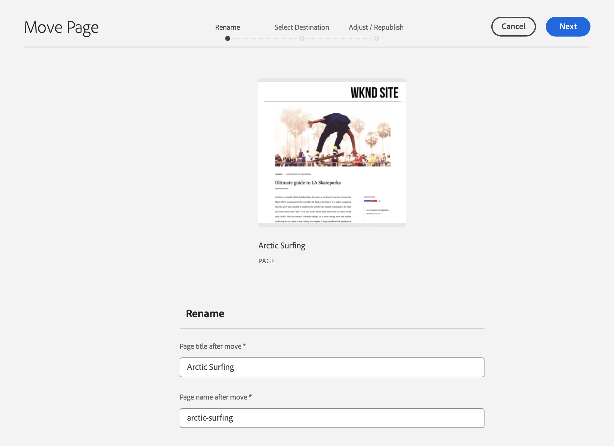

# Handleiding Snel aan de slag voor ontwerpen {#quick-guide-to-authoring}

Begin hier voor een snelle, high-level gids om u te krijgen begonnen inhoud te ontwerpen gebruikend de **console van Plaatsen**.

>[!TIP]
>
>Deze snelle startgids concentreert zich op het auteursrecht van Plaatsen, nochtans zijn de meeste concepten globaal toepasselijk op andere consoles.

## Het begint allemaal in de console van Plaatsen. {#sites-console}

Of u nieuwe inhoud wilt creëren of uw bestaande inhoud bekijken en beheren, is het centrale overzicht voor u de **console van de Plaatsen** &lbrace;.

Wanneer u zich voor het eerst aanmeldt bij AEM, arriveert u op het algemene navigatiescherm. Tik of klik eenvoudig **Plaatsen** om de **console van Plaatsen** te openen.

Om tot de globale navigatie van om het even welke andere plaats in AEM toegang te hebben, tik of klik de **verbinding van Adobe Experience Manager** bij top-left van om het even welk AEM scherm, dat een drop-down bekleding van de globale navigatie opent.

Zodra in de **console van Plaatsen**, is uw inhoud eenvoudig te navigeren en in een kolommening door gebrek voorgesteld.

## Weergaven {#views}

Door gebrek opent de **console van de Plaatsen** &lbrace;in **Kolom** mening. Elk hiërarchisch niveau wordt weergegeven als een kolom, die zichzelf goed leent voor op het web gebaseerde, hiërarchisch geordende inhoud.

Tik of klik op een item in een kolom om het te selecteren of open het volgende niveau omlaag in de hiërarchie. Een geselecteerd item wordt aangegeven met een vinkje.

Er zijn twee aanvullende weergaven beschikbaar:

* **Mening van de Kaart** - Deze mening stelt elke ingang als gemakkelijk-manipuleerbare kaart voor, die extra opties gemakkelijk toegankelijk maken.
* **Mening van de Lijst** - dit stelt één enkel niveau van een hiërarchie als één enkele lijst voor, die meer detail op de individuele punten verstrekt.

Gebruik de weergaveschakelaar linksboven in het scherm om te schakelen tussen weergaven. In dit document wordt de standaardweergave voor kolommen gebruikt.

## Navigeren door inhoud {#navigating}

**de Mening van de Kolom** stelt u inhoud als reeks cascading kolommen voor. Als u een item in de huidige kolom selecteert, worden de details in de volgende kolom rechts weergegeven als het een document is, of wordt de inhoud van het volgende hiërarchische niveau weergegeven als het een map is.

Op deze manier kunt u de inhoudstructuur naar boven en naar beneden doorlopen.

Als u snel tussen niveaus wilt springen, kunt u de broodkruimels boven aan de pagina gebruiken.

U kunt op elk gewenst moment ook het zoekpictogram rechtsboven in het scherm gebruiken om bepaalde inhoud te zoeken.

Het onderzoek verschijnt als drop-down bekleding over de volledige console. Voer zoektermen in om de inhoud te zoeken.

## Inhoud maken {#creating}

Om een nieuwe pagina tot stand te brengen, navigeer eenvoudig aan waar u het in de inhoudshiërarchie wilt zijn en dan tikt of klikt **creeer** knoop in de toolbar.

De beschikbare opties zijn contextafhankelijk. Als u de basis van de inhoudsstructuur vormt, kunt u een geheel nieuwe site maken. Anders kunt u nieuwe pagina&#39;s of andere aan pagina&#39;s gerelateerde inhoud maken.

Afhankelijk van wat u selecteert om te creëren, zal de aangewezen tovenaar u door het creatieproces begeleiden.

## Inhoud bewerken {#editing}

Om een pagina uit te geven, tik of klik om de pagina in de **console van Plaatsen** te selecteren. Dan in de toolbar die verschijnt, tikt of klikt **geeft** pictogram uit.

Hiermee wordt de pagina geopend in de editor die geschikt is voor de inhoud.

Als u wenst om de eigenschappen van een pagina zoals markeringen of zijn naam eenvoudig bij te werken, kunt u het **pictogram van Eigenschappen** in de toolbar tikken of klikken.

## Inhoud ordenen {#organizing}

Om een pagina te bewegen of te kopiëren, selecteer de pagina in de console en dan in de toolbarkraan of klik **Beweging** of **Exemplaar**. Hiermee wordt een wizard gestart die u door de stappen voor het verplaatsen of kopiëren begeleidt en waarmee u de naam en locatie van de resulterende pagina definieert.

## Inhoud publiceren {#publishing}

Wanneer u wordt gebeëindigd die de veranderingen aanbrengen die u aan uw inhoud door de **console van Plaatsen** te gebruiken wilde, kunt u de inhoud publiceren. Selecteer de inhoud u wilt publiceren en tikken of **Snelle Publish** pictogram in de toolbar klikken.

Bevestig de publicatie met een andere kraan of klik op **Publish** in de dialoog.

## Aanvullende bronnen {#additional-resources}

Dit is slechts een korte inleiding op de macht van het ontwerpen van de inhoud van Plaatsen en als dusdanig behandelt niet elk onderwerp of elke optie.

Hier zijn sommige meer middelen die diepgaand over alle eigenschappen van de console gaan evenals onderwerpen over inhoud creatie in het algemeen bespreken.

* [Basisverwerking](/help/sites-cloud/authoring/basic-handling.md)
* [Concepten van authoring](/help/sites-cloud/authoring/author-publish.md)
* [Sites-console](/help/sites-cloud/authoring/sites-console/introduction.md)
* [Pagina-editor](/help/sites-cloud/authoring/page-editor/introduction.md)
* [Pagina&#39;s publiceren](/help/sites-cloud/authoring/sites-console/publishing-pages.md)
