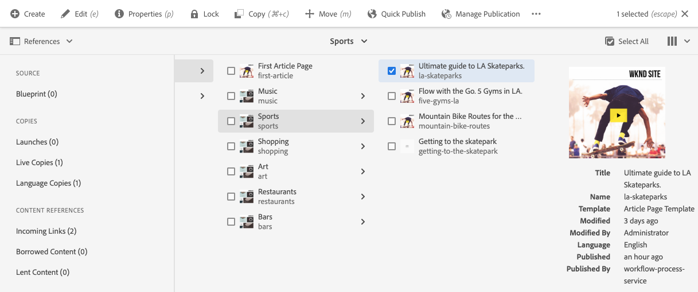
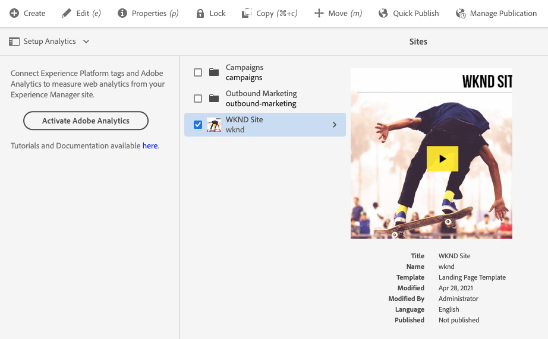

# Zijpaneel siteconsole {#side-panel}

Leer hoe u het zijpaneel in de AEM gebruikt **Sites** -console om uw inhoud beter te begrijpen en te navigeren.

## Afdrukstand {#orientation}

Het zijpaneel is standaard gesloten wanneer u de **Sites** console. Op deze manier wordt het scherm volledig aan uw inhoud gewijd.

Tik of klik op de knop **Zijpaneel** in het deelvenster **Sites** consolewerkbalk om het zijpaneel te activeren en uw weergave van de inhoud te kiezen.

* [Alleen inhoud](#content-only)
* [Inhoudsstructuur](#content-tree)
* [Tijdlijn](#timeline)
* [Verwijzingen](#references)
* [Site](#site)
* [Filter](#filter)
* [Analyses instellen](#setup-analytics)

De geselecteerde huidige weergave wordt aangegeven met een blauw vinkje in de vervolgkeuzelijst en het pictogram van het zijpaneel in de werkbalk wordt bijgewerkt met de naam van de geselecteerde weergave.

## Alleen inhoud {#content-only}

In deze weergave van het zijpaneel wordt het paneel in feite uitgeschakeld, zodat alleen de inhoud van uw site wordt weergegeven.

>[!TIP]
>
>Het accent/de achtergrond van het graf gebruiken `´` sneltoets om over te schakelen naar de weergave Alleen inhoud van het zijpaneel.

## Inhoudsstructuur {#content-tree}

In deze weergave van het zijpaneel wordt de inhoud weergegeven in een boomstructuur. Met de inhoudsstructuur kunt u snel door de sitehiërarchie in het zijpaneel navigeren en veel informatie over de pagina&#39;s in de huidige map bekijken.

Een naar rechts wijzend chevron naast een punt in de boom wijst op een knoop die kan worden uitgebreid om zijn kinderen te openbaren. Tik of klik op het chevron om de kinderen te onthullen.

De console toont de inhoud van het momenteel-uitgezochte punt in de inhoudsboom.

Met het zijpaneel van de inhoudsboomstructuur in combinatie met een lijst of kaartmening, kunt u gemakkelijk de hiërarchische structuur van het project zien en gemakkelijk over de inhoudsstructuur met de zijpaneel van de inhoudsboom navigeren, en gedetailleerde paginainformatie in de lijstmening bekijken.

>[!TIP]
>
>* Gebruik de `Alt+1` sneltoets om over te schakelen naar de weergave van de inhoudsboomstructuur van het zijpaneel.
>* Wanneer een item in de hiërarchische weergave is geselecteerd, kunt u met de pijltoetsen snel door de hiërarchie navigeren.
>* Zie [sneltoetsen](/help/sites-cloud/authoring/sites-console/keyboard-shortcuts.md) voor meer informatie .

## Tijdlijn {#timeline}

De tijdlijn kan worden gebruikt om gebeurtenissen weer te geven die invloed hebben gehad op de geselecteerde bron. U kunt deze ook gebruiken om bepaalde gebeurtenissen te starten, zoals workflows of versies.

De **Tijdlijn** In het zijpaneel kunt u verschillende gebeurtenissen met betrekking tot een geselecteerd item selecteren als typen in een vervolgkeuzelijst:

* Opmerkingen
* [Annotaties](/help/sites-cloud/authoring/page-editor/annotations.md)
* [Activiteiten](/help/sites-cloud/authoring/personalization/activities.md)
* [Lanceringen](/help/sites-cloud/authoring/launches/overview.md)
* [Versies](/help/sites-cloud/authoring/sites-console/page-versions.md)
* [Workflows](/help/sites-cloud/authoring/workflows/overview.md)
   * Er wordt geen informatie weergegeven voor tijdelijke workflows omdat er voor deze workflows geen historische gegevens worden opgeslagen.<!--With the exception of [transient workflows](/help/sites-developing/workflows.md#transient-workflows) as no history information is saved for these-->
* Alles tonen

Daarnaast kunt u opmerkingen over het geselecteerde item toevoegen/weergeven met de opdracht **Opmerking** weergegeven onder aan de lijst met gebeurtenissen. Een opmerking typen, gevolgd door `Return` registreert de opmerking. Deze wordt weergegeven wanneer **Opmerkingen** of **Alles weergeven** is geselecteerd.

In de **Sites** console u kunt tot extra eigenschappen ook toegang hebben via de ellipsknoop naast **Opmerking** veld.

* [Een versie opslaan](/help/sites-cloud/authoring/sites-console/page-versions.md)
* [Een workflow starten](/help/sites-cloud/authoring/workflows/applying.md)

>[!TIP]
>
>* Gebruik de `Alt+2` sneltoets om over te schakelen naar de tijdlijnweergave van het zijpaneel.
>* Zie [sneltoetsen](/help/sites-cloud/authoring/sites-console/keyboard-shortcuts.md) voor meer informatie .

## Verwijzingen {#references}

De **Verwijzingen** de mening toont een lijst van verwijzingstypes aan of van aan het middel dat in de console wordt geselecteerd.

Selecteer het juiste referentietype voor meer informatie. In bepaalde situaties zijn aanvullende acties beschikbaar wanneer u een specifieke verwijzing selecteert, zoals:

* **Binnenkomende koppelingen**, biedt een lijst met pagina&#39;s die naar de pagina verwijzen, samen met directe toegang tot **Bewerken** wanneer u een specifieke koppeling selecteert, wordt een van deze pagina&#39;s weergegeven.
   * Dit kan alleen statische koppelingen weergeven, niet dynamisch gegenereerde koppelingen, zoals koppelingen uit de component List.
* [Starten](/help/sites-cloud/authoring/launches/overview.md), biedt toegang tot verwante lanceringen
* [Actieve kopieën](/help/sites-cloud/administering/msm/overview.md) Hiermee geeft u de paden weer van alle live kopieën die op de geselecteerde bron zijn gebaseerd.
* [Blauwdruk](/help/sites-cloud/administering/msm/best-practices.md), geeft details en diverse acties
* [Kopieën van talen](/help/sites-cloud/administering/translation/managing-projects.md#creating-translation-projects-using-the-references-panel), geeft details en diverse acties

## Site {#site}

De **Site** in het zijpaneel worden de details van de sites weergegeven [gemaakt met een sitesjabloon.](/help/sites-cloud/administering/site-creation/create-site.md)

Zie het document [Het Sitepaneel gebruiken om uw sitethema te beheren](/help/sites-cloud/administering/site-creation/site-rail.md) voor meer informatie over hoe u het deelvenster kunt gebruiken om het [thema van uw site.](/help/sites-cloud/administering/site-creation/site-themes.md).

Als u nog niet de front-end pijpleiding hebt opstelling om op thema-gebaseerde plaats verwezenlijking toe te laten, zal het zijpaneel die optie aanbieden.

>[!TIP]
>
>Een end-to-end beschrijving van het proces om een plaats van een malplaatje te creëren en zijn thema aan te passen kan in worden gevonden [Reis voor snel maken van site.](/help/journey-sites/quick-site/overview.md)

## Filter {#filter}

De **Filter** is vergelijkbaar met het deelvenster [zoekfunctie](/help/sites-cloud/authoring/search.md) terwijl de juiste locatiefilters al zijn ingesteld, kunt u de inhoud die u wilt bekijken verder filteren.

In tegenstelling tot andere weergaven van het zijpaneel kunt u naar een andere weergave schakelen door op de knop `X` in het zoekveld.

## Analyses instellen {#setup-analytics}

In deze weergave kunt u snel Adobe Analytics instellen voor een geselecteerde site.

