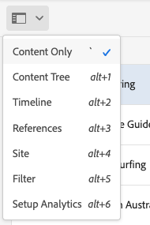
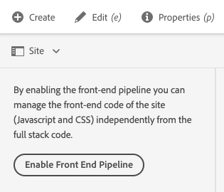

# Zijpaneel siteconsole {#side-panel}

Leer hoe te om het zijpaneel in de AEM **console van Plaatsen** te gebruiken om uw inhoud beter te begrijpen en te navigeren.

## Afdrukstand {#orientation}

Het zijpaneel is door gebrek gesloten wanneer u de **console van Plaatsen** ingaat. Op deze manier wordt het scherm volledig aan uw inhoud gewijd.

Tik of klik het **Zijpaneel** pictogram in de **3} consoletoolbar van Plaatsen {om het zijpaneel te activeren en uw mening van de inhoud te kiezen.**

* [Alleen inhoud](#content-only)
* [Inhoudsstructuur](#content-tree)
* [Tijdlijn](#timeline)
* [Verwijzingen](#references)
* [Site](#site)
* [Filter](#filter)
* [Analyses instellen](#setup-analytics)

De geselecteerde huidige weergave wordt aangegeven met een blauw vinkje in de vervolgkeuzelijst en het pictogram van het zijpaneel in de werkbalk wordt bijgewerkt met de naam van de geselecteerde weergave.

## Alleen inhoud {#content-only}

In deze weergave van het zijpaneel wordt het paneel in feite uitgeschakeld, zodat alleen de inhoud van uw site wordt weergegeven.

>[!TIP]
>
>Gebruik de sneltoets met het accent of de backtick `´` om over te schakelen naar de weergave Alleen inhoud van het zijpaneel.

## Inhoudsstructuur {#content-tree}

In deze weergave van het zijpaneel wordt de inhoud weergegeven in een boomstructuur. Met de inhoudsstructuur kunt u snel door de sitehiërarchie in het zijpaneel navigeren en veel informatie over de pagina&#39;s in de huidige map bekijken.

Een naar rechts wijzend chevron naast een punt in de boom wijst op een knoop die kan worden uitgebreid om zijn kinderen te openbaren. Tik of klik op het chevron om de kinderen te onthullen.

De console toont de inhoud van het momenteel-uitgezochte punt in de inhoudsboom.

Met het zijpaneel van de inhoudsboomstructuur in combinatie met een lijst of kaartmening, kunt u gemakkelijk de hiërarchische structuur van het project zien en gemakkelijk over de inhoudsstructuur met de zijpaneel van de inhoudsboom navigeren, en gedetailleerde paginainformatie in de lijstmening bekijken.

>[!TIP]
>
>* Gebruik de sneltoets `Alt+1` om over te schakelen naar de weergave van de inhoudsstructuur van het zijpaneel.
>* Wanneer een item in de hiërarchische weergave is geselecteerd, kunt u met de pijltoetsen snel door de hiërarchie navigeren.
>* Zie [ toetsenbordkortere weg ](/help/sites-cloud/authoring/sites-console/keyboard-shortcuts.md) voor meer informatie.

## Tijdlijn {#timeline}

De tijdlijn kan worden gebruikt om gebeurtenissen weer te geven die invloed hebben gehad op de geselecteerde bron. U kunt deze ook gebruiken om bepaalde gebeurtenissen te starten, zoals workflows of versies.

Het **paneel van de Chronologie** zijpaneel laat u diverse gebeurtenissen met betrekking tot een geselecteerd punt selecteerbaar als types van een drop-down lijst bekijken:

* Opmerkingen
* [Annotaties](/help/sites-cloud/authoring/page-editor/annotations.md)
* [Activiteiten](/help/sites-cloud/authoring/personalization/activities.md)
* [Lanceringen](/help/sites-cloud/authoring/launches/overview.md)
* [Versies](/help/sites-cloud/authoring/sites-console/page-versions.md)
* [Workflows](/help/sites-cloud/authoring/workflows/overview.md)
   * Merk op dat geen informatie voor voorbijgaande werkschema&#39;s zal worden getoond aangezien geen geschiedenisinformatie voor deze wordt bewaard.<!--With the exception of [transient workflows](/help/sites-developing/workflows.md#transient-workflows) as no history information is saved for these-->
* Alles tonen

Bovendien kunt u commentaren over het geselecteerde punt toevoegen/bekijken door de **doos van de Commentaar** te gebruiken die bij de bodem van de lijst van gebeurtenissen wordt getoond. Als u een opmerking typt die wordt gevolgd door `Return` , wordt de opmerking geregistreerd. Deze wordt weergegeven wanneer **Opmerkingen** of **Alles weergeven** is geselecteerd.

In de **console van Plaatsen** kunt u tot extra eigenschappen via de ellipsis knoop naast het **3} gebied van de Commentaar {ook toegang hebben.**

* [Een versie opslaan](/help/sites-cloud/authoring/sites-console/page-versions.md)
* [Een workflow starten](/help/sites-cloud/authoring/workflows/applying.md)

>[!TIP]
>
>* Gebruik de sneltoets `Alt+2` om over te schakelen naar de tijdlijnweergave van het zijpaneel.
>* Zie [ toetsenbordkortere weg ](/help/sites-cloud/authoring/sites-console/keyboard-shortcuts.md) voor meer informatie.

## Verwijzingen {#references}

De **mening van Verwijzingen** toont een lijst van verwijzingstypes aan of van aan het middel dat in de console wordt geselecteerd.

Selecteer het juiste referentietype voor meer informatie. In bepaalde situaties zijn aanvullende acties beschikbaar wanneer u een specifieke verwijzing selecteert, zoals:

* **Binnenkomende Verbindingen**, verstrekt een lijst van pagina&#39;s die de pagina van verwijzingen voorzien, samen met directe toegang tot **geeft** één van die pagina&#39;s uit wanneer u een specifieke verbinding selecteert.
   * Dit kan alleen statische koppelingen weergeven, niet dynamisch gegenereerde koppelingen, zoals koppelingen uit de component List.
* [ Lanceringen ](/help/sites-cloud/authoring/launches/overview.md), verleent toegang tot verwante lanceringen
* [ Levende Exemplaren ](/help/sites-cloud/administering/msm/overview.md) toont de wegen van alle levende exemplaren die op het geselecteerde middel gebaseerd zijn.
* [ Vervaging ](/help/sites-cloud/administering/msm/best-practices.md), verstrekt details en diverse acties
* [ Exemplaren van Talen ](/help/sites-cloud/administering/translation/managing-projects.md#creating-translation-projects-using-the-references-panel), verstrekt details en diverse acties

## Site {#site}

De **mening van de Plaats** van het zijpaneel toont details van plaatsen [ gecreeerd gebruikend een plaatsmalplaatje.](/help/sites-cloud/administering/site-creation/create-site.md)

Zie het document [ Gebruikend het Comité van de Plaats om Uw Thema van de Plaats ](/help/sites-cloud/administering/site-creation/site-rail.md) voor meer details op te leiden hoe u het paneel kunt gebruiken om het [ thema van uw plaats te beheren.](/help/sites-cloud/administering/site-creation/site-themes.md)

Als u nog niet de front-end pijpleiding hebt opstelling om op thema-gebaseerde plaats verwezenlijking toe te laten, zal het zijpaneel die optie aanbieden.

>[!TIP]
>
>Een beschrijving van begin tot eind van het proces om een plaats van een malplaatje te creëren en zijn thema aan te passen kan in de [ Snelle Reis van de Aanmaak van de Plaats worden gevonden.](/help/journey-sites/quick-site/overview.md)

## Filter {#filter}

Het **paneel van de Filter** is gelijkaardig aan de [ onderzoekseigenschap ](/help/sites-cloud/authoring/search.md) met de aangewezen reeds geplaatste plaatsingsfilters, toestaand u om de inhoud verder te filtreren u wilt bekijken.

In tegenstelling tot andere weergaven van het zijpaneel tikt u op een andere weergave of klikt u op `X` in het zoekveld.

## Analyses instellen {#setup-analytics}

In deze weergave kunt u snel Adobe Analytics instellen voor een geselecteerde site.

