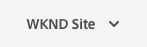

# De siteconsole {#sites-console}

Leer hoe te om de **console van Plaatsen** te gebruiken om uw pagina&#39;s van AEM te beheren en te organiseren.

## Afdrukstand {#orientation}

De **console van Plaatsen** staat u toe om uw paginahiërarchie te bekijken.

Het biedt verschillende weergaven en werkbalken om u te helpen uw pagina&#39;s te beheren en te ordenen.

* [ de consoletoolbar ](#toolbar) is altijd aanwezig om u te helpen navigeren.
* [ drie verschillende meningen ](#views) staan u toe om van uw pagina gemakkelijk de plaats te bepalen en te selecteren.
* [ de actietoolbar ](#action-toolbar) verschijnt wanneer u een punt hebt geselecteerd om actie op het te voeren.
* [ het zijpaneel ](#side-panel) heeft veelvoudige opties om gedetailleerde informatie over een geselecteerde pagina te tonen.

## Console, werkbalk {#console-toolbar}

De consoletoolbar is altijd aanwezig op de console en helpt u zich in uw inhoud oriënteren en de inhoud navigeren.

### Kiezer zijpaneel {#side-panel-selector}

Met de kiezer in het zijpaneel kunt u aanvullende informatie over het geselecteerde item weergeven in de console.

Welke opties worden weergegeven, is afhankelijk van uw huidige console. Bijvoorbeeld, in **Plaatsen** kunt u inhoud slechts selecteren (het gebrek), de chronologie, verwijzingen, of het paneel van de filterkant.

Voor meer informatie over het zijpaneel, zie [ Zijpaneel van de Console van Plaatsen ](/help/sites-cloud/authoring/sites-console/console-side-panel.md).

### Broodkruimels {#breadcrumbs}

In het midden van de spoorstaaf, waarbij altijd de beschrijving van het geselecteerde artikel wordt getoond, kunt u met de broodkruimels door de niveaus van uw website navigeren.

Tik of klik op de tekst van de broodkruimel om een vervolgkeuzelijst weer te geven met de niveaus van de hiërarchie van het geselecteerde item. Tik of klik op een item om naar die locatie te gaan.

### Alles selecteren {#select-all}

Tapping of het klikken van de **Uitgezochte Al** knoop selecteert alle punten in uw huidige mening van de console.

Wanneer u alle punten hebt geselecteerd, wordt de telling van de geselecteerde punten getoond bij het hoogste recht van de toolbar waar **Uitgezochte Al** knoop verscheen.

U kunt alle items deselecteren en de selectiemodus afsluiten door:

* Het klikken of het tikken van **X** naast de telling.
* Gebruikend de **vlucht** sleutel.

### Knop Maken {#create-button}

**creeer** knoop staat u toe om nieuwe pagina&#39;s aan uw plaats toe te voegen evenals tot extra voorwerpen van Plaatsen zoals Levende Exemplaren of Lanceringen te leiden.

Zodra geklikt, zijn de getoonde opties aangewezen aan de console/de context. De meest voorkomende zijn:

* [Pagina](/help/sites-cloud/authoring/sites-console/creating-pages.md)
* [Site](/help/sites-cloud/administering/site-creation/create-site.md)
* [Live kopie](/help/sites-cloud/administering/msm/overview.md)
* [Starten](/help/sites-cloud/authoring/launches/overview.md)
* [Taalkopie](/help/sites-cloud/administering/translation/overview.md)
* [CSV-rapport](/help/sites-cloud/authoring/sites-console/csv-export.md)

Zie de koppelingen naar deze functies voor meer informatie over hoe ze werken.

## Weergaven en Pagina&#39;s selecteren {#views}

De **console van Plaatsen** biedt drie verschillende meningen van uw inhoudshiërarchie aan. U kunt de bronnen weergeven, doorbladeren en selecteren (voor verdere actie) met een van de beschikbare weergaven.

* [Kolomweergave](#column-view)
* [Kaartweergave](#card-view)
* [Lijstweergave](#list-view)

Het **pictogram van de Mening** bij uiterst rechts van de toolbar van AEM wijst op de huidige geselecteerde mening.

Als u hierop tikt of erop klikt, kunt u een andere weergave selecteren.

U kunt schakelen tussen de kolomweergave, de kaartweergave en de lijstweergave. In de lijstweergave worden ook de weergave-instellingen weergegeven.

>[!NOTE]
>
>De optie **Instellingen weergeven** is alleen beschikbaar in de modus **Lijstweergave**.

Het bekijken, navigeren, en het selecteren zijn elk conceptueel het zelfde over alle meningen, maar hebben kleine variaties in behandeling, afhankelijk van de mening u gebruikt.

>[!NOTE]
>
>Standaard worden in AEM Assets de oorspronkelijke uitvoeringen van elementen in de gebruikersinterface niet als miniaturen weergegeven in een van de weergaven. Beheerders kunnen met overlays de oorspronkelijke uitvoeringen als miniaturen weergeven.

### Bronnen selecteren {#selecting-resources}

Het selecteren van een specifieke bron is afhankelijk van een combinatie van de weergave en het apparaat:

| Weergave | Aanraken selecteren | Bureaublad selecteren | Deselecteer Aanraken | Selectie van bureaublad opheffen |
|---|---|---|---|---|
| Kolom | Selecteer de miniatuur | Klik op de miniatuur | Selecteer de miniatuur | Klik op de miniatuur |
| Kaart | De kaart selecteren en de muisknop ingedrukt houden | Muisknop erboven gebruikt vervolgens de handeling Snel vinkje | Selecteer de kaart | Klik op de kaart |
| Lijst | Selecteer de miniatuur | Klik op de miniatuur | Selecteer de miniatuur | Klik op de miniatuur |

#### Voorbeeld selecteren {#selecting-example}

1. In de kaartweergave bijvoorbeeld:

   

1. Zodra u een middel hebt geselecteerd wordt de hoogste kopbal behandeld door de [ actiestoolbar ](#actions-toolbar) die toegang tot acties verleent momenteel toepasselijk op het geselecteerde middel.

1. Om selectiemodus weg te gaan selecteer **X** aan top-right, of gebruik **ontsnapping**.

### Kolomweergave {#column-view}

In de kolomweergave kunt u een inhoudsstructuur visueel navigeren door een reeks trapsgewijze kolommen. Met deze weergave kunt u de boomstructuur van uw website visualiseren en doorlopen.

Als u een bron in de kolom uiterst links selecteert, worden de onderliggende bronnen in een kolom rechts weergegeven. Als u een bron in de rechterkolom selecteert, worden de onderliggende bronnen in een andere kolom rechts weergegeven, enzovoort.

* U kunt omhoog en omlaag in de boom navigeren door op de middelnaam of chevron rechts van de middelnaam te tikken of te klikken.

   * De naam en het chevron van de bron worden benadrukt wanneer getikt of geklikt.
   * De kinderen van het geklikte/geplakte middel worden getoond in de kolom rechts van het aangeklikte/geplakte middel.
   * Als u een middelnaam selecteert die geen kinderen heeft, worden zijn details getoond in de definitieve kolom.

* Als u op de miniatuur tikt of erop klikt, wordt de bron geselecteerd.

   * Als deze optie is geselecteerd, wordt een vinkje op de miniatuur geplaatst en wordt de naam van de bron ook gemarkeerd.
   * De details van de geselecteerde bron worden getoond in de definitieve kolom.
   * De werkbalk Handeling wordt beschikbaar.

* Wanneer een pagina in kolomweergave is geselecteerd, wordt de geselecteerde pagina samen met de volgende details weergegeven in de definitieve kolom:

   * Paginatitel
   * Paginanaam (onderdeel van de URL van de pagina)
   * Sjabloon waarop de pagina is gebaseerd
   * Wijzigingsdetails
   * Paginataal
   * Publicatie- en voorvertoningsgegevens

### Kaartweergave {#card-view}

In de kaartweergave wordt elk item op het huidige niveau in de hiërarchie weergegeven als een grote kaart.

* Kaarten bieden informatie zoals:

   * Een visuele weergave van de pagina-inhoud.
   * De paginatitel.
   * Belangrijke datums (zoals laatst bewerkt, laatst gepubliceerd).
   * Als de pagina is vergrendeld, verborgen of deel uitmaakt van een livecopy.
   * Geeft aan of u op het item moet reageren als onderdeel van een workflow.

De mening van de kaart biedt ook [ snelle acties ](#quick-actions) voor de punten zoals selectie en gemeenschappelijke acties zoals uit uitgeven aan.

U kunt onderaan de boom navigeren door op kaarten te tikken/te klikken (die zorg nemen om het tikken van de snelle acties te vermijden) of opnieuw door [ broodkruimels in de kopbal ](#the-header) te gebruiken.

### Lijstweergave {#list-view}

De mening van de lijst verstrekt informatie voor elk middel op het huidige niveau in een lijst.

* U kunt neer door de boom navigeren door te tikken/op de middelnaam en file te klikken door [ broodkruimels in de kopbal ](#the-header) te gebruiken.
* Om alle punten in de lijst gemakkelijk te selecteren, gebruik [**Uitgezochte Al** checkbox in de toolbar ](#select-all).

* Selecteer de kolommen die moeten worden getoond gebruikend **de optie van de Montages van de Mening** onder de knoop van Bekijken wordt gevestigd. De volgende kolommen zijn beschikbaar voor weergave:

   * **Naam** - de naam van de Pagina, die in een meertalig auteursmilieu nuttig kan zijn aangezien het deel van URL van de pagina uitmaakt en niet ongeacht taal verandert
   * **Gewijzigd** - Laatste gewijzigde datum en laatst gewijzigd door gebruiker
   * **Gepubliceerd** - de status van de Publicatie
   * **Voorproef** - de status van de Voorproef
   * **Malplaatje** - Malplaatje waarop de pagina gebaseerd is
   * **Verrichting**
   * **Werkschema** - Werkschema momenteel toegepast op de pagina. Er is meer informatie beschikbaar wanneer u de muis boven de tijdlijn houdt of deze opent.
   * **Vertaald**
   * **de Weergaven van de Pagina**
   * **Unieke Bezoekers**
   * **Tijd op Pagina**

Door gebrek wordt de **kolom van de Naam** getoond, die omhoog een deel van URL voor de pagina maakt. In sommige gevallen moet de auteur pagina&#39;s openen die in een andere taal zijn en kan het nuttig zijn de naam van de pagina (die gewoonlijk onveranderlijk is) te zien als de auteur de taal van de pagina niet kent.

* Wijzig de volgorde van de items met de gestippelde verticale balk helemaal rechts van elk item in de lijst.

Selecteer de verticale selectiebalk en sleep het item naar een nieuwe positie in de lijst.

>[!NOTE]
>
>Het wijzigen van de volgorde werkt alleen in een geordende map met de waarde `jcr:primaryType` als `sling:OrderedFolder` .

## Werkbalk Handelingen {#actions-toolbar}

Wanneer een middel wordt geselecteerd, kunt u diverse acties op het geselecteerde punt uitvoeren. Deze acties worden weergegeven op de werkbalk Handelingen.

De actietoolbar verschijnt slechts wanneer een middel in de console wordt geselecteerd. De actie beschikbaar in de actiestoolbar verandert om op de acties te wijzen u op de specifieke geselecteerde punten kunt nemen. De meest voorkomende acties zijn:

* [**creeer**](#create-action) - creeer nieuwe inhoud of inhoud-verwante acties
* **geeft** uit - afhankelijk van hoe de geselecteerde pagina werd gecreeerd, **geeft** actie uit zal de aangewezen redacteur openen.
   * [ Redacteur van de Pagina ](/help/sites-cloud/authoring/page-editor/introduction.md) - voor pagina&#39;s die met de Redacteur van de Pagina van AEM worden gecreeerd
   * [ Universele Redacteur ](/help/sites-cloud/authoring/universal-editor/authoring.md) - voor pagina&#39;s die met de Universele Redacteur worden gecreeerd
* [**Eigenschappen**](/help/sites-cloud/authoring/sites-console/edit-page-properties.md) - opent het venster van pagina-eigenschappen
* [**Slot**](/help/sites-cloud/authoring/sites-console/managing-pages.md#locking-a-page) - vergrendel een pagina om anderen te verhinderen het te veranderen
* [**Exemplaar**](/help/sites-cloud/authoring/sites-console/managing-pages.md#copying-and-pasting-a-page) - Kopieer een pagina
* [**Beweging**](/help/sites-cloud/authoring/sites-console/managing-pages.md#moving-or-renaming-a-page) - beweeg of noem een pagina anders
* [**Snelle publiceer**](/help/sites-cloud/authoring/sites-console/publishing-pages.md#quick-publish) - publiceer onmiddellijk een pagina of pagina&#39;s
* [**beheer Publicatie**](/help/sites-cloud/authoring/sites-console/publishing-pages.md#manage-publication) - Plan een pagina of pagina&#39;s voor publicatie
* [**herstel**](/help/sites-cloud/authoring/sites-console/page-versions.md#restore-version) - herstel een versie van een pagina of paginaboom
* [**Schrapping**](/help/sites-cloud/authoring/sites-console/managing-pages.md#deleting-a-page) - schrap een pagina of pagina&#39;s

Vanwege de ruimtebeperkingen in sommige vensters kan de werkbalk snel langer worden dan de beschikbare ruimte. Als dit gebeurt, worden er extra opties weergegeven. Als u op de ellips klikt of erop tikt (de drie stippen of **...** ), wordt een vervolgkeuzelijst geopend met alle resterende handelingen.

### Handeling maken {#create-action}

Creeer actie biedt gelijkaardige opties aan [**&#x200B;** tot werkbalkknop ](#create-button) voor het creëren van nieuwe pagina&#39;s en gelijkaardige punten aan.

Bovendien biedt het de mogelijkheid om paginagerelateerde acties te maken.

* [**Werkschema**](/help/sites-cloud/authoring/workflows/overview.md) - pas een werkschema op een pagina toe
* [**Versie**](/help/sites-cloud/authoring/sites-console/page-versions.md) - creeer een versie van een pagina

## Sjablonen

U kunt gemakkelijk zien op welke sjabloon de pagina is gebaseerd wanneer u de pagina selecteert in de [**kolomweergave**](/help/sites-cloud/authoring/basic-handling.md#column-view) of de [**lijstweergave**](/help/sites-cloud/authoring/basic-handling.md#list-view).

## AI Assistant in AEM

Voor klanten die [ voltooide noodzakelijke criteria ](/help/implementing/cloud-manager/ai-assistant-in-aem.md#get-access) hebben, is de Medewerker AI in AEM beschikbaar aan gebruikers van hun organisatie. Zie [ Medewerker AI in AEM ](/help/implementing/cloud-manager/ai-assistant-in-aem.md).

