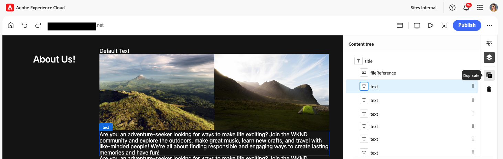

# Inhoud ontwerpen met de Universal Editor {#authoring}

Leer hoe gemakkelijk en intuïtief het is voor inhoudsauteurs om inhoud tot stand te brengen gebruikend de Universele Redacteur.

## Inleiding {#introduction}

Met de Universal Editor kunt u alle aspecten van inhoud in elke implementatie bewerken, zodat u uitzonderlijke ervaringen kunt opdoen en de snelheid van de inhoud kunt verhogen.

Hiervoor verschaft de Universal Editor de auteur van inhoud een intuïtieve gebruikersinterface die minimale training vereist om eenvoudig in de inhoud te kunnen springen en beginnen met het bewerken ervan. In dit document wordt de auteurservaring van de Universal Editor beschreven.

>[!NOTE]
>
>In dit document wordt ervan uitgegaan dat u al vertrouwd bent met de toegang tot en navigatie in de Universal Editor. Als u niet bent, zie [&#x200B; Toegang tot en het Navigeren van de Universele Redacteur &#x200B;](/help/sites-cloud/authoring/universal-editor/navigation.md).

>[!TIP]
>
>Voor een meer gedetailleerde inleiding aan de Universele Redacteur, zie [&#x200B; Universele Inleiding van de Redacteur &#x200B;](/help/implementing/universal-editor/introduction.md).

## Inhoud bewerken {#editing-content}

Inhoud bewerken is eenvoudig en intuïtief. Terwijl u de muis over de inhoud in de editor beweegt, wordt bewerkbare inhoud gemarkeerd met een dunne blauwe omtrek.

>[!TIP]
>
>Door gebrek, selecteert het tikken of het klikken op inhoud het voor het uitgeven. Als u uw inhoud door verbindingen wilt navigeren, schakelaar aan [&#x200B; voorproefwijze &#x200B;](/help/sites-cloud/authoring/universal-editor/navigation.md#preview-mode).

Afhankelijk van de inhoud u selecteert, kunt u verschillende op zijn plaats het uitgeven opties hebben en u kunt extra informatie en opties voor de inhoud in het [&#x200B; eigenschappen paneel &#x200B;](/help/sites-cloud/authoring/universal-editor/navigation.md#properties-rail).

### Onbewerkte tekst bewerken {#edit-plain-text}

U kunt de tekst op zijn plaats bewerken door te dubbelklikken op de component of erop te dubbeltikken.

De dunne blauwe omtrek wordt omgezet in een zware blauwe omtrek om de selectie aan te geven en er wordt een cursor weergegeven. Breng de wijzigingen aan en druk vervolgens op Enter/Return of selecteer buiten het tekstvak om de wijzigingen op te slaan.

Wanneer u de tekstcomponent selecteert, worden zijn details getoond in het [&#x200B; eigenschappen paneel &#x200B;](/help/sites-cloud/authoring/universal-editor/navigation.md#properties-rail). U kunt de tekst in het deelvenster ook bewerken.

Details over de tekst zijn ook beschikbaar in het deelvenster Eigenschappen. Wijzigingen worden automatisch opgeslagen als de focus het bewerkte veld in het deelvenster Eigenschappen verlaat.

### RTF-tekst bewerken {#edit-rich-text}

U kunt de tekst op zijn plaats bewerken door te dubbelklikken op de component of erop te dubbeltikken.

Voor uw gemak zijn opmaakopties en details op uw tekst beschikbaar op twee plaatsen.

#### Het contextmenu {#context-menu}

Het contextmenu wordt boven het tekstblok met tekstopmaak geopend en biedt in de context basisopmaakopties. Vanwege ruimtebeperkingen kunnen sommige opties achter de knop voor ovaal worden verborgen.

Wijzigingen worden automatisch opgeslagen als de focus het bewerkte veld verlaat.

#### Het deelvenster Eigenschappen {#properties-rail}

Het [&#x200B; eigenschappen paneel &#x200B;](/help/sites-cloud/authoring/universal-editor/navigation.md#properties-rail) toont een ingang voor de geselecteerde rijke tekstcomponent.

Tik op het item om een dialoogvenster te openen waarin een groter canvas wordt weergegeven om de RTF-tekst te bewerken.

Tik of klik **annuleer** of **Gedaan** om de veranderingen, respectievelijk te verwerpen of te bewaren. U kunt ook op de toets Escape drukken om de wijzigingen op te slaan en het dialoogvenster te sluiten.

#### Opmaakopties voor RTF-tekst {#formatting-options}

Met de RTE-editor (RTE) van de Universal Editor kan de auteur de standaardopmaak voor tekst toepassen. Standaard zijn de volgende opties beschikbaar.

* Alinea (h1, h2, h3, enz.)
* Vet
* Cursief
* Onderstrepen
* Superscript
* Subscript
* Lijst met opsommingstekens
   * Met de Tab-toets kunt u inspringen en Shift+tab naar buiten
* Genummerde lijst
   * Met de Tab-toets kunt u inspringen en Shift+tab naar buiten
* Koppeling
* Ontkoppelen
* Afbeelding
* Alle opmaak verwijderen

Bestaande tabellen kunnen worden bewerkt met de RTE, maar er kunnen geen nieuwe tabellen worden gemaakt.

De RTE kan worden gevormd om opties te verbergen of extra opties te tonen afhankelijk van auteurs&#39; behoeften. Gelieve te zien het document [&#x200B; Vormend RTE voor de Universele Redacteur &#x200B;](/help/implementing/universal-editor/configure-rte.md) voor meer informatie.

### Media bewerken {#edit-media}

U kunt zijn details in het [&#x200B; eigenschappen paneel &#x200B;](/help/sites-cloud/authoring/universal-editor/navigation.md#properties-rail) bekijken.

1. Tik of klik op de voorvertoning van de geselecteerde afbeelding in het deelvenster Eigenschappen.
1. Het [&#x200B; activa selecteur &#x200B;](/help/assets/overview-asset-selector.md#using-asset-selector) venster opent om u toe te staan om activa te selecteren.
1. Selecteer deze optie om een nieuw element te selecteren.
1. Selecteer **Uitgezocht** om aan het eigenschappen paneel terug te keren waar de activa werd vervangen.

Wijzigingen worden automatisch in de inhoud opgeslagen.

### Inhoudsfragmenten bewerken {#edit-content-fragment}

Als u a [&#x200B; het Fragment van de Inhoud &#x200B;](/help/sites-cloud/administering/content-fragments/overview.md) selecteert, kunt u zijn details in het [&#x200B; eigenschappen paneel &#x200B;](/help/sites-cloud/authoring/universal-editor/navigation.md#properties-rail) uitgeven.

De velden die zijn gedefinieerd in het inhoudsmodel van het geselecteerde inhoudsfragment, worden weergegeven en kunnen worden bewerkt in het deelvenster Eigenschappen.

Als u een veld selecteert dat verwant is aan een inhoudsfragment, wordt het inhoudsfragment in het deelvenster Componenten geladen en wordt het veld automatisch naar dit fragment geschoven.

Wijzigingen worden automatisch opgeslagen als de focus het bewerkte veld in het deelvenster Eigenschappen verlaat.

Als u uw Fragment van de Inhoud in de [&#x200B; redacteur van het Fragment van de Inhoud &#x200B;](/help/sites-cloud/administering/content-fragments/authoring.md) in plaats daarvan wilt uitgeven, tikt of klikt [**Open in de Redacteur van het CF** knoop &#x200B;](/help/sites-cloud/authoring/universal-editor/navigation.md#edit) in het eigenschappen paneel.

>[!TIP]
>
>Gebruik de sneltoets `e` om het geselecteerde inhoudsfragment te bewerken in de inhoudsfragmenteditor.

Afhankelijk van de behoeften van uw workflow wilt u het inhoudsfragment wellicht bewerken in de universele editor of rechtstreeks in de editor voor inhoudsfragmenten.

>[!NOTE]
>
>De Universele Redacteur [&#x200B; bevestigt de gebieden van het Fragment van de Inhoud die op hun modellen &#x200B;](/help/assets/content-fragments/content-fragments-models.md#validation) worden gebaseerd die u toestaan om de regels van de gegevensintegriteit zoals regex patronen en uniqueness beperkingen af te dwingen.
>
>Dit zorgt ervoor dat uw inhoud aan specifieke bedrijfsvereisten alvorens het wordt gepubliceerd voldoet.

### Componenten toevoegen aan containers {#adding-components}

1. Selecteer een containercomponent in de [&#x200B; inhoudsboom &#x200B;](/help/sites-cloud/authoring/universal-editor/navigation.md#content-tree-mode) of in de redacteur.

    toe te voegen

1. Selecteer vervolgens het pictogram Toevoegen in het deelvenster Eigenschappen.

   

1. Als er meer dan één component is toegestaan voor de container, selecteert u in de vervolgkeuzelijst welke component u wilt invoegen. Als slechts één component wordt toegestaan, wordt het opgenomen automatisch.

De component wordt opgenomen in de container en kan in de redacteur worden uitgegeven.

>[!TIP]
>
>Gebruik de sneltoets `a` om een component aan de geselecteerde container toe te voegen.

### Componenten in containers dupliceren {#duplicating-components}

1. Selecteer een component in een container gebruikend de [&#x200B; inhoudsboom &#x200B;](/help/sites-cloud/authoring/universal-editor/navigation.md#content-tree-mode) of de redacteur.
1. Dan selecteer het **Dubbele** pictogram in het eigenschappen paneel.

    toe te voegen
1. De component wordt gedupliceerd en onder de geselecteerde component ingevoegd.

De component wordt opgenomen in de container en kan in de redacteur worden uitgegeven.

### Componenten uit containers verwijderen {#deleting-components}

1. Selecteer een containercomponent in de [&#x200B; inhoudsboom &#x200B;](/help/sites-cloud/authoring/universal-editor/navigation.md#content-tree-mode) of in de redacteur.
1. Selecteer het chevron-pictogram van de container om de inhoud ervan in de inhoudsstructuur uit te vouwen.
1. Selecteer vervolgens in de inhoudsstructuur een component in de container.
1. Selecteer het verwijderpictogram in het deelvenster Eigenschappen.

   

De geselecteerde component is verwijderd.

>[!TIP]
>
>Gebruik de sneltoets `Shift+Backspace` om de geselecteerde component uit de container te verwijderen.

### Componenten opnieuw ordenen {#reordering-components}

1. Als niet reeds op [&#x200B; wijze van de inhoudsboom &#x200B;](/help/sites-cloud/authoring/universal-editor/navigation.md#content-tree-mode), schakelaar aan het.
1. Selecteer een containercomponent in de inhoudsstructuur of in de editor.
1. Selecteer het chevron-pictogram van de container om de inhoud ervan in de inhoudsstructuur uit te vouwen.
1. De greeppictogrammen van de belemmering naast de componenten binnen de container tonen dat u hen kunt herschikken. Sleep de componenten om deze binnen de container opnieuw te ordenen.

   

1. De gesleepte component wordt grijs weergegeven in de inhoudsstructuur, terwijl de invoegpositie wordt aangeduid met een blauwe lijn. Laat de component los om deze op de nieuwe locatie te plaatsen.

De componenten worden opnieuw gerangschikt in zowel de inhoudsboom als in de redacteur.

>[!NOTE]
>
>De componenten kunnen slechts tussen containers worden bewogen als de de componentenfilter van doelcontainers [&#x200B; &#x200B;](/help/implementing/universal-editor/filtering.md) de geselecteerde component toestaat.

### Ongedaan maken en Opnieuw {#undo-redo}

Selecteer de knoppen Ongedaan maken of Opnieuw om de laatste bewerking in de editor ongedaan te maken of opnieuw uit te voeren.

* Het ongedaan maken en het opnieuw doen kan voor uitgeeft in context worden uitgevoerd, uitgeeft die via het paneel van Eigenschappen wordt gedaan, evenals het toevoegen van, het dupliceren van, het bewegen van, en het schrappen van blokken.
* Ongedaan maken en opnieuw uitvoeren is beperkt tot de huidige browsersessie.

>[!TIP]
>
>Gebruik de sneltoets `Command-Z` of `Shift-Command-Z` om respectievelijk ongedaan te maken of opnieuw uit te voeren.

### Kopiëren en plakken {#copy-paste}

U kunt componenten kopiëren en kleven die binnen [&#x200B; containers zijn.](/help/implementing/universal-editor/field-types.md#container) Dit is mogelijk slechts als de doelcontainer geen [&#x200B; gevormde filters &#x200B;](/help/implementing/universal-editor/filtering.md) heeft of filters heeft die de component toestaan om worden gekleefd.

Kopiëren en plakken kan zich op hetzelfde browsertabblad of tussen browsertabbladen bevinden, mits de tabbladen al zijn geopend. U kunt een item niet kopiëren en vervolgens een nieuw browsertabblad openen om het te plakken.

1. Selecteer een component in de editor of in de inhoudsstructuur.
1. Het **pictogram van het Exemplaar** verschijnt in het [&#x200B; eigenschappen paneel.](/help/sites-cloud/authoring/universal-editor/navigation.md#properties-panel) Tik of klik erop.
1. Het **Deeg** pictogram verschijnt in het eigenschappen paneel.
1. Selecteer de component _na_ die u wenst om de gekopieerde component te kleven.
1. Tik of klik op Plakken.
1. De gekopieerde component wordt gekleefd _na_ de geselecteerde component.

>[!TIP]
>
>Gebruik de sneltoets `Command-C` of `Command-V` om respectievelijk te kopiëren of te plakken.

## Contextopties {#context-options}

Wanneer het uitgeven op zijn plaats, zal de redacteur context-relevante opties met de rechtermuisknop aanklikken zoals het dupliceren, het schrappen, of het kopiëren componenten aanbieden.

## Inhoud voorvertonen {#previewing-content}

Wanneer u klaar bent met het bewerken van inhoud, wilt u er vaak door navigeren om te zien hoe de inhoud er op andere pagina&#39;s uitziet. Op [&#x200B; voorproefwijze &#x200B;](/help/sites-cloud/authoring/universal-editor/navigation.md#preview-mode) kunt u verbindingen klikken om uw inhoud te navigeren zoals een lezer. De inhoud wordt in de editor gerenderd zoals deze zou worden gepubliceerd.

In de voorvertoningsmodus reageert de gebruiker op de inhoud door erop te tikken of erop te klikken, net als bij een lezer van de inhoud. Als u de inhoud voor het uitgeven wilt selecteren, knevel uit [&#x200B; voorproefwijze &#x200B;](/help/sites-cloud/authoring/universal-editor/navigation.md#preview-mode).

## Componentovererving bewerken {#inheritance}

Overerving is het mechanisme waarbij inhoud kan worden gekoppeld, zodat het ene element automatisch het andere verandert.

Met de Universal Editor kunt u overerving voor inhoud annuleren door de inhoud eenvoudig bij te werken. De redacteur maakt automatisch overerving voor alle veranderingen onbruikbaar die door auteurs op die pagina worden aangebracht, ervoor zorgen dat de gewijzigde inhoud wordt behouden wanneer de updates van de blauwdruk worden gesynchroniseerd.

Als de {**Uitbreiding van 0} AEM Multi-Site-Management (MSM) voor uw programma wordt toegelaten, hebt u** extra toolbaropties [&#x200B; om de overervingsstatus van een individuele component binnen de Universele Redacteur te bekijken en te veranderen.](#inheritance-extension)

Voor meer details op hoe de overerving het gebruiken van de Universele Redacteur werkt, zie [&#x200B; Overerving van de Inhoud in de Universele Redacteur &#x200B;](/help/sites-cloud/authoring/universal-editor/inheritance.md).

## Optionele werkbalkfuncties {#toolbar-options}

Aanvullende functies zijn beschikbaar als extensies voor de Universal Editor waarmee u pagina&#39;s en inhoud verder kunt beheren. [&#x200B; Deze uitbreidingen moeten in uw programma door een beheerder &#x200B;](/help/implementing/universal-editor/extending.md) worden toegelaten alvorens zij aan u als inhoudauteur in [&#x200B; de Universele toolbar van de Redacteur zichtbaar zijn.](/help/sites-cloud/authoring/universal-editor/navigation.md#universal-editor-toolbar)

### Overerving {#inheritance-extension}

De **multi-plaats-beheer van AEM (MSM) Uitbreiding** toont de huidige overervingsstatus van de geselecteerde component en staat u toe [&#x200B; om overerving te breken of opnieuw op te nemen.](/help/sites-cloud/authoring/universal-editor/inheritance.md)

Het **Geïnstalleerde Overerving** pictogram in de Universele toolbar van de Redacteur toont aan dat de overerving nog voor de geselecteerde component actief is.

Tik op het pictogram of klik op het pictogram om de overerving voor de geselecteerde component te verbreken. Overerving wordt automatisch verbroken als u de component bewerkt.

Het **Gebroken** pictogram van de Overerving van de Overerving toont aan dat de overerving voor de geselecteerde component is gebroken.

Tik op het pictogram of klik op het pictogram om de overerving voor de geselecteerde component te herstellen. U moet de pagina opnieuw laden om de inhoud te vernieuwen om de overgeërfde inhoud weer te geven.

Voor informatie over hoe te om deze uitbreiding toe te laten, [&#x200B; te zien gelieve de documentatie van Extension Manager.](https://developer.adobe.com/uix/docs/extension-manager/feature-highlights/#enablingdisabling-extensions)

>[!NOTE]
>
>De **Geïnstalleerde Overerving** en **Verbroken** pictogrammen van de Overerving slechts tonen wanneer een component is geselecteerd en de pagina is gebaseerd op een blauwdruk.

>[!NOTE]
>
>De &lbrace;**werken slechts voor pagina&#39;s, niet de Fragmenten van de Inhoud van AEM multi-plaats-beheer (MSM).**

### Pagina-eigenschappen openen {#page-properties}

De **Uitbreiding van de Eigenschappen van de Pagina van AEM** staat snelle toegang tot het [&#x200B; venster van de Eigenschappen van de Pagina &#x200B;](/help/sites-cloud/authoring/sites-console/page-properties.md) voor de pagina toe die momenteel wordt uitgegeven.

Tik of klik het **pictogram van de Eigenschappen van de Pagina** in de Universele toolbar van de Redacteur om de paginaeigenschappen voor de pagina in een nieuwe browser tabel te openen.

Voor informatie over hoe te om deze uitbreiding toe te laten, [&#x200B; te zien gelieve de documentatie van Extension Manager.](https://developer.adobe.com/uix/docs/extension-manager/feature-highlights/#enablingdisabling-extensions)

>[!NOTE]
>
>De **Uitbreiding van de Eigenschappen van de Pagina van AEM** werkt slechts voor pagina&#39;s, niet de Fragmenten van de Inhoud.

### Siteconsole openen {#sites-console}

De **Uitbreiding van Admin van de Plaats van AEM** staat snelle toegang tot de pagina toe die binnen de [&#x200B; Console van Plaatsen van AEM wordt uitgegeven, &#x200B;](/help/sites-cloud/authoring/sites-console/introduction.md) toestaand u om de plaatsboom te navigeren of pagina-vlakke acties in de console uit te voeren.

Tik op het pictogram of klik op het pictogram om de Sites-console te openen in een nieuw browsertabblad, dat naar de pagina gaat die momenteel in de editor staat.

Voor informatie over hoe te om deze uitbreiding toe te laten, [&#x200B; te zien gelieve de documentatie van Extension Manager.](https://developer.adobe.com/uix/docs/extension-manager/feature-highlights/#enablingdisabling-extensions)

### Pagina&#39;s vergrendelen en ontgrendelen {#locking-pages}

De **Uitbreiding van het Slot van de Pagina van AEM** toont het huidige slotstatuut van de pagina in de redacteur en staat u toe om [&#x200B; de pagina te sluiten of te ontgrendelen.](/help/sites-cloud/authoring/sites-console/managing-pages.md#locking-a-page)

Het **Ontgrendelde** pictogram in de Universele toolbar van de Redacteur toont aan dat de pagina momenteel in de redacteur niet wordt gesloten.

Tik of klik op het pictogram om de pagina te vergrendelen.

Het **Vergrendelde** pictogram in de Universele toolbar van de Redacteur toont aan dat de pagina momenteel in de redacteur wordt gesloten. Houd de muis boven het pictogram voor knopinfo die aangeeft welke gebruiker de pagina heeft vergrendeld.

Tik of klik op het pictogram om de pagina te ontgrendelen als u de gebruiker bent die de pagina heeft vergrendeld.

Voor informatie over hoe te om deze uitbreiding toe te laten, [&#x200B; te zien gelieve de documentatie van Extension Manager.](https://developer.adobe.com/uix/docs/extension-manager/feature-highlights/#enablingdisabling-extensions)

>[!NOTE]
>
>De **Uitbreiding van het Slot van de Pagina van AEM** werkt slechts voor pagina&#39;s, niet de Fragmenten van de Inhoud.

### Workflows {#workflows}

De **Uitbreiding van de Werkschema&#39;s van AEM** staat u toe om [&#x200B; een werkschema &#x200B;](/help/sites-cloud/authoring/workflows/overview.md) op de pagina momenteel in de redacteur te beginnen.

Tik of klik het **pictogram van de Werkschema&#39;s** in de Universele toolbar van de Redacteur om het **Begin een werkschema** modaal te openen. In het venster wordt de mogelijke inhoud weergegeven waarop u een workflow kunt toepassen.

1. In het **Model van het Werkschema** drop down, selecteer het werkschema om toe te passen.
1. Verstrek een beschrijving voor het werkschema op het **gebied van de Naam**.
1. In de **Inhoud om in werkschema** lijst te omvatten, gebruik checkboxes om te bepalen welke inhoud in het werkschema te omvatten.
1. Tik of klik **Werkschema van het Begin** om het werkschema te beginnen of **dicht** om te aborteren.

Voor informatie over hoe te om deze uitbreiding toe te laten, [&#x200B; te zien gelieve de documentatie van Extension Manager.](https://developer.adobe.com/uix/docs/extension-manager/feature-highlights/#enablingdisabling-extensions)

### Aanmelden bij ontwikkelaar {#developer-login}

De **Universele Uitbreiding van de Login van de Redacteur van AEM Dev** is nuttig voor ontwikkelaars die plaatselijk ontwikkelen, toelatend een geschikte manier om aan lokale AEM SDK voor het testen voor authentiek te verklaren.

Tik of klik het **pictogram van de Logon van de Ontwikkelaar** in de Universele toolbar van de Redacteur om uw lokale login geloofsbrieven te verstrekken om in uw lokale AEM SDK te ondertekenen.

Voor informatie over hoe te om deze uitbreiding toe te laten, [&#x200B; te zien gelieve de documentatie van Extension Manager.](https://developer.adobe.com/uix/docs/extension-manager/feature-highlights/#enablingdisabling-extensions)

## Functies in het deelvenster Optionele eigenschappen {#properties-panel-options}

Aanvullende functies zijn beschikbaar als extensies voor de Universal Editor waarmee u de pagina-inhoud verder kunt beheren. [&#x200B; Deze uitbreidingen moeten in uw programma door een beheerder &#x200B;](/help/implementing/universal-editor/extending.md) worden toegelaten alvorens zij aan u als inhoudauteur in [&#x200B; het Universele paneel van de Eigenschappen van de Redacteur zichtbaar zijn.](/help/sites-cloud/authoring/universal-editor/navigation.md#properties-rail)

### Variaties genereren {#generate-variations}

**produceer de uitbreiding van Variaties** staat u toe om generatieve kunstmatige intelligentie (AI) te gebruiken om variaties voor uw inhoud direct in het eigenschappen paneel tot stand te brengen.

Tik of klik **produceer het** pictogram van Variaties in het Universele paneel van de Eigenschappen van de Redacteur om aanbevelingen te ontvangen en variaties tot stand te brengen. Gelieve te zien het document [&#x200B; Variaties produceren - in de Redacteurs van AEM &#x200B;](/help/generative-ai/generate-variations-integrated-editor.md) voor meer details over hoe het produceren van variaties werkt.

Voor informatie over hoe te om deze uitbreiding toe te laten, [&#x200B; te zien gelieve de documentatie van Extension Manager.](https://developer.adobe.com/uix/docs/extension-manager/feature-highlights/#enablingdisabling-extensions)

## Aanvullende bronnen {#additional-resources}

Raadpleeg dit document voor meer informatie over het publiceren van inhoud met de universele editor.

* [&#x200B; het Publiceren Inhoud met de Universele Redacteur &#x200B;](publishing.md) - leer hoe de Universele Redacteur inhoud publiceert en hoe uw apps de gepubliceerde inhoud kunnen behandelen.

Zie deze ontwikkelaarsdocumenten voor meer informatie over de technische details van de Universal Editor.

* [&#x200B; Universele Inleiding van de Redacteur &#x200B;](/help/implementing/universal-editor/introduction.md) - leer hoe de Universele Redacteur het uitgeven om het even welk aspect van om het even welke inhoud in om het even welke implementatie toelaat zodat kunt u uitzonderlijke ervaringen leveren en inhoudssnelheid verhogen.
* [&#x200B; Begonnen het Worden met de Universele Redacteur in AEM &#x200B;](/help/implementing/universal-editor/getting-started.md) - leer hoe te om toegang tot de Universele Redacteur te krijgen en hoe te beginnen van instrumenten voorzien uw eerste AEM app om het te gebruiken.
* [&#x200B; Universele Architectuur van de Redacteur &#x200B;](/help/implementing/universal-editor/architecture.md) - Leer over de architectuur van de Universele Redacteur en hoe de gegevens tussen zijn diensten en lagen stromen.
* [&#x200B; Attributen en Types &#x200B;](/help/implementing/universal-editor/attributes-types.md) - leer over de gegevensattributen en de types die de Universele Redacteur vereist.
* [&#x200B; Universele Authentificatie van de Redacteur &#x200B;](/help/implementing/universal-editor/authentication.md) - leer hoe de Universele Redacteur voor authentiek verklaart.
