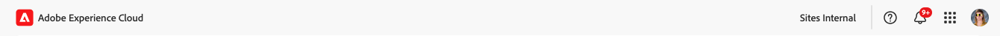
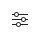

# Toegang tot en navigatie in de Universal Editor {#navigating}

Leer de basisbeginselen van toegang tot en navigatie in de Universal Editor.

## Inleiding {#introduction}

Met de Universal Editor kunt u elk aspect van elke inhoud in een implementatie bewerken, zodat u uitzonderlijke ervaringen kunt bieden, de snelheid van de inhoud kunt verhogen en een geavanceerde ontwikkelaarservaring kunt bieden.

Hiervoor verschaft de Universal Editor de auteur van inhoud een intuïtieve gebruikersinterface die minimale training vereist om eenvoudig in de inhoud te kunnen springen en beginnen met het bewerken ervan. In dit document wordt beschreven hoe u door de Universal Editor kunt navigeren.

>[!TIP]
>
>* Voor details bij het ontwerpen die de Universele Redacteur gebruiken, zie het document [&#x200B; Authoring Inhoud met de Universele Redacteur &#x200B;](/help/sites-cloud/authoring/universal-editor/authoring.md).
>* Voor een meer gedetailleerde inleiding aan de Universele Redacteur, zie [&#x200B; Universele Inleiding van de Redacteur &#x200B;](/help/implementing/universal-editor/introduction.md).

## De app voorbereiden {#prepare-app}

Als u inhoud voor een app wilt ontwerpen met de Universal Editor, moet de app van instrumenten zijn voorzien door een ontwikkelaar om de editor te ondersteunen.

>[!TIP]
>
>Zie [&#x200B; Begonnen het Worden met de Universele Redacteur in AEM &#x200B;](/help/implementing/universal-editor/getting-started.md) voor een voorbeeld van hoe te om een toepassing van AEM te vormen om met de Universele Redacteur te werken.

## De universele editor openen {#accessing}

Zodra de app van instrumenten is voorzien om met de Universal Editor te werken, kan de Universal Editor zowel in AEM as a Cloud Service als rechtstreeks toegang krijgen tot de toepassing zonder AEM te openen.

### Toegang tot AEM as a Cloud Service {#accessing-aem}

1. Meld u aan bij uw AEM as a Cloud Service-ontwerpinstantie.
1. Gebruik de [**console van 1&rbrace; Plaatsen** om aan de pagina te navigeren die voor gebruik met de Universele Redacteur wordt gecreeerd die u wenst uit te geven.](/help/sites-cloud/authoring/sites-console/introduction.md)
1. Bewerk de pagina.
1. De Universal Editor wordt geopend om de geselecteerde pagina te bewerken.

>[!NOTE]
>
>Wanneer het uitgeven van een pagina in de [**console van Plaatsen**, zal de console de redacteur aangewezen aan het 3&rbrace; malplaatje van de pagina &#x200B;](/help/sites-cloud/authoring/sites-console/introduction.md) of de Universele Redacteur openen die in dit document wordt beschreven, of de [&#x200B; paginaredacteur &#x200B;](/help/sites-cloud/authoring/page-editor/templates.md).[&#128279;](/help/sites-cloud/authoring/page-editor/introduction.md)

### Direct toegang {#accessing-directly}

1. Meld u aan bij de Universal Editor. U hebt een Adobe ID nodig om binnen te ondertekenen en [&#x200B; heeft toegang tot de Universele Redacteur &#x200B;](/help/implementing/universal-editor/getting-started.md#request-access).

1. Nadat u binnen wordt ondertekend, ga URL van de pagina in u in de [&#x200B; plaats bar &#x200B;](#location-bar) wilt uitgeven, zodat kunt u beginnen inhoud zoals tekstinhoud of media inhoud uit te geven.

## De gebruikersinterface begrijpen {#ui}

De interface is verdeeld in deze hoofdgebieden.

* [De Experience Cloud-header](#experience-cloud-header)
* [De werkbalk van de Universal Editor](#universal-editor-toolbar)
* [De editor](#editor)
* [Het deelvenster Eigenschappen](#properties-rail)

>[!TIP]
>
>De Universele Redacteur biedt een aantal [&#x200B; aanpassingsopties &#x200B;](/help/implementing/universal-editor/customizing.md) en [&#x200B; uitbreidingspunten &#x200B;](/help/implementing/universal-editor/extending.md) aan die kunnen wijzigen en aan de functionaliteit van de redacteur toevoegen. Daarom ziet u mogelijk andere opties dan de hier beschreven standaardopties.

### De Experience Cloud-header {#experience-cloud-header}

De Experience Cloud-header staat altijd boven aan het scherm. Het is een anker dat u vertelt waar u zich in Experience Cloud bevindt en dat u helpt naar andere Experience Cloud-toepassingen te navigeren.

#### Experience Manager {#experience-manager}

Selecteer de verbinding van Adobe Experience Cloud links van de kopbal om aan de wortel van uw oplossing van Experience Manager te navigeren om tot hulpmiddelen zoals [&#x200B; Cloud Manager &#x200B;](/help/onboarding/cloud-manager-introduction.md), [&#x200B; Cloud Acceleration Manager &#x200B;](/help/journey-migration/cloud-acceleration-manager/introduction/overview-cam.md), en [&#x200B; de Distributie van de Software &#x200B;](https://experienceleague.adobe.com/docs/experience-cloud/software-distribution/home.html?lang=nl-NL) toegang te hebben.

#### Organisatie {#organization}

Hier wordt de organisatie weergegeven waarmee u momenteel bent aangemeld. Schakel deze optie in om over te schakelen naar een andere organisatie als uw Adobe ID aan meerdere organisaties is gekoppeld.

#### Help Center {#help}

Het pictogram van het hulpcentrum verleent snelle toegang tot het leren en steunmiddelen.

#### Meldingen {#notifications}

Dit pictogram wordt getekend met het aantal momenteel toegewezen onvolledige [&#x200B; berichten &#x200B;](/help/implementing/cloud-manager/notifications.md).

#### Apps {#solutions}

Als u op de app-switch tikt of erop klikt, kunt u snel naar andere Experience Cloud-oplossingen gaan.

#### Account {#user-properties}

Selecteer het pictogram dat uw gebruiker vertegenwoordigt voor toegang tot uw accountinstellingen. Als u geen gebruikersbeeld hebt gevormd, wordt een pictogram willekeurig toegewezen.

Als u op het accountpictogram tikt of erop klikt, wordt een menu met uw gebruikersinstellingen geopend. Deze montages zijn op Cloud Manager in het algemeen van toepassing en zijn eigenschappen zijn gedetailleerd [&#x200B; in die documentatie.](/help/implementing/cloud-manager/navigation.md)

Voor de Universele Redacteur, [&#x200B; als u de voorproefdienst beschikbaar hebt, &#x200B;](/help/sites-cloud/authoring/sites-console/previewing-content.md) hebt u ook een optie om tussen uw productie en voorproefmilieu&#39;s onder de rubriek **Montages van het Product** te schakelen.

### De werkbalk Universele editor {#universal-editor-toolbar}

De Universele toolbar van de Redacteur is altijd aanwezig bij de bovenkant van het scherm enkel onder [&#x200B; de kopbal van Experience Cloud &#x200B;](#experience-cloud-header). Hiermee kunt u snel naar een andere pagina navigeren om deze te bewerken en te publiceren.

Afhankelijk van de configuratie van uw programma, kan het [&#x200B; extra eigenschappen ook voorstellen die als uitbreidingen door uw beheerder zijn toegelaten.](#additional-toolbar-buttons)

#### De knop Home {#home-button}

Met de knop Home keert u terug naar de startpagina van de Universal Editor

Op de startpagina kunt u de URL invoeren van de site die u wilt bewerken met de Universal Editor.

>[!NOTE]
>
>Om het even welke pagina die u met de Universele Redacteur wilt uitgeven moet [&#x200B; van instrumenten worden voorzien om de Universele Redacteur &#x200B;](/help/implementing/universal-editor/getting-started.md) te steunen.

A **Snelle Verbindingen** sectie verstrekt u van hulpmiddelen en de sectie van de a **Recenten** verstrekt verbindingen aan pagina&#39;s u onlangs met de Universele Redacteur opende.

#### Locatiebalk {#location-bar}

Op de locatiebalk ziet u het adres van de pagina die u bewerkt. Selecteer deze optie om het adres in te voeren van een andere pagina die u wilt bewerken.

>[!TIP]
>
>Open de adresbalk met de sneltoets `l` (de letter l).

>[!NOTE]
>
>Om het even welke pagina die u met de Universele Redacteur wilt uitgeven moet [&#x200B; van instrumenten worden voorzien om de Universele Redacteur &#x200B;](/help/implementing/universal-editor/getting-started.md) te steunen.

#### Ongedaan maken en Opnieuw {#undo-redo}

Selecteer de knoppen Ongedaan maken of Opnieuw om de laatste bewerking in de editor ongedaan te maken of opnieuw uit te voeren. Gelieve te zien het document [&#x200B; Authoring Inhoud met de Universele Redacteur &#x200B;](/help/sites-cloud/authoring/universal-editor/authoring.md#undo-redo) voor meer informatie.

>[!TIP]
>
>Gebruik de sneltoets `Command-Z` of `Shift-Command-Z` om respectievelijk ongedaan te maken of opnieuw uit te voeren.

#### Verificatiekoppen {#authentication-settings}

Selecteer het pictogram van authentificatiekopballen als u een kopbal van de douaneauthentificatie voor lokale ontwikkelingsdoeleinden [&#x200B; moet plaatsen. &#x200B;](/help/implementing/universal-editor/developer-overview.md#auth-header)

#### Responsieve modus {#emulator}

Selecteer het pictogram van de responsieve modus om te bepalen hoe de Universal Editor de pagina weergeeft.

Als u op het pictogram van de responsieve modus tikt of erop klikt, worden de opties weergegeven.

Standaard wordt de editor geopend in de computerlay-out, waarbij de hoogte en breedte automatisch door de browser worden gedefinieerd.

U kunt er ook voor kiezen om een mobiel apparaat te emuleren en in de Universele Editor:

* De oriëntatie definiëren
* Breedte en hoogte definiëren
* De richting wijzigen

#### Voorvertoning {#preview-mode}

In voorproefwijze, de pagina die in de redacteur wordt teruggegeven zoals het op uw gepubliceerde dienst zou worden gezien. Hierdoor kan de auteur van de inhoud door de inhoud navigeren door op koppelingen te klikken, enzovoort.

>[!TIP]
>
>Met de sneltoets `p` kunt u schakelen van en naar de voorvertoningsmodus.

#### Pagina openen {#open-page}

Selecteer het pictogram van de open pagina om de pagina te openen u momenteel in zijn eigen browser lusje uitgeeft, vrij van de redacteur om uw inhoud te bekijken.

>[!TIP]
>
>Gebruik de sneltoets `o` (de letter o) om de voorvertoning van de app te openen.

>[!TIP]
>
>De voorproef URL voor uw app [&#x200B; kan worden aangepast &#x200B;](/help/implementing/universal-editor/customizing.md#custom-preview-urls).

>[!NOTE]
>
>De open paginaknoop [&#x200B; kan &#x200B;](/help/implementing/universal-editor/customizing.md#open-page) worden onbruikbaar gemaakt en zou daarom niet in uw redacteur kunnen verschijnen.

#### Publiceren {#publish}

Selecteer de knop Publiceren, zodat u de wijzigingen in de live inhoud kunt publiceren voor gebruik door uw lezers of voor een voorbeeldomgeving ter controle.

>[!TIP]
>
>Zie het document [&#x200B; het Publiceren Inhoud met de Universele Redacteur &#x200B;](publishing.md) voor meer informatie bij het publiceren met de Universele Redacteur.

>[!NOTE]
>
>De publiceerknoop [&#x200B; kan &#x200B;](/help/implementing/universal-editor/customizing.md#disable-publish) worden onbruikbaar gemaakt en zou daarom niet in uw redacteur kunnen verschijnen.

#### Weglatingsteken {#ellipsis}

Aanvullende standaardopties zijn toegankelijk met de knop Ovaal.

Bijvoorbeeld, is de capaciteit om een pagina (d.w.z. omgekeerd de actie van [**publiceren** knoop &#x200B;](#publish)) toegankelijk via de ellipsieknoop.

#### Aanvullende knoppen {#additional-toolbar-buttons}

De Universal Editor biedt een aanpasbare en uitbreidbare ontwerpervaring. Als er extra knoppen op de werkbalk staan, is de Universal Editor uitgebreid.

* Voor details op hoe een individuele uitbreiding werkt, [&#x200B; gelieve te zien de Universele het auteursdocumentatie van de Redacteur.](/help/sites-cloud/authoring/universal-editor/authoring.md#toolbar-options)
* Voor details op uitbreidingsmogelijkheden, gelieve te zien [&#x200B; Uitbreidend de Universele Redacteur.](/help/implementing/universal-editor/extending.md)
* Voor details op hoe te om een individuele uitbreiding te installeren, te zien gelieve de [&#x200B; documentatie van Extension Manager.](https://developer.adobe.com/uix/docs/extension-manager/extension-developed-by-adobe/)

### De Editor {#editor}

De redacteur bezet het grootste deel van het venster en is waar de pagina die in [&#x200B; wordt gespecificeerd de plaatsbar &#x200B;](#location-bar) wordt teruggegeven.

Als de redacteur op [&#x200B; voorproefwijze &#x200B;](#preview-mode) is, zal de inhoud navigeerbaar zijn en u kunt verbindingen volgen, maar u kunt niet de inhoud uitgeven.

### Deelvenster Eigenschappen {#properties-rail}

Het deelvenster Eigenschappen is altijd aanwezig aan de rechterkant van de editor. Afhankelijk van de modus, kunnen er details worden weergegeven voor een component die is geselecteerd in de inhoud of de hiërarchie van de pagina-inhoud.

Afhankelijk van de configuratie van uw programma, kan het [&#x200B; extra eigenschappen ook voorstellen die als uitbreidingen door uw beheerder zijn toegelaten.](#additional-properties-panel-buttons)

#### Eigenschappenmodus {#properties-mode}

In de modus Eigenschappen toont het deelvenster de eigenschappen van de component die momenteel in de editor is geselecteerd. Dit is de standaardmodus van het deelvenster Eigenschappen wanneer een pagina wordt geladen.

Afhankelijk van het type component dat u selecteert, kunnen details worden weergegeven en gewijzigd in het deelvenster Eigenschappen.

Niet alle componenten hebben details die kunnen worden getoond en/of worden uitgegeven.

>[!TIP]
>
>Gebruik de sneltoets `d` om over te schakelen naar de modus Eigenschappen.

#### Modus Inhoudsstructuur {#content-tree-mode}

In de modus Inhoudsboomstructuur wordt in het deelvenster de hiërarchie van de pagina-inhoud weergegeven.

* Wanneer het selecteren van een punt in de inhoudsboom, scrolt de redacteur aan die inhoud en selecteert het.
* Wanneer het tweemaal klikken van een punt in de inhoudsboom, scrolt de redacteur aan die inhoud en selecteert het en opent ook de bijbehorende eigenschappen op [&#x200B; eigenschappen wijze.](#properties-mode)

>[!TIP]
>
>Gebruik de hete sleutel `f` om over te schakelen op de modus van de inhoudstructuur.

##### Openen in CF-editor {#edit}

Tijdens het bewerken worden de opties voor de geselecteerde component weergegeven in het deelvenster Eigenschappen, waar u de geselecteerde component kunt bewerken. Als de geselecteerde component een Fragment van de Inhoud is, kunt u **Open in de redacteur van het CF** knoop ook selecteren.

Tapping of het klikken van **Open in de redacteur van het CF** knoop opent de [&#x200B; redacteur van het Fragment van de Inhoud &#x200B;](/help/assets/content-fragments/content-fragments-managing.md#opening-the-fragment-editor) in een nieuw lusje. Op deze manier hebt u toegang tot alle mogelijkheden van de editor voor inhoudsfragmenten om het bijbehorende inhoudsfragment te bewerken.

Afhankelijk van de behoeften van uw workflow wilt u het inhoudsfragment wellicht bewerken in de universele editor of rechtstreeks in de editor voor inhoudsfragmenten.

>[!TIP]
>
>Gebruik de sneltoets `e` om een geselecteerd inhoudsfragment te openen in de inhoudsfragmenteditor.

##### Toevoegen {#add}

Als u een containercomponent selecteert in de inhoudsstructuur of in de editor, wordt de optie Toevoegen weergegeven in het deelvenster Eigenschappen.

 toe

Tapping of het klikken van toevoegt knoop opent een drop-down menu van componenten die beschikbaar zijn aan [&#x200B; toevoegen aan de geselecteerde container &#x200B;](/help/sites-cloud/authoring/universal-editor/authoring.md#adding-components).

 toe

>[!TIP]
>
>Gebruik de sneltoets `a` om een component aan een geselecteerde containercomponent toe te voegen.

##### Dupliceren {#duplicate}

Als u een component binnen een containercomponent selecteert in de inhoudsstructuur of in de editor, wordt de optie Dupliceren weergegeven in het deelvenster Eigenschappen.

Tapping of het klikken van de dubbele knoop [&#x200B; dupliceert de geselecteerde component &#x200B;](/help/sites-cloud/authoring/universal-editor/authoring.md#duplicating-components).

##### Verwijderen {#delete}

Als u een component binnen een containercomponent selecteert in de inhoudsstructuur of in de editor, wordt de verwijderingsoptie weergegeven in het deelvenster Eigenschappen.

Tapping of het klikken van de schrappingsknoop [&#x200B; schrapt de component &#x200B;](/help/sites-cloud/authoring/universal-editor/authoring.md#deleting-components).

>[!TIP]
>
>Gebruik de sneltoets `Shift+Backspace` om een geselecteerde component uit een container te verwijderen.

##### Kopiëren en plakken {#copy-paste}

U kunt componenten kopiëren en kleven die binnen [&#x200B; containers zijn.](/help/implementing/universal-editor/field-types.md#container)

>[!TIP]
>
>Gebruik de sneltoets `Command-C` of `Command-V` om respectievelijk te kopiëren of te plakken.

Gelieve te zien het document [&#x200B; Authoring Inhoud met de Universele Redacteur &#x200B;](/help/sites-cloud/authoring/universal-editor/authoring.md#copy-paste) voor meer informatie.

#### Aanvullende knoppen {#additional-properties-panel-buttons}

De Universal Editor biedt een aanpasbare en uitbreidbare ontwerpervaring. Als u extra knoppen ziet in het deelvenster Eigenschappen, is de Universal Editor uitgebreid.

* Voor details op hoe een individuele uitbreiding werkt, [&#x200B; gelieve te zien de Universele het auteursdocumentatie van de Redacteur.](/help/sites-cloud/authoring/universal-editor/authoring.md#properties-panel-options)
* Voor details op uitbreidingsmogelijkheden, gelieve te zien [&#x200B; Uitbreidend de Universele Redacteur.](/help/implementing/universal-editor/extending.md)
* Voor details op hoe te om een individuele uitbreiding te installeren, te zien gelieve de [&#x200B; documentatie van Extension Manager.](https://developer.adobe.com/uix/docs/extension-manager/extension-developed-by-adobe/)

## Volgende stappen {#next-steps}

Nu u weet om tot de Universele Redacteur toegang te hebben en te navigeren, bent u klaar aan [&#x200B; auteursinhoud gebruikend het &#x200B;](/help/sites-cloud/authoring/universal-editor/authoring.md).
