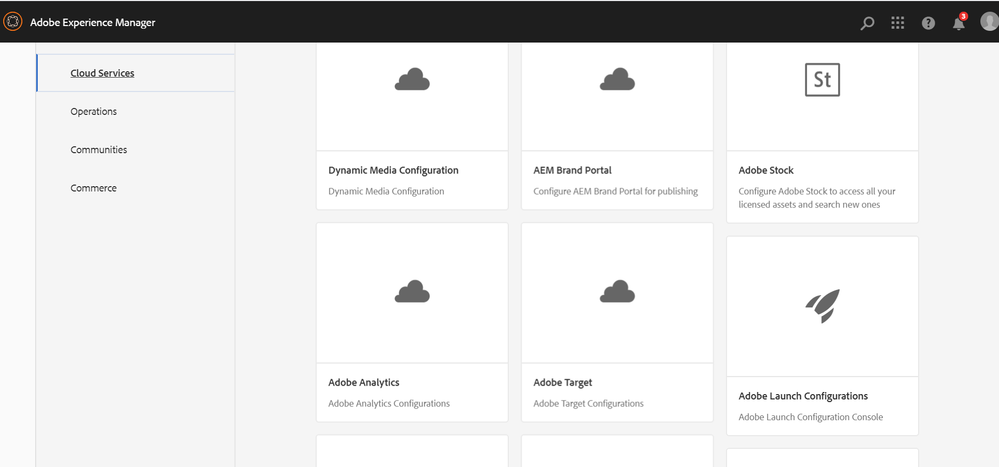
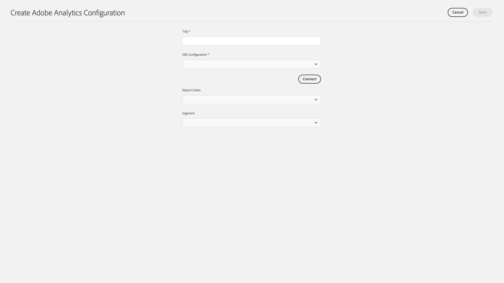

# Integreren met Adobe Analytics{#integrating-with-adobe-analytics}

Door Adobe Analytics en AEM as a Cloud Service te integreren, kunt u de activiteiten van uw webpagina bijhouden. De integratie vereist:

* met de Touch-gebruikersinterface een analytische configuratie in AEM as a Cloud Service maken. IMS-verificatie is vereist voor integratie van Adobe Analytics met AEM as a Cloud Service.
* het toevoegen van en het vormen van Adobe Analytics als uitbreiding in [ Lancering van de Adobe ](#analytics-launch). Voor meer details over de Lancering van de Adobe, kunt u met de [ gids van QuickStart ](https://experienceleague.adobe.com/docs/experience-platform/tags/get-started/quick-start.html?lang=nl-NL) beginnen.

In vergelijking met eerdere versies van AEM wordt frameondersteuning niet geleverd in de Analytics Configuration in AEM as a Cloud Service. In plaats daarvan gebeurt dit nu via het starten van de Adobe. Dit is het feitelijke hulpmiddel voor het instrumenteren van een AEM site met analysemogelijkheden (JS-bibliotheken). In de Lancering van de Adobe, wordt een bezit gecreeerd waar de uitbreiding van Adobe Analytics kan worden gevormd en de regels worden gecreeerd om gegevens naar Adobe Analytics te verzenden. Adobe Launch heeft in de plaats getreden van de door de sitecatalyst geleverde analytische taak.

>[!NOTE]
>
>Adobe Experience Manager as a Cloud Service-klanten die geen bestaande account voor Analytics hebben, kunnen toegang aanvragen tot het Analytics Foundation Pack voor Experience Cloud. This Foundation Pack provided volume limited use of Analytics.

## Adobe Analytics-configuratie maken {#analytics-configuration}

1. Navigeer aan **Hulpmiddelen** → **Cloud Servicen**.
2. Selecteer **Adobe Analytics**.
   
3. Selecteer **creeer** knoop.
4. Vul de details (zie hieronder) in, en klik **verbinden**.

### Configuratieparameters {#configuration-parameters}

De velden in het configuratievenster zijn als volgt:

| Eigenschap | Beschrijving |
|---|---|
| Titel | De configuratienaam |
| IMS-configuratie | De IMS-configuratie selecteren (zie het hoofdstuk hieronder) |
| Segment | Optie voor het gebruik van een analysesegment dat is gedefinieerd in de huidige rapporteringssuite. De analyserapporten worden gefilterd op basis van het segment. Zie [ Ongeveer segmenten ](https://experienceleague.adobe.com/docs/analytics/components/segmentation/seg-overview.html?lang=nl-NL) voor extra details. |
| Rapportageopties | Een opslagplaats waar u gegevens en trekkingsrapporten verzendt. Een rapportsuite definieert de volledige, onafhankelijke rapportage op een gekozen website, een set websites of een subset van websitepagina&#39;s. U kunt de rapporten bekijken die van één enkele rapportreeks worden gehaald en kunt dit gebied in een configuratie op elk ogenblik overeenkomstig uw vereisten uitgeven. |

### Adobe Analytics met IMS-verificatie {#configuration-parameters-ims}

Voor de integratie van Adobe Experience Manager as a Cloud Service (AEMaaCS) met Adobe Analytics via de API voor Analytics Standard is de configuratie van Adobe IMS (Identity Management System) vereist.

Zie [ Instelling IMS Integraties voor AEM as a Cloud Service ](/help/security/setting-up-ims-integrations-for-aem-as-a-cloud-service.md) leren hoe te om de configuratie tot stand te brengen IMS.

>[!NOTE]
>
>[ IMS de integratie wordt nu gevormd met S2S OAuth ](/help/security/setting-up-ims-integrations-for-aem-as-a-cloud-service.md).
>
>De vorige configuraties werden gemaakt met [ geloofsbrieven JWT die nu onderworpen aan verval in Adobe Developer Console ](/help/security/jwt-credentials-deprecation-in-adobe-developer-console.md) zijn.

### Een configuratie toevoegen aan een site {#add-configuration}

Om een configuratie van de Aanraking UI op een plaats toe te passen, ga naar: **Plaatsen** → **selecteer om het even welke plaatspagina** → **Eigenschappen** → **Geavanceerd** → **Configuratie** → selecteer de configuratiehuurder.

## Adobe Analytics integreren op AEM sites met behulp van Adobe Launch {#analytics-launch}

Adobe Analytics kan als extensie worden toegevoegd aan de eigenschap Launch. De regels kunnen worden bepaald om afbeelding uit te voeren en een postvraag aan Adobe Analytics te maken:

* Controle [ deze video ](https://experienceleague.adobe.com/docs/analytics-learn/tutorials/implementation/via-adobe-launch/basic-configuration-of-the-analytics-launch-extension.html?lang=nl-NL) leren hoe te om de uitbreiding van Analytics in Lancering voor een basisplaats te vormen.

* Zie [ Adobe Analytics ](https://experienceleague.adobe.com/docs/core-services-learn/implementing-in-websites-with-launch/implement-solutions/analytics.html?lang=nl-NL) voor details op toevoegen hoe te om regels tot stand te brengen en gegevens naar Adobe Analytics te verzenden.

>[!NOTE]
>
>De configuratie IMS (technische rekeningen) voor Launch is vooraf geconfigureerd in AEM as a Cloud Service. U hoeft deze configuratie niet te maken.

>[!NOTE]
>
>Bestaande (verouderde) frameworks werken nog, maar kunnen niet worden geconfigureerd in de aanraakinterface. Het is raadzaam om de configuraties van de veranderlijke afbeelding in Lancering opnieuw op te bouwen.
