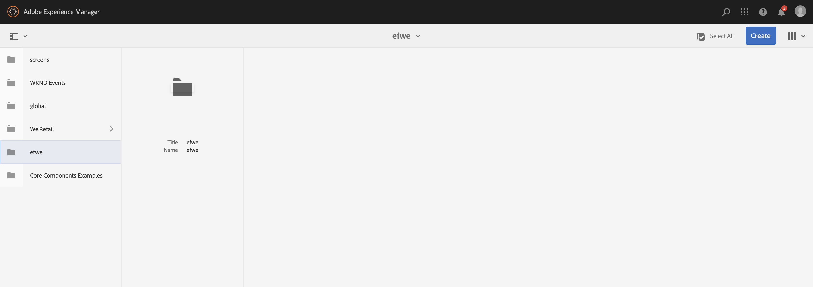
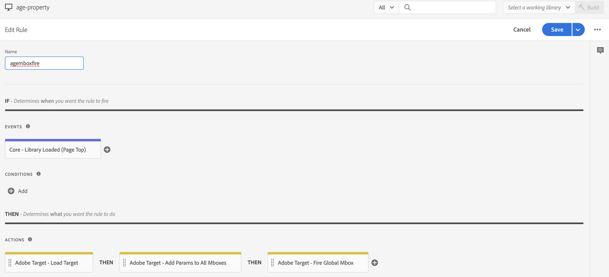

# Integreren met Adobe Target{#integrating-with-adobe-target}

Als onderdeel van de Adobe Marketing Cloud kunt u met Adobe Target de relevantie van inhoud vergroten door de inhoud op alle kanalen te richten en te meten. Voor de integratie van Adobe Target en AEM als Cloud Service is het volgende vereist:

* het gebruiken van Touch UI om een Configuratie van het Doel in AEM als Cloud Service (vereiste configuratie IMS) tot stand te brengen.
* Adobe Target toevoegen en configureren als een extensie in [Adobe starten](https://experienceleague.adobe.com/docs/launch/using/intro/get-started/quick-start.html).

Adobe Starten is nodig voor het beheer van client-side eigenschappen voor zowel Analytics als Target op AEM pagina&#39;s (JS-bibliotheken/tags). De integratie met Launch is echter noodzakelijk voor &quot;ervaring richtend&quot;. Voor de uitvoer van de Fragmenten van de Ervaring naar Doel, hebt u slechts de Configuratie van Adobe Target en IMS nodig.

>[!NOTE]
>
>Adobe Experience Manager als klanten van de Cloud Service die geen bestaande rekening van het Doel hebben, kan om toegang tot het Pak van de Stichting van het Doel voor Experience Cloud verzoeken. Het Pak van de Stichting verstrekt volume beperkt gebruik van Doel.

## Adobe Target-configuratie {#create-configuration} maken

1. Navigeer naar **Tools** → **Cloud Services**.
   
2. Selecteer **Adobe Target**.
3. Selecteer de **Create** knoop.
   
4. Vul de gegevens in (zie hieronder) en selecteer **Connect**.
   

### IMS-configuratie {#ims-configuration}

Een configuratie IMS voor zowel Lancering als Doel is noodzakelijk om Doel met AEM en Lancering behoorlijk te integreren. Terwijl de configuratie IMS voor Lancering vooraf in AEM als Cloud Service wordt gevormd, moet de configuratie van doel IMS worden gecreeerd (nadat het Doel provisioned is). Raadpleeg [deze video](https://helpx.adobe.com/experience-manager/kt/sites/using/aem-sites-target-standard-technical-video-understand.html) en [deze pagina](https://experienceleague.adobe.com/docs/experience-manager-65/administering/integration/integration-ims-adobe-io.html) voor meer informatie over het maken van de IMS-configuratie Doel.

### Adobe Target Tenant ID and Adobe Target Client Code {#tenant-client}

Houd rekening met het volgende wanneer u de velden Adobe Target Tenant ID en Adobe Target Client Code configureert:

1. Voor de meeste klanten, zijn identiteitskaart van de Aannemer en de Code van de Cliënt het zelfde. Dit betekent dat beide velden dezelfde informatie bevatten en identiek zijn. Zorg ervoor dat u de id van de huurder in beide velden invoert.
2. Voor oudere doeleinden kunt u ook verschillende waarden invoeren in de velden Tenant ID en Client Code.

Houd er in beide gevallen rekening mee dat:

* Door gebrek, wordt de Code van de Cliënt (als eerst toegevoegd) ook automatisch gekopieerd in het gebied van identiteitskaart van de Aannemer.
* U kunt de standaard huurder-id wijzigen.
* Dienovereenkomstig, zal de achterste vraag aan Doel op identiteitskaart van de Aannemer en de cliënt zijvraag aan Doel worden gebaseerd op de Code van de Cliënt.

Zoals eerder vermeld, is de eerste zaak de meest voorkomende voor AEM als Cloud Service. Hoe dan ook, zorg ervoor dat **beide** gebieden de correcte informatie afhankelijk van uw vereisten bevatten.

>[!NOTE]
>
> Als u een bestaande Configuratie van het Doel wilt veranderen:
>
> 1. Voer de huurder-id opnieuw in.
> 2. Maak opnieuw verbinding met Doel.
> 3. Sla de configuratie op.

### De doelconfiguratie bewerken {#edit-target-configuration}

Ga als volgt te werk om de doelconfiguratie te bewerken:

1. Selecteer een bestaande configuratie en klik **Eigenschappen**.
2. Bewerk de eigenschappen.
3. Selecteer **Opnieuw verbinden met Adobe Target**.
4. Selecteer **Opslaan en sluiten**.

### Een configuratie toevoegen aan een site {#add-configuration}

Ga naar: **Sites** → **Selecteer een sitepagina** → **Eigenschappen** → **Geavanceerd** → **Configuration** → Selecteer de configuratietechnicus.

## Adobe Target op AEM sites integreren met behulp van Adobe starten {#integrate-target-launch}

AEM biedt een out of the box integratie met Experience Platform Launch. Door de Adobe Target-extensie toe te voegen aan Experience Platform Launch, kunt u de functies van Adobe Target op AEM webpagina&#39;s gebruiken. Doelbibliotheken worden alleen gerenderd met Launch.

>[!NOTE]
>
>Bestaande (verouderde) frameworks werken nog, maar kunnen niet worden geconfigureerd in de aanraakinterface. Het is raadzaam om de configuraties van de veranderlijke afbeelding in Lancering opnieuw op te bouwen.

Als algemeen overzicht, zijn de integratiestappen:

1. Een opstarteigenschap maken
2. De vereiste extensies toevoegen
3. Een gegevenselement maken (om de parameters van de contexthub vast te leggen)
4. Een paginalijn maken
5. Samenstellen en publiceren

### Een opstarteigenschap maken {#create-property}

Een eigenschap is een container die is gevuld met extensies, regels en gegevenselementen.

1. Selecteer de **Nieuwe eigenschap** knoop.
2. Geef een naam op voor de eigenschap.
3. Als domein voert u de IP/host in waarop u de opstartafspeelbibliotheek wilt laden.
4. Selecteer **Save** knoop.
   

### De vereiste extensies toevoegen {#add-extension}

**De container** waarmee de kernbibliotheekinstellingen worden beheerd, wordt uitgebreid. De extensie Adobe Target ondersteunt client-side implementaties door Target JavaScript SDK te gebruiken voor het moderne web, at.js. U moet zowel **Adobe Target** als **Adobe ContextHub** uitbreidingen toevoegen.

1. Selecteer de optie Extension Catalog en zoek naar Target in het filter.
2. Selecteer **Adobe Target** at.js en klik op de installatieoptie.
   
3. Selecteer **Configure** knoop. Bericht het configuratievenster met de ingevoerde de rekeningsgeloofsbrieven van het Doel, en de versie at.js voor deze uitbreiding.
4. Selecteer **Save** om de uitbreiding van het Doel aan uw bezit van de Lancering toe te voegen. U zou de uitbreiding van het Doel moeten kunnen zien onder **Geïnstalleerde Uitbreidingen** lijst wordt vermeld die.
   
5. Herhaal de stappen hierboven om naar **Adobe te zoeken ContextHub** uitbreiding en installeer het (dit wordt vereist voor de integratie met contexthub parameters, die op welke het richten zullen worden gedaan).

### Een gegevenselement maken {#data-element}

**De** elementen van gegevens zijn placeholders waaraan u de parameters van de contexthub kunt in kaart brengen.

1. Selecteer **Gegevenselementen**.
2. Selecteer **Gegevenselement toevoegen**.
3. Geef de naam van het gegevenselement op en wijs dit toe aan een parameter van een contexthub.
4. Selecteer **Opslaan**.
   

### Een paginalijn maken {#page-rule}

In **Rule** bepalen en ordenen wij een opeenvolging van acties, die op plaats worden uitgevoerd, om het richten te bereiken.

1. Voeg een set handelingen toe zoals wordt getoond in de schermafbeelding.
   
2. In Add Params aan Alle Mboxes voegt het gegevenselement toe dat vroeger wordt gevormd (zie gegevenselement hierboven), aan de parameter die in de mbox vraag zal worden verzonden.
   

### {#build-publish} maken en publiceren

Raadpleeg deze [pagina](https://experienceleague.adobe.com/docs/experience-manager-learn/aem-target-tutorial/aem-target-implementation/using-launch-adobe-io.html) voor meer informatie over het samenstellen en publiceren.

## Wijzigingen in de inhoudsstructuur tussen Klassieke en Touch UI-configuraties {#changes-content-structure}

| **Wijzigen** | **Klassieke UI-configuratie** | **Touch UI-configuratie** | **Gevolgen** |
|---|---|---|---|
| Plaats van de Configuratie van het Doel. | /etc/cloudservices/testandtarget/ | /conf/huurder/settings/cloudservices/target | Eerder waren de veelvoudige configuraties aanwezig onder /etc/cloudservices/testandtarget maar nu is één enkele configuratie aanwezig onder een huurder. |

>[!NOTE]
>
>Oudere configuraties worden nog steeds ondersteund voor bestaande klanten (zonder de optie om nieuwe configuraties te bewerken of te maken). Oudere configuraties maken deel uit van inhoudspakketten die door klanten met VSTS worden geüpload.
