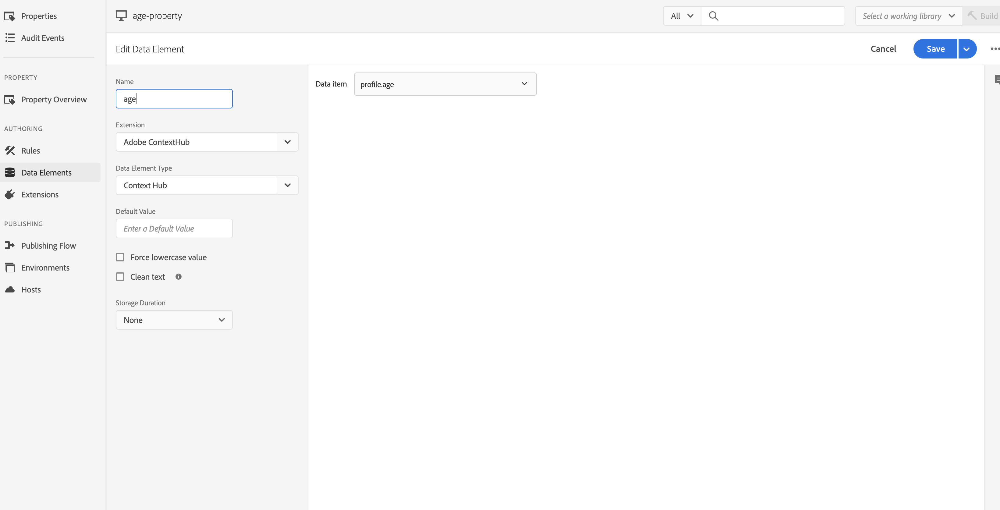

# Integreren met Adobe Target{#integrating-with-adobe-target}

Als onderdeel van de Adobe Experience Cloud kunt u met Adobe Target de relevantie van inhoud vergroten door de inhoud op alle kanalen te richten en te meten. Voor de integratie van Adobe Target en AEM as a Cloud Service zijn:

* het gebruiken van Touch UI om een Configuratie van het Doel in AEM as a Cloud Service (vereiste configuratie IMS) te creëren.
* Adobe Target toevoegen en configureren als extensie in [Adobe starten](https://experienceleague.adobe.com/docs/experience-platform/tags/get-started/quick-start.html).

Adobe starten is nodig voor het beheer van client-side eigenschappen voor zowel Analytics als Target op AEM pagina&#39;s (JS-bibliotheken/tags). Dat gezegd hebbende, is de integratie met Lancering nodig voor &quot;Ervaring gericht&quot;.

Voor het uitvoeren van de Fragmenten van de Ervaring en/of de Fragmenten van de Inhoud aan Doel, hebt u nodig [Adobe Target-configuratie](#create-configuration), met inbegrip van [IMS-integratie](#ims-configuration).

>[!NOTE]
>
>Klanten die geen bestaande rekening van het Doel hebben, kunnen om toegang tot het Pak van de Stichting van het Doel voor Experience Cloud verzoeken. Het Pak van de Stichting verstrekt volume beperkt gebruik van Doel.

## Adobe Target-configuratie maken {#create-configuration}

1. Navigeren naar **Gereedschappen** → **Cloud Servicen**.
   
2. Selecteren **Adobe Target**.
3. Selecteer de **Maken** knop.
   
4. Vul de details in (zie hieronder), en selecteer **Verbinden**.
   

### IMS-configuratie {#ims-configuration}

Voor de integratie van AEM met Adobe Target via de Target Standard API is de configuratie van Adobe IMS (Identity Management System) vereist. De IMS-configuratie van het doel moet worden gemaakt (nadat het doel is ingericht). Zie [IMS-integratie instellen voor AEM as a Cloud Service](/help/security/setting-up-ims-integrations-for-aem-as-a-cloud-service.md) en de video [Experience Platform Launch en AEM integreren](https://experienceleague.adobe.com/docs/experience-manager-learn/sites/integrations/experience-platform-data-collection-tags/overview.html) om te leren hoe te om de configuratie van het Doel te creëren IMS.

>[!NOTE]
>
>[IMS-integratie is nu geconfigureerd met S2S OAuth](/help/security/setting-up-ims-integrations-for-aem-as-a-cloud-service.md).
>
>Eerdere configuraties zijn gemaakt met [JWT-referenties die nu zijn afgekeurd in de Adobe Developer-console](/help/security/jwt-credentials-deprecation-in-adobe-developer-console.md).

>[!NOTE]
>
>Wanneer het vormen van het project, hangen de productprofielen met worden getoond af van of u hebt:
>
>* Adobe Target Standard - alleen **Standaardwerkruimte** is beschikbaar
>* Adobe Target Premium - alle beschikbare werkruimten worden weergegeven, zoals hieronder wordt weergegeven

### Adobe Target Tenant ID and Adobe Target Client Code {#tenant-client}

Houd rekening met het volgende wanneer u de velden Adobe Target Tenant ID en Adobe Target Client Code configureert:

1. Voor de meeste klanten, zijn identiteitskaart van de Aannemer en de Code van de Cliënt het zelfde. Dat wil zeggen dat beide velden dezelfde informatie bevatten en identiek zijn. Zorg ervoor dat u de id van de huurder in beide velden invoert.
2. Voor oudere doeleinden kunt u ook verschillende waarden invoeren in de velden Tenant ID en Client Code.

In beide gevallen:

* Door gebrek, wordt de Code van de Cliënt (als eerst toegevoegd) ook automatisch gekopieerd in het gebied van identiteitskaart van de Aannemer.
* Indien nodig, kunt u de standaard reeks van identiteitskaart van de Huurder veranderen.
* De achtergrond vraag aan Doel is gebaseerd op huuridentiteitskaart en de cliënt zijvraag aan Doel is gebaseerd op de Code van de Cliënt.

Zoals eerder vermeld, is de eerste zaak de meest voorkomende voor AEM as a Cloud Service. Zorg ervoor dat **beide** de velden bevatten de juiste gegevens, afhankelijk van uw vereisten.

>[!NOTE]
>
> Als u een bestaande Configuratie van het Doel wilt veranderen:
>
> 1. Voer de id van de huurder opnieuw in.
> 2. Opnieuw verbinden met doel.
> 3. Sla de configuratie op.

### De doelconfiguratie bewerken {#edit-target-configuration}

Ga als volgt te werk om de doelconfiguratie te bewerken:

1. Selecteer een bestaande configuratie en klik op **Eigenschappen**.
2. Bewerk de eigenschappen.
3. Selecteren **Opnieuw verbinding maken met Adobe Target**.
4. Selecteren **Opslaan en sluiten**.

### Een configuratie toevoegen aan een site {#add-configuration}

Ga als volgt te werk om een Touch UI-configuratie op een site toe te passen: **Sites** > **Een sitepagina selecteren** > **Eigenschappen** > **Geavanceerd** > **Configuratie** > Selecteer de configuratieteuse.

## Adobe Target integreren op AEM sites met behulp van Adobe Launch {#integrate-target-launch}

AEM biedt een out of the box integratie met Experience Platform Launch. Door de Adobe Target-extensie toe te voegen aan Experience Platform Launch, kunt u de functies van Adobe Target op AEM webpagina&#39;s gebruiken. Doelbibliotheken worden alleen weergegeven met Launch.

>[!NOTE]
>
>Bestaande (verouderde) frameworks werken nog, maar kunnen niet worden geconfigureerd in de aanraakinterface. De Adobe adviseert u de veranderlijke toewijzingsconfiguraties in Lancering opnieuw op te bouwen.

Als algemeen overzicht, zijn de integratiestappen:

1. Een opstarteigenschap maken
2. De vereiste extensies toevoegen
3. Een gegevenselement maken (om de parameters van de contexthub vast te leggen)
4. Een paginalijn maken
5. Samenstellen en publiceren

### Een opstarteigenschap maken {#create-property}

Een eigenschap is een container die is gevuld met extensies, regels en gegevenselementen.

1. Selecteer de **Nieuwe eigenschap** knop.
2. Geef een naam op voor de eigenschap.
3. Als domein voert u de IP/host in waarop u de opstartafspeelbibliotheek wilt laden.
4. Selecteer de **Opslaan** knop.
   

### De vereiste extensies toevoegen {#add-extension}

**Extensies** Dit is de container die de kernbibliotheekinstellingen beheert. De extensie Adobe Target ondersteunt client-side implementaties door Target JavaScript SDK te gebruiken voor het moderne web, at.js. Voeg beide toe **Adobe Target** en **Adobe ContextHub** extensies.

1. Selecteer de optie Extension Catalog en zoek naar Target in het filter.
2. Selecteren **Adobe Target** om.js en klik op de Install optie.
   
3. Selecteer de **Configureren** knop. Bericht het configuratievenster met de ingevoerde de rekeningsgeloofsbrieven van het Doel, en de versie at.js voor deze uitbreiding.
4. Selecteren **Opslaan** om de uitbreiding van het Doel aan uw bezit van de Lancering toe te voegen. U zou de uitbreiding van het Doel moeten kunnen zien onder **Geïnstalleerde extensies** lijst.
   
5. Herhaal bovenstaande stappen om te zoeken naar de **Adobe ContextHub** extensie en installeer deze extensie (deze extensie is vereist voor de integratie met contexthub-parameters, op basis waarvan u het doel opgeeft).

### Een gegevenselement maken {#data-element}

**Gegevenselementen** zijn placeholders waaraan u de parameters van de contexthub kunt in kaart brengen.

1. Selecteren **Gegevenselementen**.
2. Selecteren **Gegevenselement toevoegen**.
3. Geef de naam van het gegevenselement op en wijs dit toe aan een parameter van een contexthub.
4. Selecteren **Opslaan**.
   

### Een paginalijn maken {#page-rule}

In **Regel**, wordt een reeks acties gedefinieerd en geordend, die ter plaatse worden uitgevoerd, om het doel te bereiken.

1. Voeg een set handelingen toe zoals wordt getoond in de schermafbeelding.
   
2. In Add Params aan Alle Mboxes, voeg het gegevenselement toe dat vroeger (zie gegevenselement hierboven) wordt gevormd, aan de parameter die in de mbox vraag wordt verzonden.
   

### Samenstellen en publiceren {#build-publish}

Ga voor meer informatie over het samenstellen en publiceren naar [page](https://experienceleague.adobe.com/docs/experience-manager-learn/aem-target-tutorial/aem-target-implementation/using-launch-adobe-io.html).

## Wijzigingen in de inhoudsstructuur tussen Klassieke en Touch UI-configuraties {#changes-content-structure}

<table style="table-layout:auto">
  <tr>
    <th>Wijzigen</th>
    <th>Klassieke UI-configuratie</th>
    <th>Touch UI-configuratie</th>
    <th>Gevolgen</th>
  </tr>
  <tr>
    <td>Plaats van de Configuratie van het Doel.</td>
    <td>/etc/cloudservices/testandtarget/</td>
    <td>/conf/huurder/settings/cloudconfigs/target/</td>
    <td> Eerder waren de veelvoudige configuraties aanwezig onder /etc/cloudservices/testandtarget maar nu is één enkele configuratie aanwezig onder een huurder.</td>
  </tr>
</table>

>[!NOTE]
>
>Oudere configuraties worden nog steeds ondersteund voor bestaande klanten (zonder de optie om te bewerken of te maken). Verouderde configuraties maken deel uit van inhoudspakketten die door klanten met VSTS worden geüpload.
