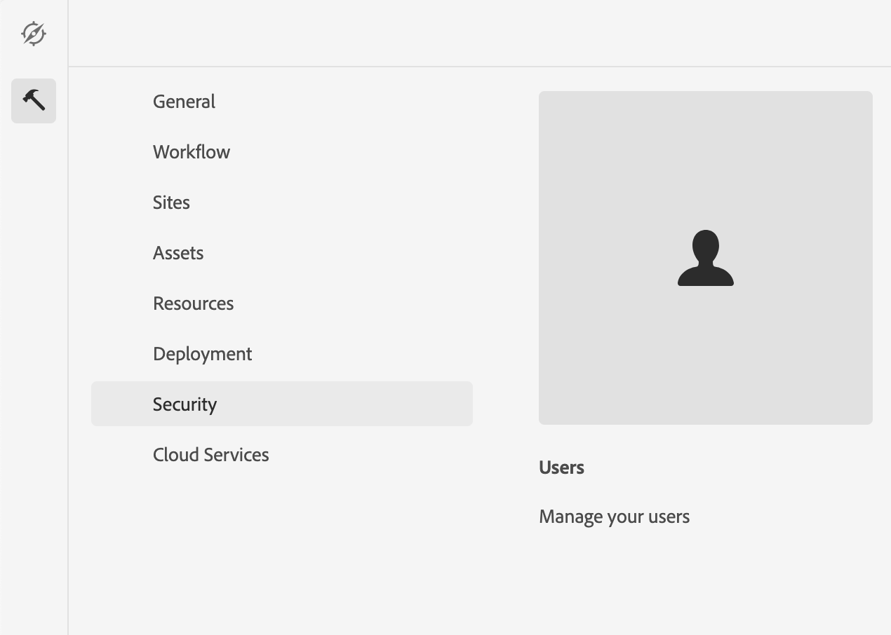

# Integreren met Adobe Campaign Classic {#integrating-campaign-classic}

Door te integreren met Adobe Campaign kunt u de levering van e-mail, inhoud en formulieren rechtstreeks in AEM as a Cloud Service beheren. De stappen van de configuratie in zowel Adobe Campaign Classic als AEM as a Cloud Service zijn nodig om de bidirectionele communicatie tussen oplossingen toe te laten.

AEM as a Cloud Service en Adobe Campaign Classic kunnen ook onafhankelijk worden gebruikt. Marketers kunnen bijvoorbeeld campagnes maken en doelgericht gebruik maken in Adobe Campaign, terwijl makers van inhoud in AEM as a Cloud Service aan het ontwerp kunnen werken.

## Integratieworkflow {#integration-workflow}

In de volgende hoofdstukken wordt gedetailleerd beschreven hoe u de oplossingen kunt integreren. Hiervoor zijn zowel in Adobe Campaign Classic als AEM as a Cloud Service configuratiestappen vereist. Als zodanig leert u hoe u:

* [De operatorgebruiker maken](#create-operator)
* [AEM voor integratie configureren](#aem-configuration)
* [De externe gebruiker van de campagne configureren](#configure-user)
* [De externe account van Adobe Campaign Classic instellen](#acc-setup)

### Vereisten {#prerequisites}

**Adobe Campaign Classic**

Om de integratie uit te voeren hebt u een werkende instantie van Adobe Campaign Classic, met inbegrip van een gegevensbestand nodig. Als u meer informatie nodig hebt over het instellen en configureren van Adobe Campaign Classic, lees dan de officiële [Adobe Campaign Classic-documentatie](https://experienceleague.adobe.com/docs/campaign-classic/using/campaign-classic-home.html) vooral de gids van de Installatie en van de Configuratie. Houd in mening dat om de hieronder voorgestelde verrichtingen uit te voeren u ook de beheerderrol moet hebben.

**AEM as a Cloud Service**

U hebt de [AEM as a Cloud Service](https://experienceleague.adobe.com/docs/experience-manager-cloud-service/content/overview/introduction.html) oplossing.

### Operator-gebruiker maken in Adobe Campaign Classic {#create-operator}

Open de Adobe Campaign Classic-clientconsole vanuit het beginmenu en meld u aan. De startpagina moet worden weergegeven.

1. Klikken **Verkenner** om de weergave Verkenner te openen.
   
1. Navigeer in de structuurweergave aan de linkerkant naar **Beheer->Toegangsbeheer->Operatoren**.
1. Dubbelklik op de knop `aemserver` in de lijst met operatoren aan de rechterkant.
1. Naar de **Bewerken** tab. Stel het wachtwoord voor de server in.
   
1. Klik op de knop **Toegangsrechten** en klik op de knop **De toegangsparameters bewerken** onder de beveiligingsinstellingen.
1. Selecteer onder Versleuteling het openbare netwerk als de geoorloofde verbindingszone. Klikken **OK**.
   
1. Klikken **Opslaan**.
1. Afmelden.
1. Ga bijvoorbeeld naar de Adobe Campaign Classic v7-installatielocatie `C:\Program Files\Adobe\Adobe Campaign Classic v7\conf` en opent u de `serverConf.xml` als beheerder.
   * Zoeken naar **veiligheidszone**.
   * De volgende parameters instellen `allowHTTP="true"` `sessionTokenOnly="true"` `allowUserPassword="true"`.
   * Sla het bestand op.
1. Zorg ervoor dat de beveiligingszone niet wordt overschreven door de desbetreffende instelling in `config-<server name>.xml` bestand (C:\Program Files\Adobe\Adobe Campaign Classic v7\conf\config_acc-test.xml).
   * Als het configuratiebestand een afzonderlijke instelling voor de beveiligingszone bevat, wijzigt u de instelling `allowUserPassword` kenmerk naar true.
1. Als u de Adobe Campaign Classic-serverpoort wilt wijzigen, vervangt u 8080 door de gewenste poort (bijvoorbeeld: 80).

>[!NOTE]
>
>Door gebrek, is er geen veiligheidsstreek die voor de exploitant wordt gevormd. Als u verbinding wilt maken met Adobe Campaign met AEM as a Cloud Service, moet u er een selecteren (zie de bovenstaande stappen). We raden u ten zeerste aan een beveiligingszone in te stellen die is gewijd aan AEM om beveiligingsproblemen te voorkomen.

### AEM configureren als cloudservice {#aem-configuration}

1. Meld u aan bij Cloud Manager en start de AEM as a Cloud Service auteurinstantie.
1. Ga naar **Gereedschappen Cloud Service-Cloud Service met oudere**.
   
1. Ga omlaag naar Adobe Campaign en klik op de knop **Nu configureren** koppeling.
   * Voer een titel in.
   * Voer een naam in.
   * Klikken **Maken**.
1. Op het scherm Component bewerken
   * Voer de gebruikersnaam in, zie [De operatorgebruiker maken](#create-operator).
   * Voer het wachtwoord in.
   * Voer het eindpunt van de Adobe Campaign Classic-API voor de server in (bijvoorbeeld `http://3.22625.51:80`).
   * Klikken **Verbinding maken met Adobe Campaign**.
   * Klikken **OK**.

   >[!NOTE]
   >
   >Zorg ervoor dat uw Adobe Campaign-server bereikbaar is via internet, omdat AEM as a Cloud Service geen privénetwerken kan bereiken.
1. Controleer de publicatie-instantie in de configuratie Externalzer koppelen.
U kunt deze configuratie bekijken door de statusstortplaats van de diensten OSGi in te controleren [ontwikkelaarsconsole](https://experienceleague.adobe.com/docs/experience-manager-learn/cloud-service/debugging/debugging-aem-as-a-cloud-service/developer-console.html#osgi-services).
Als het dan niet correct is, breng veranderingen in de overeenkomstige instantie git bewaarplaats aan en stel dan de configuratie door te gebruiken op [cloudbeheer](https://experienceleague.adobe.com/docs/experience-manager-cloud-service/content/implementing/using-cloud-manager/deploy-code.html).

```
Service 3310 - [com.day.cq.commons.Externalizer] (pid: com.day.cq.commons.impl.ExternalizerImpl)",
"  from Bundle 420 - Day Communique 5 Commons Library (com.day.cq.cq-commons), version 5.12.16",
"    component.id: 2149",
"    component.name: com.day.cq.commons.impl.ExternalizerImpl",
"    externalizer.contextpath: ",
"    externalizer.domains: [local https://author-p17558-e33255-cmstg.adobeaemcloud.com, author https://author-p17558-e33255-cmstg.adobeaemcloud.com,
     publish https://publish-p17558-e33255-cmstg.adobeaemcloud.com]",
"    externalizer.encodedpath: false",
"    externalizer.host: ",
"    feature-origins: [com.day.cq:cq-quickstart:slingosgifeature:cq-platform-model_quickstart_author:6.6.0-V23085]",
"    service.bundleid: 420",
"    service.description: Creates absolute URLs",
"    service.scope: bundle",
"    service.vendor: Adobe Systems Incorporated",
```

>[!NOTE]
>
>De publicatie-instantie moet ook bereikbaar zijn vanaf de Adobe Campaign-server.

### De externe Adobe Campaign-gebruiker configureren {#configure-user}

U moet een wachtwoord voor de campagne-verre gebruiker plaatsen. Dit is nodig om Adobe Campaign Classic als Cloud-service te kunnen verbinden met AEM.

1. Ga naar **Beveiligingsgebruikers opnieuw stilzetten AEM**.
   
1. Zoeken naar `campaign-remote` en klik erop.
1. Klik op Wachtwoord wijzigen
   * Voer het nieuwe wachtwoord tweemaal in.
   * Voer uw AEM wachtwoord in.
   * Klikken **Opslaan**.

### De externe Adobe Campaign Classic-account configureren {#acc-setup}

U moet ook een externe account configureren om Adobe Campaign Classic te verbinden met het AEM as a Cloud Service exemplaar.

1. Meld u aan bij de Adobe Campaign Classic-server met de clientconsole.
1. Ga naar de weergave Verkenner.
1. Ga in de structuurweergave links naar **Platform stille externe accounts beheren**.
1. Klik in de lijstweergave rechtsboven op AEM instantie.
1. In de AEM-instantieconfiguratie
   * Voer bijvoorbeeld AEM as a Cloud Service auteur IP/FQN in `https://author-p17558-e33255-cmstg.adobeaemcloud.com`.
   * Voer de gebruiker en account in.
   * Ga het wachtwoord voor de campagne-verre gebruiker in die u in de AEM as a Cloud Service instantie (zie de procedure hierboven) plaatst.
   * Selecteer **Ingeschakeld** selectievakje.
   * Klikken **Opslaan**.

   >[!NOTE]
   >
   >De IP/FQN van de AEM-auteurserver moet bereikbaar zijn vanaf de Adobe Campaign Classic-serverinstantie. Voeg ook de backslash niet toe in de IP/FQN van de AEM-auteurserver.

Nu zowel Adobe Campaign Classic als AEM as a Cloud Service zijn geconfigureerd, is de integratie nu voltooid. Bovendien kunt u ook leren hoe u een Adobe Experience Manager-nieuwsbrief kunt maken door te lezen [deze pagina](/help/sites-cloud/integrating/creating-newsletter.md).
