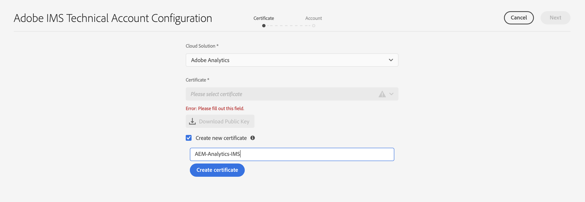
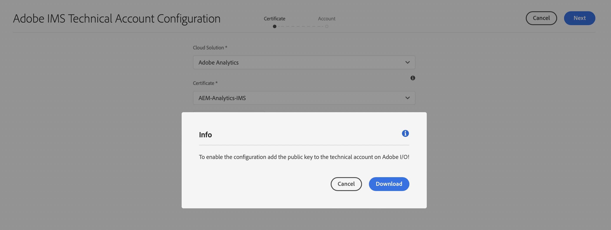
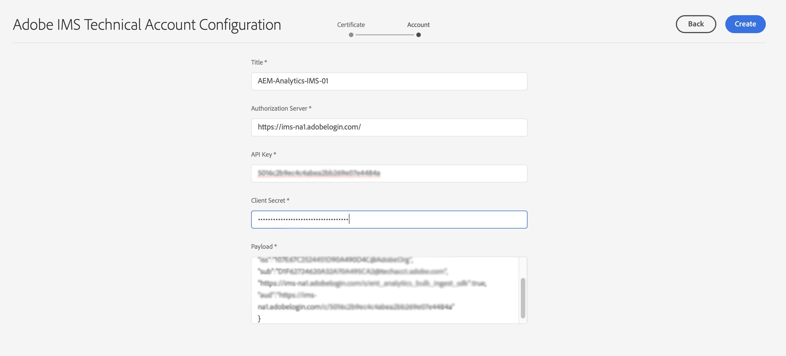
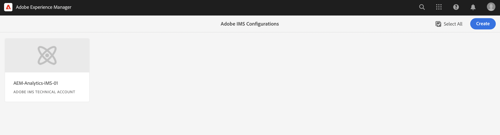

# IMS-configuratie voor gebruik bij integratie met Adobe Analytics {#ims-configuration-for-integration-with-adobe-analytics}

Voor de integratie van Adobe Experience Manager as a Cloud Service (AEMaaCS) met Adobe Analytics via de API voor Analytics Standard is de configuratie van Adobe IMS (Identity Management System) vereist. De configuratie wordt gerealiseerd met de Adobe Developer Console.

>[!NOTE]
>
>Ondersteuning voor de Adobe Analytics Standard API 2.0 is nieuw in AEMaaCS 2022.2.0. Deze versie van de API ondersteunt IMS-verificatie.
>
>De API-selectie wordt bepaald door de verificatiemethode die wordt gebruikt voor de integratie van AEM/Analytics.
>
>Nadere informatie is ook beschikbaar onder [Migreren naar de 2.0 API&#39;s](https://developer.adobe.com/analytics-apis/docs/2.0/guides/migration/).

## Vereisten {#prerequisites}

Voordat u met deze procedure begint:

* [Adobe-ondersteuning](https://helpx.adobe.com/nl/contact/enterprise-support.ec.html) moet je account opgeven voor:

   * Adobe-console
   * Adobe Developer Console
   * Adobe Analytics en
   * Adobe IMS (Identity Management-systeem)

* De systeembeheerder van het Systeem van uw organisatie zou de Admin Console moeten gebruiken om de vereiste ontwikkelaars in uw organisatie aan de relevante productprofielen toe te voegen.

   * Dit verstrekt de specifieke ontwikkelaars met toestemmingen om integratie toe te laten gebruikend de Console van de Ontwikkelaar van de Adobe.
   * Zie voor meer informatie [Ontwikkelaars beheren](https://helpx.adobe.com/enterprise/admin-guide.html/enterprise/using/manage-developers.ug.html).

## Een IMS-configuratie configureren - Een openbare sleutel genereren {#configuring-ims-generating-a-public-key}

De eerste fase van de configuratie is het creëren van een Configuratie IMS in AEM en het produceren van de Openbare Sleutel.

1. In AEM opent u de **Gereedschappen** -menu.
1. In de **Beveiliging** sectie selecteren **Adobe IMS-configuraties**.
1. Selecteren **Maken** om de **Configuratie technische account van Adobe IMS**.
1. De vervolgkeuzelijst onder gebruiken **Cloud Configuration**, selecteert u **Adobe Analytics**.
1. Activeren **Nieuw certificaat maken** en voert u een nieuwe alias in.
1. Bevestigen met **Certificaat maken**.

   

1. Selecteren **Downloaden** (of **Openbare sleutel downloaden**) om het bestand naar uw lokale station te downloaden, zodat het klaar is voor gebruik wanneer [IMS configureren voor Adobe Analytics-integratie met AEM](#configuring-ims-adobe-analytics-integration-with-aem).

   >[!CAUTION]
   >
   >Zorg dat deze configuratie geopend blijft, dat deze opnieuw nodig is wanneer [De IMS-configuratie voltooien in AEM](#completing-the-ims-configuration-in-aem).

   

## IMS configureren voor Adobe Analytics-integratie met AEM {#configuring-ims-adobe-analytics-integration-with-aem}

U moet met de Adobe Developer-console een project (integratie) maken met Adobe Analytics (voor AEM gebruik) en vervolgens de vereiste rechten toewijzen.

### Het project maken {#creating-the-project}

Open de Adobe Developer-console om een project te maken met Adobe Analytics dat AEM gebruiken:

1. Open de Adobe Developer Console voor Projecten:

   [https://developer.adobe.com/console/projects](https://developer.adobe.com/console/projects)

1. Alle projecten die u hebt, worden weergegeven. Selecteren **Nieuw project maken** - de locatie en het gebruik zijn afhankelijk van:

   * Als u nog geen project hebt, **Nieuw project maken** wordt midden onderaan weergegeven.
      
   * Als u al bestaande projecten hebt, worden deze weergegeven en **Nieuw project maken** is helemaal rechts.
      

1. Selecteren **Toevoegen aan project** gevolgd door **API**:

   

1. Selecteren **Adobe Analytics** vervolgens **Volgende**:

   >[!NOTE]
   >
   >Als je bent geabonneerd op Adobe Analytics, maar deze niet ziet, moet je de knop [Vereisten](#prerequisites).

   

1. Selecteren **Serviceaccount (JWT)** als type van authentificatie, dan ga met **Volgende**:

   

1. **Uw openbare sleutel uploaden** en, indien voltooid, doorgaan met **Volgende**:

   

1. Controleer de referenties en ga verder met **Volgende**:

   

1. Selecteer de vereiste productprofielen en ga verder met **geconfigureerde API opslaan**:

   

1. De configuratie wordt bevestigd.

### Rechten toewijzen aan de integratie {#assigning-privileges-to-the-integration}

U moet nu de vereiste rechten toewijzen aan de integratie:

1. De Adobe openen **Admin Console**:

   * [https://adminconsole.adobe.com](https://adminconsole.adobe.com/)

1. Navigeren naar **Producten** (bovenste werkbalk) selecteert u vervolgens **Adobe Analytics - &lt;*uw huurder*>** (in het linkerdeelvenster).
1. Selecteren **Productprofielen**, dan uw vereiste werkruimte uit de gepresenteerde lijst. Bijvoorbeeld de standaardwerkruimte.
1. Selecteren **API-referenties**, dan de vereiste integratieconfiguratie.
1. Selecteren **Editor** als de **Productrol**; in plaats van **Waarnemer**.

## Gegevens opgeslagen voor het Adobe Developer Console Integration-project {#details-stored-for-the-ims-integration-project}

Vanuit de Adobe Developer Console - Projecten kunt u een lijst met al uw integratieprojecten zien:

* [https://developer.adobe.com/console/projects](https://developer.adobe.com/console/projects)

Selecteer een specifieke projectingang om verdere details over de configuratie te tonen. Deze omvatten:

* Overzicht van project
* Inzichten
* Credentials
   * Serviceaccount (JWT)
      * Referentiegegevens
      * JWT genereren
* APIS
   * Bijvoorbeeld Adobe Analytics

Bij sommige hiervan moet u de integratie van Adobe Analytics in AEM op basis van IMS voltooien.

## De IMS-configuratie voltooien in AEM {#completing-the-ims-configuration-in-aem}

Als u terugkeert naar AEM kunt u de IMS-configuratie voltooien door de vereiste waarden van de IMS-integratie voor Analytics toe te voegen:

1. Terugkeren naar de [IMS-configuratie geopend in AEM](#configuring-ims-generating-a-public-key).
1. Selecteren **Volgende**.

1. Hier kunt u de [details van de projectconfiguratie in de Adobe Developer Console](#details-stored-for-the-ims-integration-project):

   * **Titel**: Uw tekst.
   * **Autorisatieserver**: Kopieer/plak deze vanuit de `aud` lijn van de **Payload** hieronder, bijvoorbeeld `https://ims-na1.adobelogin.com` in het onderstaande voorbeeld
   * **API-sleutel**: Kopieer deze van de **Credentials** van de [Overzicht van project](#details-stored-for-the-ims-integration-project)
   * **Clientgeheim**: Dit genereren in het dialoogvenster [Het geheime lusje van de Cliënt van de sectie van de Rekening van de Dienst (JWT)](#details-stored-for-the-ims-integration-project)en kopiëren
   * **Payload**: Kopieer deze van de [Het tabblad JWT van de sectie Service Account (JWT) genereren](#details-stored-for-the-ims-integration-project)

   

1. Bevestigen met **Maken**.

1. Uw Adobe Analytics-configuratie wordt weergegeven in de AEM console.

   

## De IMS-configuratie bevestigen {#confirming-the-ims-configuration}

Om te bevestigen dat de configuratie zoals verwacht werkt:

1. Open:

   * `https://localhost<port>/libs/cq/adobeims-configuration/content/configurations.html`

   Bijvoorbeeld:

   * `https://localhost:4502/libs/cq/adobeims-configuration/content/configurations.html`

1. Selecteer uw configuratie.
1. Selecteren **Health controleren** van de werkbalk, gevolgd door **Controleren**.

   

1. Als dit lukt, wordt een bevestigingsbericht weergegeven.

## De integratie met Adobe Analytics voltooien {#complete-the-integration-with-adobe-analytics}

U kunt deze IMS-configuratie nu gebruiken om de [integratie met Adobe Analytics](/help/sites-cloud/integrating/integrating-adobe-analytics.md).

<!--
## Configuring the Adobe Analytics Cloud Service {#configuring-the-adobe-analytics-cloud-service}

The configuration can now be referenced for a Cloud Service to use the Analytics Standard API:

1. Open the **Tools** menu. Then, within the **Cloud Services** section, select **Legacy Cloud Services**.
1. Scroll down to **Adobe Analytics** and select **Configure now**.

   The **Create Configuration** dialog will open.

1. Enter a **Title** and, if you want, a **Name** (if left blank this will be generated from the title).

   You can also select the required template (if more than one is available).

1. Confirm with **Create**.

   The **Edit Component** dialog will open.

1. Enter the details in the **Analytics Settings** tab:

    * **Authentication**: IMS

    * **IMS Configuration**: select the name of the IMS Configuration

1. Click **Connect to Analytics** to initialize the connection with Adobe Analytics.

   If the connection is successful, the message **Connection successful** is displayed.

1. Select **OK** on the message.

1. Complete other parameters as required, followed by **OK** on the dialog to confirm the configuration.

1. You can now proceed to [Adding an Analytics Framework](/help/sites-administering/adobeanalytics-connect.md) to configure parameters that will be sent to Adobe Analytics. 
-->
