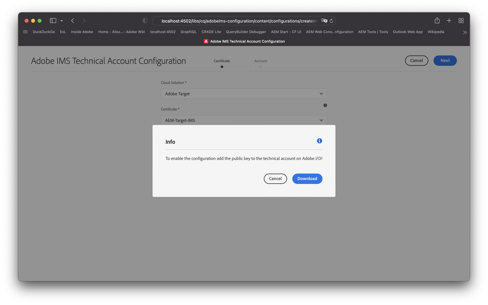
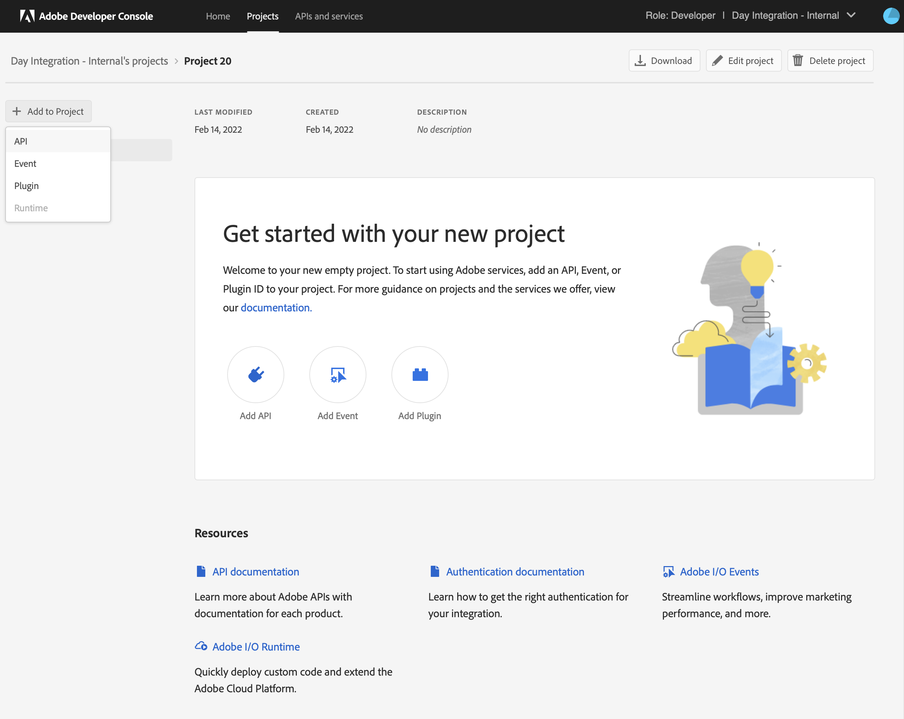

# IMS-configuratie voor gebruik bij integratie met Adobe Target{#ims-configuration-for-integration-with-adobe-target}

Voor de integratie van AEM met Adobe Target via de Target Standard API is de configuratie van Adobe IMS (Identity Management System) vereist. De configuratie wordt uitgevoerd met de Adobe Developer Console.

>[!CAUTION]
>
>De configuratie die op deze pagina wordt beschreven kan niet meer voor nieuwe of bijgewerkte integratie worden gebruikt.
>
>[IMS-integratie is nu geconfigureerd met S2S OAuth](/help/security/setting-up-ims-integrations-for-aem-as-a-cloud-service.md).
>
>Eerdere configuraties, zoals beschreven op deze pagina, zijn gemaakt met [JWT-referenties die nu zijn afgekeurd in de Adobe Developer-console](/help/security/jwt-credentials-deprecation-in-adobe-developer-console.md).

>[!NOTE]
>
>Ondersteuning voor de Adobe Target Standard API is nieuw in AEMaaCS. De doel-standaard-API gebruikt IMS-verificatie.
>
>De API-selectie wordt aangestuurd door de verificatiemethode die wordt gebruikt voor AEM/doelintegratie.

## Vereisten {#prerequisites}

Voordat u met deze procedure begint:

* [Ondersteuning voor Adobe](https://helpx.adobe.com/nl/contact/enterprise-support.ec.html) moet je account opgeven voor:

   * Adobe Console
   * Adobe Developer Console
   * Adobe Target en
   * Adobe IMS (Identity Management-systeem)

* De systeembeheerder van het Systeem van uw organisatie zou de Admin Console moeten gebruiken om de vereiste ontwikkelaars in uw organisatie aan de relevante productprofielen toe te voegen.

   * Hiermee beschikken de specifieke ontwikkelaars over machtigingen om integratie in te schakelen met de Adobe Developer-console.
   * Zie [Ontwikkelaars beheren](https://helpx.adobe.com/enterprise/admin-guide.html/enterprise/using/manage-developers.ug.html).

## Een IMS-configuratie configureren - Een openbare sleutel genereren {#configuring-an-ims-configuration-generating-a-public-key}

De eerste fase van de configuratie is een Configuratie IMS in AEM te creëren en de Openbare Sleutel te produceren.

1. In AEM opent u de **Gereedschappen** -menu.
1. In de **Beveiliging** sectie selecteren **Adobe IMS-configuraties**.
1. Selecteren **Maken** om de **Configuratie technische account van Adobe IMS**.
1. De vervolgkeuzelijst onder gebruiken **Cloud Configuration**, selecteert u **Adobe Target**.
1. Activeren **Nieuw certificaat maken** en voert u een nieuwe alias in.
1. Bevestigen met **Certificaat maken**.

   

1. Selecteren **Downloaden** (of **Openbare sleutel downloaden**) om het bestand naar uw lokale station te downloaden, zodat het klaar is voor gebruik wanneer [IMS configureren voor Adobe Target-integratie met AEM](#configuring-ims-adobe-target-integration-with-aem).

   >[!CAUTION]
   >
   >Zorg dat deze configuratie geopend blijft en dat deze opnieuw nodig is wanneer [De IMS-configuratie voltooien in AEM](#completing-the-ims-configuration-in-aem).

   

## IMS configureren voor Adobe Target-integratie met AEM {#configuring-ims-adobe-target-integration-with-aem}

Adobe Developer Console Project (integratie) met Adobe Target dat AEM gebruiken, wijst dan de vereiste voorrechten toe.

### Het project maken {#creating-the-project}

Open de Adobe Developer-console om een project te maken met Adobe Target dat AEM gebruiken:

>[!CAUTION]
>
>Momenteel ondersteunen we alleen de **Serviceaccount (JWT)** referentietype.
>
>Gebruik de **OAuth Server-to-Server** type referentie, dat in de toekomst zal worden gesteund.

1. Open de Adobe Developer-console voor projecten:

   [https://developer.adobe.com/console/projects](https://developer.adobe.com/console/projects)

1. Alle projecten die u hebt, worden weergegeven. Selecteren **Nieuw project maken** - de locatie en het gebruik zijn afhankelijk van:

   * Als u nog geen project hebt, **Nieuw project maken** is gecentreerd, onder.
     
   * Als u reeds bestaande projecten hebt, zijn deze vermeld en **Nieuw project maken** is rechtsboven.
     

1. Selecteren **Toevoegen aan project** gevolgd door **API**:

   

1. Selecteren **Adobe Target** vervolgens **Volgende**:

   >[!NOTE]
   >
   >Als je bent geabonneerd op Adobe Target, maar deze niet ziet, moet je de knop [Vereisten](#prerequisites).

   

1. **Uw openbare sleutel uploaden** en, indien voltooid, doorgaan met **Volgende**:

   

1. Controleer de referenties en ga verder met **Volgende**:

   

1. Selecteer de vereiste productprofielen en ga verder met **geconfigureerde API opslaan**:

   >[!NOTE]
   >
   >De productprofielen die worden weergegeven met, zijn afhankelijk van het volgende:
   >
   >* Adobe Target Standard - alleen **Standaardwerkruimte** is beschikbaar
   >* Adobe Target Premium - alle beschikbare werkruimten worden weergegeven, zoals hieronder wordt weergegeven

   

1. De oprichting wordt bevestigd.

<!--
1. The creation is confirmed, you can now **Continue to integration details**; these are needed for [Completing the IMS Configuration in AEM](#completing-the-ims-configuration-in-aem).

   
-->

<!-- could not verify - only saw Adobe Target Classic -->

### Rechten toewijzen aan de integratie {#assigning-privileges-to-the-integration}

U moet nu de vereiste rechten toewijzen aan de integratie:

1. De Adobe openen **Admin Console**:

   * [https://adminconsole.adobe.com](https://adminconsole.adobe.com/)

1. Navigeren naar **Producten** (bovenste werkbalk) selecteert u vervolgens **ADOBE TARGET - &lt;*uw huurder*>** (in het linkerdeelvenster).
1. Selecteren **Productprofielen**, dan uw vereiste werkruimte uit de gepresenteerde lijst. Bijvoorbeeld de standaardwerkruimte.
1. Selecteren **API-referenties**, dan de vereiste integratieconfiguratie.
1. Selecteren **Editor** als de **Productrol**; in plaats van **Waarnemer**.

## Gegevens opgeslagen voor het Adobe Developer Console Integration Project {#details-stored-for-the-ims-integration-project}

Vanuit de Adobe Developer Console Projecten Console kunt u een lijst van al uw integratieprojecten zien:

* [https://developer.adobe.com/console/projects](https://developer.adobe.com/console/projects)

Selecteren **Weergave** (rechts van een specifieke projectvermelding) om verdere details over de configuratie te tonen. Deze omvatten:

* Overzicht van project
* Inzichten
* Credentials
   * Serviceaccount (JWT)
      * Referentiegegevens
      * JWT genereren
* APIS
   * Bijvoorbeeld Adobe Target

Sommige hiervan moeten de integratie van Adobe Target in AEM op basis van IMS voltooien.

## De IMS-configuratie voltooien in AEM {#completing-the-ims-configuration-in-aem}

Terugkeren naar AEM kunt u de IMS-configuratie voltooien door vereiste waarden van de IMS-integratie voor Doel toe te voegen:

1. Terugkeren naar de [IMS-configuratie geopend in AEM](#configuring-an-ims-configuration-generating-a-public-key).
1. Selecteren **Volgende**.

1. Hier kunt u de [details van de projectconfiguratie in Adobe Developer Console](#details-stored-for-the-ims-integration-project):

   * **Titel**: Uw tekst.
   * **Autorisatieserver**: Kopieer/plak deze vanuit de `aud` lijn van de **Payload** hieronder, bijvoorbeeld `https://ims-na1.adobelogin.com` in het onderstaande voorbeeld
   * **API-sleutel**: Kopieer dit uit het project [Overzicht](#details-stored-for-the-ims-integration-project) sectie
   * **Clientgeheim**: Genereer dit in het project [Overzicht](#details-stored-for-the-ims-integration-project) en kopiëren
   * **Payload**: Kopieer deze van de [JWT genereren](#details-stored-for-the-ims-integration-project) sectie

   

1. Bevestigen met **Maken**.

1. Uw Adobe Target-configuratie wordt weergegeven in de AEM console.

   

## De IMS-configuratie bevestigen {#confirming-the-ims-configuration}

Om te bevestigen dat de configuratie zoals verwacht werkt:

1. Openen:

   * `https://localhost<port>/libs/cq/adobeims-configuration/content/configurations.html`

   Bijvoorbeeld:

   * `https://localhost:4502/libs/cq/adobeims-configuration/content/configurations.html`

1. Selecteer uw configuratie.
1. Selecteren **Health controleren** van de werkbalk, gevolgd door **Controleren**.

   

1. Als dit lukt, wordt een bevestigingsbericht weergegeven.

## De integratie met Adobe Target voltooien {#complete-the-integration-with-adobe-target}

U kunt deze IMS-configuratie nu gebruiken om de [integratie met Adobe Target](/help/sites-cloud/integrating/integrating-adobe-target.md).

<!--

## Configuring the Adobe Target Cloud Service {#configuring-the-adobe-target-cloud-service}

The configuration can now be referenced for a Cloud Service to use the Target Standard API:

1. Open the **Tools** menu. Then, within the **Cloud Services** section, select **Legacy Cloud Services**.
1. Scroll down to **Adobe Target** and select **Configure now**.

   The **Create Configuration** dialog opens.

1. Enter a **Title** and, if you want, a **Name** (if left blank it is generated from the title).

   You can also select the required template (if more than one is available).

1. Confirm with **Create**.

   The **Edit Component** dialog opens.

1. Enter the details in the **Adobe Target Settings** tab:

    * **Authentication**: IMS

    * **Client Code**: See the [Tenant ID and Client Code](#tenant-client) section.

    * **Tenant ID**: the Adobe IMS Tenant ID. See also the [Tenant ID and Client Code](#tenant-client) section.

      >[!NOTE]
      >
      >For IMS, this value must be taken from Target itself. You can log into Target and extract the Tenant ID from the URL.
      >
      >For example, if the URL is:
      >
      >`https://experience.adobe.com/#/@yourtenantid/target/activities`
      >
      >Then you would use `yourtenantid`.

    * **IMS Configuration**: select the name of the IMS Configuration

    * **API Type**: REST

    * **A4T Analytics Cloud Configuration**: Select the Analytics cloud configuration that is used for target activity goals and metrics. You need this if you are using Adobe Analytics as the reporting source when targeting content.   

      <!--
      If you do not see your cloud configuration, see note in [Configuring A4T Analytics Cloud Configuration](/help/sites-administering/target-configuring.md#configuring-a-t-analytics-cloud-configuration).
      -- >

    * **Use accurate targeting**: By default this check box is selected. If selected, the cloud service configuration will wait for the context to load before loading content. See note that follows.

    * **Synchronize segments from Adobe Target**: Select this option to download segments that are defined in Target to use them in AEM. Select this option when the API Type property is REST, because inline segments are not supported and you always need to use segments from Target. (The AEM term of 'segment' is equivalent to the Target 'audience'.)

    * **Client library**: Select whether you want the AT.js client library, or mbox.js (deprecated).

    * **Use Tag Management System to deliver client library**: Use DTM (deprecated), Adobe Launch or any other tag management system.

    * **Custom AT.js**: Leave blank if you checked the Tag Management box or to use the default AT.js. Alternatively upload your custom AT.js. Only appears if you have selected AT.js.

   <!--
   >[!NOTE]
   >
   >[Configuration of a Cloud Service to use the Target Classic API](/help/sites-administering/target-configuring.md#manually-integrating-with-adobe-target) has been deprecated (uses the Adobe Recommendations Settings tab).
   -- >

1. Click **Connect to Adobe Target** to initialize the connection with Adobe Target.

   If the connection is successful, the message **Connection successful** is displayed.

1. Select **OK** on the message, followed by **OK** on the dialog to confirm the configuration.

1. You can now proceed to [Adding a Target Framework](/help/sites-administering/target-configuring.md#adding-a-target-framework) to configure ContextHub or ClientContext parameters that are sent to Target. Note this may not be required for exporting AEM Experience Fragments to Target.

### Tenant ID and Client Code {#tenant-client}

With [Adobe Experience Manager as a Cloud Service](/help/release-notes/release-notes-cloud/release-notes-current.md), the Client Code field had been added to the Target configuration window.

When configuring the Tenant ID and Client Code fields, be aware of that for most customers, the **Tenant ID** and the **Client Code** are the same. This means that both fields contain the same information and are identical. Make sure you enter the Tenant ID in both fields.

>[!NOTE]
>
>For legacy purposes, you can also enter different values in the Tenant ID and the Client Code fields.

In both cases, note the following:

* By default, the Client Code (if added first) will also be automatically copied into the Tenant ID field.
* You have the option to change the default Tenant ID set.
* Accordingly, the backend calls to Target are based on the **Tenant ID** and the client side calls to Target are based on the **Client Code**.

As stated previously, the default case is the most common for AEM as a Cloud Service. Either way, make sure **both** fields contain the correct information depending on your requirements.

>[!NOTE]
>
> If you want to change an existing Target Configuration:
>
> 1. Re-enter the Tenant ID.
> 2. Re-connect to Target.
> 3. Save the configuration.
-->
