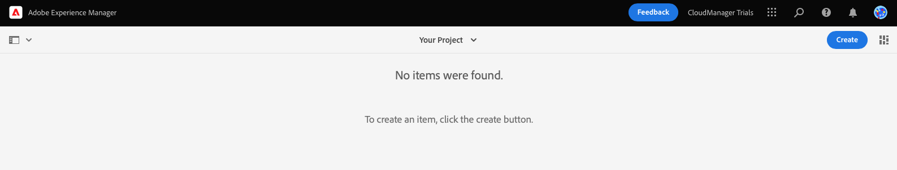
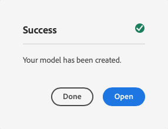
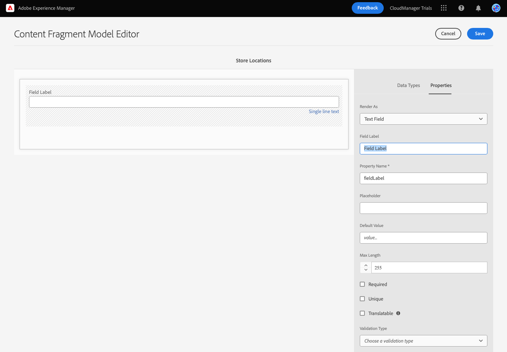

# De inhoudsstructuur voor uw app maken {#content-structure}

Met inhoudsfragmenten kunt u pagina-onafhankelijke inhoud ontwerpen, maken, beheren en publiceren. Met deze sjablonen kunt u inhoud voorbereiden die klaar is voor gebruik op meerdere locaties en via meerdere kanalen, ideaal voor levering zonder kop. De modellen van het Fragment van de inhoud worden gebruikt om de structuur van deze inhoud te bepalen en zijn het eerste ding u moet creëren om uw inhoud zonder kop te beheren.

Om u te helpen begrijpen hoe dit wordt gedaan, neemt deze module van AEM Proefversies u door het proces met een snelle, interactieve tour eerst creërend het model en dan toevoegend zijn structuur. Dit document dient als aanvulling op de rondreis in het product, die dezelfde stappen omvat en waar nodig aan extra middelen koppelt.

>[!CONTEXTUALHELP]
>id="aemcloud_sites_trial_admin_content_fragments_overview"
>title="Maak de inhoudsstructuur voor uw app"
>abstract="Als u onze reeks interactieve hulplijnen volgt, leert u de structuur (ook wel het inhoudsfragmentmodel genoemd) te maken die als basis voor al uw inhoud zonder kop fungeert."

>[!CONTEXTUALHELP]
>id="aemcloud_sites_trial_admin_content_fragments_overview_guide"
>title="De modeleditor starten"
>abstract="Het bouwen van een model van het inhoudsfragment begint met het creëren van een modelpunt in het werkschema van het modelbeleid, dan toevoegend structuurelementen aan het gebruikend de modelredacteur van het inhoudsfragment.  Klik hieronder om de functie te starten op een nieuw tabblad en volg dit leerdocument om uw eerste model voor inhoudsfragmenten te maken."
>additional-url="https://video.tv.adobe.com/v/3413261" text="Video over intro-inhoud"

>[!CONTEXTUALHELP]
>id="aemcloud_sites_trial_admin_content_fragments_overview_guide_footer"
>title="De modeleditor starten"
>abstract="Gefeliciteerd! Door een model van het Fragment van de Inhoud te creëren, nam u de eerste stap aan leverend omni-kanaalinhoud op een geschaalde en standaardmanier."

## De console van het inhoudsfragmentmodel {#content-fragment-model-console}

U begint op de console van de Modellen van het Fragment van de Inhoud. De modellenconsole voor inhoudsfragmenten kan worden beschouwd als uw modelbibliotheek. Met de console kunt u nieuwe modellen maken en bestaande modellen beheren. Uw console is leeg, dus laten we een nieuw model maken!

Als u buiten de instructies in de app zelf naar de modelconsole voor inhoudsfragmenten wilt navigeren, wordt deze gevonden met het Adobe-pictogram linksboven op de pagina. Dit opent de globale navigatie van AEM. Van hier, kiest u **Gereedschappen** en vervolgens **Algemeen** -> **Modellen van inhoudsfragmenten**.

>[!TIP]
>
>Als u meer over navigatie in AEM wilt weten, zie [Sectie Aanvullende bronnen](#additional-resources) van dit document voor meer informatie over AEM basisverwerking.

## Een model maken {#create-model}

Als u zich in de modelconsole voor inhoudsfragmenten bevindt, kunt u een nieuw model maken dat uw eigen inhoud zonder kop vertegenwoordigt.

1. Klik in de modelconsole van het inhoudsfragment op de knop **Maken** aan de rechterbovenhoek van het scherm om een model voor inhoudsfragmenten te maken.

1. De wizard Model maken begint en begeleidt u bij het maken van een model Inhoudsfragment.

   

   Geef de verplichte informatie op.

   * **Modeltitel** - Dit is een korte beschrijving van het model en geeft meestal het doel aan.
   * **Model inschakelen** - Deze optie is standaard ingeschakeld en moet zijn ingeschakeld om op basis van dit model later inhoudsfragmenten te kunnen maken.

   U kunt ook een langere **Beschrijving** aan het model en **Tags** om het te categoriseren en het voor uw gebruikers later binnen de modelconsole van het Fragment van de Inhoud te onderscheiden.

   >[!TIP]
   >
   >Als u interesse hebt in de manier waarop tags uw inhoud kunnen ordenen, raadpleegt u de [Sectie Aanvullende bronnen](#additional-resources) van dit document voor meer informatie over labelen in AEM.

1. Als de verplichte velden zijn ingevuld, klikt u op **Maken** boven aan links om het model te maken.

1. De **Succes** bevestigt dat het model is gemaakt.

   

1. Voordat u het model kunt gebruiken, moet u ook de structuur van de gegevens definiëren. Klikken **Openen** in het dialoogvenster om het te openen en door te gaan met het definiëren van het model.

## Velden toevoegen aan het model {#configure-model}

Het model van het Fragment van de Inhoud is hoofdzakelijk een schema voor uw Fragmenten van de Inhoud. Met andere woorden, het definieert welke velden/gegevenstypen het model bevat.

Met de modeleditor voor inhoudsfragmenten kunt u velden voor het inhoudsfragmentmodel definiëren via een interface voor slepen en neerzetten.

1. Sleep een veld uit de **Gegevenstypen** aan de rechterkant van het scherm en zet deze neer op het model Inhoudsfragment. Er zijn meerdere gegevenstypen waaruit u kunt kiezen, zoals tekst op één regel, tekst op meerdere regels, nummer en verwijzingen naar andere fragmenten.

   

   >[!TIP]
   >
   >Als u meer informatie over de gegevenstypes beschikbaar aan u wilt, zie [Sectie Aanvullende bronnen](#additional-resources) van dit document voor de gedetailleerde documentatie van Content Fragment-modellen.

1. Wanneer een gegevenstype is geplaatst, wordt de **Gegevenstypen** automatisch gewijzigd in **Eigenschappen** , waarin u de details kunt definiëren van het gegevenstype dat u net hebt geplaatst.

   

   Eigenschappen van het model kunnen de naam van het veld, het veldtype, de lengte van het veld, indien verplicht, enz. bevatten.

1. Gebruik de **Eigenschappen** van het geselecteerde gegevenstype om eigenschappen zoals standaardwaarde, maximumlengte, als het een verplicht veld is, enz. te definiëren.

   >[!TIP]
   >
   >Als u meer informatie wilt over de eigenschappen waarover u beschikt, raadpleegt u de [Sectie Aanvullende bronnen](#additional-resources) van dit document voor de gedetailleerde documentatie van Content Fragment-modellen.

1. Als u alle velden hebt toegevoegd die nodig zijn voor het model Inhoudsfragment, klikt u op **Opslaan** rechtsboven in het venster.

1. Zo slaat u het model op en keert u terug naar de Console van het model van het Fragmentvan de Inhoud waar u meer modellen kunt toevoegen noodzakelijk zijn.

## U hebt geleerd een model voor een inhoudsfragment te maken {#conclusion}

In deze module hebt u geleerd hoe u een model van een inhoudsfragment kunt maken om de structuur van de gegevens zonder kop weer te geven. Eerst creeerde u het model en dan bevolkte het met gegevenstypes en hun verwante eigenschappen, daardoor definiërend een schema voor uw inhoud zonder kop.

Nu u uw eigen model van het Fragment van de Inhoud hebt, kunt u het model gebruiken om de Fragmenten van de Inhoud tot stand te brengen. De module [Nieuwe inhoud maken](create-content.md) details om uw nieuwe model van het Fragment van de Inhoud te gebruiken om koploze inhoud tot stand te brengen.

U kunt terugkeren naar het beginscherm van de proefversie door op **Oplossingen** rechtsboven op de navigatiebalk en selecteert u **Experience Manager**.

## Aanvullende bronnen {#additional-resources}

Voor meer informatie over de Fragmenten en de AEM van de Inhoud, overweeg het herzien van deze extra documentatie.

* [Basisverwerking](/help/sites-cloud/authoring/getting-started/basic-handling.md) - Documentatie over het navigeren en gebruiken van AEM voor nieuwe gebruikers
* [Tags gebruiken](/help/sites-cloud/authoring/features/tags.md) - Documentatie over het gebruik van tags in AEM om inhoud te ordenen
* [Inhoudsfragmenten](/help/assets/content-fragments/content-fragments.md) - Overzicht van inhoudsfragmenten en koppelingen naar volledige documentatie over inhoudsfragmenten
* [Modellen van inhoudsfragmenten](/help/assets/content-fragments/content-fragments-models.md) - Volledige documentatie over modellen van inhoudsfragmenten
* [Content Fragment Models - Data Types](/help/assets/content-fragments/content-fragments-models.md#data-types) - Details over de verschillende gegevenstypen die beschikbaar zijn voor modellen van inhoudsfragmenten
* [Modellen van inhoudsfragmenten - eigenschappen](/help/assets/content-fragments/content-fragments-models.md#data-types) - Details over de verschillende eigenschappen die beschikbaar zijn voor de gegevenstypen van inhoudsfragmentmodellen
