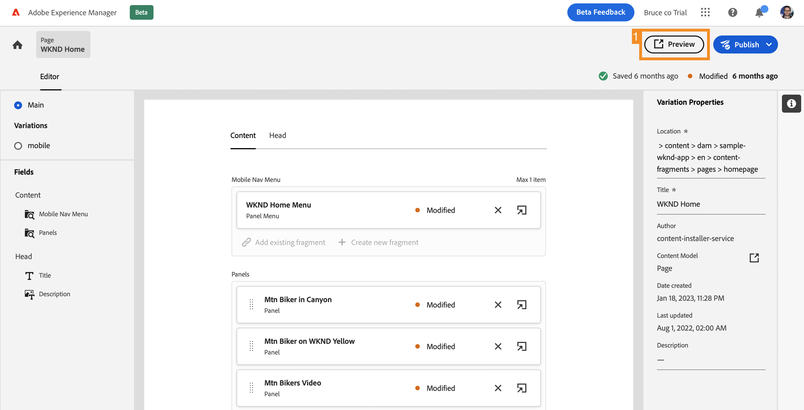

# Inhoud aanpassen in een voorbeeldprogramma Reageren {#customize-app}

>[!CONTEXTUALHELP]
>id="aemcloud_sites_trial_admin_content_fragments_react_app"
>title="Inhoud aanpassen in een voorbeeld van een React-app"
>abstract="Uw proefversie zonder AEM is geïntegreerd met een voorbeeld van een React-app die u kunt aanpassen."

>[!CONTEXTUALHELP]
>id="aemcloud_sites_trial_admin_content_fragments_react_app_guide"
>title="De editor voor inhoudsfragmenten starten"
>abstract="Laten we nu eens bekijken hoe creatie van inhoud zonder kop werkt. Uw proefversie zonder AEM is geïntegreerd met een voorbeeldtoepassing React, zodat u kunt zien hoe eenvoudig het voor iedereen is om inhoud onafhankelijk te beheren zonder ontwikkelingstijd.   lanceer deze module in een nieuw lusje door hieronder te klikken, dan deze gids te volgen."

>[!CONTEXTUALHELP]
>id="aemcloud_sites_trial_admin_content_fragments_react_app_guide_footer"
>title="In deze module hebt u geleerd hoe u een voorbeeld van een React-app kunt aanpassen.   Tijd aan markt: Versneld!  de cycli van de Ontwikkeling: Verminderde!   nu begrijpt u hoe gemakkelijk het beheren van hoofdloze inhoud voor websites en apps is die door AEM hoofdloze mogelijkheden worden aangedreven."
>abstract=""

## Voorvertoning van de app weergeven {#preview}

U start in de editor voor inhoudsfragmenten met de voorbeeldtoepassing die bij de proefversie zonder AEM is geleverd, al geladen. De voorbeeld-app wordt aangedreven door Content Fragments die via GraphQL worden geleverd. Gebruik de editor voor inhoudsfragmenten om de editor te leren kennen door een voorbeeld van de voorbeeld-app te bekijken.

1. Selecteer de **knoop van de Voorproef** bij het top-right van het redacteursscherm.

1. De demo-app wordt op een nieuw tabblad geopend. De app is voor het fictieve WKND-merk voor outdoorlifestyle. Schuif omlaag op de pagina om door de voorbeeldinhoud te navigeren.

1. Ga terug naar het browsertabblad van de editor voor inhoudsfragmenten om door te gaan.

## Een koptekst bewerken in de app {#edit-app}

In de editor voor inhoudsfragmenten wordt de basislay-out van de app weergegeven als een pagina-inhoudsfragment. De **Comités** vertegenwoordigen verschillende pagina&#39;s van app, elk waarvan zijn eigen Fragment van de Inhoud is. Door deze fragmenten te wijzigen, kunt u de inhoud van de app wijzigen.

1. Selecteer **Biker Mtn in Canyon** in de **3} sectie van Comités {.**

   

1. De redacteur opent omhoog het kopbalpaneel van app voor de bergbiker. Elk deelvenster bestaat uit lagen die verschillende afbeeldingen en tekst vertegenwoordigen die de ervaring bepalen.

1. Selecteer de tekstlaag **Mtn Biker in de Laag van de Tekst van Canyon** om het detail van de laag in de redacteur te openen. De laag bestaat uit meerdere inhoudsfragmenten die de tekst bepalen die in dit deelvenster van de app wordt weergegeven.

1. Selecteer de **Biker van Mtn in Titel van Canyon** tekstpunt. Hiermee opent u de editor voor inhoudsfragmenten waarin de inhoud van dit fragment wordt weergegeven en waarin u het fragment kunt wijzigen.

1. Wijzig de tekst van `Your next great adventure is calling` in `Choose your own adventure` . De wijziging wordt automatisch opgeslagen door de editor.

1. Selecteer **Voorproef** bij het hoogste recht van het venster om uw veranderingen te zien. De voorvertoning van de demo-app wordt op een nieuw tabblad geopend.

   

Zo eenvoudig is het om inhoud in een React-app bij te werken wanneer deze is geïntegreerd in AEM CMS zonder kop.

## Een afbeelding wisselen in de app {#change-image}

Nu u een kopregel in de app hebt gewijzigd, kunt u proberen een afbeelding te wijzigen.

1. Ga vanuit de voorvertoning terug naar het browsertabblad van de editor voor inhoudsfragmenten.

1. U moet terugkeren naar de juiste plaats in de editor voor inhoudsfragmenten. De broodkruimels bij top-left van de redacteur tonen waar u in uw inhoudshiërarchie bent. Selecteer **Biker Mtn in Canyon** in de broodkruimels om aan die pagina terug te keren.

   

1. Selecteer de **Biking Mtn - de beeldlaag van de Biker**. Hiermee opent u de editor voor inhoudsfragmenten

1. Selecteer **X** om het bikerbeeld te verwijderen. De afbeelding verdwijnt en in de editor wordt een fout weergegeven omdat de afbeelding vereiste gegevens is voor dit model van inhoudsfragment.

   

1. Selecteer **activa** toevoegen en dan **doorbladeren Assets** in pop-up menu.

1. De **Uitgezochte** dialoog opent en de weg **steekproef-wknd-app** > **en** > **beeld-dossiers** wordt automatisch geselecteerd voor u.

1. Selecteer het beeld `biker-yellow.png` en selecteer dan **Uitgezocht**.

1. De afbeelding van de fietser wordt vervangen door de geselecteerde afbeelding. De editor slaat de wijzigingen automatisch op.

1. Selecteer **Voorproef** bij het hoogste recht van het venster om uw veranderingen te zien. De voorvertoning van de demo-app wordt op een nieuw tabblad geopend. Klik op Vernieuwen in de browser en u ziet de nieuwe fietsafbeelding met gele korte tekst in de app.

Het is zo eenvoudig om afbeeldingen en middelen in uw apps bij te werken met AEM CMS zonder kop.

## Een verwijzing toevoegen aan een nieuw inhoudsfragment in de app {#create-moment}

Nu u de afbeelding van de fietser hebt bijgewerkt, gaan we door hoe u nieuwe inhoud aan een app toevoegt door een nieuw inhoudsfragment te maken en ernaar te verwijzen. U voegt een productcall-out beheerd door een &quot;shoppable moment&quot; inhoudsfragment toe aan het tweede paneel van de app.

1. Keer terug naar het browserlusje van de redacteur van het Fragment van de Inhoud van het voorproeflusje.

1. U moet terugkeren naar de juiste plaats in de editor voor inhoudsfragmenten. De broodkruimels bij top-left van de redacteur tonen waar u in uw inhoudshiërarchie bent. Selecteer **WKND Huis** in de broodkruimels om aan die pagina terug te keren.

1. Selecteer **Mtn Biker op Geel WKND** paneel.

1. Selecteer de **Biking Mtn - Verwisselbare** laag.

1. Als u een call-out wilt maken in dit deelvenster, maakt u een schokkend moment met een inhoudsfragment. Selecteer de knop **+ Nieuw fragment maken** .

    toe

1. U moet eerst een model kiezen waarop u het nieuwe inhoudsfragment wilt baseren. Selecteer het **model van het Punt van de Moment 0} Vervormbaar {van het** model van het Fragment van de Inhoud **drop-down.**

1. Geef het inhoudsfragment een naam. Bijvoorbeeld, ga `Shorts` in het **gebied van de Naam** in.

1. Selecteer **creeer en open**.

   

1. De editor wordt geopend voor het nieuwe inhoudsfragment.

1. Geef het shoppable moment een naam op het **1} gebied van de Tekst {zoals `Yellow shorts`.**

1. Plaats waarden voor **X** en **Y**. Dit is waar deze callout op het paneel zou moeten worden geregeld. Wijzigingen in het fragment worden automatisch opgeslagen door de editor

   * **X**: `-5`
   * **Y**: `-10`

1. Selecteer **Voorproef** bij het hoogste recht van het venster om uw veranderingen te zien. De voorvertoning van de demo-app wordt op een nieuw tabblad geopend. Klik verfrissen zich op browser om het plaatsen te testen en aanpassingen aan te brengen zoals nodig in de redacteur.

   

Nu begrijpt u hoe u nieuwe inhoud kunt maken en ernaar kunt verwijzen als een inhoudsfragment in uw app zonder ontwikkelingscycli.
