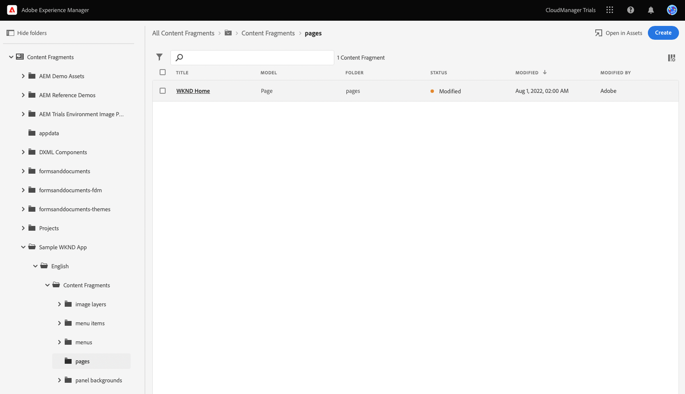
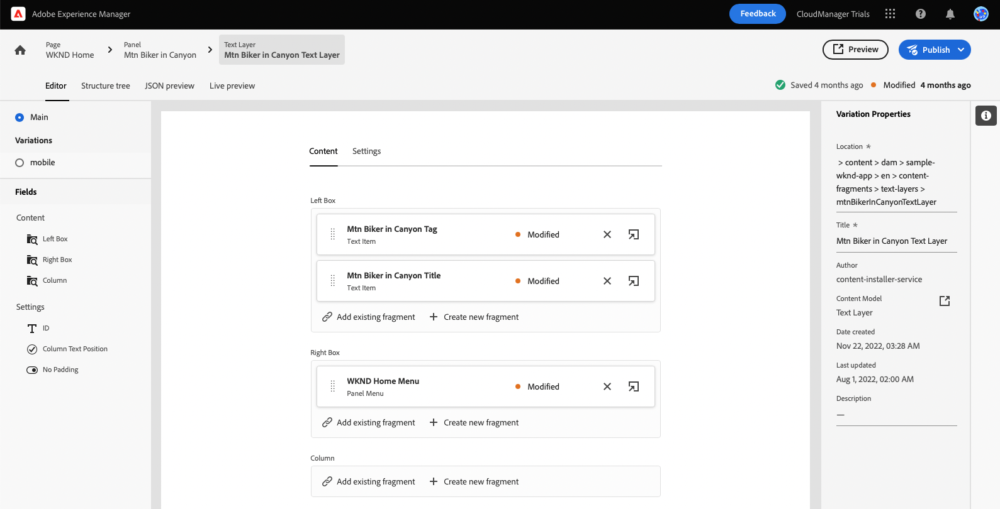

# Inhoud aanpassen in een voorbeeldprogramma Reageren {#customize-app}

AEM Proefversies voor headless worden vooraf geladen met een eenvoudige React-app om inhoud zonder kop weer te geven. In deze module leert u een voorvertoning van die app bekijken en de inhoud ervan wijzigen door een afbeelding te verwisselen en een schokkend moment voor de app te maken.

De app zelf is gebaseerd op de structuur van inhoudsfragmenten. Met de Content Fragment-editor in AEM kunt u de inhoud van uw apps wijzigen. Om u te helpen begrijpen hoe dit wordt gedaan, neemt deze module van AEM Proefversies u door het proces met een snelle, interactieve tour. Dit document dient als aanvulling op de interactieve rondleiding, die dezelfde stappen omvat en waar nodig gekoppeld is aan aanvullende middelen.

>[!CONTEXTUALHELP]
>id="aemcloud_sites_trial_admin_content_fragments_react_app"
>title="Inhoud aanpassen in een voorbeeld van een React-app"
>abstract="We hebben een moderne React-app ingesteld waarmee u kunt leren hoe u inhoud kunt aanpassen met behulp van de functieset zonder kop."

>[!CONTEXTUALHELP]
>id="aemcloud_sites_trial_admin_content_fragments_react_app_guide"
>title="De editor voor inhoudsfragmenten starten"
>abstract="AEM Proefversies voor headless worden vooraf geladen met een eenvoudige React-app om inhoud zonder kop weer te geven. De app is gebaseerd op de structuur van inhoudsfragmenten. Met de Content Fragment-editor in AEM kunt u de inhoud van uw app wijzigen.  Start de functie op een nieuw tabblad door hieronder te klikken en volg deze handleiding."
>additional-url="https://video.tv.adobe.com/v/328618" text="Plaatsaanduiding voor de intro-video"

## Inhoudsfragmenteditor {#fragment-editor}

U begint in de redacteur van het Fragment van de Inhoud voor steekproef app.

Als u zelf naar de editor voor inhoudsfragmenten wilt navigeren buiten de instructies in de app, wordt deze gevonden met het pictogram Adobe linksboven op de pagina. Dit opent de globale navigatie van AEM. Van hier, kiest u **Navigatie** en vervolgens **Inhoudsfragmenten**.

Hiermee opent u de console voor inhoudsfragmenten. Vervolgens gebruikt u de inhoudsstructuur in het linkerdeelvenster om naar de locatie van de inhoud van de app te navigeren. In dit geval wordt **Inhoudsfragmenten** -> **Voorbeeld van WKND-app** -> **Engels** -> **Inhoudsfragmenten** -> **pagina&#39;s**.

Tik of klik op de knop **WKND Home** paginafragment dat in de console rechts van de inhoudsstructuur wordt weergegeven om de editor voor de inhoud van de app te starten.

>[!TIP]
>
>Als u meer over navigatie in AEM wilt weten, zie [Sectie Aanvullende bronnen](#additional-resources) van dit document voor meer informatie over AEM basisverwerking.

## Voorvertoning van de app weergeven {#preview}

Voordat u de app gaat wijzigen, moet u er eerst een voorvertoning van de huidige status van bekijken. Tik of klik op de knop **Voorvertoning** knop rechtsboven in het editorscherm.

De demo-app wordt op een nieuw tabblad geopend.

De app zelf is een eenvoudige e-commerce-app voor het fictieve WKND-merk voor outdoorlifestyle, geïmplementeerd in React. Klik rond om door de voorbeeldinhoud te navigeren.

Ga terug naar het tabblad van de editor voor inhoudsfragmenten om door te gaan.

## Tekst bewerken in de app {#edit-app}

Zoals eerder vermeld, bestaat de app zelf uit inhoudsfragmenten. Deze fragmenten zijn aan elkaar gekoppeld in een structuur om de app te maken.

In de inhoudsfragmenteditor wordt de basislay-out van de app als een pagina weergegeven. Deze pagina is een inhoudsfragment, dat zelf een verzameling andere fragmenten is. De **Deelvensters** vertegenwoordigen verschillende pagina&#39;s van de app, die elk een eigen inhoudsfragment zijn. Door deze fragmenten te wijzigen, kunt u de inhoud van de app wijzigen.

1. Tik of klik op **Mtn Biker in Canyon** in de **Deelvensters** sectie.

   

1. De redacteur opent omhoog het kopbalpaneel voor de bergwieg. Elk deelvenster bestaat uit lagen die verschillende inhoud op een pagina van de app vertegenwoordigen.

   

1. Selecteer de tekstlaag **Mtn Biker in Canyon-tekstlaag**. Hiermee opent u de details van de laag in de editor. De laag bestaat uit meerdere inhoudsfragmenten.

   

1. Selecteer **Mtn Biker in Canyon-titel** tekstitem. Hiermee opent u de editor voor inhoudsfragmenten, waarin de inhoud van dit fragment wordt weergegeven en waarin u het fragment kunt wijzigen.

   

1. De tekst wijzigen vanuit `Your next great adventure is calling` tot `Choose your own adventure`. De wijziging wordt automatisch opgeslagen door de editor.

1. Klik op Voorvertoning om uw wijzigingen te bekijken. De demo-app wordt op een nieuw tabblad geopend.

   

Keer terug naar het lusje van de redacteur van het Fragment van de Inhoud om de module voort te zetten.

## De hoofdafbeelding van de app wijzigen {#change-image}

Nu u een stuk tekst in de app hebt gewijzigd, probeert u de hoofdafbeelding van de app te wijzigen. Eerst moet u die inhoud zoeken.

De broodkruimels bij top-left van de redacteur tonen waar u in uw inhoudshiërarchie bent.

1. Tik of klik op **Mtn Biker in Canyon** in de breadcrumbs om terug te keren naar die pagina.

   

1. Keer terug naar het deelvenster met de verschillende lagen van de app. De lagen vertegenwoordigen niet alleen tekstinhoud. Ze vertegenwoordigen alle inhoud in uw app. Daarom kunt u afbeeldingen ook omwisselen met de editor voor inhoudsfragmenten.

   

1. Selecteer **Mtn Biking - Biker** afbeeldingslaag. Hiermee opent u de editor voor inhoudsfragmenten, waarin de inhoud van dit fragment wordt weergegeven en waarin u het fragment kunt wijzigen.

   

1. Tik of klik op de knop **X** om de fietsafbeelding te verwijderen. De afbeelding verdwijnt en in de editor wordt een fout weergegeven omdat de afbeelding vereiste gegevens is voor dit model van inhoudsfragment.

   

1. Tik of klik op **Element toevoegen** en zoek de gele fietsafbeelding in **voorbeeldapp** > **en** > **afbeeldingsbestanden**. De structuurweergave aan de linkerkant van het deelvenster **Elementen selecteren** om door de inhoudshiërarchie te navigeren.

   

1. Filter voor de tekst `yellow`. Gebruik de **Alle elementen zoeken** veld boven aan **Elementen selecteren** venster waarin u naar de afbeelding kunt zoeken. Voer de zoektekst in en druk op Enter of Return om te zoeken.

   

1. Tik of klik om het `biker-yellow.png` afbeelding tikken of klikken **Selecteren**.

   

1. De afbeelding van de fietser is vervangen door de geselecteerde afbeelding. De editor slaat de wijzigingen automatisch op.

   

## Een schokkend moment maken {#create-moment}

Nu u de afbeelding van de biker hebt bijgewerkt, kunt u een schokkend moment toevoegen voor de gele korte ritten van de biker.

1. Begin door terug te keren naar de inhoudsfragmenteditor voor het paginafragment. De broodkruimels bij top-left van de redacteur tonen waar u in uw inhoudshiërarchie bent. Tik of klik op **WKND Home** in de breadcrumbs om terug te keren naar die pagina.

   

1. Selecteer **Mtn Biker op WKND Yellow** deelvenster.

   

1. U kunt nu de lagen zien waaruit de afbeelding van de wieg bestaat. Voeg een schokkend moment toe aan de gele korte zijde van de fiets door de optie **Mtn Biking - Shopable** laag.

   

1. Als u een schokkend moment wilt maken, moet u een nieuw inhoudsfragment maken dat dat moment vertegenwoordigt. Tik of klik op de knop **+ Nieuw fragment maken** om een schokkend moment toe te voegen voor de sneltoetsen.

   

1. Omdat inhoudsfragmenten gestructureerde gegevens zonder kop vertegenwoordigen, moet u bij het maken van een inhoudsfragment eerst een model kiezen waarop u het fragment wilt baseren. Selecteer **Opstuitbaar mompitem** model van het **Inhoudsfragmentmodel** vervolgkeuzelijst.

   

1. Geef het inhoudsfragment dat dit nieuwe, onoverzichtelijke moment vertegenwoordigt een naam. Voer bijvoorbeeld `Shorts` in de **Naam** veld.

   

1. Tik of klik op **Maken en openen**.

1. De editor wordt geopend voor het nieuwe inhoudsfragment.
   * Geef het schokbare moment een naam in de **Tekst** velden zoals `Yellow shorts`.
   * Stel een X en Y in, de locatie waar dit schokkende moment moet worden bedekt.
      * **X**: `-18`
      * **Y**: `-28`
   * Wijzigingen in het fragment worden automatisch opgeslagen door de editor

   

1. Tik of klik op **Voorvertoning** om deze plaatsing te testen en zo nodig aanpassingen aan te brengen.

   

## U hebt geleerd een voorbeeld van een React-app aan te passen! {#conclusion}

In deze module hebt u geleerd hoe u een voorbeeld van een React-app kunt aanpassen. Eerst hebt u geleerd hoe u bestaande tekst kunt bewerken. Vervolgens is een afbeelding omgewisseld met een ander exemplaar van die afbeelding. Tot slot hebt u gezien hoe een schokkend moment-item wordt gemaakt en geplaatst.

Controleer de [Sectie Aanvullende bronnen](#additional-resources) voor extra middelen over het gebruiken van AEM en zijn Fragments van de Inhoud.

Als u wilt leren hoe Content Fragments en inhoud zonder kop worden gemaakt voor gebruik door aangepaste apps, kunt u beginnen met het evalueren van de module [Maak de inhoudsstructuur voor uw app.](content-structure.md)

U kunt terugkeren naar het beginscherm van de proefversie door op **Oplossingen** rechtsboven op de navigatiebalk en selecteert u **Experience Manager**.

## Aanvullende bronnen {#additional-resources}

Voor meer informatie over de Fragmenten en de AEM van de Inhoud, overweeg het herzien van deze extra documentatie.

* [Modellen van inhoudsfragmenten](/help/assets/content-fragments/content-fragments-models.md) - Volledige documentatie over modellen van inhoudsfragmenten
* [Inhoudsfragmenten](/help/assets/content-fragments/content-fragments.md) - Overzicht van inhoudsfragmenten en koppelingen naar volledige documentatie over inhoudsfragmenten
* [Basisverwerking](/help/sites-cloud/authoring/getting-started/basic-handling.md) - Documentatie over het navigeren en gebruiken van AEM voor nieuwe gebruikers
