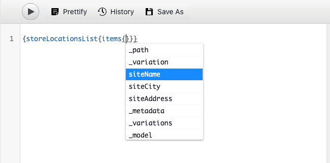

# Inhoud extraheren via de GraphQL API {#extract-content}

Tot nu toe AEM proefversies voor headless hebt u [uw eigen modellen van inhoudsfragmenten maken](content-structure.md) ook uw eigen inhoud zonder kop hebt gemaakt [Inhoudsfragmenten.](create-content.md) Nu kunt u leren hoe u inhoudsfragmenten en de GraphQL API kunt gebruiken als een systeem voor inhoudsbeheer zonder kop om uw inhoud te leveren.

GraphQL verstrekt op vraag-gebaseerde API die externe cliënttoepassingen toestaat om AEM voor slechts de inhoud te vragen het gebruikend één enkele API vraag vereist.

Eerst zult u leren hoe te om twee verschillende types van vragen in werking te stellen: **list** en **byPath** query&#39;s. Vervolgens leert u hoe u inhoud kunt ophalen uit het inhoudsfragment dat u eerder hebt gemaakt. Dit document dient als aanvulling op de interactieve rondleiding, die dezelfde stappen omvat en waar nodig gekoppeld is aan aanvullende middelen.

>[!TIP]
>
>Zie voor meer informatie over de GraphQL API de [Sectie Aanvullende bronnen](#additional-resources) aan het einde van deze module voor de GraphQL API-handleiding.

>[!CONTEXTUALHELP]
>id="aemcloud_sites_trial_admin_content_fragments_graphql"
>title="Inhoud extraheren met de GraphQL API"
>abstract="In deze module leert u hoe u inhoudsfragmenten en de GraphQL API kunt gebruiken als een beheersysteem voor inhoud zonder kop."

>[!CONTEXTUALHELP]
>id="aemcloud_sites_trial_admin_content_fragments_graphql_guide"
>title="GraphQL Explorer starten"
>abstract="GraphQL biedt een API op basis van query&#39;s waarmee externe clienttoepassingen AEM kunnen zoeken voor alleen de inhoud die het nodig heeft, met behulp van één API-aanroep. Volg deze handleiding om te leren hoe u twee verschillende typen query&#39;s uitvoert en vervolgens inhoud ophaalt uit het inhoudsfragment dat u in een vorige module hebt gemaakt.<br><br>Start de functie op een nieuw tabblad door hieronder te klikken."
>additional-url="https://video.tv.adobe.com/v/328618" text="Plaatsaanduiding voor de intro-video"

## GraphQL Explorer {#graphql-explorer}

U begint op de Ontdekkingsreiziger GraphQL. Hier kunt u vragen bouwen en tegen uw inhoud zonder kop in werking stellen.


Als u zelf naar de GraphQL Explorer wilt navigeren buiten de instructies in de app, wordt deze gevonden met het Adobe-pictogram linksboven op de pagina. Dit opent de globale navigatie van AEM. Van hier, kiest u **Gereedschappen** en vervolgens **Algemeen** -> **GraphQL Query Editor**.

>[!TIP]
>
>Als u meer over navigatie in AEM wilt weten, zie [Sectie Aanvullende bronnen](#additional-resources) van dit document voor meer informatie over AEM basisverwerking.

AEM Proefversies worden geleverd met een eindpunt dat is voorgeladen met inhoud waaruit u inhoud voor testdoeleinden kunt extraheren.


Selecteer **AEM demo-elementen** van de **Endpoint** vervolgkeuzelijst in de rechterbovenhoek van de editor, als dit nog niet het geval is.

## Een lijstquery kopiëren en uitvoeren {#list-query}

Begin met een eenvoudige lijstvraag om zich met te oriënteren hoe AEM GraphQL APIs van as a Cloud Service werkt. Dit voorbeeld van de lijstvraag zal een lijst van alle inhoud terugkeren die een specifiek model van het Fragment van de Inhoud gebruikt. De inventaris en de categoriepagina&#39;s gebruiken typisch dit vraagformaat.

1. Kopieer het volgende codefragment.

   ```text
   {
       adventureList {
         items {
            _path
            adventureTitle
            adventurePrice
            adventureTripLength
            adventurePrimaryImage {
              ... on ImageRef {
               _path
               mimeType
               width
               height
             }
           }
         }
      }
    }
   ```

1. Vervolgens vervangt u de bestaande inhoud in de query-editor door de gekopieerde code te plakken.

   

1. Klik op de knop **Afspelen** knoop bij de bovenkant verlaten van de vraagredacteur om de vraag uit te voeren.

1. Zodra de vraag met succes uitvoert, worden de resultaten getoond in het juiste paneel, naast de vraagredacteur. Als de query onjuist is, wordt een fout weergegeven in het rechterdeelvenster.

   

U hebt zojuist een lijstquery voor een volledige lijst met alle inhoudsfragmenten gevalideerd. Dit proces helpt ervoor te zorgen dat de reactie is wat uw app verwacht, met resultaten die aantonen hoe uw apps en websites de in AEM gemaakte inhoud zullen ophalen.

De verschillende kanalen en platforms waar uw inhoud moet verschijnen kunnen deze vraag of gelijkaardig nu gebruiken om uw inhoud zonder kop terug te winnen.

## Een query op pad kopiëren en uitvoeren {#bypath-query}

Als u een query van het type byPath uitvoert, kunt u elementen voor een bepaald inhoudsfragment ophalen. Productdetailpagina&#39;s en pagina&#39;s die zich op een specifieke set inhoud richten, vereisen doorgaans dit type query.

1. Kopieer het volgende codefragment.

   ```text
    {
     adventureByPath(
       _path: "/content/dam/aem-demo-assets/en/adventures/bali-surf-camp/bali-surf-camp"
     ) {
       item {
         _path
         adventureTitle
         adventureDescription {
           json
         }
         adventurePrimaryImage {
           ... on ImageRef {
             _path
             width
             height
           }
         }
       }
     }
   }
   ```

1. Vervolgens vervangt u de bestaande inhoud in de query-editor door de gekopieerde code te plakken.

   

1. Klik op de knop **Afspelen** knoop bij de bovenkant verlaten van de vraagredacteur om de vraag uit te voeren.

1. Zodra de vraag met succes uitvoert, worden de resultaten getoond in het juiste paneel, naast de vraagredacteur. Als de query onjuist is, wordt een fout weergegeven in het rechterdeelvenster.

1. Zodra de vraag met succes uitvoert, worden de resultaten getoond in het juiste paneel, naast de vraagredacteur. Als de query onjuist is, wordt een fout weergegeven in het rechterdeelvenster.

   

U hebt zojuist een lijstquery voor een volledige lijst met alle inhoudsfragmenten gevalideerd. Dit proces helpt ervoor te zorgen dat de reactie is wat uw app verwacht, met resultaten die aantonen hoe uw apps en websites de in AEM gemaakte inhoud zullen ophalen.

De verschillende kanalen en platforms waar uw inhoud moet verschijnen kunnen deze vraag of gelijkaardig nu gebruiken om uw inhoud zonder kop terug te winnen.

## Query&#39;s uitvoeren op uw eigen inhoud {#own-queries}

Nu u de twee primaire types van vragen in werking hebt gesteld, bent u bereid om vragen voor inhoud te plaatsen en in werking te stellen die u zelf creeerde.

1. Om vragen tegen uw eigen Fragmenten van de Inhoud in werking te stellen, verander het eindpunt van **AEM Demo-elementen** aan de **Uw project** map.

   

1. Begin door al bestaande inhoud in de vraagredacteur te selecteren en te schrappen. Typ vervolgens open haakje `{` en druk op Ctrl+Space of Option+Space voor een automatisch aangevulde lijst met modellen die zijn gedefinieerd in het model van het inhoudsfragment. Selecteer het model dat u hebt gemaakt en waarin u eindigt `List` in de lijst.

   

1. Definieer de items die de query moet bevatten voor het geselecteerde inhoudsfragmentmodel. Typ nogmaals haakje openen `{`Druk vervolgens op Ctrl+Space of Option+Space voor een lijst die automatisch wordt voltooid. Selecteren `items` in de lijst.

   

1. Definieer de velden die de query moet bevatten voor het geselecteerde inhoudsfragmentmodel. Typ nogmaals haakje openen `{`Druk vervolgens op Ctrl+Space of Option+Space voor een automatisch aangevulde lijst met beschikbare velden in het model Inhoudsfragment. Selecteer in de lijst de gewenste velden in uw model.

   

1. Meerdere velden scheiden met een komma (`,`) of spatie en druk nogmaals op Ctrl+Space of Option+Space om extra velden te selecteren.

1. Terwijl u werkt, kunt u tikken of op de knop **prettiseren** om de code automatisch op te maken zodat deze gemakkelijker kan worden gelezen.

   

1. Tik of klik op de knop **Afspelen** knoop bij de bovenkant verlaten van de redacteur om de vraag in werking te stellen.

   

Zo kunt u uw inhoud leveren aan alominakanale digitale ervaringen. Zie de [Sectie Aanvullende bronnen](#additional-resources) voor extra voorbeeldquery&#39;s en voor meer informatie over wat u kunt doen met de GraphQL API.

## U hebt geleerd hoe u inhoud kunt zoeken! {#conclusion}

Geweldig werk! U hebt over de twee basistypes van vragen geleerd en hoe te om uw eigen inhoud te vragen. Controleer de [Sectie Aanvullende bronnen](#additional-resources) voor extra steekproefvragen en leer hoeveel meer u met GraphQL API kunt doen.

Als u wilt leren hoe geëxtraheerde inhoud vervolgens wordt gebruikt in een aangepaste React-app, moet u de module controleren [Inhoud aanpassen in een voorbeeldprogramma Reageren.](customize-app.md)

U kunt terugkeren naar het beginscherm van de proefversie door op **Oplossingen** rechtsboven op de navigatiebalk en selecteert u **Experience Manager**.


## Aanvullende bronnen {#additional-resources}

Voor meer informatie over de Fragmenten en de AEM van de Inhoud, overweeg het herzien van deze extra documentatie.

* [De handleiding GraphQL API](https://experienceleague.adobe.com/docs/experience-manager-learn/getting-started-with-aem-headless/graphql/multi-step/explore-graphql-api.html)
* [Basisverwerking](/help/sites-cloud/authoring/getting-started/basic-handling.md) - Documentatie over het navigeren en gebruiken van AEM voor nieuwe gebruikers
* [Leren gebruiken GraphQL met AEM - Voorbeeldinhoud en query&#39;s](https://experienceleague.adobe.com/docs/experience-manager-cloud-service/content/headless/graphql-api/sample-queries.html)
