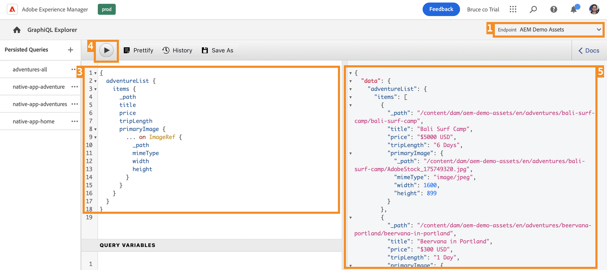

# Inhoud extraheren via de GraphQL API {#extract-content}

>[!CONTEXTUALHELP]
>id="aemcloud_sites_trial_admin_content_fragments_graphql"
>title="Inhoud extraheren met de GraphQL API"
>abstract="In deze module leert u hoe u Content Fragments en de GraphQL API kunt gebruiken als een beheersysteem zonder kop."

>[!CONTEXTUALHELP]
>id="aemcloud_sites_trial_admin_content_fragments_graphql_guide"
>title="GraphQL Explorer starten"
>abstract="GraphQL biedt een API op basis van query&#39;s waarmee externe clienttoepassingen AEM kunnen zoeken voor alleen de inhoud die het nodig heeft, met behulp van één API-aanroep. Volg deze module om te leren hoe te om twee verschillende types van vragen in werking te stellen. Leer vervolgens hoe u de inhoud ophaalt uit het inhoudsfragment dat u in de vorige module hebt gemaakt.<br><br>Start deze module op een nieuw tabblad door hieronder te klikken."

>[!CONTEXTUALHELP]
>id="aemcloud_sites_trial_admin_content_fragments_graphql_guide_footer"
>title="Mooi werk! U hebt over de twee basistypes van vragen geleerd en hoe te om uw eigen inhoud te vragen. U begrijpt nu hoe u de AEM GraphQL API kunt gebruiken om efficiënte query&#39;s te maken die inhoud leveren in een indeling die u door de app verwacht."
>abstract=""

## Query voor een lijst met voorbeeldinhoud {#list-query}

U start in GraphQL Explorer op een nieuw tabblad. Hier kunt u query&#39;s samenstellen en valideren op basis van uw inhoud zonder kop voordat u deze gebruikt om de inhoud van uw app of website van stroom te voorzien.

1. Uw AEM proefversie zonder kop wordt geleverd met een eindpunt dat is voorgeladen met Content Fragments waaruit u inhoud voor testdoeleinden kunt extraheren. Zorg ervoor dat de **AEM Demo-elementen** het eindpunt wordt geselecteerd in het dialoogvenster **Endpoint** vervolgkeuzelijst in de rechterbovenhoek van de editor.

1. Kopieer het volgende codefragment voor een lijstvraag van vooraf geladen **AEM Demo-elementen** eindpunt. Een lijstvraag keert een lijst van alle inhoud terug die een specifiek model van het Fragment van de Inhoud gebruikt. De inventaris en de categoriepagina&#39;s gebruiken typisch dit vraagformaat.

   ```text
   {
    adventureList {
     items {
       _path
       title
       price
       tripLength
       primaryImage {
         ... on ImageRef {
           _path
           mimeType
           width
           height
         }
       }
     }
    }
   }
   ```

1. Vervang de bestaande inhoud in de vraagredacteur door de gekopieerde code te kleven.

1. Klik op de knop **Afspelen** knoop bij de bovenkant verlaten van de vraagredacteur om de vraag uit te voeren.

1. De resultaten worden getoond in het juiste paneel, naast de vraagredacteur. Als de query onjuist is, wordt een fout weergegeven in het rechterdeelvenster.

   

U hebt zojuist een lijstquery voor een volledige lijst met alle inhoudsfragmenten gevalideerd. Dit proces helpt ervoor te zorgen dat de reactie is wat uw app verwacht, met resultaten die aantonen hoe uw apps en websites de in AEM gemaakte inhoud zullen ophalen.

## Query voor een specifiek deel van de voorbeeldinhoud {#bypath-query}

Als u een query op basis van pad uitvoert, kunt u inhoud voor een bepaald inhoudsfragment ophalen. Productdetailpagina&#39;s en pagina&#39;s die zich op een specifieke set inhoud richten, vereisen doorgaans dit type query.

1. Kopieer het volgende codefragment voor een byPath-query van het vooraf geladen bestand **AEM Demo-elementen** eindpunt.

   ```text
    {
     adventureByPath(
       _path: "/content/dam/aem-demo-assets/en/adventures/bali-surf-camp/bali-surf-camp"
     ) {
       item {
         _path
         title
         description {
           json
         }
         primaryImage {
           ... on ImageRef {
             _path
             width
             height
           }
         }
       }
     }
   }
   ```

1. Vervang de bestaande inhoud in de vraagredacteur door de gekopieerde code te kleven.

1. Klik op de knop **Afspelen** knoop bij de bovenkant verlaten van de vraagredacteur om de vraag uit te voeren.

1. De resultaten worden getoond in het juiste paneel, naast de vraagredacteur. Als de query onjuist is, wordt een fout weergegeven in het rechterdeelvenster.

   

U hebt zojuist een bytepadquery gevalideerd om een specifiek inhoudsfragment op te halen dat wordt aangeduid door het pad van dat fragment.

## Vraag uw eigen inhoud op {#own-queries}

Nu u de twee primaire soorten vragen in werking hebt gesteld, bent u bereid om uw eigen inhoud te vragen.

1. Om vragen tegen uw eigen Fragmenten van de Inhoud in werking te stellen, verander het eindpunt van **AEM Demo-elementen** aan de **Uw project** map.

1. Verwijder alle bestaande inhoud in de query-editor. Typ vervolgens het open haakje `{` en druk Ctrl+Space of Option+Space voor een automatisch aangevulde lijst van de modellen die in uw eindpunt werden bepaald. Selecteer het model dat u hebt gemaakt en waarin u eindigt `List` van de opties. Als u de voorbeelden in de vorige modules volgde, zou u moeten vinden `adventureList` in de lijst voor automatisch aanvullen.

   

1. Definieer de items die de query moet bevatten voor het model Inhoudsfragment dat u hebt geselecteerd. Typ nogmaals haakje openen `{`Druk vervolgens op Ctrl+Space of Option+Space voor een lijst die automatisch wordt voltooid. Selecteren `items` van de opties.

1. Selecteer de **prettiseren** om de code automatisch op te maken zodat deze gemakkelijker kan worden gelezen.

1. Selecteer de optie **Afspelen** knoop bij de bovenkant verlaten van de redacteur om de vraag in werking te stellen. De redacteur auto voltooit `items`, die kort geel worden gemarkeerd, en de query wordt uitgevoerd.

1. De resultaten worden getoond in het juiste paneel, naast de vraagredacteur.

   

Zo kunt u uw inhoud leveren aan alominakanale digitale ervaringen.

## Blijvende query&#39;s {#persisted-queries}

Blijvende query&#39;s zijn het voorkeursmechanisme voor het toegankelijk maken van de GraphQL API voor clienttoepassingen. Zodra een vraag is voortgeduurd, kan het worden gevraagd gebruikend een verzoek van de GET en in het voorgeheugen ondergebracht voor snelle herwinning.

U maakt een doorlopende query die gegevens bevat die u van uw clienttoepassing wilt gebruiken.

1. U gebruikt de gegevens die u eerder hebt gemaakt als een inhoudsfragment, dus zorg ervoor dat de **Uw project** het eindpunt wordt geselecteerd in het dialoogvenster **Endpoint** vervolgkeuzelijst in de rechterbovenhoek van de editor.

1. Kopieer het volgende codefragment.

   ```text
      {
      adventureList {
       items {
         title
         description {
           plaintext
         }
         price
         image {
           ... on ImageRef {
             _publishUrl
             mimeType
           }
         }
       }
     }
   }
   ```

1. Vervang de bestaande inhoud in de vraagredacteur door de gekopieerde code te kleven.

   >[!NOTE]
   >
   >Als u niet de zelfde gebiedsbeschrijvingen gebruikte zoals die in de vorige modules worden beschreven, werk de gebiedsnamen in deze vraag bij.
   >
   >Gebruik de GraphQL-functie voor automatisch aanvullen (Ctrl+Spatiebalk of Option+Spatiebalk), zoals eerder beschreven, om de beschikbare eigenschappen beter te kunnen identificeren.

1. Klik op de knop **Afspelen** knoop bij de bovenkant verlaten van de vraagredacteur om de vraag uit te voeren.

1. De resultaten worden getoond in het juiste paneel, naast de vraagredacteur. Als de query onjuist is, wordt een fout weergegeven in het rechterdeelvenster.

   

1. Als u tevreden bent met de query, klikt u op de knop **Opslaan als** knoop bij de bovenkant van de vraagredacteur om de vraag voort te zetten.

1. In de **Naam van query** pop-up, geef uw vraag de naam `adventure-list`.

1. Selecteren **Opslaan als**.

   

1. De vraag wordt voortgeduurd zoals bevestigd door een bannerbericht bij de bodem van het scherm. De query wordt nu ook weergegeven in het linkerdeelvenster met doorlopende query&#39;s in het venster.

1. Voor de persisted vraag om openbaar beschikbaar te zijn, moet het worden gepubliceerd, veel als hoe uw Fragments van de Inhoud moeten worden gepubliceerd. Klikken **Publiceren** bij het hoogste recht van de vraagredacteur om de vraag te publiceren.

1. De publicatie wordt bevestigd door een bannerkennisgeving.

Er is nu een nieuwe, voortgezette query die alleen de specifieke eigenschappen en indelingen bevat die u hebt gedefinieerd.
