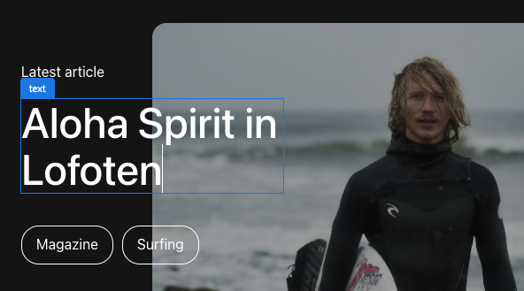
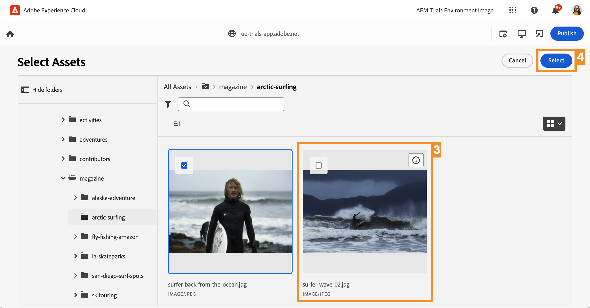
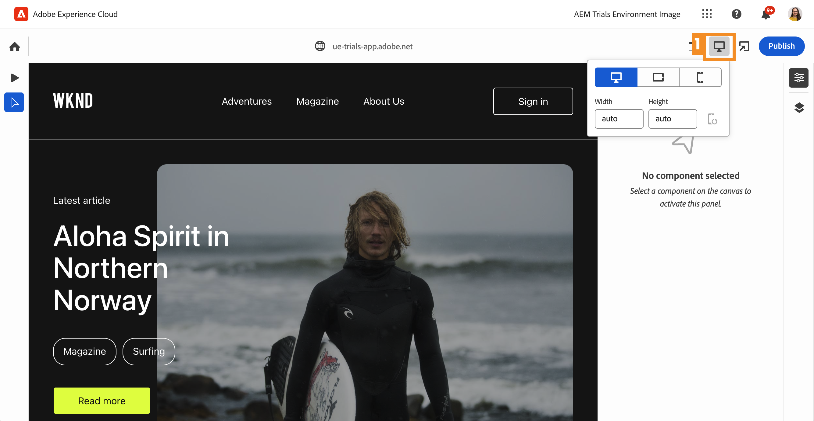

# Bewerken in context met de universele editor {#editing-in-context}

>[!CONTEXTUALHELP]
>id="aemcloud_sites_trial_edit_inline_universal_editor"
>title="Bewerken in context met de universele editor"
>abstract="Ontdek hoe uw headless-apps de Universal Editor kunnen gebruiken om weinig wrijving te veroorzaken, in context-bewerking tot de vingertoppen van uw auteurs."

>[!CONTEXTUALHELP]
>id="aemcloud_sites_trial_edit_inline_universal_editor_guide"
>title="De Universal Editor starten"
>abstract="In deze handleiding verkent u de Universal Editor en hoe iedereen hiermee elk aspect van uw inhoud in een implementatie kan bewerken. Dit leidt tot een hogere snelheid van de inhoud.  Start deze module op een nieuw tabblad door hieronder te klikken en volg deze handleiding."

>[!CONTEXTUALHELP]
>id="aemcloud_sites_trial_edit_inline_universal_editor_guide_footer"
>title="In deze module hebt u geleerd hoe u inhoud in context en op plaats kunt aanpassen met de Universal Editor."
>abstract=""

## Tekst in context bewerken {#edit-text}

Het op plaats en in context bewerken kan vaak voordelig zijn in vergelijking met het bewerken van inhoud zonder kop, zoals in de editor voor inhoudsfragmenten, die u in vorige modules hebt gezien.

>[!NOTE]
>
>Als u de Universal Editor in deze proefversie wilt gebruiken, moet u Chrome gebruiken als uw browser en niet in de incognitomodus. Dit is een beperking van de proefversie, niet van de Universal Editor.

Met de Universal Editor kunt u tekst op een flexibele manier in context en op zijn plaats bewerken, zodat u eenvoudig en intuïtief inhoud kunt ontwerpen.

1. Dubbelklik om de titel van het meest recente artikel te selecteren en te bewerken.

   

1. De component wordt geselecteerd zoals aangegeven door een blauwe rand met een tab die aangeeft dat het een tekstcomponent is. Er bevindt zich een cursor in de rand die op tekstinvoer wacht. De tekst wijzigen in `Aloha Spirit in Lofoten`.

   

1. Selecteer buiten de tekstcomponent en uw wijzigingen worden automatisch opgeslagen.

De Universal Editor slaat uw wijzigingen automatisch op in de ontwerpomgeving. U moet ze nog publiceren zodat uw lezers ze kunnen zien, wat we in een latere stap zullen doen.

## Media in context bewerken {#edit-media}

Met de Universal Editor kunt u ook afbeeldingen omwisselen terwijl u in de context van uw inhoud blijft.

1. Selecteer de afbeelding van de surfer om deze te selecteren.

1. In de componentrail kunt u de details van het element zien. Selecteer de **Aanbevolen afbeelding** miniatuur.

   

1. In de **Elementen selecteren** venster, omlaag schuiven en de `surfer-wave-02.JPG` afbeelding om deze te selecteren.

1. Selecteren **Selecteren** in de **Elementen selecteren** venster.

   

De afbeelding wordt vervangen door de afbeelding die u hebt geselecteerd.

## Ervaar uw inhoud zoals uw Readers {#emulators}

Met de Universal Editor kunt u in de context van de editor communiceren met uw inhoud, waarbij de inhoud wordt weergegeven zoals deze aan de apparaten van uw gebruikers wordt geleverd.

1. Standaard rendert de editor de bureaubladversie van uw inhoud. Selecteer de emulatorknop rechtsboven op de werkbalk van de Universal Editor om het doelapparaat te wijzigen.

   

1. Readers kunnen zich op verschillende apparaten met verschillende hoogte-breedteverhoudingen bevinden, zodat de editor emulatiemodi aanbiedt om te zien hoe de pagina aan gebruikers wordt weergegeven. Selecteer bijvoorbeeld de optie Mobiel apparaat in de staande modus.

   

1. Zie de inhoudswijziging in de editor. Het pictogram voor de emulator verandert ook om de modus aan te geven waarin deze zich bevindt. Selecteer een willekeurige locatie buiten het emulatormenu om het te sluiten en te communiceren met de inhoud.

1. Zet de emulator terug naar de bureaubladmodus.

U kunt ook exacte afmetingen voor de emulator opgeven en het geëmuleerde apparaat roteren om de inhoud op elk mogelijk doelapparaat weer te geven.

## Voorvertonen en publiceren {#preview}

Omdat u de inhoud moet selecteren om deze in de editor te wijzigen, kunt u in de editor geen koppelingen volgen of communiceren met de inhoud door erop te tikken of te klikken. In de voorbeeldmodus kunt u de koppelingen in de inhoud volgen en ervaart u deze net als uw gebruikers voordat u gaat publiceren.

1. Selecteer op de werkbalk van de Universal Editor de optie **Voorvertoning**.

1. Selecteer nu de optie **Meer informatie** koppeling voor het hoofdartikel.

   

1. Blader door het artikel en gebruik vervolgens de knop **Vorige** koppeling om terug te keren naar de hoofdpagina.

   

1. Selecteer nu de optie **Publiceren** klikt u rechtsboven in de editor om uw inhoud te publiceren.

   

Uw inhoud is gepubliceerd.

## Inhoudsfragmenten bewerken {#editing-fragments}

Als u het schrijven van inhoud wilt versnellen terwijl het gestructureerd bewerken van inhoud zonder kop voordeliger is dan het bewerken op plaats, biedt de Universal Editor u ook snel toegang tot de editor voor inhoudsfragmenten.

1. De voorvertoningsmodus uitschakelen door te tikken op de **Voorvertoning** op de werkbalk van de Universal Editor.

   

1. Verschuiven verder omlaag op de pagina naar de **avonturen** sectie.

1. Selecteer een van de avonturen, zoals **Bali Surf Camp** om het te selecteren.

   * Maak een notitie van de blauwe omtrek van de geselecteerde component. Wanneer u een inhoudsfragment selecteert, moet op het tabblad de naam van het inhoudsfragment worden weergegeven. In dit geval **Bali Surf Camp**.
   * Omdat in de Universal Editor elk object op de pagina kan worden geselecteerd, kunnen componenten die onderdeel zijn van een inhoudsfragment ook afzonderlijk worden geselecteerd. Selecteer de locatie die in de illustratie wordt aangegeven om de volledige component Content Fragment te selecteren.

1. De **Bewerken** verschijnt op de componentrail. Selecteer de **Bewerken** pictogram om de editor voor inhoudsfragmenten te openen op een nieuw tabblad.

Op het nieuwe tabblad kunt u nu het inhoudsfragment bewerken dat u hebt geselecteerd in de universele editor.
