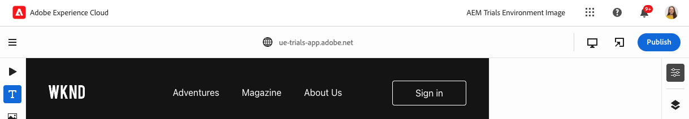

# Universele editor {#universal-editor}

>[!CONTEXTUALHELP]
>id="aemcloud_sites_trial_edit_inline_universal_editor"
>title="Universele editor"
>abstract="Ontdek hoe uw toepassingen zonder kop de Universal Editor kunnen helpen om in de context weinig wrijving te vertonen en de vingertoppen van uw auteurs te bekijken."

>[!CONTEXTUALHELP]
>id="aemcloud_sites_trial_edit_inline_universal_editor_guide"
>title="De Universal Editor starten"
>abstract="In deze handleiding bekijken we de Universal Editor en hoe iedereen hiermee elk aspect van uw inhoud in een implementatie kan bewerken. Dit leidt tot een verbeterde snelheid van de inhoud.  Start deze module op een nieuw tabblad door hieronder te klikken en volg deze handleiding."

>[!CONTEXTUALHELP]
>id="aemcloud_sites_trial_edit_inline_universal_editor_guide_footer"
>title="In deze module hebt u geleerd hoe u inhoud kunt aanpassen met de Universal Editor."
>abstract=""

## Gebruik de emulator om uw inhoud weer te geven als uw Readers {#emulators}

Met de Universal Editor kunt u communiceren met uw inhoud binnen de context, waarbij de inhoud wordt weergegeven zoals deze aan uw eindgebruikers wordt geleverd en u de inhoud op zijn plaats kunt bewerken.

1. De Universal Editor geeft uw inhoud weer zoals deze door uw lezers wordt weergegeven, ongeacht het apparaat. Standaard rendert de editor de bureaubladversie van uw inhoud. Tik of klik op de emulatorknop rechtsboven in de editor om het doelapparaat te wijzigen.

   

1. Readers kunnen zich op verschillende apparaten met verschillende hoogte-breedteverhoudingen bevinden, zodat de editor emulatiemodi heeft. Als u wilt zien hoe de pagina wordt weergegeven aan gebruikers op een mobiel apparaat, selecteert u de optie Mobiel apparaat in staande modus.

   

1. Zie de inhoudswijziging in de editor. Het pictogram voor de emulator verandert ook om de modus aan te geven waarin deze zich bevindt. Tik of klik ergens buiten het emulatormenu om het te sluiten en te communiceren met de inhoud.

1. Zet de emulator terug naar de bureaubladmodus.

U kunt ook exacte afmetingen voor de emulator opgeven en het geëmuleerde apparaat roteren om de inhoud op elk mogelijk doelapparaat te bekijken.

## Tekst in context bewerken {#edit-text}

U kunt de tekst in de context en ter plaatse bewerken, zodat u eenvoudig en intuïtief inhoud kunt ontwerpen.

1. Tik of klik op de titel van het meest recente artikel om dit te bewerken.

1. De component wordt geselecteerd zoals aangegeven door een blauwe rand met een tab die aangeeft dat het een tekstcomponent is. Er bevindt zich een cursor in de rand die op tekstinvoer wacht. De tekst wijzigen in `Aloha Spirit in Lofoten`.

   

1. Druk op Enter/Return of tik of klik buiten de tekstcomponent en uw wijzigingen worden automatisch opgeslagen.

De Universal Editor slaat uw wijzigingen automatisch op, maar deze blijven alleen behouden in de ontwerpomgeving. U moet ze nog steeds voor uw lezers publiceren.

## Voorvertonen en publiceren {#preview}

De editor geeft de context weer zoals uw lezers deze zullen zien. Omdat u op de inhoud moet tikken of erop moet klikken om deze te selecteren, kunt u in de editor geen koppelingen volgen of met de inhoud communiceren door erop te tikken of te klikken. In de voorvertoningsmodus kunt u de inhoud net zo ervaren als de inhoud die wordt gepubliceerd voordat u de inhoud publiceert.

1. Tik of klik in de modus rail links van de editor op **Voorvertoning**.

1. De pagina wordt geopend in voorvertoningsmodus op een nieuw browsertabblad.

1. Controleer de wijzigingen en als alles er goed uitziet, gaat u terug naar het tabblad Universal Editor van uw browser en tikt u of klikt u op **Publiceren**.

   

Uw inhoud is gepubliceerd.

## Inhoudsfragmenten bewerken {#editing-fragments}

De Universele Redacteur geeft u snelle toegang tot de redacteur van het Fragment van de Inhoud ook, om uw inhoud te versnellen creërend ervaring.

1. Verschuiven verder omlaag op de pagina naar de **avonturen** sectie.

1. Selecteer in de modus rail links van de editor de optie **Componenten**. Op deze manier kunt u paginacomponenten selecteren in de editor.

1. Tik of klik op een van de avonturen om deze te selecteren. Een nieuwe **Bewerken** verschijnt op de modusrail.

   * Maak een notitie van de blauwe omtrek. Het tabblad moet worden gelezen **referentie** wanneer een inhoudsfragment is geselecteerd.
   * Omdat in de Universal Editor elk object op de pagina kan worden geselecteerd, kunnen componenten die delen van een inhoudsfragment bevatten, ook afzonderlijk worden geselecteerd.

   

1. Tik of klik op de knop **Bewerken** op de modusrail om de editor voor inhoudsfragmenten te openen op een nieuw tabblad.

Op het nieuwe tabblad kunt u nu het inhoudsfragment bewerken dat u hebt geselecteerd in de universele editor.
