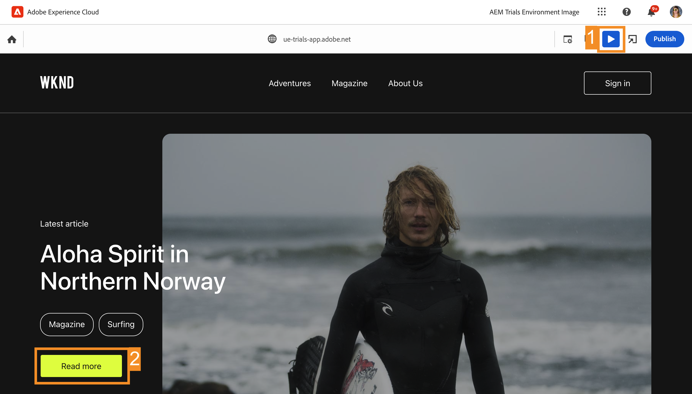

# In context bewerken {#editing-in-context}

>[!CONTEXTUALHELP]
>id="aemcloud_sites_trial_edit_inline_universal_editor"
>title="In context bewerken"
>abstract="Ontdek hoe uw headless-apps de Universal Editor kunnen gebruiken om in de context weinig wrijving te betrachten bij het bewerken van toepassingen binnen handbereik van uw auteurs."

>[!CONTEXTUALHELP]
>id="aemcloud_sites_trial_edit_inline_universal_editor_guide"
>title="De Universal Editor starten"
>abstract="In deze handleiding bekijken we de Universal Editor en hoe iedereen hiermee elk aspect van uw inhoud in een implementatie kan bewerken. Dit leidt tot een verbeterde snelheid van de inhoud.  Start deze module op een nieuw tabblad door hieronder te klikken en volg deze handleiding."

>[!CONTEXTUALHELP]
>id="aemcloud_sites_trial_edit_inline_universal_editor_guide_footer"
>title="In deze module, leerde u hoe te om inhoud in-context en op zijn plaats aan te passen gebruikend de Universele Redacteur."
>abstract=""

## Tekst in context bewerken {#edit-text}

Het op zijn plaats en in context bewerken kan vaak voordelig zijn in vergelijking met het bewerken van inhoud zonder kop, zoals in de editor voor inhoudsfragmenten, die u in vorige modules hebt gezien.

Met de Universal Editor kunt u uw tekst op een flexibele manier in context en op plaats bewerken, zodat u eenvoudig en intuïtief inhoud kunt ontwerpen.

1. De editor moet standaard worden geladen in **Tekst** in. Als dat niet het geval is, tikt u of klikt u op de knop **Tekst** pictogram in de modusrail links van de editor.

1. Tik of klik op de titel van het meest recente artikel om dit te bewerken.

   

1. De component wordt geselecteerd zoals aangegeven door een blauwe rand met een tab die aangeeft dat het een tekstcomponent is. Er bevindt zich een cursor in de rand die op tekstinvoer wacht. De tekst wijzigen in `Aloha Spirit in Lofoten`.

   

1. Druk op Enter/Return of tik of klik buiten de tekstcomponent en uw wijzigingen worden automatisch opgeslagen.

De Universal Editor slaat uw wijzigingen automatisch op in de ontwerpomgeving. U moet ze nog publiceren zodat uw lezers ze kunnen zien, wat we in een latere stap zullen doen.

## Ervaar uw inhoud zoals uw Readers {#emulators}

Met de Universal Editor kunt u in de context van de editor communiceren met uw inhoud, waarbij de inhoud wordt weergegeven zoals deze aan de apparaten van uw gebruikers wordt geleverd.

1. Standaard rendert de editor de bureaubladversie van uw inhoud. Tik of klik op de emulatorknop rechtsboven in de editor om het doelapparaat te wijzigen.

   

1. Readers kunnen zich op verschillende apparaten met verschillende hoogte-breedteverhoudingen bevinden, zodat de editor emulatiemodi aanbiedt om te zien hoe de pagina aan gebruikers wordt weergegeven. Selecteer bijvoorbeeld de optie Mobiel apparaat in de staande modus.

   

1. Zie de inhoudswijziging in de editor. Het pictogram voor de emulator verandert ook om de modus aan te geven waarin deze zich bevindt. Tik of klik ergens buiten het emulatormenu om het te sluiten en te communiceren met de inhoud.

1. Zet de emulator terug naar de bureaubladmodus.

U kunt ook exacte afmetingen voor de emulator opgeven en het geëmuleerde apparaat roteren om de inhoud op elk mogelijk doelapparaat te bekijken.

## Voorvertonen en publiceren {#preview}

Omdat u op de inhoud moet tikken of erop moet klikken om deze in de editor te selecteren, kunt u in de editor geen koppelingen volgen of communiceren met de inhoud door te tikken of te klikken wanneer de inhoud in de bewerkingsmodus staat. In de voorbeeldmodus kunt u de koppelingen in de inhoud volgen en ervaart u deze net als uw gebruikers voordat u gaat publiceren.

1. Tik of klik in de modus rail links van de editor op **Voorvertoning**.

1. Tik nu of klik op de knop **Meer informatie** koppeling voor het hoofdartikel.

   

1. Blader door het artikel en gebruik vervolgens de knop **Vorige** koppeling om terug te keren naar de hoofdpagina.

   

1. Tik nu of klik op de knop **Publiceren** klikt u rechtsboven in de editor om uw inhoud te publiceren.

   

Uw inhoud is gepubliceerd.

## Inhoudsfragmenten bewerken {#editing-fragments}

Als u het schrijven van inhoud wilt versnellen terwijl het gestructureerd bewerken van inhoud zonder kop voordeliger is dan het bewerken op plaats, biedt de Universal Editor u ook snel toegang tot de editor voor inhoudsfragmenten.

1. Verschuiven verder omlaag op de pagina naar de **avonturen** sectie.

1. Selecteer in de modus rail links van de editor de optie **Componenten**. Op deze manier kunt u paginacomponenten selecteren in de editor.

1. Tik of klik op een van de avonturen om deze te selecteren.

   * Maak een notitie van de blauwe omtrek van de geselecteerde component. Het tabblad moet worden gelezen **referentie** wanneer een inhoudsfragment is geselecteerd.
   * Omdat in de Universal Editor elk object op de pagina kan worden geselecteerd, kunnen componenten die onderdeel zijn van een inhoudsfragment ook afzonderlijk worden geselecteerd. Tik of klik op de plaats die in de illustratie is aangegeven om de volledige component Inhoudsfragment te selecteren.

1. Een nieuwe **Bewerken** verschijnt op de modusrail. Tik of klik op de knop **Bewerken** pictogram om de editor voor inhoudsfragmenten te openen op een nieuw tabblad.

Op het nieuwe tabblad kunt u nu het inhoudsfragment bewerken dat u hebt geselecteerd in de universele editor.
